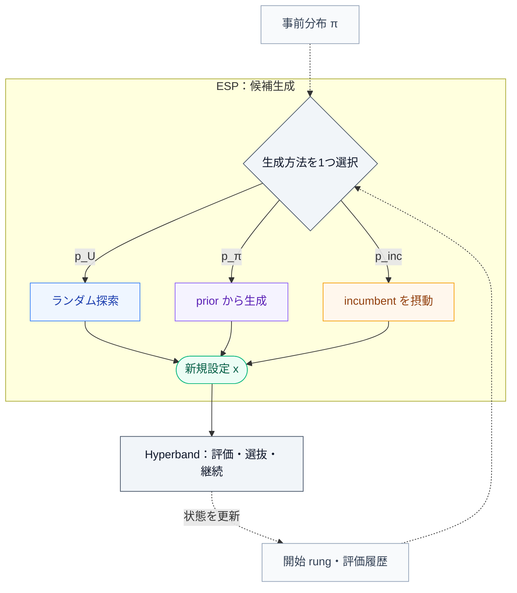

## 1. はじめに

深層学習のハイパーパラメータを調整するとき、私たちは完全な白紙から探索を始めるわけではない。論文の推奨値、公式実装のデフォルト、似たデータセットでうまくいった設定など、多少なりとも手がかりを持っている。

例えば、学習率は $10^{-5}$ から $10^{-2}$ まで探索したいが、まずは $3\times10^{-4}$ の周辺が有望に思える。一方、手元の GPU で学習を最後まで回せるのは十数回程度であり、すべての設定を同じだけ学習する余裕はない。こうした状況では、「有望そうな設定から始め、短い学習で様子を見て、良ければ継続する」という手動探索はかなり自然な選択になる。

[前回の記事](https://zenn.dev/mantis_ryuji/articles/c83da3bf1760cf) では、ハイパーパラメータ最適化（Hyperparameter Optimization; HPO）を **候補生成** と **予算配分** に分け、BOHB を解説した。BOHB は、Hyperband の予算配分に、評価履歴から学習した密度モデルによる候補生成を組み合わせる手法だった。

今回取り上げる **PriorBand** は、同じ Hyperband を土台にしながら、探索開始前から利用できる知識に着目する。

@[card](https://proceedings.neurips.cc/paper_files/paper/2023/hash/1704fe7aaff33a54802b83a016050ab8-Abstract-Conference.html)

Mallik らが NeurIPS 2023 で発表した *PriorBand: Practical Hyperparameter Optimization in the Age of Deep Learning* の中心にあるのは、**ユーザーの事前知識、安価な途中評価、探索中に見つかった良い設定を、限られた計算予算の中でどう組み合わせるか** という問題である。

ただし、「良さそうな設定」を使えば必ず探索が改善するわけではない。以前のタスクでは適切だった学習率も、モデル、データ量、バッチサイズが変われば不適切になりうる。事前知識を利用するためには、それが間違っていたときに探索方針を修正できなければならない。

本記事では、この実用上の問題を起点に PriorBand の仕組みを説明する。数式は、事前分布の意味、探索確率の決め方、観測による重みの更新を理解するために用いる。後半では、論文の結果がどこまで実用を裏づけているかを確認し、自分の学習パイプラインへ適用するときの設計に落とし込む。

## 2. PriorBand が解く問題：手がかりはあるが、計算予算が少ない

### 2.1 最適化したい性能と、途中で観測する性能

前回に合わせ、ハイパーパラメータ設定を $x\in\mathcal{X}$、一つの設定に与える学習予算を $b$ と書く。原論文の $\boldsymbol{\lambda}$ と $z$ に対応する記号である。$\mathcal{X}$ は、連続値、整数値、カテゴリ値を含みうる探索空間である。

予算 $b$ で学習したときの検証損失の観測値を

$$
Y(x,b)=f_b(x)+\varepsilon(x,b),
\qquad
\mathbb{E}[\varepsilon(x,b)\mid x,b]=0
\tag{1}
$$

とする。$f_b(x)$ はその設定と予算における期待検証損失、$\varepsilon(x,b)$ は初期値やデータ順序などに由来する観測ノイズである。この期待値による表現は、確率的な学習を明示するための整理であり、PriorBand が各候補を複数 seed で評価して期待値を推定するという意味ではない。

最終的な目標は、最大予算 $b_{\max}$ での性能が良い設定を見つけることである。

$$
x^\star\in\operatorname*{arg\,min}_{x\in\mathcal{X}}
f_{b_{\max}}(x)
\tag{2}
$$

例えば $b_{\max}=81$ epochs なら、3 epochs での検証損失が最小の設定を探したいわけではない。3 epochs の評価は、81 epochs で有望な設定を安く見つけるための **proxy（代理評価）** である。

ここで、一つの設定に与える予算 $b$ と、探索全体で使える総予算 $B$ は区別しておきたい。「最大 81 epochs、探索予算は full training 10 回分」という設定なら、後者は 10 個の設定だけを試すという意味ではない。少数 epoch の試行も組み合わせ、その合計コストを制限するという意味である。

実際に消費した計算量を $C_1,\ldots,C_T$、基準となる full training 1 回のコストを $C_{\mathrm{full}}$ とすれば、正規化した探索コストは

$$
B_{\mathrm{used}}
=\frac{\sum_{t=1}^{T}C_t}{C_{\mathrm{full}}}
\tag{3}
$$

と書ける。$T$ は評価・学習処理の実行回数である。学習を checkpoint から継続する場合、$C_t$ はその時点で追加した計算量を表す。モデルサイズなどを探索する場合には 1 epoch のコストも変わるため、epoch 数だけでなく GPU 時間などによる比較が必要になる。

### 2.2 BOHB と PriorBand は、何を手がかりに候補を作るのか

Hyperband は、多数の候補を小さな予算で評価し、上位の候補だけを大きな予算へ進める Successive Halving（SH）を利用する。さらに、評価を開始する予算と候補数が異なる複数の SH を実行することで、広い探索と慎重な評価を組み合わせる。

この予算配分の土台を共有しながら、候補生成に使う情報が異なるのが Hyperband、BOHB、PriorBand である。

| 手法 | 新規候補を作る主な情報 | 予算配分 | 探索前の「有望な設定」の扱い |
| --- | --- | --- | --- |
| Hyperband | 探索空間からのランダムサンプリング | Hyperband | 標準形では明示的に使わない |
| BOHB | 評価履歴から推定した良い・悪い領域の密度 | Hyperband | 標準形では専用の prior 入力を持たない |
| PriorBand | ランダム探索、ユーザーの prior、現在の最良設定の近傍 | Hyperband | 候補生成の分布として明示的に使う |

BOHB は、観測が蓄積した後に、その履歴から有望な領域を推定する。PriorBand は、まだ十分な観測がなくても、ユーザーが提供する prior から候補を生成できる。そのうえで、探索中に見つかった最良設定、すなわち **incumbent** の周辺も探索する。

基本形の PriorBand は、目的関数を予測する surrogate model を学習せず、獲得関数も最適化しない。この意味で **model-free** である。ただし、評価履歴を使わないわけではない。履歴は incumbent の選択と、候補生成の配分を変更するために使われる。

したがって、PriorBand を「BOHB に prior を追加した手法」と理解すると構造を取り違える。両者は Hyperband の候補生成部分を、それぞれ異なる方法で拡張している。

### 2.3 有望な領域だけを探索すればよいのか

最も単純な方法は、Hyperband が新しい設定を生成するとき、常にユーザーの prior からサンプリングすることである。事前知識が良ければ、これはうまくいく。しかし、悪い設定の周辺に prior を置いてしまった場合、探索がその領域へ偏る。

では、半分を prior、残り半分をランダム探索にすれば十分だろうか。


*Fig.1：prior の利用割合を固定した Hyperband の比較。原論文 Figure 2。左から、fidelity 間の相関が高い／低い場合と、prior が良い／悪い場合を組み合わせている。縦軸は最小化する目的関数値。*

原論文では、3 次元の multi-fidelity Hartmann 問題を用いて、この固定配分を比較している。良い prior では prior を強く使う方法が有利になり、悪い prior では通常の Hyperband が有利になる。50% ずつの混合は極端な失敗を緩和するものの、各条件で最も良い方法には及びにくい。

これは、「半分ずつなら絶対に駄目」という一般的な証明ではない。ただし、**prior の質が分からない状況で、探索中の観測を無視して配分を固定することには限界がある** という動機づけにはなる。

PriorBand はここに、incumbent の近傍を探索する第三の選択肢を加える。そして、ユーザーが最初に指定した領域と、探索によって見つかった領域のどちらを重視するかを、観測に応じて変える。

## 3. 事前知識を、探索できる分布に変える

### 3.1 prior が表すのは「最適解がありそうな場所」

PriorBand に与える $\pi$ は、探索空間上の事前分布である。「この領域に良い設定がありそうだ」というユーザーの信念を表す。

例えば、学習率 $3\times10^{-4}$、weight decay $10^{-2}$ の設定が以前うまくいったなら、その周辺を高い確率で提案する分布を作る。prior は目的関数に罰則を加える正則化項ではなく、式 $(2)$ の最適化対象も変更しない。変更するのは、どの設定から試すかである。

数理的には、連続変数である最適設定 $X^\star$ に対し、$\pi(x)$ は確率密度として解釈する。領域 $A\subseteq\mathcal{X}$ に対して

$$
\mathbb{P}_{\pi}(X^\star\in A)
=\int_A\pi(x)\,dx
\tag{4}
$$

となる。連続空間では通常、一点の確率 $\mathbb{P}_{\pi}(X^\star=x)$ は 0 なので、密度 $\pi(x)$ と同一視しない。カテゴリ変数については確率質量を用い、混合型の探索空間では積分と和を組み合わせる。

また、ここでの prior は、Gaussian Process の kernel で表す「目的関数がどれくらい滑らかそうか」という事前仮定とも異なる。PriorBand がユーザーから受け取るのは、**良い設定の所在に関する知識** である。

この違いは、実用上も重要である。HPO の履歴データを大量に持っていなくても、既存の良好な設定を一つ挙げることはできる。その設定を中心とする分布にすれば、探索開始時点から使える情報になる。

### 3.2 学習率の「近く」は、どの座標で考えるべきか

prior の中心だけでなく、どの尺度で周辺を探索するかも決める必要がある。

学習率 $\alpha$ を $[a,c]=[10^{-5},10^{-2}]$ で探索することを考える。線形尺度で一様にサンプリングすると、$10^{-3}$ から $10^{-2}$ の区間へ確率の大部分が割り当てられる。一方、対数尺度では、$10^{-5}$ から $10^{-4}$、$10^{-4}$ から $10^{-3}$、$10^{-3}$ から $10^{-2}$ の各桁を等しく扱える。

対数尺度の変数を $[0,1]$ に正規化する変換を

$$
u(\alpha)
=\frac{\log\alpha-\log a}{\log c-\log a},
\qquad
\alpha=\exp\!\left[\log a+u\log(c/a)\right]
\tag{5}
$$

とする。$\log$ は自然対数だが、同じ底を使えば正規化座標は変わらない。この座標で prior の中心を $\mu=u(\alpha_0)$ に置けば、基準値 $\alpha_0$ の周辺を **倍率の違い** として探索できる。

例えば、正規化座標での幅 $\sigma=0.25$ は、この 3 桁の探索範囲では

$$
(c/a)^{\sigma}
=1000^{0.25}
\approx5.62
\tag{6}
$$

倍に対応する。$\alpha_0=3\times10^{-4}$ のとき、切り詰め前の $\mu\pm\sigma$ に対応する値は、およそ $5.3\times10^{-5}$ から $1.7\times10^{-3}$ になる。

この計算から分かるように、**正規化空間で幅 0.25 と聞いても、必ずしも狭い局所探索ではない。** 探索範囲が何桁にわたるかによって、元の変数上で動かす量は大きく変わる。

線形尺度の変数 $x_j\in[a_j,c_j]$ なら、$u_j=(x_j-a_j)/(c_j-a_j)$ とすればよい。カテゴリ変数にはこのような大小関係を仮定せず、それぞれの選択肢へ確率を割り当てる。

例えば、事前学習済みモデルの fine-tuning を想定した探索空間は、次のように整理できる。数値は説明用であり、特定のモデルで推奨される設定を示したものではない。

| ハイパーパラメータ | 探索範囲の例 | 尺度 | prior の中心の例 |
| --- | --- | --- | --- |
| 学習率 | $10^{-5}$～$10^{-2}$ | 対数 | $3\times10^{-4}$ |
| Weight decay | $10^{-6}$～$10^{-1}$ | 対数 | $10^{-2}$ |
| Dropout | $0$～$0.5$ | 線形 | $0.1$ |
| 学習 epoch 数 | $3$～$81$ | fidelity | prior を置く通常の HP とは区別する |

Weight decay を対数尺度で探索するなら 0 は含められない。正則化なしも比較したい場合には、0 を別の選択肢として扱うなど、探索空間そのものを設計する必要がある。

### 3.3 prior の幅と、探索範囲を分けて考える

prior の設計では、次の二つを混同しないことが重要である。

- **探索範囲**：候補として許す領域。
- **prior の集中度**：その中で、どこを優先して試すか。

「この値が有望だと思う」だけなら、探索範囲を極端に狭める必要はない。許容範囲を確保したまま、prior で有望な領域を重視すればよい。探索空間の外に最適解を除外してしまうと、PriorBand のランダム探索でも到達できない。

連続値について、正規化座標 $u\in[0,1]$ 上に Gaussian を置くなら、範囲外の値を扱う規則も必要になる。例えば、切断正規分布は

$$
\pi_u(u)
=\frac{
\phi\!\left((u-\mu)/\sigma\right)
}{
\sigma\left[
\Phi\!\left((1-\mu)/\sigma\right)
-\Phi\!\left(-\mu/\sigma\right)
\right]
}
\,\mathbf{1}_{[0,1]}(u)
\tag{7}
$$

と書ける。$\phi$ と $\Phi$ は標準正規分布の密度関数と累積分布関数、$\mathbf{1}_{[0,1]}$ は区間内で 1 となる指示関数である。分母は、区間内で密度の積分が 1 になるように補正している。

ここで切断分布を示したのは、有限の探索空間で prior を定義する具体例としてである。単に Gaussian から生成した値を境界へ clip する方法とは分布が異なる。clip では境界上に確率質量が生じるため、後で密度を評価するときにも同じ扱いが必要になる。

複数のハイパーパラメータを独立に扱う最も単純な設計は、正規化した設定 $u=(u_1,\ldots,u_d)$ に対して

$$
\pi_u(u)=\prod_{j=1}^{d}\pi_j(u_j)
\tag{8}
$$

とすることである。$d$ は探索するハイパーパラメータ数である。ただし、この分解は、学習率とバッチサイズなどの相互依存を表現しない。複数のパラメータを同時に変えることでしか良くならない問題では、良好な設定の周辺へ独立にノイズを加えるだけでは効率が悪くなりうる。

原論文は分布入力を一般的に定義しているが、中心的な実験では数値変数に対する Gaussian prior と固定した幅を用いている。したがって、「任意の複雑な prior を与えても同程度に頑健」とまで実験的に確認されたわけではない。

実用上は、まず既存の良好な設定を中心に置き、自信のないパラメータには過度に強い集中を与えない、という使い方が理解しやすい。prior を用意するためだけに大規模な探索を始めてしまうと、少ない計算で HPO を行うという目的から離れてしまう。

## 4. PriorBand の候補生成：三つの探索方法を使い分ける

### 4.1 Ensemble Sampling Policy の全体像

PriorBand の中心となる候補生成機構は、**Ensemble Sampling Policy（ESP）** と呼ばれる。原論文では $\mathcal{E}_{\pi}$ と表記される。

ESP は、次の三つの方法から一つを選び、その方法で新しい設定を生成する。

| サンプリング方法 | 生成する候補 | 役割 |
| --- | --- | --- |
| Random sampling | 探索空間全体からの候補 | prior や現在の有望領域の外も調べる |
| Prior-based sampling | ユーザーの prior に従う候補 | 探索前から分かっている有望領域を使う |
| Incumbent-based sampling | 現在の最良設定を摂動した候補 | 探索によって見つかった領域をさらに調べる |

「ensemble」といっても、三つの予測モデルの出力を平均するわけではない。ここで混合するのは、候補の生成方法である。

探索履歴を更新する時点を $t$、新規候補を評価し始める fidelity の段階を $r$ とする。ランダム生成の分布を $\mathcal{U}$、prior の分布を $\Pi$、incumbent の近傍を生成する分布を $\mathcal{L}_t$ と書くと、ESP の混合分布は

$$
\mathcal{Q}_{t,r}
=p_{\mathcal{U}}(r)\mathcal{U}
+p_{\pi}(t,r)\Pi
+p_{\mathrm{inc}}(t,r)\mathcal{L}_t
\tag{9}
$$

である。ただし、各係数は非負で、和が 1 になる。

$$
p_{\mathcal{U}}(r)+p_{\pi}(t,r)+p_{\mathrm{inc}}(t,r)=1
\tag{10}
$$

$\Pi$ の密度または確率質量が前章の $\pi$ に対応する。式 $(9)$ は分布そのものの混合として書いているので、連続変数を変更せずに残す操作や、カテゴリ変数を含む場合にも使える。また、$\mathcal{U}$ の一様性は探索用の尺度に対するものであり、対数尺度の変数なら元の値では log-uniform になる。

Hyperband と ESP の関係は、次のように整理できる。


> Fig.2：PriorBand の候補生成と予算配分。ESP は開始 rung と評価履歴に応じて選択確率を決め、三つの生成方法から一つを選ぶ。生成された設定の評価・選抜・継続は Hyperband が担い、その結果を次の候補生成に利用する。

新しい設定を作るのは ESP だが、既存の候補を次の fidelity へ進めるかどうかは SH が決める。**昇格した候補のハイパーパラメータを、その場で変更するわけではない。** Incumbent の摂動から生まれるのは、別の新規候補である。

### 4.2 安い評価では広く探索し、高い評価では手がかりを重視する

三つの確率は、二段階で決まる。まず、ランダム探索に割く割合を、新規候補の開始 fidelity から決める。残りを prior と incumbent の探索に配分する。

ここでは Hyperband の削減率を整数 $\eta\ge2$ とし、

$$
s_{\max}
=\left\lfloor\log_{\eta}\frac{b_{\max}}{b_{\min}}\right\rfloor,
\qquad
b_r=b_{\max}\eta^{r-s_{\max}},
\quad r=0,\ldots,s_{\max}
\tag{11}
$$

という段階を考える。$b_{\min}$ は許容する最小学習予算である。比率が $\eta$ の整数乗でない場合、式 $(11)$ の最下段 $b_0$ は $b_{\min}$ 以上になる。

前回の記事の SH bracket の添字 $s$ を使うなら、開始 rung は $r=s_{\max}-s$ に対応する。ここでの $r$ は、**その新規候補をどの段階から評価するか** を表す。

Incumbent sampling がまだ有効でないとき、PriorBand は

$$
p_{\pi}=\eta^r p_{\mathcal{U}},
\qquad p_{\mathcal{U}}+p_{\pi}=1
$$

と設定する。代入すると $(1+\eta^r)p_{\mathcal{U}}=1$ なので、

$$
p_{\mathcal{U}}(r)=\frac{1}{1+\eta^r},
\qquad
p_{\pi}(t,r)=\frac{\eta^r}{1+\eta^r},
\qquad
p_{\mathrm{inc}}(t,r)=0
\tag{12}
$$

となる。

$b_{\min}=3$、$b_{\max}=81$、$\eta=3$ の場合は次のとおりである。

| 開始 rung $r$ | 新規候補の開始予算 $b_r$ | ランダム探索 $p_{\mathcal{U}}$ | prior による探索 $p_{\pi}$ |
| --- | --- | --- | --- |
| 0 | 3 epochs | $1/2=50\%$ | $1/2=50\%$ |
| 1 | 9 epochs | $1/4=25\%$ | $3/4=75\%$ |
| 2 | 27 epochs | $1/10=10\%$ | $9/10=90\%$ |
| 3 | 81 epochs | $1/28\approx3.57\%$ | $27/28\approx96.43\%$ |

安価な評価なら、外れを引いても損失が小さいため、広い探索に使いやすい。一方、いきなり最大予算で評価する候補は、手がかりのある領域から選びたい。さらに、ユーザーが「良い設定」と考えているのは通常、十分に学習したときの性能についてである。この二つの判断を、開始 fidelity に応じた配分として表している。

**この確率は、単純な経過時間のスケジュールではない。** Hyperband が再び低い開始 fidelity の bracket を実行すれば、ランダム探索の割合は再び大きくなる。また、3 epochs から始めた候補を 9 epochs に昇格させるたびに、この表に従って設定を引き直すわけでもない。

Incumbent sampling が有効になった後も、ランダム探索の割合は式 $(12)$ のままである。表の prior に割り当てていた残りの確率を、prior と incumbent に分け直す。その分け方を第5章で説明する。

### 4.3 Incumbent の周辺をどう探索するか

現在の最良設定を $\hat{x}_t$、その正規化座標を $\hat{u}_t$ とする。PriorBand の incumbent sampling は、この設定のハイパーパラメータを一部だけ摂動する局所探索である。

数値変数の第 $j$ 成分について、変更するかどうかを決める変数 $M_j$ と、ノイズ $\epsilon_j$ を

$$
M_j\sim\operatorname{Bernoulli}(p),
\qquad
\epsilon_j\sim\mathcal{N}(0,\sigma^2),
\qquad
u'_j=\hat{u}_{t,j}+M_j\epsilon_j
\tag{13}
$$

と書けば、基本的な考え方が表せる。原論文では $p=0.5$、$\sigma=0.25$ を固定している。式 $(13)$ は境界処理前の表現であり、実際には範囲内での再サンプリングなど、探索空間に適合する処理が必要である。整数変数にも、許容される整数値へ変換する処理が必要になる。

なぜ全パラメータを必ず変更しないのか。良い設定を見つけた後、その構成をある程度残しながら周辺を探索したいからである。ただし、数値変数が $d$ 個なら、変更対象に選ばれる個数の期待値は $dp=d/2$ である。これは「常に一つのパラメータだけを調整する」座標探索とは異なる。

カテゴリ変数では、現在と同じ値を選びやすくしつつ、他の値も生成する。選択肢が $k$ 個で、現在のカテゴリを $c_\star$ とすると、論文の補足資料では、変更対象になった成分の再サンプリングを

$$
\mathbb{P}(c'=c_\star)=\frac{k}{2k-1},
\qquad
\mathbb{P}(c'=c)=\frac{1}{2k-1}\quad(c\ne c_\star)
\tag{14}
$$

とする。例えば 3 択なら、現在の値が $3/5$、他の二つがそれぞれ $1/5$ である。[補足資料 E.2.5](https://proceedings.neurips.cc/paper_files/paper/2023/file/1704fe7aaff33a54802b83a016050ab8-Supplemental-Conference.pdf)

この操作により、当初の prior が外れていても、ランダム探索などから良い設定が見つかれば、その周辺を追いかけられる。一方、prior が良ければ、そこから見つかった incumbent の周辺を探索することで、さらに調整できる。

なお、ここでいう「近傍」はハイパーパラメータ空間上の近傍であり、ニューラルネットワークの重み空間上の近傍ではない。学習済み重みを摂動したり、モデル間で重み平均を取ったりする手法ではない。

## 5. prior をどこまで信じるかを、観測から決める

### 5.1 Incumbent を使い始めるタイミング

探索開始直後に得られた最良設定は、数少ない候補の中で偶然良く見えただけかもしれない。その周辺へ直ちに探索を集中させると、早すぎる局所探索になってしまう。

そこで PriorBand は、少なくとも次の二つを満たすまでは incumbent sampling を無効にする。

1. 最初の SH bracket を一回実施する程度の累積予算を消費したこと。
2. 少なくとも一つの設定を最大 fidelity で評価したこと。

原論文は前者の目安を $\eta b_{\max}$ 程度と記述している。ただし、実際のコストは段階数や学習を再開できるかによって変わるため、すべての探索設定で厳密に $\eta b_{\max}$ と一致する定数ではない。

例えば、3、9、27、81 epochs の段階に 27、9、3、1 個の候補を進める SH では、checkpoint から学習を再開でき、epoch あたりのコストを一定と仮定すると、合計コストは

$$
27\times3+9\times(9-3)+3\times(27-9)+1\times(81-27)
=243
\tag{15}
$$

epoch 相当、すなわち 81 epochs の full training 3 回分になる。各段階で最初から学習し直すなら、同じ候補数でも合計 324 epochs、4 回分である。

ここでの activation は、単に「一つ良い値が出たか」ではなく、ある程度の探索資源を使い、最大 fidelity の観測も持ったかを確認するための条件である。

Incumbent の定義にも注意が必要である。原論文では、探索中に観測された全 fidelity の誤差を比較して、最も小さい誤差を出した設定を incumbent として扱う。履歴を $\mathcal{H}_t=\{(x_i,b_i,y_i)\}_{i=1}^{t}$ と書けば、

$$
i_t^\star\in\operatorname*{arg\,min}_{1\le i\le t}y_i,
\qquad
\hat{x}_t=x_{i_t^\star}
\tag{16}
$$

という選択である。これは「最大 fidelity で実測済みの候補の中から最良を選ぶ」定義とは異なる。異なる fidelity の指標値を比較できるかという問題があり、特にデータ subset や解像度を変える場合には慎重さが必要になる。論文の評価時の扱いは第6章で確認する。

### 5.2 上位候補を説明できる分布に、より多く配分する

Incumbent sampling が有効になったら、残りの確率を prior と incumbent に分ける。その根拠になるのは、**実際に観測された上位候補が、それぞれの分布でどれくらい高く評価されるか** である。

まず、fidelity ごとに履歴を分ける。Rung $r$ における観測数を $N_r$ とし、十分な観測を持つ最も高い rung を

$$
r_{\mathrm{score}}
=\max\{r:N_r\ge\eta\}
\tag{17}
$$

で選ぶ。集合が空なら、まだスコアを計算できない。ここでの $r_{\mathrm{score}}$ は、新しい候補の開始 rung $r$ と必ずしも一致しない。

次に、選んだ rung の候補を誤差の小さい順に並べ、上位の集合 $\{x_{(1)},\ldots,x_{(n)}\}$ を取り出す。原論文本文では「上位 $1/\eta$」と説明されているが、同ページの脚注では最低 $\eta$ 個を利用すると補足されている。整数への丸めを床関数で表せば、$n=\max\{\eta,\lfloor N_{r_{\mathrm{score}}}/\eta\rfloor\}$ とする整理になる。これはスコア算出用の集合であり、SH の昇格候補数を変更する話ではない。[^top-count]

[^top-count]: 原論文 p.6 の脚注1。公開実装では細部が変わることがあるため、論文の再現時には対象コードも固定したい。例えば参照時点の [NePS の sampler ソース](https://automl.github.io/neps/latest/api/neps/optimizers/priorband/)では、上位集合の個数を `len(rung_table) // eta` としている。

Prior の密度を $\pi(x)$、incumbent を中心とする比較用の密度を $\kappa_t(x)$ と書く。この $\kappa_t$ は、現在の良い領域を評価するために置く分布である。原論文 Figure 4 の Gaussian の例では、prior と同じ幅で中心を incumbent に移している。

ここでは、実際に一部の成分だけを変更する局所提案分布 $\mathcal{L}_t$ と、スコア計算に使う $\kappa_t$ を区別している。成分を変更しない操作を含む $\mathcal{L}_t$ には点質量が生じるので、単純な多変量 Gaussian の密度と同一視できない。原論文ではこの二つに近い記号が使われているが、実装を考えると区別しておく方が明確である。

性能順位 $i$ に対する重みを $w_i=n+1-i$ とし、二つのスコアを

$$
S_{\pi}
=\sum_{i=1}^{n}w_i\pi(x_{(i)}),
\qquad
S_{\mathrm{inc}}
=\sum_{i=1}^{n}w_i\kappa_t(x_{(i)})
\tag{18}
$$

とする。良い候補ほど大きな重みを持つので、特に上位の設定へ高い密度を与える分布が有利になる。ここでの密度は、双方で共通の探索座標系を用いて評価する。


*Fig.3：上位候補の位置と、prior・incumbent を中心とする分布の関係。原論文 Figure 4。丸数字は性能順位であり、良い順位の候補ほどスコアへの寄与が大きい。*

ランダム探索を除いた残りを $q_r=1-p_{\mathcal{U}}(r)$ と書けば、$S_{\pi}+S_{\mathrm{inc}}>0$ のとき、配分は

$$
p_{\pi}(t,r)
=q_r\frac{S_{\pi}}{S_{\pi}+S_{\mathrm{inc}}},
\qquad
p_{\mathrm{inc}}(t,r)
=q_r\frac{S_{\mathrm{inc}}}{S_{\pi}+S_{\mathrm{inc}}}
\tag{19}
$$

となる。二つを足すと $q_r$ になるので、ランダム探索の割合を保ったまま配分を変更できる。

例えば、上位三つの候補について次の密度値が得られたとする。数値は説明用の例であり、原論文の実測値ではない。

| 性能順位 $i$ | 重み $w_i$ | prior の密度 $\pi(x_{(i)})$ | incumbent 側の密度 $\kappa_t(x_{(i)})$ |
| --- | --- | --- | --- |
| 1 | 3 | 0.1 | 0.6 |
| 2 | 2 | 0.2 | 0.4 |
| 3 | 1 | 0.3 | 0.2 |

この場合、$S_{\pi}=3\times0.1+2\times0.2+0.3=1.0$、$S_{\mathrm{inc}}=3\times0.6+2\times0.4+0.2=2.8$ となる。新規候補を $r=2$、$\eta=3$ の段階から評価するなら、$p_{\mathcal{U}}=0.1$、$q_r=0.9$ なので、

$$
(p_{\mathcal{U}},p_{\pi},p_{\mathrm{inc}})
\approx(0.100,\,0.237,\,0.663)
\tag{20}
$$

である。観測された良い設定が incumbent 側の分布で高い密度を持つため、局所探索に多く配分される。逆に prior が上位候補をよく捉えていれば、prior の割合が大きくなる。

### 5.3 この更新ができることと、できないこと

ここまでの流れを、新規候補を一つ生成する処理としてまとめると次のようになる。

```text
入力：新規候補の開始 rung r、履歴 H、prior、Hyperband の状態

1. p_random = 1 / (1 + eta^r) を計算する。
2. 残り q = 1 - p_random を用意する。
3. incumbent sampling の開始条件を満たさなければ、
   p_prior = q、p_incumbent = 0 とする。
4. 開始条件を満たし、スコアに使える履歴があれば、
   a. 十分な観測がある最も高い rung を選ぶ。
   b. その rung の上位候補から二つの密度スコアを計算する。
   c. スコアの比率で q を prior と incumbent に配分する。
5. 三つの確率に従って候補生成方法を一つ選ぶ。
6. その方法で新しい設定 x を生成する。
7. x を Hyperband に渡し、開始予算で評価する。
```

この重み付けは、ベイズの定理から導いた「prior が正しい確率」ではない。式 $(18)$ は、観測損失の確率モデルに基づく尤度でもなければ、各 sampler の将来の期待改善量でもない。**上位候補への密度を使って探索先を配分する、データ依存のヒューリスティック** である。

また、候補を実際に生成した sampler の成功率を数えているわけでもない。ランダム探索で見つかった候補であっても、prior の高密度領域にあれば $S_{\pi}$ に寄与する。

この見方をすると、強みと限界が分かりやすい。強みは、悪い prior が与えられた場合でも、別の場所で見つかった有望領域へ探索を移せることである。一方、偶然良い値を出した候補へ集中する可能性や、狭い局所領域から抜けにくい可能性は残る。ランダム探索を維持することは脱出の機会を残すが、有限予算での成功を保証するものではない。

さらに、スコアを密度から計算する以上、prior の幅や正規化の扱いも配分に影響する。狭い分布は中心付近の密度が高くなるので、「スコアが大きい」という事実だけで、その prior が広い意味で優れているとは言えない。原論文の固定幅による比較は、この点の自由度を抑えている。

実装時には、多次元密度の積による数値的な underflow にも気をつけたい。log-density と log-sum-exp を用いてスコア比を計算し、二つの分布が上位候補をともに支持しない場合の fallback を定める必要がある。分布ごとに異なる未知の比例定数を残したまま式 $(19)$ に代入すると、その定数だけで配分が変わるため、密度のスケールを揃えることも必要である。

PriorBand の適応性とは、「時間が経ったらユーザーの知識を捨てる」ことではない。**探索から得た候補との整合性を見ながら、最初の知識と現在の発見を使い分けること** である。

## 6. 実験結果から、何が言えるのか

### 6.1 評価した問題と、用意された prior

原論文では、次の 12 個のベンチマークを用いている。

| ベンチマーク群 | 使用した問題数 | HP 数 | 主な特徴 |
| --- | --- | --- | --- |
| PD1 | 4 | 4 | 大規模モデルの画像分類、言語モデリング、翻訳など |
| LCBench | 5 | 7 | 表形式データに対するニューラルネットワークの調整 |
| JAHS-Bench | 3 | 14 | モデル構造と学習設定を含む混合型探索空間 |

大規模モデルを含んでいる点は重要だが、各 HPO 手法で巨大モデルを何度も実学習した比較と解釈してはいけない。中心となる比較は、既存の学習結果をもとにした surrogate benchmark を利用している。ここでの surrogate は **評価環境を近似するモデル** であり、PriorBand 自身が探索のために学習する surrogate とは別のものである。

主な単一 worker の比較は、各手法を 50 seeds で実行し、平均と標準誤差を示している。短い探索予算での挙動を見るため、主実験では full training 約 12 回分までを評価している。

Prior の品質も、実際のユーザーに自由に入力してもらったものではなく、実験用に制御されている。主な二条件は次のとおりである。

- **Good prior**：ランダムに選んだ 25 個の設定のうち、最良の設定を中心にする。
- **Bad prior**：ランダムに選んだ 50,000 個の設定のうち、最悪の設定を中心にする。

Good prior の作成方法は補足資料 D.3 に記載されている。Bad prior は意図的に厳しく作られた条件であり、通常の専門家の知識より悪い場合を想定したストレステストといえる。[補足資料 D.3](https://proceedings.neurips.cc/paper_files/paper/2023/file/1704fe7aaff33a54802b83a016050ab8-Supplemental-Conference.pdf)

この評価が問うているのは、**一定の prior が入力された後、その知識をどう利用できるか** である。Good prior の生成に相当する探索を、今回のタスクで新しく実施するところまで含めた費用対効果とは区別したい。「25 個を先に調べて良い設定を作り、その後 12 回分の HPO を行う」のであれば、先行評価の費用も今回の総コストに入る。一方、過去の研究や公式実装にその設定が既にあるなら、利用価値は大きい。

### 6.2 良い prior を使え、悪い prior から回復できる


*Fig.4：PriorBand、Random Search、Hyperband の比較。原論文 Figure 5。上段は good prior 条件での問題別の normalized regret、下段は各条件で平均した相対順位。いずれも小さい方がよい。上段の `[+]` と `[-]` は fidelity 間の相関の高低を表す。*

Good prior 条件では、PriorBand は多くの問題で探索初期から有利であり、Hyperband より良い平均順位を維持している。これは、履歴を十分に集める前から有望領域へ候補を集中させられるという狙いに対応する。

一方、bad prior 条件では、探索開始直後に損をする。そこから探索が進むにつれ、Hyperband に近い性能へ回復する様子が見える。したがって、この結果は「悪い prior を入れてもコストがかからない」という意味ではない。**初期の不利を、その後の探索で取り戻せる場合がある** という結果である。

この違いは、探索をどの時点で止めるかによって重要になる。Full training 数回分しか使えないなら、悪い prior から回復する前に予算が終わる可能性がある。論文自身も、より長い予算が bad prior からの回復を助けることを限界の節で述べている。


*Fig.5：prior と incumbent の配分方法を比較した ablation。原論文 Figure 8。固定比率、探索の進行に応じた prior の減衰、密度スコアによる適応的な配分を比較している。*

Fig.5 では、配分を固定する方法や、時間に応じて prior を弱める方法に対し、密度スコアによる適応的な方法が全体として良い挙動を示している。単に prior を使うことに加え、**観測に応じて prior と incumbent の配分を変えること** の有効性を支える結果である。

ただし、平均順位は改善幅そのものを表さない。わずかな差で 1 位になった場合と、大きな差で 1 位になった場合は同じ順位になる。自分のタスクへの効果を考えるときには、集約順位だけでなく、問題別の曲線や absolute な性能差を見る必要がある。また、Good と Bad をまとめた `All` は、その実験上の条件混合での平均であり、現実のユーザーの prior 品質分布を推定したものではない。

### 6.3 BOHB との比較と、実験の読み方の限界

PriorBand の基本形は model-free だが、原論文では Gaussian Process と Expected Improvement を使う **PriorBand+BO** も評価している。


*Fig.6：PriorBand+BO と BO、πBO、BOHB などの比較。原論文 Figure 7。縦軸は平均相対順位で、小さい方がよい。*

この図の PriorBand 側は、基本形ではなく **PriorBand+BO** である。ただし、論文の設定では full training 10 回分の予算まではモデルベース探索を開始しておらず、その区間は PriorBand として動作する。したがって、モデルを使う前から良い挙動が見られることは、ESP による初期探索の有効性を示している。

一方、この比較だけで「PriorBand は BOHB の上位互換」とは言えない。PriorBand 側には外部の prior が与えられており、利用できる情報が同じではない。さらに、BO 系手法の初期設計やモデルを使い始める時点も結果に影響する。予算と prior の品質を条件として読むべき比較である。

ESP は SH の状態を使うモジュールなので、ASHA や非同期 Hyperband に組み込む拡張も調べられている。並列実験は 4 workers・10 seeds で行われ、補足資料では実際の対象が 7 benchmarks と説明されている。これは並列構成への拡張性を示すが、単一 GPU で試すうえで非同期実行を導入する必要があるわけではない。[補足資料 D.4](https://proceedings.neurips.cc/paper_files/paper/2023/file/1704fe7aaff33a54802b83a016050ab8-Supplemental-Conference.pdf)

もう一つ、評価プロトコル上の重要な点がある。第5章で述べたとおり、論文の incumbent は全 fidelity の観測値から選ばれる。相対順位を計算するときには、その選ばれた設定の最大 fidelity での性能を、ベンチマークから取得している。[補足資料 D.5](https://proceedings.neurips.cc/paper_files/paper/2023/file/1704fe7aaff33a54802b83a016050ab8-Supplemental-Conference.pdf)

これは、各時点で「その推奨設定を最後まで学習したらどうなるか」を評価する方法である。探索中に、その候補の full training が必ず実行済みだったという意味ではない。実タスクで同じ性能を確認するには、追加の学習が必要になる場合がある。そのため、自分の実験では **推薦された設定の性能** と **予算内で実際に最大 fidelity まで評価できた設定の性能** を区別したい。

PriorBand が直接改善するのは探索の仕方であり、proxy の品質、検証指標の妥当性、最終評価の信頼性まで自動的に改善するわけではない。この三つは、利用者側に残る設計である。

## 7. 自分のタスクに適用する前に決めること

### 7.1 何の性能を、どの計算予算で改善したいか

ここからは、原論文の説明を踏まえた実験設計上の提案である。PriorBand を導入する際には、sampler の細部より先に、最適化対象と評価条件を決めたい。

例えば、同じ事前学習済み checkpoint から分類モデルを fine-tuning するなら、まず checkpoint、データ分割、評価指標、入力サイズを固定し、学習率・weight decay・dropout などを探索対象にする。こうすれば、何を変更して得られた改善かを追いやすい。モデル構造まで同時に探索することもできるが、計算コストと失敗要因が増える。

自己教師あり学習を含むパイプラインでは、最適化する指標にも注意が必要である。**事前学習 loss が低い設定が、下流タスクの性能も良いとは限らない。** 下流性能を目的にするなら、その性能を反映する評価を定義する必要がある。Linear probe を安価な proxy に使う場合も、full fine-tuning の順位をどの程度保つかを別途確認したい。

事前知識については、設定値だけでなく、その値が有効だった条件を記録する。

| 記録する内容 | なぜ必要か |
| --- | --- |
| prior の中心と出典 | 論文の推奨値なのか、同じデータでの既存結果なのかを区別する |
| 元のモデル・checkpoint・バッチサイズ | 学習率などの意味が変わる条件を把握する |
| 探索範囲、線形／対数尺度、prior の幅 | 「近傍」の定義を再現する |
| 最大 fidelity と評価指標 | 何を良い設定と見なすかを固定する |
| HPO、初期確認、最終再評価への予算配分 | 探索だけで計算資源を使い切らないようにする |

初期設定の full training、proxy の確認、探索後の再評価にも費用がかかる。これらを探索予算の外に隠さず、総予算の中で見積もることが重要である。原論文の prior 利用手法は最初に prior の mode を最大 fidelity で評価するので、この一回も、予算が小さいときには無視できない。

### 7.2 途中評価は、本当に良い候補を残せるか

PriorBand は Hyperband の予算配分を使うため、低 fidelity での誤った選抜に影響される。最初に調べたいのは、**最後まで学習すれば良い設定が、早い段階で落とされないか** である。

少数の候補を最大 fidelity まで学習し、その途中経過を保存すれば、各段階での順位を事後的に比較できる。この候補群は prior 周辺だけに偏らせず、許容する探索範囲からも選びたい。探索範囲の一部だけで相関を測ると、広い探索時の振る舞いを見誤る可能性がある。

順位相関を見ることに加えて、SH の選抜を直接模擬する方法もある。同じ $N$ 個の候補について、最大 fidelity の上位 $k$ 個の集合を $A_{\max,k}$、低予算 $b$ で上位 $m$ 個として残す集合を $A_{b,m}$ とする。$m$ は例えば $\lfloor N/\eta\rfloor$、$k$ は確認したい最終上位候補の個数である。

$$
\operatorname{Retention}(b;k,m)
=\frac{|A_{\max,k}\cap A_{b,m}|}{k}
\tag{21}
$$

これは、最終的に良い候補のうち何割を、その段階の選抜で残せるかを表す。少数候補による推定なので不確実性は大きいが、探索空間全体の相関係数だけを見るより、早期打ち切りの目的に直接対応する。

低い $b$ でこの保持率が低い場合には、$b_{\min}$ を引き上げる、$\eta$ を小さくして一度に落とす候補を減らす、proxy 自体を変える、といった対応を考える。十分に有用な低コスト評価を作れないなら、full fidelity を中心とする探索も比較対象になる。

学習 epoch 数を fidelity にするときは、learning-rate schedule の扱いが特に重要である。最大 81 epochs の cosine schedule を 9 epochs まで進めた評価と、9 epochs で学習率が下がり切る短縮 schedule の評価は、同じではない。

前者なら 9 epochs の checkpoint をそのまま継続しやすい。後者は「短い訓練を完了したときの性能」という別の proxy であり、81 epochs の訓練へ昇格させる際に再学習や schedule の再設計が必要になる。どちらを使うかを決めずに `epochs=b` だけを変えると、fidelity の意味が曖昧になる。

Warmup を長く取る設定にも同様の問題がある。初回の判定が warmup 中なら、その設定だけを不利に評価する可能性がある。固定した $b_{\min}$ を選ぶ際には、探索範囲内の学習スケジュールを踏まえる必要がある。

### 7.3 改善があったと、何と比べて判断するか

PriorBand を実際に使って良い設定が見つかっても、それだけで導入の効果は分からない。最初から与えた設定が良かっただけかもしれないからである。

比較対象は、答えたい問いに合わせて選ぶとよい。

| 確認したいこと | 比較対象 | 揃える条件 |
| --- | --- | --- |
| 探索する価値があったか | 元の prior 中心の設定 | 最終学習条件と評価 seed |
| 事前知識を使う利点があったか | 通常の Hyperband | 探索空間、fidelity、総計算量 |
| 適応的な配分が必要だったか | prior からの固定サンプリングを使う Hyperband | 同じ prior、同じ初期評価 |
| モデルベース探索と比べてどうか | BOHB など | 計算量と、各手法に与えた外部情報の明示 |

すべてを大規模に比較する必要はない。実用目的なら、まず **元の良好な設定を上回れるか** を確認する価値が高い。手法の研究的な比較を主張したい場合には、複数 seed の HPO 実行や prior 品質を変えた比較が必要になる。

また、探索中の一回の最良値をそのまま最終結果にしない。上位の少数候補を最大 fidelity・複数の学習 seed で再評価し、平均的な改善とばらつきを確認する。探索アルゴリズムの seed と、学習の初期値などを決める seed は役割が異なるので、記録も分ける。

未知ドメインへの汎化を目指す場合には、validation の作り方が結果を左右する。画像単位のランダム分割が、個体・試料・撮影条件の重複を許していれば、HPO がその分割に有利な設定を選んでも、未知個体や未知条件への改善とは言えない。どの変化への汎化を評価したいかに合わせて、分割単位を決める必要がある。

PriorBand も、validation への繰り返しの適応による overtuning を解決しない。探索と候補選択に使うデータから、最終評価用のデータを分けておく。良い sampler を選ぶことと、意味のある評価を設計することは、両方必要である。

## 8. 実装するときに押さえるポイント

### 8.1 NePS で探索空間を定義する

論文の [実験再現用リポジトリ](https://github.com/automl/mf-prior-exp) は、2023年11月以降メンテナンスしないことを明記し、実用には **NePS（Neural Pipeline Search）** を案内している。論文の再現と、自分の学習パイプラインへの導入では、参照先を分けた方がよい。

@[card](https://github.com/automl/neps)

インストールするパッケージ名は `neural-pipeline-search`、Python での import 名は `neps` である。[NePS のインストール案内](https://automl.github.io/neps/latest/#installation)

```bash
python -m pip install neural-pipeline-search
```

NePS の公式ドキュメントでは、prior を持つパラメータと fidelity を定義する使い方が示されている。以下は、本記事の例に合わせた **探索空間の定義部分** である。学習処理は含まず、これだけで HPO が実行されるわけではない。API の記述は2026年9月時点の公式ドキュメントに基づく。[Multi-fidelity and expert priors の公式例](https://automl.github.io/neps/latest/examples/efficiency/multi_fidelity_and_expert_priors/)

```python
import neps


class FineTuneSpace(neps.PipelineSpace):
    """Search space for fine-tuning a fixed pretrained model."""

    learning_rate = neps.Float(
        lower=1e-5,
        upper=1e-2,
        log=True,
        prior=3e-4,
        prior_confidence="medium",
    )
    weight_decay = neps.Float(
        lower=1e-6,
        upper=1e-1,
        log=True,
        prior=1e-2,
        prior_confidence="medium",
    )
    dropout = neps.Float(
        lower=0.0,
        upper=0.5,
        prior=0.1,
        prior_confidence="low",
    )
    epochs = neps.IntegerFidelity(lower=3, upper=81)
```

ここで `prior` は中心となる値、`prior_confidence` は事前分布の集中度に関する指定である。`"medium"` や `"low"` を、普遍的な信頼確率や本記事の $\sigma$ そのものと解釈してはいけない。具体的な対応は利用する NePS のバージョンとパラメータ型の実装で確認する。

既存の学習コードを接続する際には、次の対応を作る。

| NePS への入力 | 学習コード側で用意するもの |
| --- | --- |
| `pipeline_space` | 上の `FineTuneSpace()` |
| `evaluate_pipeline` | 同じ名前の引数を受け取り、指定した epoch 数で学習・検証する関数 |
| `root_directory` | 探索状態と結果を保存するディレクトリ |
| 停止条件 | 評価回数、fidelity の消費量、実測コストなどに基づく上限 |

NePS は目的関数を最小化するため、accuracy を使うなら $1-\mathrm{accuracy}$ などの一貫した損失にする。評価関数の入出力と停止条件の詳細は、[評価関数の仕様](https://automl.github.io/neps/latest/reference/evaluate_pipeline/)と [実行設定](https://automl.github.io/neps/latest/reference/neps_run/)を参照できる。

公式説明では、prior と multi-fidelity の情報があるときに PriorBand がデフォルトで選ばれる。ただし、研究で結果を再現したい場合には、実際に選ばれた optimizer、設定、パッケージバージョンを保存しておく。[PriorBand の公式説明](https://automl.github.io/neps/latest/reference/search_algorithms/multifidelity_prior/)

API 上の「評価回数」は full training 回数とは限らず、worker ごとの停止条件と探索全体の予算も同じとは限らない。特に並列実行や再開を使う場合は、式 $(3)$ に対応する総消費量を自分でも追跡したい。

### 8.2 学習の継続と、新しい候補の評価を区別する

Multi-fidelity HPO では、同じ候補を昇格させる場合と、別の候補を新たに評価する場合を分ける必要がある。

同じ設定を 9 epochs から 27 epochs に進めるなら、対応する checkpoint から追加で 18 epochs 学習できる。このとき保存すべきなのは、モデルの重みだけではない。

- Optimizer と learning-rate scheduler の状態。
- 現在の epoch、step、必要に応じたデータ読み込み位置。
- Python、NumPy、PyTorch、CUDA などで利用する乱数状態。
- 使用している場合の AMP GradScaler の状態。

これらを復元できなければ、連続して 27 epochs 学習した場合と異なる学習になることがある。データ順序や augmentation まで厳密に再現したい場合には、sampler や worker の乱数管理も必要になる。

一方、incumbent sampling で学習率や dropout を変更して生成した候補は、別の設定である。同じ初期条件からの比較を目的にしているなら、共通の事前学習済み checkpoint から評価を始める。Incumbent の学習途中の重みを無条件に引き継ぐと、候補間で学習履歴が異なり、探索対象の意味が変わる。

探索ログにも、この区別を残しておくとよい。

| ログ項目 | 確認できること |
| --- | --- |
| 候補 ID、ハイパーパラメータ、初期 checkpoint | 同じ設定の継続か、新規候補か |
| 開始・終了 fidelity、追加計算量 | 予算を二重計上していないか |
| 生成元と三つの選択確率 | prior と incumbent のどちらが使われたか |
| fidelity ごとの検証値 | 早期順位と最終順位が入れ替わっていないか |
| Seed、device、dtype、コードと依存関係のバージョン | 結果をどこまで再現できるか |
| 失敗理由 | 発散、メモリ不足、入出力エラーなどを区別できるか |

数値発散と一時的な実行エラーを同じ「悪い設定」にまとめると、探索が誤った情報を学ぶ可能性がある。失敗の記録と再実行方針も、評価関数の一部として決めておく。

### 8.3 PriorBand が合う状況と、設計を見直したい状況

PriorBand を選ぶときの判断を、ここまでの説明からまとめると次のようになる。

| 状況 | 判断の方向 |
| --- | --- |
| 既に良好な設定があり、途中評価も比較的有用 | PriorBand の狙いに合っている |
| 良い設定の見当はあるが、今回も有効かは不明 | prior を使いながら外側の探索と回復余地を確保する価値がある |
| 信頼できる手がかりが全くない | 外部 prior を利用する利点は小さい。Hyperband や BOHB などとの比較を考える |
| 途中評価と最終性能の順位が頻繁に逆転する | $b_{\min}$、$\eta$、proxy の設計を先に見直す |
| 学習一、二回分しか使えず、prior の品質も不明 | 悪い prior からの回復を期待しすぎない。候補を絞った直接比較も考える |
| 広い高次元空間で、強い相互作用がある | 固定幅の局所摂動だけでは効率が落ちうる。探索対象や表現、別の候補生成法を検討する |
| 大きな予算があり、観測を十分に蓄積できる | PriorBand+BO などのモデル利用も比較対象になる |

PriorBand の利点は、使い始めるために目的関数モデルを自作する必要がなく、手元の有望な設定をそのまま探索の出発点にできることである。一方、適切な探索範囲や fidelity を決める作業は残る。初めてのタスクであれば、**手元の設定を確認し、途中評価の使い道を確かめ、その後で探索を回す** という順序が、結果の解釈もしやすい。

## 9. さいごに

PriorBand は、Hyperband の予算配分を維持しながら、ランダム探索、ユーザーの prior、探索中の incumbent を組み合わせて候補を生成する。安い評価では広く探索し、高い評価では手がかりを重視する。そして、観測された上位候補を使って、prior と incumbent のどちらに多く配分するかを変える。

BOHB が、蓄積した評価履歴から有望な領域を推定する仕組みを与えたのに対し、PriorBand は、探索前から持っている知識と、探索中に得られる発見を一つの手順に組み込む。そのため、良好な設定の見当があり、学習コストが高く、安価な途中評価を利用できる状況で特に関心を持つ価値がある。

ただし、悪い prior の影響が瞬時に消えるわけではなく、使い物にならない proxy が改善されるわけでもない。論文の良好な結果は、prior の品質、fidelity 間の関係、探索予算を条件として成立している。実用では、探索だけでなく、初期確認と最終再評価まで含めて計算資源を設計したい。

「この設定が良さそうだ」という経験は、探索を始めるための有用な情報になる。PriorBand が与えるのは、**その経験を使いながら、実際に得られた結果に応じて探索先を修正する仕組み** である。
