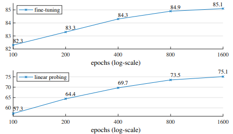
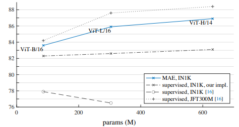

## Masked Autoencoders (MAE) 論文解説 ― なぜ高マスク率と非対称設計が効くのか

Masked Autoencoders（MAE）は、Vision Transformer 時代の自己教師あり学習を語るうえで外せない論文である。実際、この論文はしばしば「画像版 BERT」として紹介される。もちろん、その説明が完全に誤っているわけではない。入力の一部を隠し、隠した部分を予測するという枠組みだけを見れば、たしかに発想の表面はよく似ている。  
しかし、この理解だけでは MAE の本質をかなり取りこぼす。というのも、MAE の重要性は「画像でも masked modeling ができた」という一点にあるのではなく、 **画像という信号に合わせて masked modeling をどう設計し直したか** にあるからである。

自然言語と画像では、信号の性質が大きく異なる。言語の token は意味密度が高く、少数の欠損語を予測するだけでも高次の意味理解を要求しやすい。一方で画像は空間的冗長性が大きく、単純な欠損補完タスクをそのまま与えると、周囲の局所情報からそれらしく埋めるだけで解けてしまう場合がある。論文がまず問題にしているのは、まさにこの点である。すなわち、vision においては masked prediction をそのまま持ち込むだけでは、表現学習として十分に強い課題にならないのである。

そこで MAE は、非常に思い切った二つの設計を採用する。第一に、**75% 前後という高いマスク率** を用いて、再構成課題を意図的に難しくしたこと。第二に、 **エンコーダは可視パッチのみに作用し、再構成は軽量デコーダに任せる非対称設計** を採ったことである。この二つは独立な工夫ではない。高マスク率によって課題を難しくしつつ、同時に visible token しかエンコーダに入れないことで計算量を大きく削減する。MAE の美しさは、この「表現学習としての難しさ」と「計算効率としての軽さ」を同時に成立させた点にある。

本記事では、MAE を単なるアーキテクチャ紹介としては扱わない。見るべきなのは、各モジュールの名前や処理順そのものではなく、 **なぜその設計が必要だったのか** 、そして **どの設計選択がどの性能差として現れたのか** である。したがって、この記事の焦点は次の三点にある。  

- 第一に、なぜ vision では NLP と同じ感覚で masked modeling を設計できないのか。  
- 第二に、MAE の高マスク率と非対称 encoder-decoder 設計は、それぞれどの問題を解決しているのか。  
- 第三に、実験結果を通して、MAE の性能がどの仮説を支持しているのか。  

この視点をもとに、本記事は **MAE は何をうまく切り分けたのか** を読み解いていく。
ではまず、そもそもなぜ画像では masked modeling が NLP ほど素直に効かなかったのか、という点から見ていく。

@[card](https://arxiv.org/pdf/2111.06377)
@[card](https://github.com/facebookresearch/mae)

---

## 1. なぜ画像では masked modeling がそのまま効かなかったのか

masked modeling という発想自体は単純である。入力の一部を隠し、その欠損部分を予測するようにモデルを学習させる。自然言語処理では、この枠組みはきわめて大きな成功を収めた。BERT に代表される masked language modeling では、欠損した token を予測する過程そのものが、文脈理解や意味表現の獲得に直結しやすいからである。MAE 論文も、この NLP における成功を明確に意識しつつ、同じ発想を vision に持ち込もうとしている。

しかし、ここで重要なのは、　**「同じ発想をそのまま持ち込めるわけではない」**　という点である。論文が最初に強調しているのは、言語と画像では信号の情報構造が異なるということである。言語は人間が離散的な記号列として構成した信号であり、各 token が比較的高い意味密度を持つ。したがって、文中の一部の単語を隠すだけでも、その予測には構文・意味・文脈の理解が必要になりやすい。これに対して画像は自然信号であり、局所的な相関と空間的冗長性がきわめて強い。ある領域を隠しても、その周囲のテクスチャやエッジの連続性から、低レベルな補間としてそれらしく埋められてしまう場合がある。つまり、vision において単純な masked prediction を与えただけでは、必ずしも高次の意味表現を学ばせる課題にならないのである。

この点は、なぜ vision における autoencoding 系手法が NLP ほど素直には伸びなかったのか、という問いにも直結している。masked autoencoding という考え方自体は新しくない。古典的な denoising autoencoder の延長として、入力を破損させて元信号を復元する枠組みは以前から存在していたし、画像の一部を隠して復元する研究も MAE より前から存在していた。にもかかわらず、それらがそのまま「強い表現学習の標準形」にならなかったのは、画像では再構成課題がしばしば易しすぎるからである。タスクが易しすぎれば、モデルは大域的な物体理解やシーン理解に到達する前に、局所統計の延長だけで損失を下げられてしまう。MAE 論文は、この点を正面から問題設定に据えている。

では、vision において表現学習として十分に強い masked modeling を作るには何が必要なのか。MAE の答えは明快である。第一に、 **タスクを意図的に難しくすること** である。論文は、BERT 的な低いマスク率ではなく、75% 前後という非常に高いマスク率を用いる。これにより、入力の大半が失われ、単なる近傍補完では済まない状況が作られる。可視パッチが少ないため、モデルは局所的な連続性だけでなく、物体やシーンの全体的な構造を手掛かりに予測せざるを得ない。つまり、高マスク率は単なるノイズ注入ではなく、 **pretext task を意味のある難しさへ押し上げるための装置** として機能しているのである。

第二に、再構成という目的と表現学習という目的を、アーキテクチャ上で適切に切り分けることである。画像再構成は本質的に低レベルな情報を要求する。したがって、もし encoder 自身に再構成の細部まで背負わせると、認識に有用な抽象表現の学習と、画素復元のための局所的 detail の保持とが混ざりやすい。MAE はここで、可視パッチのみを処理する encoder と、full token を受けて再構成を担う lightweight decoder という非対称設計を採用する。これにより、encoder は表現学習に集中し、decoder が reconstruction のための情報整形を受け持つ構図が作られる。論文が非対称 encoder-decoder を中核設計としているのは、この役割分離に意味があるからである。

さらに、この非対称設計は表現学習上の利点だけでなく、計算効率の面でも本質的である。高マスク率を採ると、可視パッチは全体の 25% 程度にまで減る。もし encoder が visible patch のみを処理するなら、self-attention の計算量は full token 数ではなく visible token 数に支配される。これは、タスクを難しくするために高マスク率を導入したことが、そのまま計算効率の改善にもつながることを意味する。MAE の設計が美しいのは、表現学習に必要な「難しさ」と、大規模学習に必要な「軽さ」を同じ仕組みで同時に実現している点にある。ここに、単なる autoencoder の改良以上の設計的価値がある。

このように見ると、MAE の出発点は「画像でも BERT をやってみよう」という単なる模倣ではない。むしろ逆であり、 **画像は言語とは違う** という事実を受け入れたうえで、vision に適した masked modeling を再設計したのである。高マスク率、visible-only encoder、lightweight decoder、masked patch のみでの損失計算といった後続の設計は、すべてこの問題意識から導かれている。したがって MAE を理解するとは、単に Figure 1 の処理フローを追うことではなく、なぜそのフローでなければならなかったのかを理解することに等しい。

*Figure 1. **のMAEアーキテクチャ** 事前学習時には、画像パッチの大きなランダム部分集合（たとえば75%）をマスクする。エンコーダは、可視パッチの小さな部分集合に対して適用される。mask token はエンコーダの後に導入され、符号化されたパッチ全体と mask token の集合が、小さなデコーダによって処理され、元画像を画素単位で再構成する。事前学習後は、デコーダは破棄され、認識タスクのためにエンコーダが損傷のない画像（完全なパッチ集合）に適用される。*

---

## 2. MAE の方法：高マスク率・非対称設計・再構成損失

MAE の方法を一言でいえば、「入力の大部分を隠したうえで、見えている部分だけを重い encoder に通し、欠損部分の再構成だけを軽い decoder に担わせる」設計である。重要なのは、これは単なる実装上の工夫ではなく、第1章で見た問題設定、すなわち「画像では再構成課題が易しすぎる」「しかし大規模 ViT を効率よく学習したい」という二つの要請に同時に応える構造になっている点である。論文はこの方法を、masking、visible-only encoder、lightweight decoder、masked-only reconstruction loss、そして特殊な疎演算を必要としない簡潔な実装、という一貫した流れで提示している。

### 2.1 入力のパッチ化とマスキング

まず、入力画像を $N$ 個の重なりのない patch に分割する。ViT と同様、各 patch は線形射影によって token に変換され、位置情報は positional embedding によって与えられる。ここで MAE は、全 patch をそのまま encoder に入れるのではなく、その部分集合だけを残し、残りをマスクする。可視 patch の添字集合を $V$ 、マスクされた patch の添字集合を $M$ と書けば、

$$
V \cup M = {1,\dots,N}, \qquad V \cap M = \emptyset
$$

である。mask ratio を $r \in [0,1]$ とすれば、

$$
|M| = rN, \qquad |V| = (1-r)N
$$

となる。MAE の特徴は、この $r$ を非常に大きく取り、典型的には $r \approx 0.75$ とする点にある。つまり、全 patch の 75% 前後を除去し、残る 25% 程度だけを手掛かりとして再構成を行うのである。さらに、どの patch を残すかは block-wise ではなく、一様分布に基づくランダムサンプリングで決められる。これは中心付近に偏ったマスキングを避けると同時に、局所補完だけでは解きにくい sparse な観測条件を作るためである。

### 2.2 Encoder は visible patch のみを見る

MAE の最重要設計は、encoder が visible patch のみを入力として受け取る点にある。通常の masked modeling を素朴に実装すると、欠損位置を表す mask token を full token 列の中に混ぜ、その全体を encoder に通したくなる。しかし MAE はそうしない。マスクされた patch は encoder 入力から完全に除去され、encoder は $V$ に属する token だけを処理する。したがって、encoder が扱う系列長は $N$ ではなく $(1-r)N$ になる。

この設計は計算量の観点からきわめて本質的である。Transformer の self-attention は系列長に対して二次的に重くなるため、主要計算量は概ね

$$
O\left(|V|^2\right)=
O\left(((1-r)N)^2\right)
$$

とみなせる。たとえば $r=0.75$ なら $|V|=0.25N$ なので、attention 起因の計算は full token を処理する場合に比べて大きく減少する。もちろん実際の FLOPs には線形層や埋め込みなど他の項も含まれるが、少なくとも「高マスク率によって encoder 側の計算が大きく軽くなる」という直感はこの式で明確になる。論文でも、mask token を encoder に入れず decoder 側へ送ることで、学習時間とメモリ消費を大きく削減できることが強調されている。

さらに重要なのは、この visible-only encoder が単なる高速化テクニックではないことである。encoder は pretraining 時も downstream 時も「実際に観測される patch」だけを見る。もし encoder 内に多数の mask token を含めてしまうと、事前学習時の入力分布と下流タスク時の入力分布の間にギャップが生じる。MAE はそのギャップを避けるように設計されているのである。

### 2.3 Decoder は full token を受けて再構成する

encoder の出力は visible patch に対応する潜在表現だけである。しかし最終的には、元の画像全体に対応する patch を再構成しなければならない。そこで MAE は、encoder の後段で初めて mask token を導入する。すなわち、(i) encoder が出力した可視 patch の latent token 群と、(ii) 欠損 patch の位置に対応する共有の学習可能 mask token 群を結合し、それらを元の patch 順序に並べ戻したうえで decoder に入力する。さらに、mask token 自体は位置情報を持たないため、decoder 側では full token 列全体に positional embedding を加える必要がある。こうして decoder は、「どこが見えていて、どこが欠損しているか」を位置つきで受け取り、元画像の patch 列を再構成する。

ここでのポイントは、decoder が encoder よりも小さくてよい、というより、小さく設計されるべきだという点である。decoder の役割は、認識に使う汎用表現を作ることではなく、あくまで pretraining 中の再構成タスクを成立させることである。論文では、decoder は encoder よりも浅く狭い軽量な Transformer として設計され、token あたりの計算量も encoder よりかなり小さい。事前学習後には decoder は破棄され、下流タスクでは encoder のみを用いる。したがって MAE は、「重いモデルは表現学習にだけ使い、再構成のための後処理は軽いモジュールに押し込める」という明確な役割分担を採っているのである。

### 2.4 再構成損失

MAE は最終的に、各 masked patch に対応する画素値ベクトルを予測する。patch $i$ の真値を $x_i$ 、decoder の予測を $\hat{x}_i$ とすれば、基本的な損失は masked patch 上の平均二乗誤差である。すなわち、

$$
\mathcal{L}_{\mathrm{MAE}}=
\frac{1}{|M|}
\sum_{i \in M}
\left\lVert \hat{x}_i - x_i \right\rVert_2^2
$$

である。ここで重要なのは、損失を **masked patch のみに対して計算する** 点である。visible patch については入力として既に与えられているため、そこまで再構成誤差を課す必要はない。むしろ損失を masked 部分だけに限定することで、モデルは「見えていない部分をどう推論するか」に集中させられる。これは BERT 系の masked modeling と同型の考え方であるが、vision では画素空間での再構成として実装されている。

論文はさらに、単純な生 pixel だけでなく、patch 内で正規化した pixel を再構成目標とする変種も検討している。各 patch 内で平均と標準偏差を用いて正規化した target を使うことで、実験上は表現品質が改善したと報告されている。これは、少なくとも MAE においては tokenization のような複雑な離散化を導入しなくても、pixel-based な目標で十分に強い表現学習が可能であることを示唆している。

### 2.5 実装上のポイント

MAE のもう一つの美点は、この方法が見かけよりも実装しやすいことである。高マスク率・部分観測・非対称設計と聞くと、特殊な sparse attention や複雑なインデックス操作が必要に見えるかもしれない。しかし論文の実装はもっと単純である。まず全 patch から token を作り、ランダムに shuffle する。次に、その先頭 $(1-r)N$ 個だけを取り出して encoder に通す。encoder の出力の後ろに mask token を付け足し、その列を unshuffle して元の patch 順序へ戻す。最後に、その full token 列を decoder に入れて再構成する。つまり、masking は「token を抜く」というより「token 列をシャッフルして一部を切り落とす」操作として実装できるのである。論文は、この方法では特別な疎演算は一切不要であり、shuffle / unshuffle のオーバーヘッドも小さいと述べている。

以上をまとめると、MAE の方法は次のように整理できる。高マスク率によって task を難しくする。visible-only encoder によって重い計算を削る。lightweight decoder によって full reconstruction を成立させる。masked-only reconstruction loss によって学習の焦点を欠損部分の推論へ絞る。そしてその全体が、特殊な計算機構なしに実装できる。このように、MAE は各要素がばらばらに置かれているのではなく、「難しさ」「軽さ」「単純さ」を同時に満たすよう、方法全体が一つの設計原理で貫かれている。

---

## 3. MAE は何をうまく切り分けたのか

第2章では、MAE の方法を構成要素ごとに見た。ここで次に重要になるのは、それらの要素を個別の工夫として理解するのではなく、 **なぜこの組み合わせで性能と効率が同時に成立したのか** を考えることである。MAE の本質は、単に masked reconstruction を行ったことにはない。むしろ重要なのは、画像における表現学習で衝突しやすい複数の要求、すなわち「課題を十分に難しくしたい」「しかし計算は重くしたくない」「さらに encoder には認識に有用な表現を学ばせたい」という要請を、設計上きれいに分離した点にある。論文中の高マスク率、visible-only encoder、lightweight decoder、mask token の配置といった工夫は、すべてこの切り分けの上に置かれている。

### 3.1 高マスク率は「難しい pretext task」を作る

まず最も重要なのは、高マスク率の意味である。MAE において 75% 前後という非常に高いマスク率が採用されているのは、単に入力を強く壊したいからではない。目的は、 **再構成課題を表現学習として意味のある難しさにすること** である。論文が繰り返し指摘しているように、画像は空間的冗長性が大きい。したがって、欠損率が低いと、周辺パッチからの連続性だけでそれらしい補完が可能になりやすい。その場合、モデルは大域的な物体構造やシーン理解に到達しなくても損失を十分に下げられてしまう。

これに対して、高マスク率では事情が変わる。見えている情報がごく一部しかないため、単なる局所補間では足りず、より大域的で抽象的な構造を推論しなければならない。論文中でも、再構成結果は元画像そのものとは一致しなくても、意味的にはもっともらしい出力を与える例が示されている。ここから読み取るべきなのは、MAE が「画素を丸写しするモデル」ではなく、 **欠損した視覚情報を、物体やシーンの整合性を手掛かりに推論するモデル** になっていることである。すなわち、高マスク率はノイズ量の調整ではなく、pretext task の性質そのものを変えるレバーとして働いているのである。

別の言い方をすれば、MAE は「再構成できるか」を問うているのではなく、「少ない手掛かりから、もっともらしい全体像を復元できるか」を問うている。そしてその問いに変えるためには、マスク率をかなり高くしなければならなかった。BERT 的な感覚で低マスク率を選ぶと、この問いが成立しない。ここに、画像と言語の違いを踏まえた MAE の最初の再設計がある。

### 3.2 encoder と decoder の役割を分離した

次に重要なのは、MAE が encoder と decoder に異なる責務を与えている点である。通常、autoencoder という語からは、入力を圧縮し、それを元に戻す対称的な構造を想像しやすい。しかし MAE はそこから意識的に外れている。encoder は visible patch のみを受け取り、その少ない観測から潜在表現を形成する。一方で decoder は、mask token を含む full token 列を受け取り、画像再構成という低レベルな出力生成を担う。つまり MAE は、 **表現学習の中核** と **再構成という補助課題の実行部** を、アーキテクチャ上で切り離しているのである。

この切り分けには、表現学習上の意味がある。画像再構成は本質的に画素レベルの詳細を要求する。もしその役割まで重い encoder に直接背負わせると、encoder は認識に有用な抽象表現を学ぶ一方で、局所的 detail を保持することも強いられる。その結果、再構成に特化した低レベル表現と、下流認識に有用な高レベル表現が混ざりやすくなる。論文は、画像においては decoder 設計が潜在表現の意味レベルを左右すると指摘しており、ある程度の再構成特化を decoder 側に押し込めることが重要だと述べている。

この点から見ると、MAE の非対称設計は単に「小さい decoder で済ませて速くした」という話ではない。より本質的には、 **encoder に何を学ばせ、decoder に何を押し込めるかを整理した設計** である。encoder は sparse な観測から意味的に豊かな潜在表現を作ることに集中し、decoder はその表現と mask token を使って再構成の細部を整える。この責務分離があるからこそ、reconstruction を pretext task として使いながらも、encoder 自体は recognition-oriented な表現を保持しやすくなるのである。

### 3.3 mask token を encoder に入れない理由

MAE の設計の中でも特に重要なのが、mask token を encoder に入れないという判断である。一見すると、欠損位置を表す token を最初から encoder に与えた方が自然に見えるかもしれない。しかし論文のアブレーションでは、この設計はむしろ性能を悪化させる。理由は明快である。encoder が多数の mask token を含む入力で事前学習されると、pretraining 時と downstream 時とで入力分布が変わってしまうからである。事前学習中の encoder は「人工的な欠損記号が大量に並ぶ画像」を見ているのに、下流タスクではそのような token は存在しない。このギャップが表現品質を損なう。

そこで MAE は、encoder にはあくまで実 patch だけを見せる。mask token は decoder 側で初めて導入される。これにより encoder は、pretrain 時も downstream 時も「現実の画像パッチを処理する装置」として一貫する。これは表現学習の観点から自然であるだけでなく、計算量の観点からも有利である。mask token を encoder から外せば、処理すべき系列長そのものが短くなり、self-attention のコストが大きく減る。したがってこの設計は、 **分布ギャップの縮小** と **計算削減** を同時に達成している。MAE らしさは、こうした二重の意味を持つ選択にある。

### 3.4 「難しさ」と「軽さ」を同じ機構で両立した

MAE が特に洗練されているのは、表現学習のために導入した高マスク率が、そのまま計算効率の改善にも直結している点である。通常、pretext task を難しくすれば学習は重くなりやすい。より多くの文脈、より複雑な予測、より大きなモデルが必要になるからである。ところが MAE では逆のことが起きる。高マスク率にすると visible patch 数が減るため、encoder が処理する token 数も減り、attention 計算が軽くなる。つまり、 **課題を難しくするための設計が、同時に学習を軽くしている** のである。

これは偶然ではない。論文の中心仮説は、画像では冗長性が高いからこそ、高マスク率によって本質的な情報だけを残すべきだというものである。そして、その sparse な観測条件に合わせて encoder を visible-only にすれば、重い ViT をより少ない token 上で回せる。この意味で MAE は、「画像の冗長性を学習課題の難化に使い、その副作用として計算も減らす」という設計になっている。冗長性は通常、学習を甘くする要因だが、MAE ではそれを逆手に取っているのである。

### 3.5 MAE は reconstruction を目的にしていない

ここまでを踏まえると、MAE を単なる再構成モデルとして理解するのは不十分であることが分かる。たしかに訓練時の損失は再構成誤差であり、出力も画素である。しかし論文が本当に狙っているのは、画素再現の忠実さそのものではない。目標は、 **再構成を通じて強い視覚表現を学ぶこと** である。そのために、再構成課題は「易しすぎない」ように高マスク率で難しくされ、encoder は「再構成専用器」にならないように visible-only かつ非対称設計で守られている。decoder も pretraining が終われば捨てられる。これは、再構成が目的ではなく、あくまで representation learning のための手段であることをはっきり示している。

したがって MAE の価値は、「masked reconstruction を導入したこと」ではなく、 **reconstruction を表現学習のための良い課題に変換したこと** にある。しかもその変換は、複雑な補助損失や特殊な教師信号によらず、高マスク率、非対称設計、mask token の配置といった比較的単純な選択の組み合わせで実現されている。論文タイトルに “Scalable” とあるのは、単に大規模モデルで動いたからではなく、この切り分けが方法全体をシンプルかつ拡張可能なものにしているからである。

以上より、MAE は「何か新しい層を足したモデル」ではない。むしろ、画像における masked modeling の失敗しやすい点を見極め、それぞれに対して最小限で整合的な設計を当てた方法である。高マスク率は task を難しくする。visible-only encoder は計算を軽くしつつ表現学習を守る。lightweight decoder は再構成の detail を引き受ける。mask token の後置は分布ギャップを避ける。MAE は、この役割分担の設計そのものが本質である。

---

## 4. 実験から見る MAE の本質

ここで重要なのは、実験結果を単に「この設定で何点だったか」の一覧として読むことではない。MAE 論文のアブレーションは、それぞれが明確な設計仮説に対応している。したがって本章では、表を順に説明するのではなく、 **どの実験がどの仮説を支持しているのか** という観点で整理する。実際、ImageNet-1K 上の ViT-L/16 に対するベースライン比較だけでも、scratch 学習の実装が 82.5% であるのに対し、baseline MAE から fine-tuning すると 84.9% まで向上しており、事前学習の寄与がすでに明確に現れている。

### 4.1 本当に高マスク率が効くのか

MAE の中核仮説は、「画像では pretext task を十分に難しくするために高マスク率が必要である」というものであった。この点を直接検証しているのが **Figure 2** である。Figure 2 は masking ratio を横軸に取り、fine-tuning と linear probing の両方の精度変化を示している。論文の結論はかなり明確であり、**75% 前後の高マスク率が両評価で良好に機能する**。これは、BERT における典型的な 15% 前後のマスク率とも、従来の vision 系 masked modeling で多かった 20〜50% とも大きく異なる。 

*Figure 2. **Masking ratio.** 高いマスキング率（75%）は、fine-tuning（上）と linear probing（下）の両方で良好に機能する。本論文中のすべてのプロットにおいて y 軸は ImageNet-1K validation accuracy（%）である。*

さらに、単に Figure 2 の曲線を読むだけでなく、**Figure 3** を用いてその意味を定性的にも補足する。Figure 3 は、75% で学習した MAE に対して、推論時にさらに高いマスク率の入力を与えたときの再構成例である。ここでは元画像と完全一致ではないが、意味的にはもっともらしい再構成が得られている。したがって論文は、高マスク率によってタスクが「局所的な埋め草」ではなく、「全体像を推論する課題」へ変わっていると解釈している。実際、Figure 2 では linear probing の精度がマスク率とともに大きく上昇し、最大で約 20 ポイントの差が現れる一方、fine-tuning でも 40〜80% の広い範囲で良好に機能している。ここから読み取るべきなのは、**高マスク率は単なる強い破損ではなく、表現学習に必要な難しさを与える装置である**ということである。  

*Figure 3. マスキング率75%で事前学習された MAE を用途時にはより高いマスキング率の入力に適用した場合の、ImageNet 検証画像の再構成結果。予測は元画像ともっともらしく異なっており、本手法が汎化できることを示している。*

### 4.2 decoder は重いほど良いのか

次に問うべきは、decoder をどの程度重く設計すべきかである。この点は **Table 1a と Table 1b** によって検討されている。論文本文では、decoder depth に関する議論が Table 1a、decoder width に関する議論が Table 1b に対応している。結果として、 **十分に深い decoder は linear probing にとって重要であるが、fine-tuning に対する影響はそれほど大きくない** ことが示される。論文はこの挙動を、再構成に特化する後段部分を decoder 側が担うことで、encoder 側の潜在表現をより抽象的なレベルに保てるからだと説明している。Table 1a では、decoder depth の調整によって linear probing が最大 8 ポイント改善すると述べられている。 

ただし、ここから「decoder は重いほどよい」と結論してはならない。論文は同時に、単一ブロックの decoder でも fine-tuning では 84.8% という強い性能が得られることを報告している。また、デフォルト decoder は 8 blocks・512-d であり、これは **Table 1 の gray 行** で定義されたベース設定に対応する。さらに、その軽さは **Table 2** で示される計算効率の議論ともつながっている。したがって、この実験が支持しているのは、「decoder は大きいほどよい」ではなく、 **再構成特化を引き受けるのに十分な能力は必要だが、主役はあくまで encoder であり、decoder 自体は軽量であるべき** という MAE の設計思想である。

*Table 1 **MAE のアブレーション実験** ImageNet-1K 上で ViT-L/16 を用いる。fine-tuning（ft）および linear probing（lin）の精度（%）を報告する。特に指定がない場合のデフォルト設定は次の通りである：デコーダは depth 8、width 512、再構成目標は非正規化ピクセル、データ拡張は random resized cropping、マスキング率は 75%、事前学習長は 800 epochs である。デフォルト設定は `gray` で示す。*

### 4.3 mask token を encoder に入れない設計は正しいのか

MAE のもう一つの中心設計は、mask token を encoder に入れず、decoder 側で初めて導入する点である。この仮説を検証しているのが **Table 1c** であり、計算時間との対応を補助しているのが **Table 2** である。論文によれば、encoder が mask token を用いる場合、linear probing 精度は 14% 低下する。これは単なる小さな差ではなく、設計方針そのものを左右する大きな差である。論文の解釈は、pretraining 時には多数の mask token を含む入力を見ていた encoder が、downstream 時にはそのような token をまったく見ないため、入力分布ギャップが生じるというものである。 

さらに、この設計は表現品質だけでなく計算効率にも直接効いている。 **Table 1c** では学習 FLOPs が 3.3 倍削減され、 **Table 2** では実時間で 2.8 倍の高速化が報告されている。より小さい decoder やより大きい encoder を使う条件では、3.5〜4.1 倍まで伸びるとも書かれている。したがって、mask token の後置は単なるテクニックではない。 **表現の質を保ちながら、同時に pretraining を大幅に軽くする設計** として機能しているのである。この点は MAE の設計の中でも特に美しい部分であり、性能と効率の両立を示す代表的な実験である。  

*Table 2. 128 個の TPU-v3 コアと TensorFlow を用いてベンチマークした、 MAE 学習（800 epochs）の実時間。高速化率は、エンコーダが mask token を持つエントリ（gray）に対する相対値である。デコーダ幅は 512、マスク率は 75% である。 $\dag$ ：このエントリは 10 epochs の学習から推定した値である。*

### 4.4 pixel target で十分なのか

masked image modeling を考えると、pixel を直接再構成するのは素朴すぎるのではないか、という疑問が生じる。この点を検証しているのが **Table 1d** であり、転移学習まで含めた再確認として **Table 3** も参照できる。まず Table 1d では、正規化しない pixel、正規化した pixel、PCA 係数、さらに dVAE token を使った変種が比較されている。その結果、 **正規化 pixel target は性能を改善し、PCA 係数 target は性能を落とす** 。さらに token prediction は非正規化 pixel に対して fine-tuning 精度を 0.4% 改善するものの、正規化 pixel に対して優位ではなく、linear probing ではむしろ低下する。 

この論点は第5章の転移学習実験でも再確認されており、 **Table 3** では dVAE token と正規化 pixel が統計的に同等であると整理されている。したがって論文全体を通じて見ると、pixel target は「妥協案」ではなく、 **MAE においては十分に強く、しかも追加の tokenizer 事前学習を不要にする簡潔な選択** であることが分かる。ここで重要なのは、target を複雑にするほどよいわけではない、という点である。MAE の強さは複雑な tokenization によるのではなく、masking と非対称設計の側にある。 

*Table 3. **MAE の再構成目標としての pixels と tokens** 。 $\triangle$ は、dVAE tokens を用いた場合と正規化ピクセルを用いた場合との差を表す。その差は統計的に有意ではない。*

### 4.5 augmentation 依存は強いのか

自己教師あり学習、とくに contrastive learning に慣れていると、強い augmentation が性能の前提であるように感じられる。しかし MAE の実験は、それとはかなり異なる像を示している。この点に対応するのは **Table 1e** である。論文によれば、固定サイズあるいはランダムサイズの cropping だけでも MAE は良好に動作し、color jittering を加えるとかえって性能が悪化する。さらに、center-crop のみで flipping すら行わない場合でも、そこそこの性能を維持している。 

この結果の意味は重要である。MAE では、学習サンプルの多様化や正則化の主役が augmentation ではなく **ランダムマスキングそのもの** だからである。各 iteration でマスク位置が変わるため、同じ画像でも毎回異なる観測条件が生成される。したがって Table 1e が示しているのは、単に「augmentation が弱くても動く」という経験則ではなく、 **MAE は contrastive learning とは別の仕方で自己教師あり学習の多様性を確保している** ということである。 

### 4.6 ランダムマスキングは本当に最適か

masking strategy の違いを比較しているのが **Table 1f** と **Figure 4** である。Table 1f は定量評価、Figure 4 は対応する定性的再構成例を示している。block-wise masking は Figure 4 の中央、grid-wise sampling は右、ランダムサンプリングは左に描かれている。結果として、block-wise masking は 50% ではそこそこ機能するが 75% では性能が悪化し、training loss も高く、再構成もよりぼやける。逆に grid-wise sampling は task 自体は容易で、再構成はより鮮明になるが、表現品質は低い。 

この組み合わせから読み取るべきことは明確である。 **再構成が見た目に鮮明であることと、表現学習として優れていることは一致しない** 。Figure 4 の右にある grid-wise の再構成は見栄えが良くても、Table 1f の精度はそれに対応して良くならない。むしろ論文の結論は、ランダムサンプリングこそが、高い masking ratio を可能にしつつ、速度と表現品質を最もよく両立する、というものである。ここでも MAE が「きれいな補完」ではなく「強い表現」を目的に設計されていることがはっきり現れている。

*Figure 4. マスクサンプリング戦略は pretext task の難易度を決定し、それが再構成品質と表現に影響する（Table 1f）。ここで各出力は、指定したマスキング戦略で学習した MAE から得られたものである。左：ランダムサンプリング（デフォルト）．中央：大きなランダムブロックを取り除く block-wise sampling．右：4 個のパッチごとに 1 個を残す grid-wise sampling．画像は validation set からのものである。*

### 4.7 本当にスケールするのか

最後に、論文タイトルにも入っている “Scalable” が本当に成立しているかを見る必要がある。この点には二つの対応箇所がある。ひとつは学習長の影響を直接示す **Figure 5**、もうひとつは他手法との比較をまとめた **Table 3** と、教師あり事前学習との比較を示す **Figure 6** である。Figure 5 によれば、学習スケジュールを長くするほど精度は着実に向上し、1600 epochs においても linear probing の飽和は観察されていない。論文はこれを、MoCo v3 が ViT-L で 300 epochs 程度で飽和することと対比している。 

さらに **Table 4** では、MAE が ViT-H で 224 解像度 86.9%、448 解像度 87.8% を達成し、ImageNet-1K のみを用いる従来結果を更新していることが示されている。加えて、Table 4 のモデルは 1600 epochs 学習しているにもかかわらず、本文では ViT-L の MAE が 31 時間、MoCo v3 が 36 時間であると述べられている。つまり MAE は、長く学習してもなお総時間で競争力を保っている。さらに **Figure 6** は、教師あり事前学習との比較において、モデルサイズが大きくなるほど MAE の利得が大きくなることを示している。したがって “Scalable” とは、単に大きいモデルで動いたという意味ではなく、**モデルを大きくするほど利得が伸び、しかも学習時間の面でも十分現実的である**という意味である。

*Table 4. **ImageNet-1K における従来結果との比較** 事前学習データは ImageNet-1K の訓練セットである（ただし，BEiT の tokenizer のみは 2.5 億枚の DALLE データで事前学習されている）。すべての自己教師あり手法は、end-to-end fine-tuning によって評価される。ViT モデルは B/16，L/16，H/14 である。各列で最良の結果には下線を付している。すべての結果は画像サイズ 224 におけるものであり、ViT-H についてのみ 448 の追加結果がある。ここで我々の MAE は正規化ピクセルを再構成し、1600 epochs の事前学習を行っている。*

Figure 5. Training schedules. より長い学習スケジュールは、明確な改善をもたらす。ここで各点は、完全な学習スケジュールを表している。モデルは Table 1 のデフォルト設定を用いた ViT-L である。

Figure 6. **MAE 事前学習 vs 教師あり事前学習** ImageNet-1K（224 サイズ）での fine-tuning により評価。元の ViT の結果と比較しており、それらは IN1K または JFT-300M で学習されている。

以上をまとめると、本章の実験は第3章で整理した設計原理をかなり一貫して支持している。高マスク率の妥当性は **Figure 2** と **Figure 4** によって支えられ、decoder の役割分担は **Table 1a・1b** によって示される。mask token の後置は **Table 1c と Table 2** によって性能と効率の両面から裏づけられ、pixel target の十分性は **Table 1d と Table 3** によって確認される。augmentation 依存の低さは **Table 1e** 、マスク戦略の意味は **Table 1f と Figure 4** 、そしてスケーラビリティは **Table 4、Figure 5、Figure 6** によって示される。つまり MAE の強さは、個々の工夫の寄せ集めではなく、 **どの図表を見ても同じ設計思想が繰り返し支持されている** 点にある。

---

## 5. MAE の表現は“線形には弱く、適応すると強い”

ここまでの議論で、MAE が高マスク率と非対称設計によって強い表現を学習していることは見えてきた。しかし、ここで一つ注意すべき点がある。それは、**その強さが linear probing だけでは十分に見えない**ことである。実際、論文はこの点を独立の論点として扱い、　**Figure 7** を用いて詳しく検討している。出発点になっているのは、すでに **Table 1** の時点で見えていた事実、すなわち linear probing の結果と full fine-tuning の結果が必ずしも強く相関していない、という観察である。論文はこのズレを、単なる評価上のノイズではなく、**表現の性質そのものを示す重要な手掛かり**として読んでいる。 

Figure 7. **Partial fine-tuning** ．Table 1 のデフォルト設定において，fine-tune する Transformer blocks の数に対する ViT-L の結果。0 blocks の調整は linear probing、24 blocks は full fine-tuning に対応する。MAE 表現は線形分離可能性は低いが、1 個以上の block を調整した場合には、一貫して MoCo v3 より優れている。

### 5.1 Figure 7 が何を見せているのか（見出しにfigureって入れんのやめてくれ）

この論点を直接示しているのが **Figure 7** である。Figure 7 は、ViT-L を用いた MAE 表現に対して、「何個の Transformer block を fine-tune するか」を横軸に取り、精度がどう変わるかを示した図である。図の読み方として重要なのは、**0 blocks が linear probing、24 blocks が full fine-tuning に対応する**点である。すなわち Figure 7 は、線形評価と end-to-end fine-tuning を別の評価法として並べているのではなく、**凍結する範囲を連続的に変えたときに性能がどう立ち上がるか**を見ている。ここにより、MAE の表現が「線形にはどの程度見え、非線形に適応させるとどこまで伸びるか」が一枚で分かる構成になっている。 

Figure 7 の最も印象的な点は、**Transformer block を1つだけ fine-tune するだけで、精度が 73.5% から 81.0% に大きく向上する**ことである。さらに、最後の block の半分、すなわち MLP sub-block だけを調整した場合でも 79.1% に達しており、これは linear probing を大きく上回る。論文はこの変種を、実質的には MLP head を fine-tune しているのと同じだと述べている。加えて、4 個あるいは 6 個程度の block を調整すれば、full fine-tuning にかなり近い精度へ到達する。つまり Figure 7 が示しているのは、**MAE の表現は「線形分類器を乗せただけ」では十分に引き出されないが、少し非線形適応を許しただけで急速に強さを発揮する**ということである。 

### 5.2 linear probing が低いことは、表現が弱いことを意味しない

この結果から最初に言えるのは、 **linear probing の値だけで表現の良し悪しを断定してはならない** ということである。自己教師あり学習では、しばしば linear probing が表現品質の標準指標として用いられる。たしかにこれは便利であり、表現の線形分離可能性を簡潔に比較できる。しかし、論文が Figure 7 を通して示しているのは、線形分離可能性は表現の一側面にすぎない、ということである。MAE の場合、0 blocks すなわち linear probing の位置だけを見ると、表現はそれほど強く見えないかもしれない。ところが 1 block だけ適応させると精度が大幅に跳ね上がる。これは、表現の中に有用な情報が十分埋め込まれていても、それが単純な線形境界では取り出しきれない可能性を意味する。

ここで論文は、MAE の表現を **“linearly less separable but more powerful nonlinear features”** と解釈している。日本語で言えば、MAE の表現は線形分離可能性という意味では控えめである一方、少し非線形な head を許すと非常にうまく働く表現だ、ということである。これは、MAE が reconstruction を通じて比較的豊かな潜在表現を学んでおり、それが線形評価では過小評価されやすいことを示唆している。第3章で述べた「decoder が再構成特化を引き受けることで、encoder 側は抽象的な表現を保てる」という解釈ともよく噛み合う。抽象的な表現ほど、単純な線形分類器だけでは読み出しきれない場合があるからである。 

### 5.3 Figure 7 における MoCo v3 比較の意味

Figure 7 のもう一つの重要な点は、MAE の曲線が **MoCo v3** と比較されていることである。論文によれば、MoCo v3 は linear probing の精度では MAE より高い。しかし、partial fine-tuning の結果では一貫して MAE が優れており、たとえば  **4 blocks を調整した場合には 2.6% の差** がある。この比較が意味するのは明確である。もし評価指標として linear probing だけを採用していたなら、「MoCo v3 の方が強い表現である」と読んでしまうかもしれない。ところが Figure 7 は、その判断が早計であることを示している。少しでも非線形適応を許すと、MAE の表現の方がより強く機能するからである。 

この比較は、評価指標そのものへの批判にもなっている。論文は、linear probing は物体検出のような転移学習性能と十分に相関しないことが以前から指摘されているとも述べている。さらに、NLP では事前学習済み表現の評価として線形評価がそれほど一般的ではないことにも触れている。つまり MAE 論文は、単に自分たちの手法の成績を弁護しているのではなく、 **自己教師あり学習の表現評価そのものを、もう少し豊かに考えるべきではないか** という問題提起をしているのである。Figure 7 はそのための根拠図として読むべきである。

### 5.4 なぜ MAE ではこのようなズレが生じるのか

では、なぜ MAE では linear probing と fine-tuning の間にこれほど大きなズレが生じるのか。論文はこの点を明示的に理論化しているわけではないが、全体の設計思想からかなり自然に解釈できる。MAE は pixel reconstruction を pretext task として用いるが、そのままでは低レベル課題に落ちやすいため、高マスク率によってタスクを難しくし、decoder に再構成特化を押し込み、encoder には sparse な観測から潜在表現を作らせるよう設計されていた。このとき encoder が学ぶのは、単純なクラス境界に直ちに対応する表現というより、 **部分観測から全体構造を推論するための、より柔軟で内部構造を持った表現** だと考える方が自然である。

そのような表現は、線形分類器を一枚載せるだけでは十分に読めないかもしれない。しかし、最後の 1 block あるいは MLP sub-block によって軽く非線形変換を許せば、一気に有用性が表面化する。Figure 7 の急な立ち上がりは、まさにこの仮説と整合する。したがって MAE の場合、linear probing が低めであることは「情報がない」ことを意味するのではなく、 **情報の配置が線形読出しにあまり親和的でない** ことを意味している可能性が高い。論文のいう “more powerful nonlinear features” とは、その意味で理解するのがよい。 

### 5.5 この章から何を学ぶべきか

以上を踏まえると、第5章の要点は単純である。MAE は、linear probing だけを見ると過小評価されうる。だが **Figure 7** を見ると、1 block だけの partial fine-tuning ですでに大きな性能向上が得られ、4〜6 blocks の調整で full fine-tuning に近づく。さらに MoCo v3 との比較でも、linear probing 単独の順位と partial fine-tuning を含めた順位が入れ替わる。したがって、MAE の表現を理解するためには、「線形に分離しやすいか」だけでなく、 **少数の非線形層を通したときにどれだけ強く機能するか** を見る必要がある。

この意味で、Figure 7 は MAE 論文の中でも特に重要な図である。第4章のアブレーションが「なぜその設計なのか」を示していたとすれば、Figure 7 は「その設計がどのような表現を生んだのか」を示している。高マスク率と非対称設計によって学ばれた表現は、単なる線形特徴ではない。むしろ、少し適応させたときに強く立ち上がる、非線形な柔軟性を持つ表現である。これが MAE の表現を読むうえでの核心である。

---

## 6. MAE が残したもの

ここまで見てきたように、MAE の貢献は単に ImageNet で高精度を達成したことにとどまらない。むしろ重要なのは、MAE が vision における自己教師あり学習の設計空間そのものを押し広げた点にある。論文の意義は、「masked autoencoding でも強かった」という結果の報告ではなく、**画像に対して masked modeling を成立させるには何を設計し直すべきか**を示したことにある。

第一に、MAE は contrastive learning 一辺倒になりつつあった vision SSL に対して、別の強い路線を与えた。SimCLR、MoCo、BYOL などの系譜では、view 生成や augmentation 設計が中心課題であった。これに対して MAE は、reconstruction を軸にしながらも、単純な autoencoder ではなく、高マスク率と非対称設計を通じて有効な表現学習を成立させた。これは、自己教師あり学習の中心課題を「どの augmentation で不変性を学ばせるか」から、「どの欠損課題を与えれば意味ある推論が生じるか」へと押し広げたと言える。

第二に、MAE は複雑な target design を必須条件としなかった。同時期には離散 token を予測する系統も注目されていたが、MAE は pixel reconstruction でも十分に強いことを示した。ここで重要なのは、pixel が特別に優れているというより、性能の本質が tokenizer の複雑さではなく、task の難しさと architecture の責務分離にあると示した点である。これは、masked image modeling を考えるうえで大きな整理を与えた。

第三に、MAE は大規模 ViT を自己教師ありで事前学習する現実的な道筋を示した。高マスク率によって task を難しくしながら、visible-only encoder によって計算を軽くするという設計は、表現学習上の意味と計算効率上の意味を同時に持っていた。その結果として、ViT-L や ViT-H のような大規模モデルでも、自己教師あり事前学習が現実的なコストで成立することが示された。MAE の “Scalable” とは、単に大きいモデルで性能が伸びたというだけでなく、設計そのものがスケールに適していたという意味で理解すべきである。

第四に、MAE は vision における masked modeling の一つの標準形を与えた。高マスク率、visible-only encoder、lightweight decoder、masked-only reconstruction loss という構成は、その後の masked image modeling を考える際の基準点になった。後続研究は、この枠組みをそのまま採用するにせよ、あるいは target、decoder、masking strategy を変えるにせよ、基本的には MAE が定めた設計座標の上で議論することになった。この意味で MAE は、単なる一手法ではなく、設計原理としての影響を残した論文である。

要するに、MAE が残したものは「強い pretrained model」だけではない。より重要なのは、画像に対して masked modeling をどう成立させるかという問いに対し、単純で、計算効率が高く、しかも大規模化に耐える一つの答えを与えたことである。そこに、MAE が後続研究に与えた本当のインパクトがある。

---

## 7. MAE を過大評価しないために

ここまで見てきたように、MAE はきわめて強力な手法である。しかし、その強さを正しく理解するためには、同時に限界や前提も押さえておく必要がある。MAE の価値は、「masked reconstruction を導入したから万能になった」というところにはない。むしろ重要なのは、画像という信号に対して masked modeling をかなり丁寧に再設計したことであり、その有効性もまた特定の条件の上で成立している、という点である。論文自身も Discussion において、画像と言語は本質的に異なる信号であり、この違いには慎重に対処しなければならないと述べている。

第一に、**画像再構成がそのまま最良の表現学習目標であるとは限らない**。MAE は pixel reconstruction を通じて強い表現を得ているが、それは再構成それ自体が本質だったという意味ではない。実際、論文全体を通じて見えてくるのは、再構成を「良い pretext task」に変えるために、高マスク率、visible-only encoder、lightweight decoder、masked-only loss といった複数の設計が必要だったということである。したがって、もしこれらの設計上の支えを外したなら、再構成は再び局所補完に流れ、表現学習として弱くなる可能性がある。MAE の成功を「再構成すればよい」と一般化するのは危険である。

第二に、**decoder 設計は表現の意味レベルに影響する**。論文は、画像においては decoder が画素再構成を担うため、その設計が学習される潜在表現の性質を左右すると明言している。これは裏を返せば、decoder は単なる後処理器ではなく、潜在表現の抽象度に介入する存在であるということである。したがって MAE を応用・拡張する際には、「decoder は軽ければ何でもよい」とは考えない方がよい。どこまでを encoder に学ばせ、どこからを decoder に押し込めるかは、表現学習の質そのものに関わる設計変数である。

第三に、**linear probing だけでは MAE の強さを測れない**。第5章で見たように、MAE の表現は線形にはそれほど強く見えなくても、少数の block を fine-tune するだけで急激に性能が伸びる。これは MAE の表現が弱いという意味ではなく、むしろ線形読出しだけでは十分に引き出せない種類の表現であることを示している。したがって、もし評価指標を linear probing のみに固定してしまうと、MAE のような手法を過小評価する危険がある。これは MAE の限界というより、表現評価の限界であるが、手法の理解にとっては重要な注意点である。

第四に、**MAE の利得は downstream での適応を前提としている側面が大きい**。論文では ImageNet fine-tuning だけでなく、COCO、ADE20K、分類系データセットにおける転移学習でも有効性が示されているが、それらは基本的に end-to-end の fine-tuning を伴う設定である。したがって、MAE を「完全に凍結した特徴抽出器」としてのみ使う状況では、その強みを十分に享受できない可能性がある。これは実運用上かなり重要であり、計算資源や下流データ量の制約が厳しい場面では、MAE の利点がどの程度残るかを別途見極める必要がある。

第五に、**画像以外の信号へ移すときには、masking 単位や reconstruction target を再定義する必要がある**。論文は、画像は言語のような「単語」に対応する意味的分解を自然には持たず、ランダムパッチを除去して画素を再構成しているのだと強調している。これは逆に言えば、画像でうまくいった masking の設計を、時系列、音声、スペクトル、化学構造のような別種の信号へそのままコピーしても、本質的には別問題だということである。どの単位を隠すべきか、何を再構成目標とすべきか、局所冗長性と大域構造のバランスはどうか、という問いは、ドメインごとにあらためて立て直さなければならない。MAE の設計思想は移植可能であっても、具体的実装は信号依存である。

最後に、論文の「より広い影響」に関わる注意も触れておくべきである。MAE は学習データの統計に基づいて内容を予測するため、そのデータに含まれるバイアスを反映しうる。また、現実には存在しないがもっともらしい内容を生成する可能性もある。論文ではこれを、画像生成へ発展させる場合にはさらなる研究と慎重な検討が必要な論点として挙げている。したがって MAE を「単純で強い自己教師あり学習」と評価することと、「無害で中立な表現学習」とみなすことは別である。この区別は保っておくべきである。

以上をまとめると、MAE はきわめて優れた方法であるが、その強さは「再構成」という表層的ラベルからは十分に理解できない。高マスク率、非対称設計、mask token の後置、decoder への責務分離、fine-tuning 前提の評価といった条件が揃って初めて、その利点が明瞭に現れる。したがって MAE を正しく継承するとは、単に同じ損失を書くことではなく、**何を難しくし、何を軽くし、何を encoder に残すのか**という設計思想ごと引き継ぐことである。

## 8. まとめ

ここまでの議論を最後に圧縮すると、MAE の本質は **masked reconstruction** そのものにはない。より正確には、**高マスク率によって pretext task を十分に難しくし、visible-only encoder によって重い計算を削減し、lightweight decoder に再構成の細部を押し込めたこと**にある。論文の各章・各実験は、ほぼ一貫してこの設計原理を支持していた。

第一に、画像では言語ほど素朴に masked modeling が効かない。画像は空間的冗長性が大きく、低いマスク率では局所補完だけで損失を下げられてしまうからである。したがって MAE は、75% 前後という高マスク率を用いて、再構成課題を「意味のある難しさ」を持つ課題へ変換した。ここで重要なのは、マスク率を上げたこと自体ではなく、それによって task を局所補完から大域推論へ移した点である。

第二に、MAE は encoder と decoder の責務を明確に分離した。encoder は sparse な観測から潜在表現を形成することに集中し、decoder は full token を受けて再構成の detail を引き受ける。mask token を encoder に入れず decoder 側で導入する設計も、この役割分離の一部である。この結果、encoder は downstream にも自然に接続でき、同時に self-attention の計算量も大きく削減される。つまり MAE は、表現学習のための「難しさ」と、大規模学習のための「軽さ」を、別々の仕組みではなく同じ設計の中で両立させたのである。

第三に、MAE は単純であるがゆえに強い。pixel target は十分に有効であり、複雑な tokenization を必須としない。augmentation への依存も contrastive learning より小さく、ランダムマスキングそのものが task generator 兼 regularizer として機能する。さらに partial fine-tuning の結果から、MAE の表現は線形には控えめに見えても、少し適応させると強く立ち上がることが分かった。したがって MAE は、「簡単だから弱い方法」ではなく、**何を単純化し、何を残すべきかを見極めた結果として単純な方法**なのである。

以上より、MAE が与えた最も大きな示唆は、vision における masked modeling は BERT の単純な焼き直しではなく、**画像という信号に固有の冗長性と構造を踏まえて設計し直されるべきもの**だということである。そして MAE は、その再設計の一つの標準形を与えた。高マスク率、visible-only encoder、lightweight decoder という組合せは、その後の masked image modeling や ViT 系自己教師あり学習を考えるうえでの基準点になったと言ってよい。

本記事の結論をさらに一文で言えば、MAE は「画像を隠して復元する手法」なのではない。**画像をどう隠せば、どう復元させれば、表現学習として意味のある問題になるのかを設計した手法**なのである。ここに、MAE が単なる一手法にとどまらず、設計思想として広く参照され続けている理由がある。
