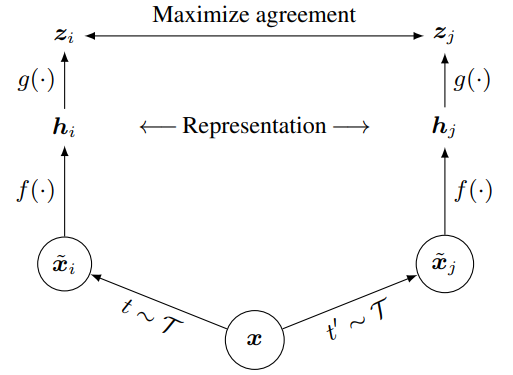

## SimCLR 論文解説 ＆ PyTorch 実装（Contrastive Learning / 自己教師あり学習）

本稿では、視覚表現のコントラスト学習のためのシンプルな枠組みである **SimCLR (Simple Framework for Contrastive Learning )** を紹介する。SimCLRは、近年提案されているコントラスト型の自己教師あり学習アルゴリズムを、 **特別なアーキテクチャ** や **メモリバンク** を必要とせずに簡素化した手法である。

@[card](https://arxiv.org/pdf/2002.05709)
@[card](https://github.com/google-research/simclr)

*SimCLR Architecture*

---

## 論文理解

## 1. Introduction

教師なしで有用な視覚表現を学ぶ研究は、**生成的**（ピクセル生成・モデル化）と **識別的**（教師ありに近い目的で学ぶ）の2系統に大別される。生成的手法は計算コストが高く、表現学習に必須とは限らない。一方、識別的手法は **pretext task** [^1] によりラベルなしデータから擬似ラベルを作って学ぶが、従来はヒューリスティック設計に依存し、汎用性を損ねうる。

近年は、潜在表現を直接最適化する **コントラスト学習** が注目され、当時のSOTAを達成している[^2]。本研究は、そのためのシンプルな枠組み **SimCLR** を提案し、**特殊なアーキテクチャやメモリバンク不要**で高性能を実現する。

さらに体系的検討により、性能の鍵として

1. **複数拡張の組み合わせ** と、教師あり以上に効く **強いAugmentation**
2. 表現と損失の間の **学習可能な非線形射影（projection head）**
3. **正規化埋め込み** と適切な **温度パラメータ**
4. **大バッチ・長時間学習** および **深い／幅広いネットワーク** 

を示した。

[^1]: pretext task（前処理タスク／代理タスク）は、ラベルなしデータだけから擬似的な教師信号を作って、表現を学ばせるための学習課題のこと。
[^2]: 論文公開当時（2020年）の ImageNet（主に ResNet-50）での自己教師あり／半教師ありベンチマークに対してという文脈。線形評価で Top-1 Acc 76.5%（従来比 相対+7%）、ラベル 1% ファインチューニングでも Top-5 85.8%（相対+10%）。他の自然画像データセットでも多くで強力な教師ありベースラインに匹敵または上回る。

---

## 2. Method

### 2.1 フレームワーク

SimCLR のコントラスト学習枠組みは、 **同一サンプルから作った2つの拡張ビューの表現が近くなる（agreement 最大化）** ように学習する。本枠組みは次の **4つ** の主要コンポーネントから構成される。

*図2. コントラスト学習のためのシンプルな枠組み*

#### 2.1.1 確率的データ拡張モジュール

与えられたデータ例を確率的に変換し、同一例から相関のある2つのビュー $\tilde{\boldsymbol{x}}_i$ と $\tilde{\boldsymbol{x}}_j$ を生成する。これらを **正例ペア** とみなす。本研究では、ランダムクロップ後に元サイズへリサイズ、ランダムな色変換、ランダムなガウシアンブラー、の3つの単純な拡張を順に適用する。Section 3 で示すように、とくに **ランダムクロップと色変換の組み合わせ** が高性能に不可欠である。
#### 2.1.2 基礎エンコーダ $f(\cdot)$

拡張後のデータ例から表現ベクトルを抽出するニューラルネットワーク。本枠組みはアーキテクチャに制約を設けず、任意のネットワークを選択できる。ここではResNetを採用する。
  
$$
\begin{aligned}
\tilde{\boldsymbol{x}}_i&\in\mathbb{R}^{3\times H_0\times W_0}\\
\boldsymbol{h}_i&:=f(\tilde{\boldsymbol{x}}_i)={\rm ResNet}(\tilde{\boldsymbol{x}}_i)\in\mathbb{R}^{d},\qquad\left(\boldsymbol{h}_i\text{はGAP後の出力}\right)
\end{aligned}
$$

> `GAP` は Global Average Pooling （空間次元 $H\times W$ の平均）

#### 2.1.3 投影ヘッド $g(\cdot)$

エンコーダが出力する表現 $\boldsymbol{h}_i\in\mathbb{R}^{d}$ を、そのまま下流タスクで使える汎用表現として保持しつつ、コントラスト損失で最適化するための学習専用の表現空間へ写像する小規模ネットワークである。ここでは隠れ層 1 層の MLP を用い、

$$
\boldsymbol{z}_i:=g(\boldsymbol{h}_i)=W^{(2)}\mathrm{ReLU}\left(W^{(1)}\boldsymbol{h}_i+\boldsymbol{b}^{(1)}\right)+\boldsymbol{b}^{(2)}
\in\mathbb{R}^{d_z}
$$

とする。Section 4 で示すように、コントラスト損失を $\boldsymbol{h}_i$ ではなく $\boldsymbol{z}_i$ 上で定義する方が有利である。

#### 2.1.4 コントラスト損失関数

正例ペア $\tilde{\boldsymbol{x}}_i,\tilde{\boldsymbol{x}}_j$ を含む集合 $\{\tilde{\boldsymbol{x}}_k\}$ が与えられたとき、コントラスト予測タスクは、与えられた $\tilde{\boldsymbol{x}}_i$ に対して、$\{\tilde{\boldsymbol{x}}_k\}_{k\neq i}$ の中から対応する $\tilde{\boldsymbol{x}}_j$ を識別することを目的とする。

ここでは $N$ 個の例からなるミニバッチをランダムにサンプリングし、そのミニバッチから生成した拡張ペアに対してコントラスト予測タスクを定義する。

$N$ 枚の元画像（ミニバッチ）： $\{\boldsymbol{x}_1,\boldsymbol{x}_2,\ldots,\boldsymbol{x}_N\}$ の各 $\boldsymbol{x}_n$ に対してAugmentationを **独立に2回** かける。
- $\tilde{\boldsymbol{x}}_{2n-1}=\mathrm{Aug}(\boldsymbol{x}_n),\quad\tilde{\boldsymbol{x}}_{2n}=\mathrm{Aug}'(\boldsymbol{x}_n)$

これによりデータは $2N$ 個となる。

このとき、与えられたアンカー $\tilde{\boldsymbol{x}}_i$ に対して、同一元データ由来の正例ビュー $\tilde{\boldsymbol{x}}_j$ を、候補集合 $\{\tilde{\boldsymbol{x}}_k\}_{k\neq i}$ の中から識別することを考える。

ここで類似度を $\mathrm{sim}(\boldsymbol{z}_i,\boldsymbol{z}_k)$ と書き、温度パラメータ $\tau$ を用いて **logit（スコア）** を 

$$
s_{i,k}:=\mathrm{sim}(\boldsymbol{z}_i,\boldsymbol{z}_k)/\tau
$$ 

と定義する。
また、アンカー $i$ に対する候補インデックス集合を

$$
\mathcal{K}_i:=\{1,2,\ldots,2N\}\setminus\{i\}
$$

とする（自分自身 $k=i$ を除外）。

コントラスト予測タスクでは、アンカー $i$ の正解はその正例 $j$ （同一元データ由来の相方ビュー）であり、アンカー $i$ に対して、候補 $k \in\mathcal{K}_i$ が正解である **確率** を logit $s_{i,k}$ に基づく softmax で定める：

$$
p(k\mid i):=\frac{\mathrm{exp}(s_{i,k})}{\sum_{m\in\mathcal{K}_i}\mathrm{exp}(s_{i,m})}
$$

アンカー $i$ に対する損失を **クロスエントロピー** として定義する。
正解は $j$ なので教師ラベル (OneHot) を

$$
y_{i,k}:=\mathbf{1}_{[k=j]}\in\{0,1\}
$$

とおく。ここで $\mathbf{y}_i$ は $k=j$ の時のみ $1$ になる指示関数である。
クロスエントロピーは、

$$
\begin{aligned}
\ell_{i,j}:&=H(\mathbf{y}_i,\mathbf{p}_i)\\
&=-\sum_{k\in\mathcal{K}_i}y_{i,k}\log p(k\mid i)\\
&=-\log p(j\mid i)\\
&=\log\frac{\mathrm{exp}(\mathrm{sim}(\boldsymbol{z}_i,\boldsymbol{z}_j)/\tau)}{\sum_{k\in\mathcal{K}_i}\mathrm{exp}(s_{i,k})}\\
&=-\log\frac{\mathrm{exp}(\mathrm{sim}(\boldsymbol{z}_i,\boldsymbol{z}_j)/\tau)}{\sum_{k=1}^{2N}\mathbf{1}_{[k\neq i]}\mathrm{exp}(\mathrm{sim}(\boldsymbol{z}_i,\boldsymbol{z}_k)/\tau)}\qquad\cdots(1)
\end{aligned}
$$

これにより、論文に示された式(1)を導出することができた。
これを **NT-Xent（normalized temperature-scaled cross entropy）損失** と呼ぶ。

> 式(1)は「アンカー $i$ に対して、候補集合 $\mathcal{K}_i$ からの中から正例 $j$ を当てる softmax 分類のクロスエントロピー」といえる。

正例ペアは 2 つのビューから成るので、どちらもアンカーになれる。

* $\ell_{i,j}$ ：アンカー $i$ から見て $j$ を当てる
* $\ell_{j,i}$ ：アンカー $j$ から見て $i$ を当てる

これを両方入れると、1 ペアから 2 個の分類問題が生まれ、**対称性**も保てる。

損失は最終的に

$$
\begin{aligned}
\mathcal{L}&=\frac{1}{2N}\sum_{n=1}^{N}\Bigl(\ell_{2n-1,\,2n}+\ell_{2n,\,2n-1}\Bigr)\\
&=\frac{1}{2N}\sum_{i=1}^{2N}\ell_{i,\mathrm{pos}(i)}
\end{aligned}
$$

ここで $\mathrm{pos}(i)$ は $i$ の正例インデックスとして平均する。

すなわち、

:::message
アンカー表現 $\mathbf{z}_i$ が、正例 $\mathbf{z}_j$ には近く、同一バッチ内の他の $2N−2$ 個には相対的に遠くなるように、softmax分類として学習する。
:::

### 2.2 大規模バッチで学習

手法の簡潔さを保つため、SimCLR ではメモリバンク（Wu et al., 2018; He et al., 2019）を用いてモデルを学習しない。代わりに、学習時のバッチサイズ $N$ を 256 ~ 8192 まで大きくして負例を増やす。バッチサイズ 8192 の場合、2つの拡張ビューの両方を用いることで、正例ペア1組あたり 16382 個の負例を得ることができる。

一方で、大きなバッチサイズでの学習は、標準的な SGD/Momentum に線形な学習率スケーリングを組み合わせると不安定になり得る。そこで学習を安定化させるため、すべてのバッチサイズに対して LARS[^3] オプティマイザ（You et al., 2017）を用いる。

:::message alert
##### 分散学習でのBN問題
ResNetは BatchNorm を使うが、分散データ並列では通常デバイス内（ローカル）で平均・分散を計算する。このとき、コントラスト学習では正例ペアが同一デバイス上に載るため、ローカルBNだと **「デバイス固有の統計」から正例を当てる抜け道（情報漏洩）** が起き、表現が本質的に良くならない可能性がある。

- 対策 1 ：学習中に BN の平均と分散を **全デバイスにわたって集約** して計算する。
- 対策 2 ：デバイス間でデータ例をシャッフルする。（He et al., 2019）
- 対策 3 ：BN を layer norm に置き換える。（Hénaff et al., 2019）

:::

[^3]: [LARS (Layer-wise Adaptive Rate Scaling)](https://arxiv.org/pdf/1708.03888)

### 2.3 評価プロトコル 

#### データセットと評価

* 事前学習の主検討は ImageNet ILSVRC-2012、CIFAR-10 で追加実験
* 評価は主に線形評価：
  * 事前学習済みエンコーダ $f$ を凍結し、線形分類器のみ学習
  * テスト精度を表現品質の代理指標として採用
* さらに半教師あり・転移学習でもSOTAと比較

#### デフォルト実験設定

* Augmentation： ランダムクロップ+リサイズ（フリップ含む）、色変換、ガウシアンブラー
* Backbone： ResNet-50
* Projection head： 2 層 MLP で 128 次元へ射影
* Loss： NT-Xent
* Optimizer： LARS
* 学習率： 4.8 ( = $0.3 \times \text{BatchSize}/256$ , weight decay： $10^{-6}$ )
* 学習：BatchSize = 4096 , 100 epoch
* LR schedule：最初 10 epoch 線形ウォームアップ $\rightarrow$ コサインアニーリング（restartなし）

---

## 3. Data Augmentation for Contrastive Representation Learning

---

## 4. Architectures for Encoder and Head

---

## 5. Loss Functions and Batch Size

---

## 実装【PyTorch】

### Encoder

### Head

### Loss Function

### Augmentation

### SimCLR

---

## 所感

