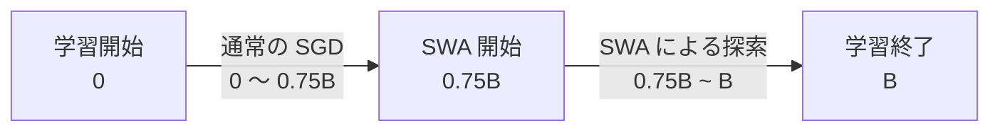

## 1. はじめに

深層ニューラルネットワークは一般に、学習率を徐々に減衰させながら確率的勾配降下法 (SGD) を実行し、学習終了時の重みを最終モデルとして採用する。しかし、訓練損失が十分に収束した重みが、未知データに対して最も高い性能を示すとは限らない。実際、深層ニューラルネットワークの重み空間には、同程度に低い訓練損失を持つ解が広い領域として存在し、SGD が最終的に到達した一点は、その領域の中心ではなく周辺部に位置することがある。

**Stochastic Weight Averaging (SWA)** は、この SGD の最終点だけでなく、学習軌道上で得られた複数の重みを利用する手法である。SGDが通過した重みを $w_1,w_2,\ldots,w_K$ とすると、SWAの重みは単純な平均

$$
w_{\mathrm{SWA}}=\frac{1}{K}\sum_{k=1}^{K}w_k
$$

によって与えられる。ここで $K$ は平均に用いる重みの数である。操作そのものは単純だが、通常の減衰学習率で得られた近接した重みを無条件に平均すればよいわけではない。SWAでは、一定または周期的な学習率を用いて、SGD に高性能なモデルが存在する重み空間内の領域を継続的に探索させ、その軌道上の点を平均する。

SWA の基本的な直感が Fig.1 に示されている。通常のSGDによって得られる重み $w_{\mathrm{SGD}}$ は、低い訓練損失を持つ領域の境界付近に位置する。一方、一定または周期的な学習率を用いると、SGDはこの領域の周辺を移動し、互いに異なる複数の重みを生成する。これらを平均して得られる $w_{\mathrm{SWA}}$ は、個々の重みの中間、すなわち良好な解領域のより中心的な位置へ移動する。

***Fig.1: CIFAR-100 における Preactivation ResNet-164 の SGD 解と SWA 解** 左：FGEによって得られた3つのサンプルと、それらを重み空間内で平均して得られた SWA 解に対するテスト誤差の損失地形。中央・右：125エポックの学習後に得られた同一の SGD 初期点から出発し、SGD によって得られた収束時の重みと SWA によって得られた重みを示した、テスト誤差および訓練損失の損失地形。*

ここで重要なのは、SWA の "訓練損失" が SGD より低くなるとは限らないことである。むしろ、SWA では訓練損失がわずかに悪化する一方、テスト誤差が改善する場合が多い。これは、訓練損失の最小点とテスト誤差の最小点が重み空間上で完全には一致していないことを示唆する。SGDは訓練損失を低下させる方向に最適化を続けるため、最終的に訓練データに対しては良好でも、重みの摂動に対して急峻な位置に到達しうる。一方、SWA は複数の重みを平均することで、周囲の広い範囲で性能が維持される、より頑健な解を取得する。

また、SWA はモデルの予測を平均する一般的なアンサンブルとは異なり、重みを平均した単一モデルを出力する。そのため、複数モデルを保持して推論する必要がなく、推論時の計算量とメモリ使用量は通常の単一モデルとほぼ同じである。学習時に必要となる追加処理も、平均重みを一組保持し、一定間隔で更新する操作に限られる。

SWAの特徴は、次の三点に要約できる。

* SGD軌道上の複数の重みを単純に平均する
* 良好な解領域の周辺部から、より中心的で平坦な位置へ移動する
* 推論時の計算量を増やさず、単一モデルの汎化性能を改善する

本記事では、まず一定および周期的学習率の下で SGD がどのような軌道を描くのかを確認する。次に SWA のアルゴリズムと計算量を整理し、重み平均が汎化性能を改善する理由を、損失地形の幾何とアンサンブル近似の観点から説明する。最後に、CIFAR および ImageNet における実験結果を通じて、SWAの有効性と適用上の条件を順に見ていく。

@[card](https://arxiv.org/abs/1803.05407)
@[card](https://github.com/timgaripov/swa)

---

## 2. SGD はどのような解を探索しているのか

SWA が有効に機能するためには、単に学習後半の重みを平均すればよいわけではない。平均する重みが、**同一の良好な解領域を適度に広く探索** している必要がある。本章では、通常の減衰学習率が SGD の軌道を一点へ収束させるのに対し、一定または周期的な学習率が、低い損失を持つ領域内の複数の点を探索させることを説明する。

### 2.1 減衰学習率は探索を停止させる

ミニバッチ $B_t$ を用いたSGDの更新は、一般に

$$
w_{t+1}=w_t-\alpha_t\nabla \mathcal{L}_{B_t}(w_t)
$$

と表される。ここで、$w_t$ は反復 $t$ におけるモデルの重み、$\alpha_t$ は学習率、$\mathcal{L}_{B_t}$ はミニバッチ $B_t$ 上の損失関数である。

通常のニューラルネットワーク学習では、学習の進行に伴って $\alpha_t$ を小さくする。学習初期には大きな更新によって損失を急速に低下させ、学習後半では小さな更新によって重みを特定の解の近傍へ収束させる。この学習率減衰は、訓練損失を安定して最小化するうえでは有効である。

一方で、学習率が十分に小さくなると、SGD は現在の位置からほとんど移動しなくなる。すなわち、減衰学習率は最終的な一点を精密化する一方、同程度に低い損失を持つ周辺領域の探索を停止させる。

深層ニューラルネットワークでは、低い訓練損失を持つ重みが孤立した一点として存在するとは限らない。むしろ、互いに異なる重みでありながら、同程度の訓練損失と予測性能を持つ解が、重み空間内の連続的な領域を形成することがある。通常の SGD が返す $w_{\mathrm{SGD}}$ は、その領域を代表する唯一の解ではなく、学習率が小さくなった時点で **たまたま収束した一点** にすぎない。

学習中の重みを平滑化する方法として、指数移動平均 (Exponential Moving Average: EMA) も広く用いられる。EMA は

$$
w_t^{\mathrm{EMA}}=\beta w_{t-1}^{\mathrm{EMA}}+(1-\beta)w_t,\qquad 0\leq\beta<1
$$

によって重みを更新する。

EMA では直近の重みに大きな重みを与え、古い重みの寄与を指数的に減衰させる。したがって、減衰学習率によってすでに一点へ収束しつつある軌道に適用した場合、主な効果は最終的な **SGD 軌道の平滑化** となる。

これに対して SWA では、比較的大きな学習率を維持、あるいは周期的に変化させることで、重みを単一の解へ収束させず、低損失領域内を移動させる。そして、その軌道上で得られた複数の重みを同じ比率で平均する。したがって、EMA と SWA の本質的な違いは、重みの平均方法だけでなく、平均対象となる重みの軌道をどのように生成するかにもある。

### 2.2 一定・周期的学習率による解領域の探索

SWA では、通常の SGD によってモデルを十分に学習した後、一定学習率または周期的学習率を用いて学習を継続する。学習率を 0 付近まで減衰させないことで、SGD を一つの重みに固定せず、低損失領域内で移動させる。

論文で用いられる周期的学習率は、反復 $i$ に対して

$$
\begin{aligned}
\alpha(i)&=(1-t(i))\alpha_1 + t(i)\alpha_2,\\
t(i)&=\frac{1}{c}(\bmod(i-1,c)+1).
\end{aligned}
$$

と定義される。

ここで、$\alpha_1$ はサイクル開始時の学習率、$\alpha_2$ はサイクル終了時の学習率、$c$ は 1 サイクルに含まれる反復数である。通常は $\alpha_1\geq\alpha_2$ とし、各サイクル内で学習率を $\alpha_1$ から $\alpha_2$ まで線形に減少させる。学習率が $\alpha_2$ に到達すると、次の反復で再び $\alpha_1$ に戻る。

***Fig.2: 周期的学習率と対応するテスト誤差** 上段は各反復における学習率、下段は同じ学習過程におけるテスト誤差を示す。丸印は学習率が最小値に到達した時点であり、周期的学習率を用いる SWA では、この時点の重みを平均対象として回収する。*

各サイクルの開始時には、比較的大きな学習率によって現在の位置から離れ、異なる重みを探索する。その後、学習率を徐々に下げることで、新たに到達した位置を局所的に調整する。したがって、周期的学習率には、探索と精密化を交互に繰り返す役割がある。

周期的学習率を用いる場合、通常は学習率が最小となる時点の重みを保存する。大きな学習率で移動した直後ではなく、各サイクルの終端で取得することで、低い損失を持つ比較的高性能な候補を集められる。

一方、一定学習率では $\alpha(i)=\alpha$ として、学習中のすべての反復で同じ学習率を用いる。一定学習率では局所的な精密化を行わず、比較的大きな更新を続けるため、周期的学習率よりも強く解領域を探索できる。その反面、軌道上の個々の重みは、周期的学習率のサイクル終端で得られる重みより低精度になる場合がある。

両者の違いは、次のように整理できる。

| 学習率スケジュール | 解領域の探索      | 個々の候補解     |
| --------- | ----------- | ---------- |
| 周期的学習率    | 探索と精密化を反復する | 比較的高精度     |
| 一定学習率     | 継続的に強く探索する  | 精度が低い場合がある |

ただし、SWA では平均に含める各重みが、単体で最高性能を持つ必要はない。重要なのは、それらの重みが互いに無関係な領域に散らばっているのではなく、**同一の低損失領域内にある異なる位置** から得られていることである。

### 2.3 SGD 軌道は良好な解領域の周辺を移動する

一定学習率と周期的学習率が実際にどのような領域を探索するかを調べるため、論文では CIFAR-100 で学習した Preactivation ResNet-164 の SGD 軌道を可視化している。

高次元の重み空間をそのまま描画することはできないため、軌道上の最初、中間、最後の3点を含む 2 次元平面を構成し、その平面上における訓練損失とテスト誤差を評価している。

***Fig.3 周期的学習率および一定学習率で得られる SGD 軌道周辺の損失地形**  左側 2 つは周期的学習率、右側 2 つは一定学習率を用いた場合を示す。それぞれについて、交差エントロピー訓練損失とテスト誤差が描画されている。黒い×は軌道上の最初、中間、最後の点である。*

この図の軌道は、低い訓練損失とテスト誤差を持つ領域の周辺を移動している。周期的学習率でも一定学習率でも、SGD は学習済みモデルから大きく逸脱するのではなく、高性能なモデルが存在する同一の領域内を探索している。

ただし、図中に描かれた曲線は、実際の SGD 軌道そのものではない。最初・中間・最後の 3 点は図示された 2 次元平面上にあるが、それ以外の重みは高次元のパラメータ空間上にあり、その位置をこの平面へ射影して描いている。したがって、射影後の位置における背景の損失値は、元の重みが実際に持つ損失値とは一致しない。Fig. 3 は SGD 軌道に沿った厳密な損失変化を示すものではなく、SGD が探索する領域の幾何を定性的に可視化した図として解釈する必要がある。

それでも、Fig.3 からは二つの重要な傾向を読み取れる。

1. SGD によって得られる候補重みは、良好な解領域の中心に集まるのではなく、その周辺を広く移動している。学習率を残したまま SGD を続けても、軌道上の一点が自然に領域の中心へ収束するわけではない。
2. 訓練損失とテスト誤差の損失地形はおおむね似ているものの、その位置は完全には一致していない。訓練損失が最も低い位置が、テスト誤差においても最良とは限らない。これは、訓練損失だけを最小化した最終的な SGD 解よりも、良好な解領域の内側にある重みの方が、未知データに対して高い性能を示す可能性を意味する。

以上の観察から、SWA の基本的な発想が得られる。一定または周期的学習率によって SGD に良好な解領域を探索させ、軌道上の複数の重みを取得する。SGD自体は領域の周辺を移動するが、それらを重み空間上で平均すれば、個々の候補点の内側に位置する重みを構成できる。

次章では、この重み平均を逐次的に計算する SWA のアルゴリズムと、学習時に必要となる計算量および Batch Normalization の処理について説明する。

---

## 3. Stochastic Weight Averaging

前章では、一定または周期的な学習率を用いることで、SGD が単一の重みへ収束せず、良好な解領域の周辺を継続的に探索することを確認した。Stochastic Weight Averaging (SWA) は、この軌道上から複数の重みを取得し、その平均を最終モデルとして用いる。

本章では、SWA の具体的なアルゴリズム、通常学習から SWA へ切り替える理由、および計算量と Batch Normalization に関する実装上の注意を整理する。

### 3.1 SWA のアルゴリズム

SGD によって得られた $K$ 個の重みを $w_1,w_2,\ldots,w_K$ とすると、SWA モデルの重みは

$$
w_{\mathrm{SWA}}=\frac{1}{K}\sum_{k=1}^{K}w_k
$$

によって定義される。

この平均を計算するために、すべての重みを保存しておく必要はない。第 $k$ 番目の重み $w_k$ を取得した時点で、平均重みを

$$
w_{\mathrm{SWA}}^{(k)}=\frac{(k-1)w_{\mathrm{SWA}}^{(k-1)}+w_k}{k}
$$

と更新すればよい。これは

$$
w_{\mathrm{SWA}}^{(k)}=\frac{1}{k}\sum_{i=1}^{k}w_i
$$

と等価である。

したがって、学習中に保持する必要があるのは、現在のモデル $w$ と平均モデル $w_{\mathrm{SWA}}$ の 2 組だけである。

SWA の処理は、次のように整理できる。

:::message

#### Algorithm: Stochastic Weight Averaging

**入力:**
$\quad$ 初期重み $\hat{w}$、学習率の上下限 $\alpha_1,\alpha_2$
$\quad$ サイクル長 $c$（一定学習率の場合は $c = 1$）、
$\quad$ 反復回数 $n$

**出力:** $w_\text{SWA}$

$\quad\;w\leftarrow\hat{w}$ {現在の重みを $\hat{w}$ で初期化}
$\quad\;w_1\leftarrow w$ {最初の重みを取得}
$\quad\;w_\text{SWA}\leftarrow w_1$
$\quad\;k\leftarrow 1$ {取得済みの重みの数}

$\qquad$ **for** $i\leftarrow 1,2,\ldots,n$ **do**
$\qquad\quad\;\alpha\leftarrow\alpha(i)$ {反復 $i$ における学習率を計算}
$\qquad\quad\;w\leftarrow w-\alpha\nabla\mathcal{L}_i(w)$ {確率的勾配により重みを更新}

$\qquad\quad$ **if** $\bmod(i,c)=0$ **then**
$\qquad\qquad\;k\leftarrow k+1$
$\qquad\qquad\;w_k\leftarrow w$ {第 $k$ 番目の重みを取得}
$\qquad\qquad\;w_\text{SWA}\leftarrow \frac{(k-1)w_\text{SWA}+w_k}{k}$ {平均重みを更新}
$\qquad\quad$ **end if**

$\quad$ **end for**
{$w_\text{SWA}$ に対して Batch Normalization の統計量を再計算}

:::

一定学習率を用いる場合は、各エポックの終了時など、一定間隔で重みを取得する。周期的学習率を用いる場合は、通常、各サイクルで学習率が最小となる時点の重みを取得する。

周期的学習率では、大きな学習率によって異なる位置を探索した後、学習率を下げながら候補解を調整する。したがって、サイクル終端の重みは、互いに異なる位置にありながら、単体でも比較的高い性能を持ちやすい。

一方、一定学習率では、個々の重みの性能が低い場合でも、より広い範囲を効率よく探索できる。SWA では個々の候補解を最終モデルとして使用するわけではないため、平均に含まれるすべての重みが高精度である必要はない。重要なのは、同一の良好な解領域内から、互いに異なる位置の重みを取得することである。

### 3.2 なぜ通常学習の後に SWA を開始するのか

SWA は原理上、ランダム初期値から実行することもできる。しかし、実用上は、通常の学習によってモデルをある程度収束させた後に、SWA へ切り替える方法が安定している。

通常のモデルを収束させるために必要な学習予算を $B$ エポックとする。論文では、VGG、Preactivation ResNet、Wide ResNet などについて、概ね $0.75B$ まで通常の SGD で学習し、その後の期間を SWA に使用している。

学習全体は、次の二段階に分けて理解できる。

$$
\underbrace{\text{通常の SGD}}_{\text{良好な解領域まで移動}}
\quad\longrightarrow\quad
\underbrace{\text{SWA}}_{\text{領域を探索して重みを平均}}
$$

通常学習の役割は、ランダム初期値から、低い訓練損失を持つ解領域までモデルを移動させることである。この段階では、比較的大きな学習率から開始し、学習率を減衰させる標準的なスケジュールを用いる。

モデルが良好な解領域へ到達した後、学習率を一定または周期的なスケジュールへ切り替える。これにより、SGD を一点へ固定するのではなく、到達した解領域内で再び探索させる。

SWA を早すぎる段階から開始すると、平均に含まれる重みの一部が、まだ高損失の領域に存在する可能性がある。その場合、重み平均によって良好な解領域の中心へ移動するのではなく、学習初期の不適切な重みに引きずられる。

反対に、学習率を十分に減衰させた後で SWA を開始しても、軌道上の重みが互いにほとんど異ならなければ、平均による効果は小さい。したがって、SWA では開始時点だけでなく、開始後に SGD をどの程度移動させるかも重要である。

この観点から、SWA のハイパーパラメータは次の三つに整理できる。

* SWA を開始する時点
* SWA 期間中の学習率
* 重みを取得する間隔

開始時点は、モデルが十分に高性能な解領域へ到達した後に設定する。学習率は、その領域内を探索できる程度に大きく、同時に領域外へ逸脱しない程度に小さくする必要がある。取得間隔は、ほぼ同一の重みを過剰に平均しないよう、SGD がある程度移動できる長さに設定する。

### 3.3 Batch Normalization 統計量の再計算

SWA を Batch Normalization (BN) を含むモデルへ適用する場合、重みを平均した後に BN の統計量を再計算する必要がある。

BN 層は、学習可能なパラメータであるスケール $\gamma$ とバイアス $\beta$ に加えて、学習中に推定される running mean $\mu_{\mathrm{BN}}$ と running variance $\sigma_{\mathrm{BN}}^2$ を保持している。推論時の変換は、概念的に

$$
\operatorname{BN}(x)=\gamma\frac{x-\mu_{\mathrm{BN}}}{\sqrt{\sigma_{\mathrm{BN}}^2+\varepsilon}}+\beta
$$

と表される。

学習時には、各ミニバッチから計算された平均と分散を用いて活性化を正規化しながら、推論時に使用する running mean と running variance を更新する。一方、推論時にはミニバッチの統計量ではなく、学習中に蓄積されたこれらの統計量を使用する。

SWA では、複数の重み $w_1,w_2,\ldots,w_K$ を平均し、新しい重み

$$
w_{\mathrm{SWA}}=\frac{1}{K}\sum_{k=1}^{K}w_k
$$

を構成する。この $w_{\mathrm{SWA}}$ は、平均に使用したいずれのモデルとも異なる新しいモデルである。そのため、**各モデルの学習中に記録された BN 統計量は、そのままでは $w_{\mathrm{SWA}}$ に対応しない。**

:::details 重み平均と BatchNorm 統計量が交換できない理由

ある Batch Normalization 層へ入力される活性化を $h(x;w)$ とする。重み $w$ に対応する BN 統計量を

$$
\operatorname{BNStat}(w)=\left(\mu(w),\sigma^2(w)\right)
$$

と定義する。ここで、

$$
\mu(w)=\mathbb{E}_x[h(x;w)],\quad\sigma^2(w)=\mathbb{E}_x\left[\left(h(x;w)-\mu(w)\right)^2\right]
$$

である。実際の BN では、これらを各チャネルについて計算する。

SWA による平均重みを

$$
\bar{w}=\frac{1}{K}\sum_{k=1}^{K}w_k
$$

とする。このとき、SWA モデルで必要となる BN 統計量は

$$
\operatorname{BNStat}(\bar{w})=\operatorname{BNStat}\left(\frac{1}{K}\sum_{k=1}^{K}w_k\right)
$$

である。

一方、平均前の各モデルが保持する BN 統計量を平均すると、

$$
\frac{1}{K}\sum_{k=1}^{K}\operatorname{BNStat}(w_k)
$$

が得られる。しかし、この二つは一般に一致しない。すなわち、

$$
\boxed{\operatorname{BNStat}\left(\frac{1}{K}\sum_{k=1}^{K}w_k\right)\neq\frac{1}{K}\sum_{k=1}^{K}\operatorname{BNStat}(w_k)}
$$

である。

この非可換性を、1 つの隠れユニットを持つ 2 層 ReLU MLPで確認する。モデルを

$$
h(x;w)=a\;\operatorname{ReLU}(bx)
$$

とし、重みを $w=(a,b)$ とする。

入力 $x$ は

$$
x=
\begin{cases}
-1 & \text{確率 }1/2,\\
1 & \text{確率 }1/2
\end{cases}
$$

に従うとする。

ここで、2つのモデルの重みを

$$
w_1=(1,1),\qquad w_2=(1,-1)
$$

とする。

第 1 のモデルの活性化は

$$
h(x;w_1)=\operatorname{ReLU}(x)
$$

であり、

$$
h(-1;w_1)=0,\qquad h(1;w_1)=1
$$

となる。したがって、その平均と分散は

$$
\mu(w_1)=\frac{0+1}{2}=\frac{1}{2}
$$

および

$$
\sigma^2(w_1)=\frac{\left(0-\frac{1}{2}\right)^2+\left(1-\frac{1}{2}\right)^2}{2}=\frac{1}{4}
$$

である。

第 2 のモデルでは、

$$
h(x;w_2)=\operatorname{ReLU}(-x)
$$

であり、

$$
h(-1;w_2)=1,\qquad h(1;w_2)=0
$$

となる。そのため、

$$
\mu(w_2)=\frac{1}{2},\qquad
\sigma^2(w_2)=\frac{1}{4}
$$

である。

したがって、各モデルの BN 統計量を平均すると、

$$
\frac{\operatorname{BNStat}(w_1)+\operatorname{BNStat}(w_2)}{2}=\left(\frac{1}{2},\frac{1}{4}\right)\tag{1}
$$

となる。

一方、2 つのモデルの重みを先に平均すると、

$$
\bar{w}=\frac{w_1+w_2}{2}=\left(1,0\right)
$$

となる。平均重みを持つモデルの活性化は

$$
h(x;\bar{w})=\operatorname{ReLU}(0\cdot x)=0
$$

であり、すべての入力に対して 0 となる。したがって、

$$
\mu(\bar{w})=0,\qquad\sigma^2(\bar{w})=0
$$

である。

よって、

$$
\operatorname{BNStat}\left(\frac{w_1+w_2}{2}\right)=(0,0)\tag{2}
$$

したがって、式 (1), (2) より両者は一致しない。

$$
\operatorname{BNStat}\left(\frac{w_1+w_2}{2}\right)\neq\frac{\operatorname{BNStat}(w_1)+\operatorname{BNStat}(w_2)}{2}
$$

この不一致が生じるのは、重みを平均すると、平均前のモデルとは異なる活性化関数が得られるためである。上の例では、2 つのモデルがそれぞれ正の入力と負の入力に反応していたのに対し、重みを平均したモデルでは入力への応答が完全に消失した。

一般の2層 ReLU MLP

$$
h(x;w)=W_2\operatorname{ReLU}(W_1x+b_1)+b_2
$$

についても、

$$
\operatorname{ReLU}\left(\frac{1}{K}\sum_{k=1}^{K}(W_{1,k}x+b_{1,k})\right)\neq\frac{1}{K}\sum_{k=1}^{K}\operatorname{ReLU}(W_{1,k}x+b_{1,k})
$$

であるため、平均重みが生成する活性化分布は、各モデルが生成する活性化分布の平均とは一般に異なる。

したがって、平均前のモデルが保持していた running mean と running variance を平均しても、SWA モデルに対応する BN 統計量は得られない。

:::

つまり、平均後の重み $w_{\mathrm{SWA}}$ を用いたときに、各層でどのような活性化分布が生じるかを改めて推定する必要がある。

そこで、SWA の重み平均が完了した後、学習データを $w_{\mathrm{SWA}}$ にもう一度入力し、各 BN 層の running mean と running variance を再計算する。この処理では重みを更新しないため、損失計算、逆伝播、Optimizer による更新は必要ない。必要なのは forward のみである。

処理手順は次のように整理できる。

1. モデルの重みを $w_{\mathrm{SWA}}$ に置き換える。
2. BN の running mean と running variance を初期化する。
3. 学習データをモデルへ順伝播させる。
4. 各 BN 層の統計量を再推定する。
5. 再計算された統計量を用いて推論を行う。

BN 統計量を再計算しない場合、平均後の重みが生成する活性化分布と、BN 層が保持する平均・分散の間に不整合が生じる。その結果、活性化が不適切に正規化され、SWA によって得られるはずの性能が損なわれる可能性がある。

したがって、Batch Normalization を含むモデルでは、BN 統計量の再推定までを SWA の一連の処理として扱う必要がある。なお、Layer Normalization や Group Normalization のように、推論時に学習データ全体から推定した running statistics を使用しない正規化手法では、この再計算は必要ない。

以上のように、SWA の処理自体は重みの逐次平均によって実現できるが、BN を含むモデルでは、平均後のモデルに対応する活性化統計量を再構成することが不可欠である。

次章では、SWA によって得られる重みがなぜ高い汎化性能を示すのかを、損失地形における平坦性と、予測アンサンブルの局所近似という二つの観点から説明する。

---

## 4. なぜ重み平均で汎化性能が改善するのか

SWA の操作は、SGD 軌道上の重みを平均するだけである。しかし、ニューラルネットワークの出力や損失は重みに対して非線形であるため、重み平均によって性能が改善することは自明ではない。異なる重みを平均すれば、低損失領域から外れ、性能が大きく低下する可能性もある。

SWA が機能する背景には、平均する重みが無関係な解ではなく、SGD によって同一の良好な解領域から取得されていることがある。本章では、SWA の汎化性能を、損失地形における頑健性、訓練損失とテスト誤差のずれ、および予測アンサンブルとの関係から説明する。

### 4.1 SWA 解は重みの摂動に対して頑健である

SWA によって得られた重みを $w_{\mathrm{SWA}}$、通常の減衰学習率を用いた SGD の最終的な重みを $w_{\mathrm{SGD}}$ とする。

それぞれの重みから、単位方向ベクトル $d$ に沿って距離 $t$ だけ移動した点を

$$
\begin{aligned}
w_{\mathrm{SWA}}(t,d)&=w_{\mathrm{SWA}}+td,\\
w_{\mathrm{SGD}}(t,d)&=w_{\mathrm{SGD}}+td
\end{aligned}
$$

と定義する。ここで、$\lVert d\rVert_2=1$ である。

重み $w$ の近傍における損失を Taylor 展開すると、

$$
\mathcal{L}(w+td)=\mathcal{L}(w)+t\nabla \mathcal{L}(w)^\top d+\frac{t^2}{2}d^\top H(w)d+O(t^3)
$$

となる。

* $w\in\mathbb R^P$：現在のモデルパラメータ
* $d\in\mathbb \R^P$：パラメータ空間上の移動方向
* $t\in\mathbb \R$：その方向にどれだけ移動するかを表すスカラー
* $\nabla\mathcal L(w)$：損失の勾配
* $H(w)=\nabla^2\mathcal L(w)$：損失の Hessian
* $O(t^3)$：$t^3$ 以上の次数を持つ高次項

:::details この Taylor 展開パッとできないんだよな...

#### 1変数関数へ帰着する

損失 $\mathcal L(w)$ は、多数のパラメータからなるベクトル $w$ を入力とする多変数関数である。そこで、重み空間上の方向 $d$ を固定し、その方向に沿って損失がどのように変化するかだけを考える。

具体的には、

$$
\phi(t)=\mathcal L(w+td)
$$

という 1 変数関数を定義する。

ここで、$d$ は重み空間上の移動方向を表すベクトル、$t$ はその方向への移動量を表すスカラーである。$t=0$ のとき、$w+td=w$ となるため、$\phi(t)$ を $t=0$ の周囲で展開すれば、重み $w$ の近傍における損失の変化を調べられる。

$\phi(t)$ を $t=0$ の周囲で2次まで Taylor 展開すると、

$$
\phi(t)=\phi(0)+t\phi'(0)+\frac{t^2}{2}\phi''(0)+O(t^3)
$$

となる。以下、それぞれの項を計算する。

まず、$t=0$ を代入すると、

$$
\phi(0)=\mathcal L(w)
$$

である。

次に、1 階微分を求める。$\phi(t)=\mathcal L(w+td)$ に連鎖律を適用すると、

$$
\phi'(t)=\nabla\mathcal L(w+td)^\top d
$$

となる。特に $t=0$ では、

$$
\phi'(0)=\nabla\mathcal L(w)^\top d
$$

となる。

この内積は、重み $w$ から方向 $d$ に移動したときの損失の一次的な変化率、すなわち方向微分を表す。

続いて、$\phi'(t)$ をもう一度 $t$ で微分する。

$$
\phi''(t)=\left(\frac{d}{dt}\nabla\mathcal L(w+td)\right)^\top d
$$

となる。

勾配 $\nabla\mathcal L(w+td)$ に連鎖律を適用すると、

$$
\frac{d}{dt}\nabla\mathcal L(w+td)=\nabla^2\mathcal L(w+td)d
$$

である。したがって、

$$
\phi''(t)=\left(\nabla^2\mathcal L(w+td)d\right)^\top d
$$

となる。損失が 2 階連続微分可能であれば、Hessian $\nabla^2\mathcal L$ は対称行列であるため、

$$
\phi''(t)=d^\top\nabla^2\mathcal L(w+td)d
$$

と書ける。

ここで、Hessian を

$$
H(w)=\nabla^2\mathcal L(w)
$$

と定義すると、

$$
\phi''(t)=d^\top H(w+td)d
$$

である。特に $t=0$ では、

$$
\phi''(0)=d^\top H(w)d
$$

となる。

これは、重み $w$ における方向 $d$ に沿った損失曲面の曲率を表す。

以上を Taylor 展開へ代入すると、

$$
\mathcal L(w+td)=\mathcal L(w)+t\nabla\mathcal L(w)^\top d+\frac{t^2}{2}d^\top H(w)d+O(t^3)
$$

が得られる。

:::

解の近傍で勾配項 ($\nabla \mathcal{L}$) が十分に小さいと仮定すれば、方向 $d$ に沿った損失の増加は、主として $d^\top H(w)d$ によって決まる。この値が大きければ、その方向に少し移動するだけで損失が急増する。反対に、この値が小さければ、より大きな摂動を加えても損失が維持される。

したがって、ある許容損失増加量 $\varepsilon>0$ に対して、

$$
\mathcal{L}(w+td)-\mathcal{L}(w)\leq \varepsilon
$$

を満たす $t$ の範囲が広いほど、その解は方向 $d$ に対して平坦であると解釈できる。

***Fig.4: SWA解およびSGD解からランダムな方向へ移動したときのテスト誤差と訓練損失** CIFAR-100 で学習した Preactivation ResNet-164 について、10 個のランダムな方向に沿って重みを摂動している。左はテスト誤差、右は $\ell_2$正則化を含む訓練損失を示す。*

Fig.4 では、$t=0$ がそれぞれの SWA 解と SGD 解に対応する。SGD 解から移動した場合、比較的小さな摂動でも訓練損失とテスト誤差が増加している。一方、**SWA 解では、より大きな距離まで低い損失と誤差が維持されている。**

この結果は、SWA 解が少なくとも観測した方向に対して、SGD 解よりも摂動に頑健であることを示している。すなわち、重みが多少変化しても予測性能が崩れにくい位置にある。

ただし、ここで測定されているのはランダムに選択された有限個の方向における平坦性である。高次元の重み空間では、ランダム方向の多くが急峻な固有方向とほぼ直交する可能性があるため、Fig.4 だけから Hessian の最大固有値やすべての方向における平坦性を断定することはできない。

また、ニューラルネットワークの平坦性はパラメータ化や重みのスケーリングに依存する。したがって、「平坦な解は常に良く汎化する」という一般的な命題としてではなく、同一のアーキテクチャとパラメータ化の下で、SWA 解と SGD 解を相対的に比較した結果として解釈するのが適切である。

### 4.2 訓練損失の最小点とテスト誤差の最小点は一致しない

ランダム方向に沿った解析では、SGD 解から移動すると、ほぼすべての方向でテスト誤差が増加していた。しかし、$w_{\mathrm{SGD}}$ から $w_{\mathrm{SWA}}$ へ向かう方向では、テスト誤差は低下する。

これは、SWA 解と SGD 解を結ぶ方向が、一般的なランダム方向とは異なる、損失地形の構造を反映した方向であることを意味する。

両者を結ぶ直線上の重みを

$$
w(\lambda)=(1-\lambda)w_{\mathrm{SWA}}+\lambda w_{\mathrm{SGD}}
$$

と定義する。

ここで、$w(0)=w_{\mathrm{SWA}},\qquad w(1)=w_{\mathrm{SGD}}$ である。$\lambda$ を区間 $[0,1]$ の外側まで変化させれば、SWA 解と SGD 解を結ぶ線分を延長した方向についても、損失と誤差を評価できる。

***Fig.5: SWA解とSGD解を結ぶ直線上の訓練損失とテスト誤差** CIFAR-100 について、左は Preactivation ResNet-164,右は VGG-16 の結果を示す。横軸は SWA 解からの符号付き距離である。*

Fig.5 から、SWA の汎化性能を理解するうえで重要な三つの性質を確認できる。

1. **SWA 解と SGD 解の間には高い損失障壁が存在しない。**
   両者を結ぶ直線上で訓練損失が大きく増加しないことから、SWA は SGD とは全く異なる局所解を発見しているのではなく、同一の低損失領域内に位置していると考えられる。
2. **SGD 解の方が訓練損失はわずかに低い一方、SWA 解の方がテスト誤差は低い。**
   したがって、$\argmin_w\mathcal{L}_{\mathrm{train}}(w)$ と $\argmin_w\mathcal{L}_{\mathrm{test}}(w)$ は、同一の位置にあるとは限らない。そのため、訓練損失をさらに低下させる方向が、未知データに対しても良い方向である保証はない。
3. **損失地形は SGD 解の近傍で非対称である。**
   SGD 解は広い低損失領域の中心ではなく、一方の側で損失が急激に上昇する境界付近に位置している。これに対し、SWA 解はその内側にあり、両方向へ比較的大きく移動しても損失が維持される。

SGD が境界付近に到達しやすい理由は、確率的勾配と学習率による更新が、低損失領域の内部で停止するとは限らないためである。一定または周期的な学習率を用いると、SGD は領域の周辺にある複数の点を移動する。これらの点を平均すれば、各点の内側に位置する重みを得られる。

ただし、「中心」という表現は幾何学的な重心を意味しており、訓練損失の局所最小点を意味しない。実際、SWA 解では SGD 解より訓練損失が高い場合がある。SWA の目的は訓練損失の最小化ではなく、低損失領域内で摂動に頑健な位置を得ることにある。

### 4.3 重み平均は予測アンサンブルを局所的に近似する

SWA は複数モデルの重みを平均するが、Fast Geometric Ensembling (FGE) などのアンサンブルでは、複数モデルの "予測" を平均する。

重み $w_i$ を持つモデルの出力を $f(x;w_i)$ とする。簡単のため、以下では入力 $x$ を省略し、$f(w_i)$ と書く。これは特定クラスの logit や予測確率など、スカラー出力を表すものとする。

$K$ 個のモデルによる予測アンサンブルは、

$$
\bar{f}=\frac{1}{K}\sum_{i=1}^{K}f(w_i)
$$

である。

一方、SWA では重みを

$$
w_{\mathrm{SWA}}=\frac{1}{K}\sum_{i=1}^{K}w_i
$$

と平均した後、$f(w_{\mathrm{SWA}})$ を単一モデルの予測として用いる。

ニューラルネットワークは重みに対して非線形であるため、一般には

$$
f\left(\frac{1}{K}\sum_{i=1}^{K}w_i\right)\neq\frac{1}{K}\sum_{i=1}^{K}f(w_i)
$$

である。

したがって、重み平均と予測平均が完全に一致するわけではない。しかし、各重みが $w_{\mathrm{SWA}}$ の近傍にある場合、両者の差は局所的に小さくなる。

各重みを

$$
w_i=w_{\mathrm{SWA}}+\Delta_i
$$

と表す。$w_{\mathrm{SWA}}$ の定義から、

$$
\frac{1}{K}\sum_{i=1}^{K}\Delta_i=0
$$

が成立する。

$f$ が $w_{\mathrm{SWA}}$ の近傍で 2 階連続微分可能であると仮定し Taylor 展開すると、

$$
f(w_i)=f(w_{\mathrm{SWA}})+\nabla f(w_{\mathrm{SWA}})^\top\Delta_i+\frac{1}{2}\Delta_i^\top H_f(w_{\mathrm{SWA}})\Delta_i+O(\lVert\Delta_i\rVert^2)
$$

これをモデル間で平均すると、

$$
\begin{aligned}
\bar{f}&=f(w_{\mathrm{SWA}})+\nabla f(w_{\mathrm{SWA}})^\top\left(\frac{1}{K}\sum_{i=1}^{K}\Delta_i\right)\\
&\quad+\frac{1}{2K}\sum_{i=1}^{K}\Delta_i^\top H_f(w_{\mathrm{SWA}})\Delta_i+\frac{1}{K}\sum_{i=1}^{K}O(\lVert\Delta_i\rVert^2).
\end{aligned}
$$

一次項は

$$
\frac{1}{K}\sum_{i=1}^{K}\Delta_i=0
$$

によって消えるため、

$$
\bar{f}-f(w_{\mathrm{SWA}})=\frac{1}{2K}\sum_{i=1}^{K}\Delta_i^\top H_f(w_{\mathrm{SWA}})\Delta_i+O(\Delta^2)
$$

となる。ここで、$\Delta^2=\frac{1}{K}\sum_{i=1}^{K}O(\lVert\Delta_i\rVert^2)$ とした。

Hessian がこの近傍で有界であれば、二次項は $O(\Delta^2)$ であるため、

$$
\bar{f}-f(w_{\mathrm{SWA}})=O(\Delta^2)
$$

が得られる。

:::details 二次項が O(Δ²) となる理由

Hessian の作用素ノルムを用いると、任意の $\Delta_i$ について、

$$
\Bigl\lvert\Delta_i^\top H_f(w_{\mathrm{SWA}})\Delta_i\Bigr\rvert\leq\lVert H_f(w_{\mathrm{SWA}})\rVert_{\mathrm{op}}\lVert\Delta_i\rVert^2
$$

と評価できる。

ここで「Hessian が有界」とは、ある有限な定数 $M$ が存在して、

$$
\lVert H_f(w)\rVert_{\mathrm{op}}\leq M
$$

が $w_\text{SWA}$ の近傍で成立する。

したがって、

$$
\Bigl\lvert\Delta_i^\top H_f(w_{\mathrm{SWA}})\Delta_i\Bigr\rvert\leq M\lVert\Delta_i\rVert^2
$$

ここで、

$$
\Delta=\max_i\lVert\Delta_i\rVert
$$

とすると、すべての $i$ について $\lVert\Delta_i\rVert^2\leq\Delta^2$ である。

よって、

$$
\begin{aligned}
\Biggl\lvert\frac{1}{2K}\sum_{i=1}^{K}\Delta_i^\top H_f(w_{\mathrm{SWA}})\Delta_i\Biggr\rvert&\leq\frac{M}{2K}\sum_{i=1}^K \lVert\Delta_i\rVert^2\\
&\leq
\frac{M}{2}\Delta^2.
\end{aligned}
$$

つまり、二次項の大きさは定数倍の $\Delta^2$ 以下に抑えられ、

$$
\bar{f}-f(w_{\mathrm{SWA}})=O(\Delta^2)
$$

となる。

:::

一方、二つの候補モデル $i,j$ の予測差は、

$$
f(w_i)-f(w_j)=\nabla f(w_{\mathrm{SWA}})^\top(\Delta_i-\Delta_j)+O(\Delta^2)
$$

であり、一般には一次の大きさ $O(\Delta)$ を持つ。

:::details 補足

$\Delta=\max_k\|\Delta_k\|$ と定義しているので、三角不等式から、

$$
\begin{aligned}
\|\Delta_i-\Delta_j\|
&\leq \|\Delta_i\|+\|\Delta_j\|\\
&\leq 2\Delta.
\end{aligned}
$$

したがって、

$$
\boxed{\|\Delta_i-\Delta_j\|=O(\Delta)}
$$

と評価できる。

さらに勾配が $\Delta$ に依存しない有限なベクトルであれば、Cauchy–Schwarzの不等式より、

$$
\begin{aligned}
|\nabla f(w_{\mathrm{SWA}})^\top(\Delta_i-\Delta_j)|
&\leq\|\nabla f(w_{\mathrm{SWA}})\|\;\|\Delta_i-\Delta_j\|\\
&\leq
2\|\nabla f(w_{\mathrm{SWA}})\|\Delta.
\end{aligned}
$$

よって、

$$
\nabla f(w_{\mathrm{SWA}})^\top(\Delta_i-\Delta_j)=O(\Delta)
$$

> $O(\Delta)$ はあくまで **上からの評価** 

:::

したがって、候補モデル同士の予測には一次の差が存在する一方、それらの予測平均と SWA モデルの予測との差は二次の大きさに抑えられる。

$$
\underbrace{f(w_i)-f(w_j)}_{O(\Delta)}\qquad\underbrace{\bar{f}-f(w_{\mathrm{SWA}})}_{O(\Delta^2)}
$$

この局所解析は、FGE モデルが互いに異なる予測を持ちながら、SWA モデルがそれらの予測平均に近い出力を生成できる理由を説明する。

論文では、CIFAR-100 の Preactivation ResNet-164 を用いて、この関係を実験的にも評価している。

| 比較対象                   | 予測確率の差または一致率 |
| ---------------------- | -----------: |
| 連続する FGE モデル間の予測確率差      |        0.126 |
| FGE アンサンブルと SWA の予測確率差    |        0.079 |
| FGE アンサンブルと SWA の予測ラベル一致率 |       95.26% |

SWA と FGE アンサンブルの予測差は、個々の FGE モデル間の予測差より小さい。また、両者はテストサンプルの 95% 以上について同じラベルを出力している。この結果は、SWA が単一モデルによって FGE アンサンブルを近似しているという解釈と整合する。

ただし、この近似には重要な前提がある。

Taylor 展開による近似が有効であるためには、候補重み $w_i$ が $w_{\mathrm{SWA}}$ の近傍にあり、同一の低損失領域に属している必要がある。異なる初期値から学習されたモデルや、異なる引力領域に属するモデルの重みを無条件に平均しても、良好なモデルが得られるとは限らない。

また、ニューラルネットワークには、隠れユニットの置換など、同じ関数を異なる重みで表現できる対称性が存在する。機能的に同等な二つのモデルであっても、パラメータの対応関係が異なれば、その重み平均は性能を失う可能性がある。

SWA で重み平均が成立するのは、同一の SGD 軌道から候補点を取得することで、モデル間のパラメータ対応が維持され、候補重みが局所的に近接しているためである。

以上から、SWA による汎化性能の改善は、次の二つの観点から理解できる。

1. SGD 軌道上の重みを平均することで、低損失領域の周辺部から、重みの摂動に対して頑健な内側の位置へ移動する。

2. 近接する候補モデルの重みを平均することで、複数モデルの予測アンサンブルを、二次の近似誤差を持つ単一モデルとして表現する。

次章では、これらの解釈が実際の性能改善につながるかを、CIFAR および ImageNet におけるベンチマーク、学習率スケジュールの比較、および一定学習率による学習実験から見ていく。

---

## 5. 実験から見る SWA の有効性

前章では、SWA が低損失領域のより内側に位置する重みを構成し、近接する複数モデルの予測アンサンブルを局所的に近似することを説明した。本章では、これらの性質が実際の汎化性能の改善につながるかを実験結果から検証する。

主に確認するのは、次の三点である。

1. SWA の改善が特定のデータセットやアーキテクチャに限定されないか
2. SWA 期間中の学習率が性能にどのような影響を与えるか
3. 平均に含まれる個々のモデルが高精度でなくても、SWA は機能するか

### 5.1 アーキテクチャやデータセットを越えて改善するか

論文では、CIFAR-10、CIFAR-100 および ImageNet を用いて、通常の SGD と SWA を比較している。

CIFAR における評価対象は、次のネットワークである。

* VGG-16
* Preactivation ResNet-164
* Wide ResNet-28-10
* Shake-Shake 2x64d
* PyramidNet-272

これらはネットワークの深さ、接続構造、正則化、学習方法が異なる。したがって、複数のアーキテクチャで一貫した改善が得られれば、SWA が特定のモデル構造に依存する手法ではないことを示す証拠となる。

実験では、各モデルを通常の SGD によって学習するために必要なエポック数を、$1B$ (learning **B**udget)としている。VGG、Preactivation ResNet、Wide ResNetでは、まず約 $0.75B$ まで通常の SGD で学習し、その後、一定学習率を用いた SWA へ切り替える。

SWA は、全学習時間がそれぞれ $1, 1.25, 1.5B$ となる時点で評価される。したがって、$1B$ の結果は、通常の SGD と同程度の学習計算量で比較した結果である。一方、$1.25, 1.5B$ では、追加学習による効果も含まれる。

***Tab.1: CIFAR-10 および CIFAR-100 における SGD、FGE、SWA のテスト精度**  SWA については異なる learning budget での結果が示されている。FGE は複数モデルによるアンサンブルであるのに対し、SWA は重み平均によって得られた単一モデルである。*

CIFAR-10 では、Shake-Shake を除く複数のアーキテクチャで、SWA によって一貫して約 0.5 ポイントの精度改善が得られている。Shake-Shake では SGD の時点ですでに高い精度に達しており、改善幅は比較的小さい。

CIFAR-100 では、SWA による改善幅は概ね 0.75〜1.5 ポイントであり、CIFAR-10 より大きい。クラス数が多く、分類問題が難しい CIFAR-100 において改善幅が大きいことは、SWA が単に訓練精度を微調整しているのではなく、汎化性能に影響を与えていることを示唆する。

また、SWA は単一モデルでありながら、6〜12 個のモデルから構成される FGE アンサンブルと同程度、あるいはそれ以上の精度を達成する場合がある。

通常の予測アンサンブルでは、モデル数を $K$ とすると、推論時に概ね $K$ 回の forward が必要となる。一方、SWA は重みを事前に平均した単一モデルであるため、推論時の計算量は通常のモデルと変わらない。

ただし、CIFAR-100 において FGE と同程度の性能を得るには、SWA で $1B$ を超える学習が必要となる場合がある。そのため、SWA が常に同一の学習時間で FGE を上回ると解釈するべきではない。

次に、より大規模な ImageNet における結果を確認する。論文では、torchvision の事前学習済みモデルを初期値として、以下のアーキテクチャに SWA を適用している。

* ResNet-50
* ResNet-152
* DenseNet-161

すべてのモデルに対して、同一の周期的学習率スケジュールを用いて 10 エポック追加学習している。

***Tab.2: ImageNet における SGD モデルと SWA モデルの Top-1 精度** ResNet-50、ResNet-152、DenseNet-161 のすべてにおいて、10 エポックの SWA による追加学習後の精度が示されている。*

ImageNet では、3 種類すべてのアーキテクチャにおいて、SWA によって 0.6〜0.9 ポイントの Top-1 精度改善が得られている。

これらの実験では、異なる規模のデータセットと複数の CNN アーキテクチャにおいて、SWA による一貫した改善が確認されている。したがって、SWA は特定のネットワークやデータセットに限定された最適化上の偶然ではなく、広い条件で有効な学習手続きであると考えられる。

一方で、これらの結果だけから、任意のモデルやタスクで SWA が必ず改善をもたらすとは断定できない。SWA が機能するためには、平均対象の重みが同一の良好な解領域を探索している必要があり、その探索は学習率スケジュールに依存する。

### 5.2 学習率スケジュールは性能にどう影響するか

SWAでは、通常の SGD と同様に学習率が重要である。ただし、その役割は単に訓練損失を安定して減少させることではない。

SWA 期間中の学習率には、次の二つの条件が求められる。

* SGD を現在の重みから十分に移動させること
* 良好な解領域から大きく逸脱させないこと

学習率が小さすぎる場合、取得される重みは互いにほぼ同一となる。このとき、$w_1\approx w_2\approx\cdots\approx w_K$ であるため、その平均を計算しても、通常の SGD 解からほとんど移動しない。

反対に、学習率が大きすぎる場合、SGD は現在の低損失領域から外れ、性能の低い重みを生成する可能性がある。平均する重みが広く散らばりすぎれば、それらの平均も低損失領域内に残るとは限らない。

論文では、CIFAR-100 の Preactivation ResNet-164 を用いて、複数の一定学習率と周期的学習率を比較している。すべての条件で、通常の SGD によって 125 エポック学習した同一のモデルを初期値として使用している。

一定学習率については、$\alpha\in\{10^{-1},5\times10^{-2},10^{-2},10^{-3}\}$ を比較している。

周期的学習率については、サイクル長を 5 エポックに固定し、最大・最小学習率の組として、$(\alpha_1,\alpha_2)\in\{(10^{-1},10^{-3}),(5\times10^{-2},5\times10^{-4}),(10^{-2},10^{-4}),(5\times10^{-3},5\times10^{-5})\}$ を比較している。

***Fig.6: 異なる学習率スケジュールを用いたSWAのテスト誤差** CIFAR-100 の Preactivation ResNet-164 について、一定学習率および周期的学習率を用いた場合のテスト誤差を、学習エポック数に対して示している。*

Fig.6 から、比較的大きな一定学習率を用いると、SWA のテスト誤差が速く改善する傾向が確認できる。学習率が大きいほど SGD 軌道上の重みが速く移動し、低損失領域の異なる位置を効率よく取得できるためである。

ただし、最も大きな学習率が常に最良とは限らない。探索が強すぎると、候補重みの訓練損失が増加し、平均後の性能も悪化する可能性がある。

論文では、通常学習で使用する最大・最小学習率の中間程度を、SWA の一定学習率として設定すると、良好な結果が得られる場合が多いと報告している。

したがって、SWA 期間中の学習率は、概念的には次の範囲に設定する必要がある。

$$
\underbrace{\text{重みがほとんど動かない}}_{\text{学習率が小さすぎる}}<
\underbrace{\text{低損失領域内を探索する}}_{\checkmark\textbf{適切な学習率}}<
\underbrace{\text{低損失領域から逸脱する}}_{\text{学習率が大きすぎる}}
$$

一定学習率と周期的学習率のどちらが優れているかは、目的によって異なる。

一定学習率は、継続的に大きな更新を行うため、重み空間の探索効率が高い。一方、周期的学習率では、各サイクルの後半に学習率を小さくすることで、取得する候補重み自体の性能を高められる。

| スケジュール   | 主な利点               | 主な欠点                |
| -------- | ------------------ | ------------------- |
| 一定学習率    | 解領域を速く探索できる        | 個々の候補モデルの精度が低くなりやすい |
| 周期的学習率   | 候補モデルをサイクルごとに調整できる | 探索速度が比較的遅い          |
| 小さすぎる学習率 | 学習が安定する            | 重みの多様性が得られない        |
| 大きすぎる学習率 | 広く探索できる            | 良好な解領域から外れる可能性がある   |

SWA は学習率に対してある程度頑健であるものの、学習率スケジュールから独立した手法ではない。「学習後半の重みを何でも平均すれば改善する」のではなく、**適切な範囲を探索する軌道を生成することが必要** である。

### 5.3 個々のモデルが低精度でも平均は高精度になる

ここまでの説明では、SWA が高性能なモデルの重みを平均する手法であるように見えるかもしれない。しかし、平均に用いる個々の重みが、単体で高精度である必要はない。

この性質を調べるため、論文では CIFAR-100 の Wide ResNet-28-10 を、ランダム初期値から一定学習率 $\alpha=0.05$ で 300 エポック学習している。

学習率を減衰させないため、SGD は特定の一点へ収束せず、低損失領域の周囲を継続的に移動する。140 エポック目以降、各エポック終了時の重みを平均し、SWA モデルを構成する。

***Fig.7: 一定学習率による SGD と SWA のテスト誤差** 青線は通常の減衰学習率を用いた学習、緑線は一定学習率を用いた SGD、赤線は 140 エポック目以降の重みを平均した SWA モデルを示す。*

一定学習率による SGD 軌道上の個々のモデルは、約 65% のテスト精度にとどまる。一方、それらの重みを平均して得られた SWA モデルは、81.7% のテスト精度を達成している。

両者の差は約 16 ポイントであり、通常の SWA 実験で観測される 1 ポイント前後の改善よりはるかに大きい。

この結果は、SWA を単に「複数の高精度モデルの中間を取る手法」と解釈できないことを示している。軌道上の各モデルは単体では低精度であっても、その配置が良好な解領域の周辺を適切に覆っていれば、重み平均によって高性能な位置へ移動できる。

この実験は、前章で説明した **「SGD軌道上の点は良好な解領域の周辺にあり、その平均は領域の内側へ移動する」** という幾何学的解釈を強く支持する。

ただし、この結果から、SWA を常にランダム初期値から一定学習率で実行すべきだとは結論できない。スクラッチから一定学習率で学習する場合、良好な解領域へ到達するまでに多くのエポックを必要とし、学習率の選択によっては不安定になる。

実用上は、標準的な減衰学習率を用いてモデルを十分に学習し、良好な解領域へ到達した後に SWA へ切り替える方が、高速かつ安定している。

以上の実験結果から、SWA について次の結論が得られる。

* CIFAR と ImageNet の複数アーキテクチャで一貫して精度が改善する
* 単一モデルでありながら、FGE アンサンブルと同程度の性能を得られる場合がある
* 性能は学習率スケジュールに依存し、適切な探索範囲を設定する必要がある
* 平均対象の各モデルが高精度でなくても、軌道の配置が適切なら高精度な平均モデルを得られる

SWA の有効性は、単なる学習時間の延長だけでは説明しにくい。一定または周期的学習率によって生成された軌道を平均することで、SGD の最終点とは異なる、より頑健な重みが構成されている。

最後の章では、これまでの数理的説明と実験結果をまとめ、SWA の実用上の価値と、その解釈における注意点を整理する。

---

## さいごに

本記事では、Stochastic Weight Averaging (SWA) のアルゴリズムと、その汎化性能を損失地形の幾何から解説した。

通常の SGD は、学習率の減衰によって低い訓練損失を持つ一点へ収束する。しかし、その点が未知データに対して最も良い位置にあるとは限らない。実験では、SGD 解が低損失領域の境界付近に位置する一方、SWA 解は同じ領域のより内側に位置し、重みの摂動に対して頑健であることが示された。

SWA では、一定または周期的な学習率によって SGD に良好な解領域を探索させ、その軌道上の重みを平均する。これにより、訓練損失がわずかに悪化する場合でも、テスト性能の高いモデルを得られる。また、近接した複数モデルの予測平均を単一モデルで近似できるため、通常のアンサンブルのように推論コストを増やす必要もない。

CIFAR-10、CIFAR-100、ImageNet を用いた実験では、異なるアーキテクチャに対して一貫した精度向上が確認された。学習中に必要となる追加処理も平均重みの保持と更新に限られ、実装上の負担は小さい。

ただし、学習後半の重みを無条件に平均すればよいわけではない。学習率が小さすぎれば候補重みがほとんど変化せず、大きすぎれば良好な解領域から外れる可能性がある。Batch Normalization を含むモデルでは、重み平均後に統計量を再計算する必要もある。また、SWA の結果を「平坦な解ほど必ず汎化する」という一般則として解釈するのは適切ではない。ここで示されたのは、同一の学習軌道において、SWA 解が SGD 解より頑健であり、実際に高いテスト性能を示したという相対的な関係である。

SWA の興味深い点は、最適化手法を根本的に変更するのではなく、通常は捨てられる SGD の軌道を最終モデルの構成に利用することにある。ニューラルネットワークの学習を単一の最適解探索ではなく、良好な解領域の探索と、その領域から代表的なモデルを取り出す問題として捉え直した手法といえる。