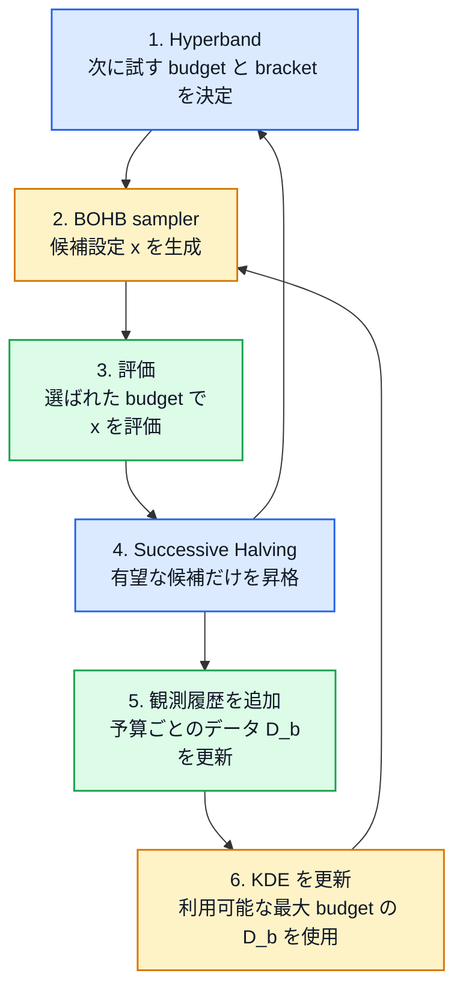

## 1. はじめに

機械学習モデルの性能は、学習率、バッチサイズ、正則化係数、モデル構造など、多数のハイパーパラメータに左右される。しかし、あるハイパーパラメータ設定の良し悪しを正確に評価するには、基本的にはモデルを最後まで学習しなければならない。モデルの学習自体が数時間から数日かかる場合、多数の設定を最大予算で評価するハイパーパラメータ最適化は、すぐに計算不可能になる。

この問題に対する代表的なアプローチの一つが、過去の評価結果から有望な領域を推定するベイズ最適化 (Bayesian Optimization; BO) である。BO は、評価履歴を利用して次に試すべき設定を選ぶため、十分な観測が得られた後には Random Search より効率よく良い設定を探索できる。一方、探索初期には利用できる観測が少なく、良いモデルを構築できない。また、通常の BO では各設定を大きな予算で評価するため、一回の評価が高価な問題では、モデルを構築するためのデータを集めること自体に時間がかかる。

これとは異なる方向から計算量を削減する手法が [Hyperband](https://arxiv.org/abs/1603.06560) である。Hyperband は、最初に多数の設定を小さな予算で評価し、性能の悪い設定を早期に打ち切る。生き残った設定だけにより大きな予算を割り当てることで、限られた計算資源を有望な設定へ集中させる。そのため、探索開始直後から比較的良い設定を発見しやすい。しかし、Hyperband が新しい設定を生成する方法は Random Search であり、過去の評価結果から探索すべき領域を学習するわけではない。このため、探索初期には強い一方、計算予算が増えた後の収束性能には限界がある。

この二つのアプローチを組み合わせた手法が、Falkner らによって提案された **BOHB** (Bayesian Optimization and Hyperband) である。

@[card](https://arxiv.org/abs/1807.01774)

BOHB の狙いは明快である。Hyperband の効率的な予算配分を維持しながら、新しいハイパーパラメータ設定のランダム生成を、評価履歴に基づくモデルベースの生成へ置き換える。これにより、Hyperband が持つ強い anytime performance[^1] と、BO が持つ終盤の探索性能を両立させる。

[^1]: 計算を途中のどの時点で止めても、その時点まででなるべく良い解を返せる性質

*Fig.1: ニューラルネットワークの 6 つのハイパーパラメータを最適化した結果。縦軸は、それまでに発見された最良設定と最適設定の差を表す immediate regret であり、小さいほどよい。*

Fig.1 は、原論文で示された典型的な結果である。Hyperband は探索初期から regret[^2] を急速に減少させるが、やがて改善が鈍化し、長期的には Random Search に近い挙動を示している。対照的に、BO は探索初期こそ Random Search と同程度だが、観測の蓄積に伴って有望な領域を識別できるようになり、最終的には Hyperband を上回る。BOHB は Hyperband と同様に立ち上がりが速く、その後もモデルベース探索によって改善を続けている。

[^2]: 現時点で見つけている最良の設定が、真の最適設定からどれだけ劣っているか

ただし、BOHB の本質は、単に BO と Hyperband を同時に実行することではない。BOHB では、次の二つの役割が明確に分離されている。

* Hyperband は、何個の設定を、どの予算で評価するかを決める。
* BO の一種である TPE に基づくモデルは、どの設定を評価するかを決める。

つまりBOHB は、**「候補への予算配分」** と **「候補そのものの生成」** を異なる問題として扱い、それぞれに適した方法を組み合わせたアルゴリズムである。

本記事では、まず BOHB が対象とする予算付きハイパーパラメータ最適化を定式化する。次に、Hyperband の予算配分がどのように設計されているかを Successive Halving から順に導出する。その後、TPE において Expected Improvement の最大化が密度比の最大化へ帰着することを示し、最後に、それらを BOHB がどのように統合しているのかを説明する。実験結果だけでなく、BOHB が有効に機能するための条件と、低予算評価が最終性能を正しく反映しない場合に生じる限界についても検討する。

:::message alert
本記事では BOHB を一つの題材として取り上げ、Multi-fidelity HPO、Hyperband、Bayesian Optimization、Expected Improvement、TPE、KDE など、周辺する概念も含めて理解するために数理的に掘り下げます。そのため、BOHB だけを手早く理解するための記事ではなく、BOHB に至るまでの考え方をまとめて学ぶための記事になっています。
:::

> なお、BOHB の実装としては原著者らによる **HpBandSter** があり、**Ray Tune** からも利用できる。
> @[card](https://github.com/automl/HpBandSter)
> @[card](https://docs.ray.io/en/latest/tune/api/suggestion.html)

---

## 2. BOHB が解く問題：予算付きハイパーパラメータ最適化

前章では、BOHB が「どの設定を試すか」という候補生成と、「各設定をどこまで評価するか」という予算配分を組み合わせた手法であると説明した。本章では、BOHB が対象とするハイパーパラメータ最適化問題を定式化し、この二つの役割を整理する。

### 2.1 Multi-fidelity HPO[^3] の定式化

[^3]: Multi-fidelity HPO とは、学習 epoch 数、使用データ量、入力解像度などを fidelity（評価精度・計算予算）として変化させ、低 fidelity の安価な評価を利用しながら有望なハイパーパラメータ設定に計算資源を集中させる HPO の枠組みである。Hyperband や BOHB はその代表例である。 

ハイパーパラメータ設定を $x\in\mathcal{X}$ とする。探索空間 $\mathcal{X}$ には、学習率のような連続変数だけでなく、層数のような整数変数、活性化関数や最適化アルゴリズムのようなカテゴリ変数も含まれうる。

ある設定 $x$ でモデルを学習したときの検証損失を $Y(x)$ とすれば、通常のハイパーパラメータ最適化は、その期待値を最小化する設定

$$
x^\star\in\argmin_{x\in\mathcal{X}}\mathbb{E}[Y(x)]
\tag{1}
$$

を探索する問題として表せる。期待値を考えるのは、同じハイパーパラメータ設定であっても、重みの初期値、データの順序、データ拡張などの確率性によって、得られる検証損失が変動するためである。

しかし、式 $(1)$ の評価には、原則として各設定でモデルを最後まで学習する必要がある。そこで、BOHB では評価に使用する計算資源を表す **予算** $b$ を導入する。

予算 $b$ で設定 $x$ を評価したときの観測値を

$$
Y(x,b)=f_b(x)+\varepsilon(x,b),
\qquad
\mathbb{E}[\varepsilon(x,b)\mid x,b]=0
\tag{2}
$$

とする。ここで、$f_b(x)$ は予算 $b$ における期待検証損失、$\varepsilon(x,b)$ は学習の確率性などに由来する観測ノイズである。ノイズの分散は設定や予算に依存してもよく、BOHB の構成に正規分布の仮定は必要ない。

最小予算と最大予算をそれぞれ $b_{\min}$、$b_{\max}$ とし、$b\in[b_{\min},b_{\max}]$ とする。
BOHB が最終的に最小化したいのは、最大予算における目的関数である。

$$
x^\star
\in
\argmin_{x\in\mathcal{X}}f_{b_{\max}}(x)
\tag{3}
$$

一般に、小さい予算での評価は安価であり、大きい予算での評価は高価である。評価コストを $c(b)$ とすれば、少なくとも

$$
b_1<b_2
\quad\Rightarrow\quad
c(b_1)<c(b_2)
\tag{4}
$$

であることを想定する。

一方で、予算を増やせば同じ設定の損失が単調に改善するとは限らない。すなわち、

$$
b_1<b_2
\quad\not\Rightarrow\quad
f_{b_1}(x)\geq f_{b_2}(x)
$$

である。学習初期には性能が悪くても、十分に学習すると高い性能を示す設定も存在する[^4]。また、使用するデータ数を予算とした場合、小規模データで有効な正則化やモデル構造が、全データでも有効とは限らない。

[^4]: 極端な例として、訓練を長く継続した後に汎化性能が大きく改善する [grokking](https://arxiv.org/abs/2201.02177) のような遅延汎化が知られている。遅延汎化の具体例：[ニューラルネットワークは FizzBuzz を「理解」できるのか――未知の桁数への外挿実験](https://zenn.dev/mantis_ryuji/articles/fizz-buzz-exp)

Multi-fidelity HPO に必要なのは、 異なる予算間で損失値そのものが一致することではない。小さい予算で有望と判定された設定が、大きい予算でも有望であるという、候補間の順位の保存である。理想的には、二つの設定 $x_i,x_j$ に対して、

$$
f_b(x_i)<f_b(x_j)
\quad\Rightarrow\quad
f_{b_{\max}}(x_i)<f_{b_{\max}}(x_j)
\tag{5}
$$

が多くの組み合わせで成立することが望ましい。

式 $(5)$ がほとんど成立しなければ、小予算で候補を選別する意味はない。それどころか、最終的には優れた性能を示す設定を、小予算で誤って打ち切る危険がある。したがって、**低予算評価と最大予算評価の間に十分な順位相関が存在することが、Hyperband と BOHB が有効に機能するための本質的な条件となる。**

なお、損失値の尺度が予算ごとに異なっていても問題はない。Successive Halving は、同じ予算で評価された設定同士を比較する。また、後述する BOHB のモデルも予算ごとに構築される。そのため、$f_b(x)$ と $f_{b'}(x)$ の値を異なる予算間で直接比較する必要はない。

### 2.2 候補生成と予算配分

予算付き HPO は、大きく二つの問題に分解できる。

一つ目は、探索空間 $\mathcal{X}$ から **どのハイパーパラメータ設定を評価するか** という候補生成である。二つ目は、生成した設定へ **どれだけの予算を割り当てるか** という予算配分である。

時刻 $t$ までに得られた観測を $D_t$ とすれば、この二つの操作は概念的に、

$$
x_t\sim\pi_t(\,\cdot\mid D_t),
\qquad
b_t=S_t(x_t,D_t)
\tag{6}
$$

と表せる。ここで、$\pi_t$ は次の設定を生成するサンプリング方策、$S_t$ は設定の評価予算や継続・打ち切りを決めるスケジューラである。

代表的な HPO 手法をこの二軸で整理すると、次のようになる。

| 手法            | 候補生成 $\pi_t$  | 予算配分 $S_t$                  |
| ------------- | ------------- | --------------------------- |
| Random Search | ランダム          | 各設定を最大予算で評価                 |
| 通常の BO / TPE  | 評価履歴に基づくモデル   | 各設定を最大予算で評価                 |
| Hyperband     | ランダム          | Successive Halving による適応的配分 |
| BOHB          | モデルベース＋一部ランダム | Hyperband による適応的配分          |

Random Search は単純で並列化しやすいが、過去の評価結果を次の候補生成に利用しない。通常の BO は評価履歴から有望な設定を生成できるが、各設定を最大予算で評価する場合、観測を一つ追加するためのコストが大きい。

Hyperband は、候補生成をランダムなまま維持しながら、予算配分を改善する。多数の設定を小予算で評価し、有望な設定だけを次の予算へ進めるため、限られた計算時間でも比較的早く良い設定を発見できる。一方、過去の探索から有望な領域を学習しないため、候補生成の効率は Random Search と本質的に変わらない。

BOHB は、この Hyperband の候補生成部分だけをモデルベースの方法へ置き換える。どの設定をどの予算で評価するかは Hyperband が決定し、各 Hyperband bracket の開始時にどの設定を投入するかは、TPE に似た密度推定モデルが決定する。ただし、モデルの誤りによって探索範囲が狭まりすぎることを防ぐため、一定の確率でランダムな設定も生成する。

この違いは、時刻 $t$ でアルゴリズムが推奨する最良設定を $x_{\mathrm{inc}}(t)$ としたときの regret を考えると理解しやすい。最大予算におけるsimple regretを

$$
r(t)
=
f_{b_{\max}}\bigl(x_{\mathrm{inc}}(t)\bigr)
-
f_{b_{\max}}(x^\star)
\geq 0
\tag{7}
$$

と定義する。$r(t)$ が小さいほど、その時点で発見されている設定が最適設定に近いことを意味する。

Hyperband は小予算評価によって多数の候補を早く選別できるため、探索初期から $r(t)$ を減少させやすい。これは、計算を途中で停止されても比較的良い設定を返せるという、強い anytime performance に対応する。しかし、候補生成がランダムなので、長時間探索を続けたときの改善は鈍化しやすい。

一方、BO は観測が少ない探索初期には有効なモデルを構築しにくいが、観測が蓄積すると有望な領域へ候補を集中させられる。BOHB は、Hyperband の予算配分によって探索初期の $r(t)$ を小さくし、その評価履歴から候補生成モデルを構築することで、探索後半も $r(t)$ を減少させることを狙っている。

残る問題は、限られた総予算の中で、候補数と各候補への予算をどのように決めるかである。次章では、BOHB の予算配分を担う Hyperband について、その基礎となる Successive Halving から順に説明する。

---

## 3. Hyperband：計算資源を有望な候補へ集める

前章では、予算付き HPO を「候補生成」と「予算配分」に分解した。Hyperband が担うのは後者である。Hyperband は、すべての設定を最大予算で評価する代わりに、多数の設定を小予算で評価し、その結果に基づいて有望な設定だけへ追加の予算を与える。

本章では、まず Hyperband の基礎となる Successive Halving を説明する。その後、候補数と初期予算の異なる複数の Successive Halving を、ほぼ等しい総予算で実行するように設計された Hyperband を導出する。

### 3.1 Successive Halving

Successive Halving (SH) は、複数の候補を同じ小予算で評価し、性能の悪い候補を段階的に打ち切る方法である。

初期候補集合を

$$
C_0=\{x_1,\ldots,x_{n_0}\}
$$

とし、候補数を $n_0=|C_0|$、初期予算を $b_0$、最大予算を $b_{\max}$ とする。また、各段階で候補数を削減し、予算を増加させる割合を $\eta>1$ とする。

説明を簡単にするため、

$$
\frac{b_{\max}}{b_0}=\eta^K
$$

を満たす整数 $K$ が存在すると仮定する。このとき、SH は $i=0,\ldots,K$ の $K+1$ 段階から構成される。

第 $i$ 段階で評価される候補数と、一候補あたりの予算をそれぞれ

$$
n_i
=
\left\lfloor n_0\eta^{-i}\right\rfloor,
\qquad
b_i
=
b_0\eta^i
\tag{8}
$$

とする。

各段階では、候補集合 $C_i$ のすべての設定を同じ予算 $b_i$ で評価し、観測された損失が小さい順に上位およそ $1/\eta$ の候補だけを残す。したがって、

$$
C_{i+1}
=
\operatorname{Top}_{\lfloor |C_i|/\eta\rfloor}
\left\{
Y(x,b_i):x\in C_i
\right\}
\tag{9}
$$

となる。ここで、$\operatorname{Top}_k$ は損失が小さい方から $k$ 個の設定を選ぶ操作を表す。

候補数は段階ごとにおよそ $1/\eta$ へ減少する一方、一候補あたりの予算は $\eta$ 倍になる。そのため、床関数による丸めを無視すれば、第 $i$ 段階で使用する総予算は

$$
\begin{aligned}
n_i b_i
&\approx
\left(n_0\eta^{-i}\right)
\left(b_0\eta^i\right)\\
&=
n_0b_0
\end{aligned}
\tag{10}
$$

となり、すべての段階でほぼ一定になる。

例えば、

$$
n_0=27,
\qquad
b_0=1,
\qquad
b_{\max}=27,
\qquad
\eta=3
$$

とすると、SH の評価過程は次のようになる。

| 段階 $i$ | 候補数 $n_i$ | 一候補あたりの予算 $b_i$ | 段階全体の予算 $n_ib_i$ |
| -----: | --------: | --------------: | ---------------: |
|      0 |        27 |               1 |               27 |
|      1 |         9 |               3 |               27 |
|      2 |         3 |               9 |               27 |
|      3 |         1 |              27 |               27 |

最初は27個の設定を予算1で広く評価する。次に上位9個だけを予算3で評価し、さらに上位3個を予算9、最後に1個を最大予算27で評価する。各段階の総予算は27で等しいため、特定の段階だけが極端に高価になることはない。

SH 全体の総予算は、丸めを無視すれば、

$$
B_{\mathrm{SH}}
=
\sum_{i=0}^{K}n_ib_i
\approx
(K+1)n_0b_0
\tag{11}
$$

となる。すべての27候補を最大予算27で評価する場合には

$$
27\times27=729
$$

の予算が必要になる。一方、上の SH が使用する予算は

$$
4\times27=108
$$

である。SH は計算量を約 $1/6.75$ に削減しながら、少なくとも一つの候補を最大予算まで評価できる。

ただし、この削減が有効なのは、**小予算での順位が最大予算でもある程度維持される場合に限られる。** 最終的に最良となる設定が初期段階で下位に位置していれば、その設定は最大予算へ到達する前に除外される。

SH の処理を擬似コードで表すと、次のようになる。

:::message
##### Successive Halving
**input:**
$\quad$ 初期候補集合 $C$
$\quad$ 初期予算 $b_0$
$\quad$ 最大予算 $b_\text{max}$
$\quad$ 削減率 $\eta$

$b \leftarrow b_0$

**while** $b \leq b_\text{max}$:
$\quad$ $C$ の全設定を予算 $b$ で評価する

$\quad$ **if** $b = b_\text{max}$:
$\quad\quad$ **break**

$\quad$ 損失の小さい上位 $1/\eta$ の設定だけを $C$ に残す
$\quad$ $b \leftarrow \eta b$

**return** $C$ の中で最良の設定
:::

SH の仕組み自体は単純である。しかし、性能は初期候補数 $n_0$ と初期予算 $b_0$ の選び方に大きく依存する。

### 3.2 Hyperband による bracket の構成

SH を実行するには、最初に何個の設定を、どれだけの予算から評価するかを決めなければならない。

初期予算を小さくして多数の候補を評価すれば、探索空間を広く調べられる。しかし、小予算での評価が不正確であれば、将来有望になる設定を誤って打ち切る危険が大きい。反対に、初期予算を大きくすれば評価は信頼しやすくなるが、試せる候補数は少なくなる。

どちらが適切かは、事前には分からない。そこで Hyperband は、初期候補数と初期予算の異なる複数の SH を実行する。この一つ一つの SH を **bracket** と呼ぶ。

最小予算を $b_{\min}$、最大予算を $b_{\max}$ とすると、利用可能な予算段階の最大数を

$$
s_{\max}
=
\left\lfloor
\log_\eta
\frac{b_{\max}}{b_{\min}}
\right\rfloor
\tag{12}
$$

と定義する。

Hyperband は、

$$
s\in\{s_{\max},s_{\max}-1,\ldots,0\}
$$

の各値について一つの bracket を構成する。bracket $s$ の初期候補数 $n_s$ と初期予算 $b_s$ は、

$$
n_s
=
\left\lceil
\frac{s_{\max}+1}{s+1}\eta^s
\right\rceil,
\qquad
b_s
=
b_{\max}\eta^{-s}
\tag{13}
$$

で与えられる。

ここで、$s$ はその bracket で行われる候補削減の回数でもある。bracket $s$ は $i=0,\ldots,s$ の $s+1$ 段階を持ち、各段階の候補数と予算は、

$$
n_{s,i}
=
\left\lfloor n_s\eta^{-i}\right\rfloor,
\qquad
b_{s,i}
=
b_s\eta^i
\tag{14}
$$

となる。

最後の段階 $i=s$ では、

$$
b_{s,s}
=
b_s\eta^s
=
b_{\max}\eta^{-s}\eta^s
=
b_{\max}
$$

となるため、すべての bracket が最終的には最大予算へ到達する。

式 $(13)$ の初期候補数が一見複雑なのは、異なる bracket の総予算を揃えるためである。床関数と天井関数による丸めを無視すると、bracket $s$ の総予算は、

$$
\begin{aligned}
B_s
&=
\sum_{i=0}^{s}
n_{s,i}b_{s,i}\\
&\approx
\sum_{i=0}^{s}
\left(n_s\eta^{-i}\right)
\left(b_s\eta^i\right)\\
&=
(s+1)n_sb_s
\end{aligned}
$$

となる。ここへ式 $(13)$ を代入すると、

$$
\begin{aligned}
B_s
&\approx
(s+1)
\left(
\frac{s_{\max}+1}{s+1}\eta^s
\right)
\left(
b_{\max}\eta^{-s}
\right)\\
&=
(s_{\max}+1)b_{\max}
\end{aligned}
\tag{15}
$$

を得る。

したがって、各 bracket は候補数と初期予算が異なるにもかかわらず、ほぼ同じ総予算を使用する。$\eta^s$ と $\eta^{-s}$ が打ち消し合い、さらに $s+1$ も分母の $s+1$ と打ち消し合うように、初期候補数が設計されている。

具体例として、

$$
b_{\min}=1,
\qquad
b_{\max}=27,
\qquad
\eta=3
$$

を考える。このとき、

$$
s_{\max}
=
\left\lfloor
\log_3\frac{27}{1}
\right\rfloor
=
3
$$

である。各 bracket は次のようになる。

| $s$ | 初期候補数 $n_s$ | 初期予算 $b_s$ | SH の過程                                                                | 実際の総予算 |
| --: | ----------: | ---------: | --------------------------------------------------------------------- | -----: |
|   3 |          27 |          1 | $27\times1\rightarrow9\times3\rightarrow3\times9\rightarrow1\times27$ |    108 |
|   2 |          12 |          3 | $12\times3\rightarrow4\times9\rightarrow1\times27$                    |     99 |
|   1 |           6 |          9 | $6\times9\rightarrow2\times27$                                        |    108 |
|   0 |           4 |         27 | $4\times27$                                                           |    108 |
> $n_s$ は式 $(13)$ より算出

$s=3$ は、最小予算から多数の候補を評価する最も攻撃的な bracket である。小予算評価を積極的に利用するため探索範囲は広いが、誤った打ち切りの影響も受けやすい。

反対に、$s=0$ は候補の削減を一度も行わず、4個の設定を最初から最大予算で評価する最も保守的な bracket である。探索できる候補数は少ないが、小予算による誤った順位付けの影響を受けない。

$s=1,2$ はその中間に位置する。Hyperband は、低予算評価をどの程度信頼すべきかを一つに決めるのではなく、攻撃性の異なるすべての bracket へほぼ同じ総予算を割り当てることで、この不確実性に対処している。

表において $s=2$ の総予算だけが99となるのは、候補数に床関数と天井関数を適用しているためである。式 $(15)$ が示す予算の等しさは近似的なものであり、実際の候補数が整数でなければならない以上、小さな差は避けられない。

Hyperband の全体像は、次のように表せる。

:::message
##### Hyperband
**input:**
$\quad$ 最小予算 $b_\text{min}$
$\quad$ 最大予算 $b_\text{max}$
$\quad$ 削減率 $\eta$

$s_\text{max} \leftarrow \operatorname{floor}\bigl(\log_{\eta}(b_\text{max} / b_\text{min})\bigr)$

**for** $s$ **in** $\{s_\text{max}, s_\text{max} - 1,\ldots, 0\}$:
$\quad$ $n_s \leftarrow \operatorname{ceil}\bigl(((s_\text{max} + 1) / (s + 1)) \eta^s\bigr)$
$\quad$ $b_s \leftarrow b_\text{max} \eta^{-s}$

$\quad$ $n_s$ 個の設定をランダムに生成する
$\quad$ 初期予算 $b_s$、最大予算 $b_\text{max}$ で
$\quad$ Successive Halving を実行する
:::

### 3.3 Hyperband の強みと限界

Hyperband の強みは、特定の初期予算に依存せず、複数の予算配分戦略を同時に試せる点にある。

小予算評価が最終性能をよく反映する問題では、$s=s_\text{max}$ に近い攻撃的な bracket が機能する。多数の設定を安価に比較し、見込みのない設定を早く除外できるため、すべての設定を最大予算で評価する Random Search よりも早く良い設定へ到達できる。

一方、小予算での順位が不正確な問題では、$s=0$ に近い保守的な bracket が重要になる。特に $s=0$ は設定を最初から最大予算で評価するため、低予算で誤って有望な設定を除外することがない。Hyperband は、攻撃的な早期打ち切りだけでなく、低予算評価を信用しない場合の探索も同時に含んでいる。

この性質により、Hyperband は限られた計算時間でも良い設定を発見しやすく、強い anytime performance を持つ。しかし、候補生成には依然として次の制約が残る。

第一に、**新しいハイパーパラメータ設定はランダムに生成される。** ある bracket で有望な領域が見つかっても、その情報を使って次の bracket の候補を生成することはない。予算の使い方は適応的だが、探索空間のどこを調べるかは適応的ではない。

第二に、**低予算と最大予算の順位が大きく異なる場合、攻撃的な bracket は最終的に優れた設定を早期に除外する。** 複数の bracket を使うことでこの危険を軽減できるが、低予算評価そのものを正確にするわけではない。

第三に、**探索が十分に進んだ後も、Hyperband は小予算から始まる bracket を繰り返す。** そのため、大きな計算予算が与えられた状況では、小予算評価が固定的なオーバーヘッドとなり、最大予算だけをモデルベースに探索する方法より収束が遅くなる可能性がある。

したがって、Hyperband は「見込みのない候補へ大きな予算を使わない」という問題には答えるが、「そもそもどの候補を試すべきか」という問題には答えない。

BOHB は Hyperband の予算配分をそのまま利用し、このランダムな候補生成だけをモデルベースの方法へ置き換える。そのために用いられるのが、次章で説明する Tree-structured Parzen Estimator (TPE) に基づく密度推定である。

---

## 4. TPE：評価履歴から次の候補を選ぶ

Hyperband は、候補数と各候補へ割り当てる予算を適応的に変化させる。しかし、各 bracket に投入するハイパーパラメータ設定はランダムに生成されるため、それまでに得られた評価結果を次の候補生成へ活用しない。

BOHB は、この候補生成をモデルベースの方法へ置き換える。具体的には、ベイズ最適の一種である Tree-structured Parzen Estimator (TPE) を基礎として、良い性能を示した設定が分布する領域を推定する。

本章では、まず BO の基本的な枠組みと Expected Improvement を説明する。次に、TPE において Expected Improvement の最大化が二つの確率密度の比 $\ell(x)/g(x)$ の最大化へ帰着することを導出する。

### 4.1 ベイズ最適化と Expected Improvement

本章では、ある一つの予算 $b$ で得られた評価結果だけを扱うため、予算を表す添字を省略する。時刻 $t$ までに得られた観測データを

$$
D_t
=
\left\{
(x_i,y_i)
\right\}_{i=1}^{t},
\qquad
y_i=Y(x_i)
\tag{16}
$$

とする。

ベイズ最適化は、観測データ $D_t$ から未知の目的関数に関する確率モデルを構築し、そのモデルに基づいて次に評価する設定を決定する方法である。典型的には、目的関数に関する事後分布 $p(f\mid D_t)$、または未評価点における予測分布

$$
p(y\mid x,D_t)
$$

を構築する。

ただし、予測損失が最も小さい設定だけを評価すればよいわけではない。現在のモデルが予測する最良領域だけを繰り返し評価すると、まだ観測されていない領域に存在する、より良い設定を発見できない可能性がある。

そこで BO は、予測分布から次の評価点の価値を計算する **獲得関数**（acquisition function）$a_t(x)$を使用する。次の設定は、

$$
x_{t+1}
\in
\argmax_{x\in\mathcal{X}}a_t(x)
\tag{17}
$$

として選択される。獲得関数は、既に良い性能が期待される領域を詳しく調べる exploitation と、不確実性の大きい領域を調べる exploration のバランスを表す。

代表的な獲得関数が Expected Improvement（EI）である。ある基準値 $\tau$ よりも小さい損失が得られたとき、その改善量を

$$
I_\tau(x,y)
=
(\tau-y)_+
=
\max(\tau-y,0)
\tag{18}
$$

と定義する。

損失 $y$ が $\tau$ より小さければ改善量は $\tau-y$ であり、$y\geq\tau$ なら改善量は0である。しかし、未評価点 $x$ で得られる損失は事前には分からない。そこで、予測分布 $p(y\mid x,D_t)$ に関する改善量の期待値を計算する。

$$
\begin{aligned}
\operatorname{EI}_\tau(x)
&=
\mathbb{E}
\left[
I_\tau(x,Y(x))
\mid x,D_t
\right]\\
&=
\mathbb{E}
\left[
\max(\tau-y,0)
\mid x,D_t
\right]\\
&=
\int_{-\infty}^{\infty}
\max(\tau-y,0)
p(y\mid x,D_t)\,dy\\
&=
\int_{-\infty}^{\tau}
(\tau-y)
p(y\mid x,D_t)\,dy
\end{aligned}
\tag{19}
$$

:::details 式 (19) 補足
ここで、連続確率変数 $Y$ の関数 $g(Y)$ の期待値は

$$
\mathbb{E}[g(Y)]
=
\int_{-\infty}^{\infty}
g(y)p(y)\,dy
$$

と書けるため、

$$
\mathbb{E}
\left[
\max(\tau-Y(x),0)
\mid x,D_t
\right]
=
\int_{-\infty}^{\infty}
\max(\tau-y,0)
p(y\mid x,D_t)\,dy
$$

となる。

さらに、

$$
\max(\tau-y,0)
=
\begin{cases}
\tau-y, & y<\tau,\\
0, & y\ge \tau
\end{cases}
$$

である。すなわち、最小化問題では $y<\tau$ のときだけ現在の基準値 $\tau$ を改善し、$y\ge\tau$ の領域では改善量は $0$ となる。そのため積分を $\tau$ で分割すると、

$$
\begin{aligned}
&\int_{-\infty}^{\infty}
\max(\tau-y,0)
p(y\mid x,D_t)\,dy\\
&\quad=
\int_{-\infty}^{\tau}
(\tau-y)p(y\mid x,D_t)\,dy
+
\int_{\tau}^{\infty}
0\cdot p(y\mid x,D_t)\,dy\\
&\quad=
\int_{-\infty}^{\tau}
(\tau-y)p(y\mid x,D_t)\,dy
\end{aligned}
$$

となる。
:::

式 $(19)$ は、単に予測損失が小さい点だけを高く評価するわけではない。平均的な予測性能がそれほど良くなくても、予測分布の不確実性が大きく、基準値 $\tau$ を大幅に下回る可能性があれば、Expected Improvement は大きくなりうる。

通常の EI では、現在までに観測された最良値

$$
\tau
=
\min_{1\leq i\leq t}y_i
$$

を基準値として使用できる。一方、TPE では観測を二つの集合へ分割して確率密度を推定する必要がある[^5]ため、最良値そのものではなく、観測損失の $q$-quantile を $\tau$ として使用する。

[^5]: TPE では $\tau$ が「改善の基準値」であると同時に、「観測データを good / bad に分割する境界」でもあるため。最良値を閾値にすると、$\tau$ より小さい観測が存在せず、良い設定の密度を推定が不可能になる。

### 4.2 Expected Improvement から密度比へ

通常の BO は、ハイパーパラメータ設定 $x$ を与えたときの損失分布

$$
p(y\mid x,D_t)
$$

を直接モデル化する。これに対して TPE は、損失 $y$ が与えられたときに、どのような設定 $x$ が出現しやすいかを表す逆向きの条件付き密度

$$
p(x\mid y,D_t)
$$

をモデル化する。

観測損失の $q$-quantile を閾値 $\tau$ とし、設定空間上の二つの密度を

$$
p(x\mid y,D_t)
=
\begin{cases}
\ell(x), & y<\tau,\\[4pt]
g(x), & y\geq\tau
\end{cases}
\tag{20}
$$

と定義する。ここで、

* $\ell(x)$ は、損失が小さかった設定から推定される密度
* $g(x)$ は、それ以外の設定から推定される密度

である。

:::details BOHB 原論文 式(2) に関する補足
BOHB 原論文の式 $(2)$ では、$\ell(x)=p(y<\alpha\mid x,D)$、$g(x)=p(y>\alpha\mid x,D)$ と記載されている。しかし、これらは $x$ 上の確率密度ではなく、この定義からは以降導出する式 $(28)$ を導けない。TPE の定義および BOHB の実際のアルゴリズムに従えば、正しくは式 $(20)$ のように $\ell(x)=p(x\mid y<\tau,D_t)$、$g(x)=p(x\mid y\geq\tau,D_t)$ である。
:::

したがって、$\ell(x)$ が大きい領域は、過去に良い性能を示した設定が多く存在する領域であり、
$g(x)$ が大きい領域は、過去に良くない性能を示した設定が多く存在する領域である。

また、

$$
\gamma
=
P(y<\tau\mid D_t)
\tag{21}
$$

と定義する。$\tau$ を $q$-quantile として選んだ場合、有限標本における丸めを無視すれば $\gamma=q$ である。

全確率の法則[^6]より、設定 $x$ の周辺密度は、

[^6]: 確率論において周辺確率と条件付き確率とを関連づける基本的な法則の一つ。[Wikipedia-全確率の法則](https://ja.wikipedia.org/wiki/%E5%85%A8%E7%A2%BA%E7%8E%87%E3%81%AE%E6%B3%95%E5%89%87)

$$
\begin{aligned}
p(x\mid D_t)
&=
P(y<\tau\mid D_t)
p(x\mid y<\tau,D_t)\\
&\quad+
P(y\geq\tau\mid D_t)
p(x\mid y\geq\tau,D_t)\\
&=
\gamma\ell(x)
+
(1-\gamma)g(x)
\end{aligned}
\tag{22}
$$

となる。

:::details 式 (22) 補足
設定 $x$ と目的関数値 $y$ の同時密度 $p(x,y\mid D_t)$ から $y$ を周辺化すると、
設定 $x$ の周辺密度 $p(x\mid D_t)$ が得られる。
すなわち、

$$
p(x\mid D_t)
=
\int_{-\infty}^{\infty}
p(x,y\mid D_t)\,dy
$$

と書ける。

積分区間を閾値 $\tau$ で分割すると、

$$
\begin{aligned}
p(x\mid D_t)
&=
\int_{-\infty}^{\tau}
p(x,y\mid D_t)\,dy
+
\int_{\tau}^{\infty}
p(x,y\mid D_t)\,dy.
\end{aligned}
$$

ここで、条件付き確率の定義より

$$
p(x\mid y,D_t)=\frac{p(x,y\mid D_t)}{p(y\mid D_t)}
$$

であるから、

$$
p(x,y\mid D_t)
=
p(x\mid y,D_t)p(y\mid D_t)
$$

であり、これを用いると、

$$
\begin{aligned}
p(x\mid D_t)
&=
\int_{-\infty}^{\tau}
p(x\mid y,D_t)p(y\mid D_t)\,dy\\
&\quad+
\int_{\tau}^{\infty}
p(x\mid y,D_t)p(y\mid D_t)\,dy.
\end{aligned}
$$

TPE では、$p(x\mid y,D_t)$ を $y$ の値そのものではなく、$y$ が閾値 $\tau$ より小さいかどうかによって

$$
p(x\mid y,D_t)
=
\begin{cases}
\ell(x), & y<\tau,\\[4pt]
g(x), & y\geq\tau
\end{cases}
$$

とモデル化する。したがって、

$$
\begin{aligned}
p(x\mid D_t)
&=
\int_{-\infty}^{\tau}
\ell(x)p(y\mid D_t)\,dy\\
&\quad+
\int_{\tau}^{\infty}
g(x)p(y\mid D_t)\,dy.
\end{aligned}
$$

$\ell(x)$ と $g(x)$ は積分変数 $y$ に依存しないため、積分の外へ出せる。

$$
\begin{aligned}
p(x\mid D_t)
&=
\ell(x)
\int_{-\infty}^{\tau}
p(y\mid D_t)\,dy\\
&\quad+
g(x)
\int_{\tau}^{\infty}
p(y\mid D_t)\,dy.
\end{aligned}
$$

確率密度の積分より、

$$
\int_{-\infty}^{\tau}
p(y\mid D_t)\,dy
=
P(y<\tau\mid D_t),
$$

$$
\int_{\tau}^{\infty}
p(y\mid D_t)\,dy
=
P(y\geq\tau\mid D_t)
$$

であるため、

$$
\begin{aligned}
p(x\mid D_t)
&=
P(y<\tau\mid D_t)\,\ell(x)\\
&\quad+
P(y\geq\tau\mid D_t)\,g(x).
\end{aligned}
$$

さらに、

$$
\gamma
=
P(y<\tau\mid D_t)
,\quad
1-\gamma
=
P(y\geq\tau\mid D_t)
$$

なので、

$$
\boxed{
p(x\mid D_t)
=
\gamma\ell(x)
+
(1-\gamma)g(x)
}
$$

を得る。
:::

ここから、Expected Improvement と密度比の関係を導出する。Bayes の定理[^7]より、

[^7]: [Wikipedia-ベイズの定理](https://ja.wikipedia.org/wiki/%E3%83%99%E3%82%A4%E3%82%BA%E3%81%AE%E5%AE%9A%E7%90%86)

$$
p(y\mid x,D_t)
=
\frac{
p(x\mid y,D_t)p(y\mid D_t)
}{
p(x\mid D_t)
}
\tag{23}
$$

である。式 $(23)$ を Expected Improvement の式 $(19)$ へ代入すると、

$$
\operatorname{EI}_\tau(x)
=
\int_{-\infty}^{\tau}
(\tau-y)
\frac{
p(x\mid y,D_t)p(y\mid D_t)
}{
p(x\mid D_t)
}
\,dy
\tag{24}
$$

を得る。

分母 $p(x\mid D_t)$ は積分変数 $y$ に依存しないため、積分の外へ出せる。また、積分範囲では常に $y<\tau$ なので、式 $(20)$ より

$$
p(x\mid y,D_t)=\ell(x)
$$

である。したがって、

$$
\begin{aligned}
\operatorname{EI}_\tau(x)
&=
\frac{\ell(x)}{p(x\mid D_t)}
\int_{-\infty}^{\tau}
(\tau-y)p(y\mid D_t)\,dy
\end{aligned}
\tag{25}
$$

となる。

ここで、

$$
A_\tau
=
\int_{-\infty}^{\tau}
(\tau-y)p(y\mid D_t)\,dy
$$

とおく。$A_\tau$ は $x$ に依存しない定数であるため、Expected Improvement を最大化する際には無視できる。よって、

$$
\operatorname{EI}_\tau(x)
\propto
\frac{\ell(x)}{p(x\mid D_t)}
\tag{26}
$$

である。さらに、式 $(22)$ を代入すると、

$$
\begin{aligned}
\operatorname{EI}_\tau(x)
&\propto
\frac{
\ell(x)
}{
\gamma\ell(x)+(1-\gamma)g(x)
}\\
&=
\frac{1}{
\gamma+(1-\gamma)\dfrac{g(x)}{\ell(x)}
}
\end{aligned}
\tag{27}
$$

を得る。

$\gamma$ は $x$ に依存しない定数であり、右辺は $g(x)/\ell(x)$ に対して単調減少する。したがって、

$$
\begin{aligned}
\argmax_{x\in\mathcal{X}}
\operatorname{EI}_\tau(x)
&=
\argmin_{x\in\mathcal{X}}
\frac{g(x)}{\ell(x)}\\
&=
\argmax_{x\in\mathcal{X}}
\frac{\ell(x)}{g(x)}
\end{aligned}
\tag{28}
$$

が成立する。

つまり、Expected Improvement を最大化する設定を探す問題は、

$$
\boxed{\text{良い設定が密集し、悪い設定があまり存在しない領域を探す問題}}
$$

へ置き換えられる。

単に $\ell(x)$ が大きい領域を選ぶだけでは、良い設定と悪い設定の両方が密集している領域も高く評価されてしまう。そこで $\ell(x)/g(x)$ という密度比を用いることで、良い設定の密度が高く、かつ悪い設定の密度が相対的に低い領域を優先できる。

### 4.3 KDE による確率密度の推定

TPE では、式 $(20)$ の $\ell(x)$ と $g(x)$ を Kernel Density Estimation (KDE) [^8]によって推定する。

[^8]: [Wikipedia-カーネル密度推定](https://ja.wikipedia.org/wiki/%E3%82%AB%E3%83%BC%E3%83%8D%E3%83%AB%E5%AF%86%E5%BA%A6%E6%8E%A8%E5%AE%9A)

観測データを、閾値 $\tau$ に基づいて

$$
D_t^{(\ell)}
=
\left\{
x_i:y_i<\tau
\right\},
\qquad
D_t^{(g)}
=
\left\{
x_i:y_i\geq\tau
\right\}
\tag{29}
$$

へ分割する。それぞれの要素数を $N_\ell$、$N_g$ とする。

説明を簡単にするため、すべてのハイパーパラメータが連続変数である一次元の探索空間を考える。このとき、良い設定の密度は、

$$
\ell(x)
=
\frac{1}{N_\ell}
\sum_{x_i\in D_t^{(\ell)}}
\frac{1}{h_\ell}
K\left(
\frac{x-x_i}{h_\ell}
\right)
\tag{30}
$$

と推定できる。ここで、$K$ はカーネル関数、$h_\ell>0$ はカーネルの広がりを決める bandwidth である。同様に、

$$
g(x)
=
\frac{1}{N_g}
\sum_{x_i\in D_t^{(g)}}
\frac{1}{h_g}
K\left(
\frac{x-x_i}{h_g}
\right)
\tag{31}
$$

とする。

各観測点を中心にカーネルを配置し、それらを平均することで、観測点の近傍に滑らかな確率密度を構築する。連続変数には一般に Gaussian kernel を使用できる。カテゴリ変数には、同一カテゴリへ高い確率を与えつつ、他のカテゴリにも小さな確率を残す離散的なカーネルを使用する。

単純化した固定次元の TPE では、各ハイパーパラメータについて一次元密度を **独立に推定** し、それらの **積** によって同時密度を構成する[^9]。$x=(x_1,\ldots,x_d)$ とすれば、

[^9]: KDE 自体は多次元へ拡張でき、実際に現在の Optuna には複数のハイパーパラメータを同時にモデル化する multivariate TPE が実装されている。一方、original TPE は各ハイパーパラメータを個別にモデル化することで密度推定を単純化し、高次元かつ評価回数の限られた探索や、ハイパーパラメータの有効・無効が条件によって変化する tree-structured な探索空間を扱いやすくしている。ただし、その代償としてハイパーパラメータ間の依存関係を直接表現できない。なお現行 [Optuna docs](https://optuna.readthedocs.io/en/latest/reference/samplers/generated/optuna.samplers.TPESampler.html) では multivariate TPE は複数パラメータを joint distribution として扱い、independent TPE より良い性能が報告されている、と明示されている。

$$
\ell_{\mathrm{TPE}}(x)
=
\prod_{j=1}^{d}\ell_j(x_j),
\qquad
g_{\mathrm{TPE}}(x)
=
\prod_{j=1}^{d}g_j(x_j)
\tag{32}
$$

である。

実際の TPE は tree 構造[^10]を用いることで、「optimizer が SGD の場合だけ momentum が有効になる」といった条件付き探索空間も扱える。ただし、同時に有効なハイパーパラメータ間については、式 $(32)$ のような因子分解を基本とする。そのため、各次元の周辺分布は表現できても、ハイパーパラメータ間の相互作用を十分に表現できない場合がある。

[^10]: TPE の “Tree-structured” は、あるハイパーパラメータの値によって、別のハイパーパラメータが有効になるかどうかが変化する条件付き探索空間を tree 構造として表現できることに由来する。例えば、optimizer に SGD を選んだ場合のみ momentum を探索し、Adam を選んだ場合は代わりに $\beta_1,\beta_2$ を探索するといった構造である。本記事では BOHB の理解に必要な密度推定の側面に焦点を当てるため、tree-structured search space の詳細は扱わない。TPE の原論文は [Algorithms for Hyper-Parameter Optimization](https://papers.nips.cc/paper_files/paper/2011/hash/86e8f7ab32cfd12577bc2619bc635690-Abstract.html) を参照。

TPE による候補生成は、概ね次の手順で行われる。

:::message
##### Tree-structured Parzen Estimator
**input:**
$\quad$ 観測データ $D_t$
$\quad$ quantile $q$
$\quad$ 候補サンプル数 $N_s$

観測損失の $q$-quantile を閾値 $\tau$ とする
$D_t$ を $y < \tau$ と $y \geq \tau$ の二群に分割する
良い群から密度 $\ell(x)$ を推定する
悪い群から密度 $g(x$) を推定する

$\ell(x)$ から $N_s$ 個の候補をサンプリングする
各候補について $\ell(x) / g(x)$ を計算する
密度比が最大の候補を次の評価点として返す
:::

$\ell(x)/g(x)$ を探索空間全体で厳密に最大化するのではなく、まず $\ell(x)$ から有限個の候補を生成し、その中から密度比が最大の候補を選ぶ。この方法には、有望な領域を重点的に探索できることに加え、獲得関数の最適化コストを制御しやすいという利点がある。

また、Gaussian Process を用いる標準的な BO では、素朴な実装の場合、$N$ 個の観測に対する共分散行列の分解に $O(N^3)$ の計算量が必要となる。これに対して KDE の構築は観測数に対して概ね線形であり、小予算評価によって多数の観測が蓄積する BOHB と相性がよい。連続変数、整数変数、カテゴリ変数が混在した探索空間へ適用しやすいことも、TPE が採用された理由である。

一方、TPE にも限界がある。基本的な TPE は観測を $\tau$ より良いか悪いかで二分するため、それぞれの集合内部における損失値の大小を直接利用しない。また、式 $(32)$ の因子分解では**次元間の相互作用が失われる。** さらに、KDE は高次元になるほど密度推定に多くの観測を必要とする。

BOHB は、この TPE の枠組みをそのまま使用するわけではない。Hyperband によって異なる予算で得られた観測をどのように選択するか、良い設定と悪い設定の密度をどのように構築するか、モデルが不正確な探索初期をどのように処理するかについて、いくつかの変更を加えている。次章では、これらを Hyperband の予算配分と統合した BOHB の全体アルゴリズムを説明する。

---

## 5. BOHB：Hyperband のランダム探索をモデルベースにする

ここまで、Hyperband と TPE をそれぞれ説明した。Hyperband は、何個の設定をどの予算で評価するかを効率的に決定できるが、新しい設定はランダムに生成する。一方、TPE は評価履歴から有望な設定を生成できるが、通常は各設定を単一の予算で評価する。

BOHB は、Hyperband の予算配分を維持したまま、各 bracket に投入する設定の生成を TPE に似たモデルベースの方法へ置き換える。単に二つのアルゴリズムを順番に実行するのではなく、異なる予算で得られた観測からどのモデルを構築するか、モデルを構築できない探索初期をどう扱うかについて、BOHB 固有の設計が加えられている。

### 5.1 予算ごとの評価履歴からモデルを選ぶ

Hyperband は、各 bracket について初期候補数 $n_s$ と初期予算 $b_s$ を決定する。通常の Hyperband では、ここで $n_s$ 個の設定を探索空間 $\mathcal{X}$ からランダムに生成する。

BOHB は、この設定生成をモデルベースのサンプリングへ置き換える。生成された設定に対する予算配分と候補の選別には、引き続き通常の Successive Halving を使用する。すなわち、BOHB においても式 $(13)$、$(14)$ で定義した Hyperband のスケジュールは変化しない。

BOHB は、評価されたすべての設定を予算ごとに保存する。予算 $b$ で得られた観測集合を

$$
D_b
=
\left\{
(x_i,y_i)
:
y_i=Y(x_i,b)
\right\}
\tag{33}
$$

とする。

例えば、使用可能な予算が

$$
\mathcal{B}=\{1,3,9,27\}
$$

であれば、BOHB は

$$
D_1,\quad D_3,\quad D_9,\quad D_{27}
$$

を別々に管理する。異なる bracket で得られた観測であっても、予算が同じなら同じ $D_b$ に追加される。したがって、新しい bracket のモデルは、過去の bracket で得られた評価結果も利用できる。

ここで考えなければならないのは、どの予算の観測からモデルを構築するかである。

最終的な目的は、最大予算 $b_{\max}$ における損失 $f_{b_{\max}}(x)$ を最小化することである。そのため、可能であれば $D_{b_{\max}}$ からモデルを構築することが望ましい。しかし、最大予算へ到達する設定は少ないため、探索初期には十分な観測が蓄積していない。

一方、小さい予算では多数の観測を早く得られるが、第2章で述べたように、小予算での順位が最大予算での順位と一致するとは限らない。

そこで BOHB は、モデルを構築するのに十分な観測が存在する予算のうち、最も大きい予算を使用する。KDE の構築に必要な最小観測数を $N_{\min}$ とし、

$$
\mathcal{B}_{\mathrm{model}}
=
\left\{
b\in\mathcal{B}
:
|D_b|\geq N_{\min}+2
\right\}
$$

とする。使用する予算は、

$$
b^\dagger
=
\max\mathcal{B}_{\mathrm{model}}
\tag{34}
$$

である。

$\mathcal{B}_{\mathrm{model}}$ が空集合なら、まだどの予算にも十分な観測が存在しないため、BOHB は設定をランダムに生成する。原論文の実験では、探索空間の次元数を $d$ として、

$$
N_{\min}=d+1
$$

が使用されている。したがって、少なくとも $d+3$ 個の観測が同じ予算に蓄積するまでは、その予算についてモデルを構築しない。

探索の進行に伴って、使用されるモデルは

$$
D_{b_{\min}}
\longrightarrow
D_{\eta b_{\min}}
\longrightarrow
\cdots
\longrightarrow
D_{b_{\max}}
$$

と、より大きな予算の観測へ移行していく。これにより、探索初期には情報量の多い小予算の観測を利用しつつ、十分な高予算データが蓄積した後は、低予算から得た誤った結論に依存し続けることを避ける。

ただし、これは予算間の関係を直接学習する方法ではない。BOHB は、

$$
p\left(f_{b_{\max}}(x)\mid f_b(x)\right)
$$

のような fidelity 間の相関をモデル化しない。単に「利用可能な中で最も高い予算の観測を使う」というヒューリスティックである。この単純さは BOHB の実装上の利点である一方、低予算から高予算への情報伝達を十分に活用できないという限界でもある。

### 5.2 多次元 KDE による候補生成

使用する予算 $b^\dagger$ が決まったら、BOHB は $D_{b^\dagger}$ の観測を、損失が小さい設定と大きい設定に分ける。

以下では、

$$
N_b=|D_{b^\dagger}|
$$

とする。良い設定の密度 $\ell(x)$ と、悪い設定の密度 $g(x)$ を構築するために使用する観測数を、それぞれ

$$
\begin{aligned}
N_{b,\ell}
&=
\max
\left(
N_{\min},
\left\lceil qN_b\right\rceil
\right),\\
N_{b,g}
&=
\max
\left(
N_{\min},
N_b-N_{b,\ell}
\right)
\end{aligned}
\tag{35}
$$

とする。ここで、$q\in(0,1)$ は良い設定とみなす割合である。

損失が小さい方から $N_{b,\ell}$ 個の設定を使って $\ell(x)$ を構築し、損失が大きい方から $N_{b,g}$ 個の設定を使って $g(x)$ を構築する。

観測数が十分に多い場合、これは第4章で説明した $q$-quantile による分割とほぼ同じになる。一方、観測数が少ない場合には、両方の KDE に少なくとも $N_{\min}$ 個の観測を与えるため、良い集合と悪い集合が一部重複することがある。

例えば、

$$
N_b=7,
\qquad
N_{\min}=5
$$

なら、

$$
N_{b,\ell}=5,
\qquad
N_{b,g}=5
$$

となる。7個の観測から上位5個と下位5個を選ぶため、中央の3個は両方の集合に含まれる。少数の観測を無理に完全分離するよりも、二つの KDE に最低限必要な観測数を確保しつつ、可能な範囲で重なりを小さくする設計である。

BOHB と original TPE の重要な違いは、複数のハイパーパラメータに対する確率密度の構成方法にある。

各観測点 $x_i=(x_{i1},\ldots,x_{id})$ と次元 $j$ に対する一次元カーネルを、

$$
\kappa_{ij}(x_j)
=
\frac{1}{h_j}
K\left(
\frac{x_j-x_{ij}}{h_j}
\right)
\tag{36}
$$

とする。

第4章で説明したように、単純化した original TPE は、各次元の周辺密度を個別に推定し、それらを掛け合わせる。

$$
\begin{aligned}
\ell_{\mathrm{TPE}}(x)
&=
\prod_{j=1}^{d}
\ell_j(x_j)\\
&=
\prod_{j=1}^{d}
\left[
\frac{1}{N_{b,\ell}}
\sum_{i=1}^{N_{b,\ell}}
\kappa_{ij}(x_j)
\right]
\end{aligned}
\tag{37}
$$

これは、各次元についてカーネルを足し合わせた後に、次元間で掛け合わせる

$$
\prod_j\sum_i
$$

という構造である。

これに対して BOHB は、一つの観測点に対応する各次元のカーネルを先に掛け合わせ、その後で観測点について平均する。

$$
\ell_{\mathrm{BOHB}}(x)
=
\frac{1}{N_{b,\ell}}
\sum_{i=1}^{N_{b,\ell}}
\prod_{j=1}^{d}
\kappa_{ij}(x_j)
\tag{38}
$$

すなわち、BOHB の KDE は

$$
\sum_i\prod_j
$$

という構造を持つ。同様の方法で $g_{\mathrm{BOHB}}(x)$ も構築する。

この二つの違いは、積と和の順序だけに見えるが、モデル化される同時分布は **大きく異なる。**

二次元の探索空間に、良い観測として

$$
x_1=(0,0),
\qquad
x_2=(1,1)
$$

の二点が存在するとする。各座標の0と1を中心とするカーネルを、それぞれ $K_0$、$K_1$ と略記する。

original TPE の因子分解では、

$$
\begin{aligned}
\ell_{\mathrm{TPE}}(x_1,x_2)
&=
\frac{1}{2}
\left[
K_0(x_1)+K_1(x_1)
\right]\\
&\quad\times
\frac{1}{2}
\left[
K_0(x_2)+K_1(x_2)
\right]\\
&=
\frac{1}{4}
\Bigl[
K_0(x_1)K_0(x_2)
+
K_0(x_1)K_1(x_2)\\
&\qquad+
K_1(x_1)K_0(x_2)
+
K_1(x_1)K_1(x_2)
\Bigr]
\end{aligned}
\tag{39}
$$

となる。

その結果、実際に観測された $(0,0)$ と $(1,1)$ だけでなく、観測されていない組み合わせ $(0,1)$ と $(1,0)$ の周辺にも密度が生じる。各次元の周辺分布だけを見れば、0と1のどちらも有望であり、それらが **どの組み合わせで観測されたかという情報が失われる** ためである。

一方、BOHB の多次元 KDE は、

$$
\ell_{\mathrm{BOHB}}(x_1,x_2)
=
\frac{1}{2}
\left[
K_0(x_1)K_0(x_2)
+
K_1(x_1)K_1(x_2)
\right]
\tag{40}
$$

となる。**観測された** $(0,0)$ と $(1,1)$ の **組み合わせを維持** するため、$(0,1)$ と $(1,0)$ の周辺に不要な mode を直接生成しない。

したがって BOHB の多次元 KDE は、original TPE よりもハイパーパラメータ間の相互作用を表現しやすい。ただし、BOHB が使用する各多次元カーネルは、一次元カーネルの積からなる product kernel である。各カーネルが完全な共分散行列を持つわけではなく、依存関係は複数の product kernel の混合によって表現される。

BOHB の実装では、連続変数に Gaussian kernel、カテゴリ変数に Aitchison–Aitken kernel[^11] が使用され、bandwidth は Scott's rule に基づいて推定される。

[^11]: Aitchison–Aitken kernel は、順序を持たないカテゴリ変数のための離散 kernel である。同じカテゴリには大きな重み、異なるカテゴリには小さな重みを与えることで密度を平滑化する。Gaussian kernel のように「値の距離」を使えないカテゴリ変数に対応するための手法と考えると分かりやすい。原論文は [Aitchison & Aitken, 1976](https://academic.oup.com/biomet/article/63/3/413/270829)。

$\ell(x)$ と $g(x)$ を構築した後、BOHB は $\ell(x)$ から直接候補を生成するのではなく、その bandwidth を係数 $b_w$ 倍した分布 $\ell'(x)$ を使用する。

$$
h_j'
=
b_w h_j
\tag{41}
$$

通常は $b_w>1$ とするため、$\ell'(x)$ は $\ell(x)$ よりも広がった分布になる。これは、過去に良かった観測点の近傍を探索しつつ、その周辺へ探索範囲を広げるためである。

$\ell'(x)$ から $N_s$ 個の候補

$$
z_1,\ldots,z_{N_s}
\overset{\mathrm{i.i.d.}}{\sim}
\ell'(x)
$$

を生成し、その中から密度比が最大の候補を選ぶ。

$$
x_{\mathrm{model}}
=
\argmax_{z_k\in\{z_1,\ldots,z_{N_s}\}}
\frac{\ell(z_k)}{g(z_k)}
\tag{42}
$$

$\ell'(x)$ は候補を生成するためだけに使用し、密度比の計算には元の $\ell(x)$ と $g(x)$ を使用する。したがって、候補生成時には探索範囲を広げつつ、候補の評価時には元の KDE が表す Expected Improvement の基準を維持している。

ここまでをまとめると、BOHB のモデルベース候補生成は次のようになる。

:::message
##### BOHB sampler
**input:**
$\quad$ 予算別の観測集合 $\{D_b\}$
$\quad$ quantile $q$
$\quad$ 最小観測数 $N_\text{min}$
$\quad$ 候補サンプル数 $N_s$
$\quad$ bandwidth 拡大係数 $b_w$

十分な観測が存在する最大予算 $b^\dagger$ を選ぶ

そのような予算が存在しなければ、
$\quad$ ランダムな設定を返す

$D_{b^\dagger}$ の損失が小さい方から $N_{b,\ell}$ 個を選ぶ
$D_{b^\dagger}$ の損失が大きい方から $N_{b,g}$ 個を選ぶ

多次元 KDE $\ell(x), g(x)$ を構築する
$\ell(x)$ の bandwidth を $b_w$ 倍して $\ell′(x)$ を作る

$\ell′(x)$ から $N_s$ 個の候補を生成する
$\ell(x) / g(x)$ が最大の候補を返す
:::

### 5.3 ランダム探索と並列化

モデルベース探索だけに依存すると、探索初期の少数の観測から誤った密度を構築し、その周辺だけを繰り返し探索する危険がある。また、KDE がほぼ 0 となる領域は、そこに優れた設定が存在していても候補として生成されにくい。

そこで BOHB は、一定の確率 $\rho$ でモデルを無視し、探索空間からランダムに設定を生成する。

$$
x_{\mathrm{new}}
=
\begin{cases}
x_{\mathrm{random}},
&
\text{確率 }\rho,\\[4pt]
x_{\mathrm{model}},
&
\text{確率 }1-\rho
\end{cases}
\tag{43}
$$

ここで、

$$
x_{\mathrm{random}}
\sim p_{\mathrm{random}}(x)
$$

であり、通常は各ハイパーパラメータに設定された探索分布から生成する。

ランダム生成は、単なる探索初期の代替手段ではない。モデルを構築できるようになった後も、確率 $\rho$ で継続される。これにより、

* KDE が誤って高い確率を与えた領域への集中を防ぐ
* 既存の観測から離れた領域を探索する
* Random Search と同様の漸近的な探索可能性を残す

という効果が得られる。

ランダム探索が持つ保険を、原論文の議論に沿って確認する。

Hyperband の一巡には、$s_{\max}+1$ 個の bracket が含まれる。このうち $s=0$ の bracket は、

$$
n_0=s_{\max}+1
$$

個の設定を最初から最大予算で評価する。各設定が確率 $\rho$ でランダムに生成されるため、Hyperband を $m$ 周実行した後、$s=0$ の bracket だけでも、最大予算で評価されたランダム設定の期待数は

$$
\rho m(s_{\max}+1)
\tag{44}
$$

となる。

一つの bracket が使用する総予算は最大でも概ね

$$
(s_{\max}+1)b_{\max}
$$

であり、一巡には $s_{\max}+1$ 個の bracket が存在する。したがって、$m$ 周の総予算は最大で

$$
m(s_{\max}+1)^2b_{\max}
$$

程度である。

同じ総予算をすべて Random Search に使用すれば、最大予算で評価できる設定数は

$$
m(s_{\max}+1)^2
$$

程度となる。これと式 $(44)$ の比は、

$$
\frac{
m(s_{\max}+1)^2
}{
\rho m(s_{\max}+1)
}
=
\frac{s_{\max}+1}{\rho}
\tag{45}
$$

である。

したがって、低予算の評価が完全に誤解を招き、KDE もまったく役に立たない最悪の場合でも、BOHB に含まれるランダム探索は、同じ総予算を用いた Random Search に対して

$$
\frac{s_{\max}+1}{\rho}
$$

程度の定数倍の遅れに抑えられる、というのが原論文の主張である。

ただし、これは有限時間で最適解の発見を保証する式ではない。連続な探索空間では、厳密な最適点をランダムに引く確率は通常 0 である。最適点の任意の近傍に正の確率を割り当てることや、目的関数の連続性などを仮定した上で、探索を続ければ最適値へ近づける可能性が残るという漸近的な議論である。また、式 $(45)$ は丸め、並列実行の待ち時間、設定ごとの実行時間差などを無視した概算である。

BOHB は、複数の worker を用いた並列実行にも対応する。すべての bracket に別々の worker 群を割り当てるのではなく、一つの共有 worker pool を使用する。

実行開始時には、最小予算から多数の設定を評価する最も攻撃的な bracket を開始する。現在の bracket に必要な設定を順に生成し、空いている worker へ割り当てる。現在の bracket に必要な設定をすべて割り当てても空き worker が存在する場合には、前の bracket の終了を待たずに次の bracket を開始する。

worker が空いたとき、既存の SH に実行待ちの評価があれば、新しい bracket を無条件に開始するのではなく、待機中の小予算評価を優先して実行する。小予算評価は早く完了するため、新しい観測を早期に $D_b$ へ追加できる。すべての bracket は予算別の観測集合 ${D_b}$ を共有しているため、ある bracket の評価結果を、別の bracket の候補生成モデルへ利用できる。

BOHB の全体的な情報の流れは、次のように整理できる。

Hyperband は候補数、予算、昇格条件を決定する。BOHB sampler は、ランダム探索または多次元 KDE によって候補を生成する。評価結果は予算ごとの $D_b$ に追加され、その時点で利用可能な最も高い予算のモデルが次の候補生成に使われる。

このように BOHB は、Hyperband の予算配分と TPE 型の候補生成を、予算別の評価履歴を介して循環的に接続している。Hyperband が探索初期の計算効率を担い、多次元 KDE が評価履歴の蓄積後に有望な領域へ探索を集中させ、ランダム生成がモデルの誤りに対する保険として機能する。

---

## 6. BOHB はいつ有効なのか

BOHB の有効性は、Hyperband の早期打ち切りと、KDE によるモデルベース探索が相補的に機能するという主張にある。原論文では、この主張を検証するため、人工関数、Support Vector Machine、Feed-forward Neural Network、Bayesian Neural Network、強化学習、Convolutional Neural Network という性質の異なる問題で実験を行っている。

本章では、実験を一つずつ紹介するのではなく、BOHB のどの性質が検証されたのかという観点から結果を整理する。また、BOHB が有効に機能するための条件と、原論文の評価だけでは十分に検証されていない点についても考える。

### 6.1 実験設定と評価設計

ここまで見てきたように、BOHB は Hyperband の低予算評価による高速な候補淘汰と、モデルベース探索による候補生成を組み合わせている。したがって実験で確認すべきなのは、単に最終的な最良性能だけではない。

原論文の実験は、大きく次の問いを検証するように設計されている。

* **探索初期の効率**：Hyperband と同様に、少ない計算予算から良い設定を発見できるか。
* **探索後半の性能**：評価履歴が蓄積した後、ランダム探索に依存する Hyperband より速く高性能な設定へ収束できるか。
* **問題設定への頑健性**：連続・カテゴリ変数、高次元空間、異なる種類の fidelity、ノイズを含む評価などでも機能するか。
* **実用上の計算効率**：wall-clock time や並列計算を考慮しても、既存の BO や Multi-fidelity HPO に対して競争力を持つか。

このため、単一の benchmark だけでなく、性質の異なる複数の問題と optimizer を用いて比較している。

原論文では、Hyperband と BOHB の削減率をすべて $\eta=3$ に固定している。比較対象には、Random Search、Hyperband、TPE、Gaussian Process を用いた BO、SMAC[^12]、Fabolas[^13]、学習曲線を利用する HB-LCNet[^14] などが含まれる。ただし、すべての問題で同じ比較手法が使用されているわけではない。探索空間や利用可能な fidelity に応じて、適用可能な手法だけが比較されている。

[^12]: SMAC (Sequential Model-based Algorithm Configuration) は、Random Forest を surrogate model として用いる逐次モデルベース最適化手法。連続変数だけでなくカテゴリ変数や条件付きハイパーパラメータを含む複雑な探索空間を扱えるよう設計されている。原論文：[Sequential Model-Based Optimization for General Algorithm Configuration](https://www.cs.ubc.ca/~hutter/papers/10-TR-SMAC.pdf)

[^13]: FABOLAS (Fast Bayesian Optimization on Large Datasets) は、使用するデータセットサイズを fidelity として扱う multi-fidelity Bayesian Optimization。小さなデータ subset での安価な評価から full dataset での性能を推定し、情報利得と計算コストを考慮して次の評価点とデータサイズを選択する。原論文：[Fast Bayesian Optimization of Machine Learning Hyperparameters on Large Datasets](https://proceedings.mlr.press/v54/klein17a.html)

[^14]: HB-LCNet は、学習途中の learning curve から最終性能を予測する LCNet を Hyperband と組み合わせた手法。LCNet は複数のハイパーパラメータ設定から得られた学習曲線を Bayesian neural network でモデル化し、学習途中から最終性能を予測する。LCNet 原論文：[Learning Curve Prediction with Bayesian Neural Networks](https://ml.informatik.uni-freiburg.de/wp-content/uploads/papers/17-ICLR-LCNet.pdf)

中心的な評価指標は、第2章の式 $(7)$ で定義した immediate regret である。時刻 $t$ までに発見された incumbent を $x_{\mathrm{inc}}(t)$ とすると、

$$
r(t)
=
f_{b_{\max}}
\left(
x_{\mathrm{inc}}(t)
\right)
-
f_{b_{\max}}(x^\star)
$$

によって、その時点での推奨設定が最適設定からどれだけ離れているかを評価する。

横軸には、評価回数ではなく wall-clock time または最大予算で正規化した累積予算が使用される。Multi-fidelity 手法は一回の評価コストが設定ごとに異なるため、試した設定数だけを比較しても、計算効率を正しく評価できないためである。

原論文で扱われた問題は、次のように整理できる。

| 問題                       | 探索空間        | 予算 $b$         | 主な検証事項           |
| ------------------------ | ----------- | -------------- | ---------------- |
| Stochastic Counting Ones | 連続変数＋カテゴリ変数 | Bernoulli 標本数  | 混合・高次元空間         |
| SVM on MNIST             | 2次元連続空間     | 訓練データ数         | 低次元での GP 系手法との比較 |
| Feed-forward NN          | 6次元         | 学習時間           | 典型的な学習曲線を持つ HPO  |
| Bayesian NN              | 5次元         | MCMC step 数    | ノイズと感度の大きい問題     |
| PPO                      | 8次元         | 異なる seed での試行数 | 強化学習における頑健性      |
| CNN on CIFAR-10          | 4次元         | 学習 epoch 数     | 並列計算環境での実用性      |

最初の Stochastic Counting Ones は、BOHB の性質を制御された条件で調べるための人工問題である。$N_{\mathrm{cat}}$ 個のカテゴリ変数

$$
x_i\in\{0,1\}
$$

と、$N_{\mathrm{cont}}$ 個の連続変数

$$
x_j\in[0,1]
$$

からなる設定

$$
x=(x_1,\ldots,x_d),
\qquad
d=N_{\mathrm{cat}}+N_{\mathrm{cont}}
$$

を考える。

連続変数 $x_j$ について、パラメータ $x_j$ を持つ Bernoulli 分布[^15]から、予算 $b$ に応じて

[^15]: [ベルヌーイ分布の定義と性質](https://mathlandscape.com/bernoulli-distrib/)

$$
Z_{jk}\overset{\mathrm{i.i.d.}}{\sim}
\operatorname{Bernoulli}(x_j),
\qquad
k=1,\ldots,b
$$

を生成する。予算付き目的関数は、

$$
\widetilde f_b(x)
=
-
\left[
\sum_{i=1}^{N_{\mathrm{cat}}}x_i
+
\sum_{j=N_{\mathrm{cat}}+1}^{d}
\frac{1}{b}
\sum_{k=1}^{b}Z_{jk}
\right]
\tag{46}
$$

である。

:::details 式(46) 補足
式 (46) は、Counting Ones を stochastic かつ multi-fidelity な問題に拡張したものである。

カテゴリ変数 $x_i\in\{0,1\}$ については、その値をそのまま得点として加える。一方、連続変数 $x_j\in[0,1]$ は、その値を Bernoulli 分布の成功確率とみなし、

$$
Z_{jk}\sim\operatorname{Bernoulli}(x_j)
$$

から $b$ 回サンプリングする。ここで $Z_{jk}$ は $k$ 回目のサンプルを表し、

$$
P(Z_{jk}=1)=x_j,
\qquad
P(Z_{jk}=0)=1-x_j
$$

を満たす。

例えば $x_j=0.8$ なら、各 $Z_{jk}$ は確率 $0.8$ で $1$、確率 $0.2$ で $0$ となる。$b=5$ 回サンプリングして

$$
(Z_{j1},\ldots,Z_{j5})
=
(1,1,0,1,1)
$$

が得られた場合、その標本平均は

$$
\frac{1}{5}(1+1+0+1+1)
=
0.8
$$

となる。もちろん有限回のサンプリングなので、別の試行では $0.6$ や $1.0$ など異なる値をとりうる。

それでも Bernoulli 変数の期待値は

$$
\mathbb{E}[Z_{jk}]
=
1\cdot x_j
+
0\cdot(1-x_j)
=
x_j
$$

であるため、標本平均

$$
\frac{1}{b}\sum_{k=1}^{b}Z_{jk}
$$

は平均的には $x_j$ に一致する。したがって、この標本平均によって連続値 $x_j$ を確率的に近似できる。

このように、カテゴリ部分の得点と連続部分の標本平均を足し合わせることで、

$$
\widetilde f_b(x)
=
-
\left[
\sum_{i=1}^{N_{\mathrm{cat}}}x_i
+
\sum_{j=N_{\mathrm{cat}}+1}^{d}
\frac{1}{b}
\sum_{k=1}^{b}Z_{jk}
\right]
$$

を得る。先頭に負号が付いているのは、本来は「1 の数」を大きくしたい問題を最小化問題として扱うためである。

ここで $b$ が小さいと、少数の Bernoulli サンプルだけから $x_j$ を近似するため観測値のばらつきが大きい。一方、$b$ を大きくすると標本平均は $x_j$ に近づき、より正確な評価となる。

したがって、

$$
\begin{aligned}
&b\ \text{が小さい}
\quad\Longrightarrow\quad
\text{粗い低 fidelity 評価},\\
&b\ \text{が大きい}
\quad\Longrightarrow\quad
\text{正確な高 fidelity 評価}
\end{aligned}
$$

となり、$b$ がそのまま fidelity を制御する budget として機能する。
:::

その期待値は、

$$
\begin{aligned}
f(x)
&=
\mathbb{E}
\left[
\widetilde f_b(x)
\right]\\
&=
-
\left[
\sum_{i=1}^{N_{\mathrm{cat}}}x_i
+
\sum_{j=N_{\mathrm{cat}}+1}^{d}x_j
\right]
\end{aligned}
\tag{47}
$$

となるため、最適設定はすべての次元が1である

$$
x^\star=(1,\ldots,1),
\qquad
f(x^\star)=-d
$$

と解析的に分かる。

:::details 式(47) 補足
式 (46) の期待値を計算する。期待値の線形性より、

$$
\begin{aligned}
\mathbb{E}
\left[
\widetilde f_b(x)
\right]
&=
-
\left[
\sum_{i=1}^{N_{\mathrm{cat}}}x_i
+
\sum_{j=N_{\mathrm{cat}}+1}^{d}
\mathbb{E}
\left[
\frac{1}{b}
\sum_{k=1}^{b}Z_{jk}
\right]
\right]\\
&=
-
\left[
\sum_{i=1}^{N_{\mathrm{cat}}}x_i
+
\sum_{j=N_{\mathrm{cat}}+1}^{d}
\frac{1}{b}
\sum_{k=1}^{b}
\mathbb{E}[Z_{jk}]
\right].
\end{aligned}
$$

Bernoulli 分布

$$
Z_{jk}\sim\operatorname{Bernoulli}(x_j)
$$

の期待値は

$$
\mathbb{E}[Z_{jk}]=x_j
$$

であるため、

$$
\begin{aligned}
\mathbb{E}
\left[
\widetilde f_b(x)
\right]
&=
-
\left[
\sum_{i=1}^{N_{\mathrm{cat}}}x_i
+
\sum_{j=N_{\mathrm{cat}}+1}^{d}
\frac{1}{b}
\sum_{k=1}^{b}x_j
\right]\\
&=
-
\left[
\sum_{i=1}^{N_{\mathrm{cat}}}x_i
+
\sum_{j=N_{\mathrm{cat}}+1}^{d}
\frac{1}{b}
\,b x_j
\right]\\
&=
-
\left[
\sum_{i=1}^{N_{\mathrm{cat}}}x_i
+
\sum_{j=N_{\mathrm{cat}}+1}^{d}x_j
\right].
\end{aligned}
$$

したがって、budget $b$ は観測値のばらつきには影響するが、その期待値には影響しない。すべての $x_i,x_j$ を大きくするほど目的関数は小さくなるため、

$$
x^\star=(1,\ldots,1)
$$

が最適設定となり、

$$
f(x^\star)=-d
$$

を得る。
:::

一方、連続部分の観測分散は、

$$
\operatorname{Var}
\left[
\widetilde f_b(x)
\right]
=
\frac{1}{b}
\sum_{j=N_{\mathrm{cat}}+1}^{d}
x_j(1-x_j)
\tag{48}
$$

である。したがって、予算 $b$ を増やすほど観測ノイズが減少する。この問題では低予算と高予算で期待目的関数そのものは変化せず、予算は評価の精度だけを制御する。低予算で目的関数が系統的に変化するニューラルネットワークの学習とは異なり、比較的 BOHB に都合のよい fidelity 設計である点には注意が必要である。

:::details 式(48) 補足
式 (46) の分散を計算する。

カテゴリ部分

$$
\sum_{i=1}^{N_{\mathrm{cat}}}x_i
$$

は、設定 $x$ を固定すれば確率変数ではなく定数であるため、分散に寄与しない。また、

$$
\operatorname{Var}[-X]=\operatorname{Var}[X]
$$

であるため、外側の負号も分散には影響しない。

したがって、

$$
\operatorname{Var}
\left[
\widetilde f_b(x)
\right]
=
\operatorname{Var}
\left[
\sum_{j=N_{\mathrm{cat}}+1}^{d}
\frac{1}{b}
\sum_{k=1}^{b}Z_{jk}
\right].
$$

各 Bernoulli サンプルが独立であることから、独立な確率変数の和の分散はそれぞれの分散の和となる。よって、

$$
\begin{aligned}
\operatorname{Var}
\left[
\widetilde f_b(x)
\right]
&=
\sum_{j=N_{\mathrm{cat}}+1}^{d}
\operatorname{Var}
\left[
\frac{1}{b}
\sum_{k=1}^{b}Z_{jk}
\right]\\
&=
\sum_{j=N_{\mathrm{cat}}+1}^{d}
\frac{1}{b^2}
\sum_{k=1}^{b}
\operatorname{Var}[Z_{jk}].
\end{aligned}
$$

Bernoulli 分布の分散は、

$$
\operatorname{Var}[Z_{jk}]
=
x_j(1-x_j)
$$

であるため、

$$
\begin{aligned}
\operatorname{Var}
\left[
\widetilde f_b(x)
\right]
&=
\sum_{j=N_{\mathrm{cat}}+1}^{d}
\frac{1}{b^2}
\sum_{k=1}^{b}
x_j(1-x_j)\\
&=
\sum_{j=N_{\mathrm{cat}}+1}^{d}
\frac{b}{b^2}
x_j(1-x_j)\\
&=
\frac{1}{b}
\sum_{j=N_{\mathrm{cat}}+1}^{d}
x_j(1-x_j).
\end{aligned}
$$

したがって、観測分散は budget $b$ に反比例する。

$$
\operatorname{Var}
\left[
\widetilde f_b(x)
\right]
\propto
\frac{1}{b}
$$

つまり、小さい budget ではノイズの大きな低 fidelity 評価となり、budget を増やすほど同じ設定 $x$ をより正確に評価できる。この性質によって、Stochastic Counting Ones は multi-fidelity HPO の挙動を制御された条件で調べる人工問題になっている。
:::

SVM と Feed-forward NN の実験には、事前に収集した評価データから構築された surrogate benchmark が使用されている。実モデルを毎回学習する代わりに、ハイパーパラメータ設定と予算から性能および実行時間を予測する surrogate を最適化する。これにより、各optimizerを数百回独立に実行し、平均と標準誤差を計算できる。

surrogate benchmark は、optimizer間の差を低分散で比較できる点では優れている。一方、surrogate 自体が実際の目的関数を完全に再現するわけではない。特に、optimizer がofflineデータの少ない領域を集中的に探索した場合、surrogate の外挿誤差をoptimizerの性能と誤認する可能性がある。多数回の反復による統計的精度と、実タスクに対する忠実度は別の問題である。

以上のように、原論文では一つの条件だけで BOHB の優位性を示そうとしているわけではない。Stochastic Counting Ones では混合・高次元探索空間と fidelity の効果を制御された条件で調べ、SVM では GP ベースの BO が得意とする低次元連続空間と比較する。さらに、ニューラルネットワーク、Bayesian neural network、強化学習、CNN へと対象を広げることで、学習時間、MCMC step、試行 seed 数、epoch 数など異なる fidelity に対しても BOHB が機能するかを検証している。

したがって、この実験群で問われているのは単純な「BOHB が最も高い性能を出すか」ではなく、**Hyperband の強い anytime performance を維持しながら、モデルベース探索によって最終性能と収束速度を改善できるか、そしてその性質が異なる HPO 問題でも再現するか** である。

### 6.2 BOHB は Hyperband の弱点を補えたか

ここまで見てきたように、BOHB の設計意図は明確である。

Hyperband は低予算評価を利用することで探索初期から良い設定を発見しやすい一方、新しい候補そのものはランダムに生成する。そのため、探索が進んでも過去の評価結果を利用して有望な領域へ探索を集中させることができない。

BOHB は、この候補生成だけをモデルベース探索へ置き換える。したがって実験で確認したいのは、

> **Hyperband の強い anytime performance を維持しながら、モデルベース探索によって終盤の収束性能を改善できるか**

である。

この挙動が最も明瞭に現れているのが、Stochastic Counting Ones の16次元問題である。

Random Search は良い設定を発見するまでに多くの評価を必要とした。TPE と SMAC は、十分な観測が蓄積してモデルが有益になった後に Random Search を上回る。一方、Hyperband は低予算評価によって多数の候補を早期に比較できるため、探索初期には強い。しかし、候補生成自体はランダムであるため、その後の改善は次第に鈍化する。

BOHB は探索初期には Hyperband とほぼ同じ性能を示し、KDE を構築できるだけの観測が蓄積した後に Hyperband を上回った。

*Fig.2: Stochastic Counting Ones の16次元問題における結果。BOHB は Hyperband と同様に探索初期から regret を減少させ、その後もモデルベース探索によって改善を続けている。*

この時間変化は、BOHB のアルゴリズム設計と対応している。

探索初期には KDE を構築するための観測が不足しているため、BOHB もほぼランダムに候補を生成する。この段階では、BOHB と Hyperband の差は小さい。

一方、評価履歴が蓄積すると、BOHB は良い設定と悪い設定から $\ell(x),\;g(x)$ を推定し、
$\ell(x)/g(x)$ が大きい領域へ候補生成を集中させることができる。Hyperband にはこの機構がない。

したがって、

$$
\begin{aligned}
\text{探索初期}
&:\quad
\text{BOHB}\approx\text{Hyperband},\\
\text{探索後半}
&:\quad
\text{BOHB}>\text{Hyperband}
\end{aligned}
$$

という性能曲線は、**Hyperband の予算配分を維持したまま、候補生成だけをモデルベース化する** という BOHB の設計意図と整合している。

同様の傾向は Feed-forward NN の surrogate benchmark でも確認されている。

*Fig.3: Feed-forward NN の6個のハイパーパラメータを最適化した結果。Hyperband は探索初期に強く、TPE と GP-BO は観測の蓄積後に追いつく。BOHB は Hyperband と同程度の初期性能から、その後も改善を続けている。*

Hyperband は探索初期に TPE や GP-BO より速く良い設定を発見する一方、十分な時間が与えられると TPE と GP-BO が追いつき、最終的には Hyperband を上回った。BOHB は Hyperband とほぼ同じ性能から開始し、その後も改善を続け、論文中の surrogate benchmark では Hyperband の最終性能へ約100倍早く到達している。

Bayesian NN でも、Hyperband は探索初期に TPE を上回った一方、BOHB は両者より速く収束した。PPO でも Hyperband と BOHB は探索初期に同程度だったが、最終的には BOHB がより良い設定を発見している。

ただし、BOHB がすべての問題で優れていたわけではない。Stochastic Counting Ones を64次元まで高次元化すると、TPE や SMAC が BOHB を上回った。原論文では、この条件では評価ノイズが大きくなり、小予算での評価が最大予算におけるモデル構築に十分役立たなかったことが理由として挙げられている。また、2次元連続空間の SVM on MNIST では BOHB は Fabolas と同程度で、Hyperband をわずかに上回る程度だった。

したがって、原論文の結果は **BOHB があらゆる HPO 手法を一貫して上回る** ことを示すものではない。むしろ、**Hyperband の強い anytime performance を維持しながら、モデルベースの候補生成によって探索後半の性能を改善する** という BOHB の設計意図が、複数の問題で確認されたと解釈するのが妥当である。

CIFAR-10 の実験は、手法間の厳密な比較というより実用例として位置づけられる。BOHB は4個のハイパーパラメータを22、66、200、600 epoch の予算で最適化し、19 worker、合計33 GPU days でテスト誤差 $2.78\%\pm0.09\%$ を得た。

ただし、同一の探索空間と計算予算を用いた主要 HPO 手法との直接比較は行われておらず、他論文の NAS との比較条件も一致しない。したがって、この結果は BOHB の相対的優位性を示す証拠ではなく、**BOHB を実際の並列深層学習へ適用できることを示す実用例** として読むのが適切である。

### 6.3 どのような問題で BOHB は有効か

前節の結果から分かるように、BOHB の性能は問題の構造に依存する。特に重要なのは、**低 fidelity の評価が最終性能について有益な情報を持つこと** と、**評価履歴から有益な探索モデルを構築できること** の二点である。

BOHB の主な成功条件を整理すると、次のようになる。

| 成功条件                     | 条件から外れた場合                  |
| ------------------------ | ------------------------- |
| 小予算と最大予算で候補順位がある程度保存される  | 最終的に良い設定が早期に除外される         |
| $b_{\min}$ でも候補差を識別できる | 小予算評価がノイズとなる              |
| KDE を構築するための十分な観測がある     | 誤った密度へ探索が集中する             |
| 探索空間が観測数に対して高次元すぎない      | 多次元 KDE の推定が不安定になる        |
| 小予算評価が最大予算評価より十分に安い      | Multi-fidelity 化の利益が小さくなる |

特に $b_{\min}$ の設定は重要である。小さい budget ほど多くの候補を評価できるが、候補間の性能差を識別できないほど小さければ意味がない。短すぎる学習、少なすぎるデータ、少なすぎる MCMC step や RL trial は、安価な fidelity ではなく単なるノイズ源になりうる。

つまり、Multi-fidelity HPO に必要なのは単に $b_{\min}\ll b_{\max}$ であることではなく、
$f_{b_{\min}}(x)$ が $f_{b_{\max}}(x)$ における候補の良し悪しをある程度反映していることである。

もう一つの制約が、BOHB の候補生成に用いられる多次元 KDE である。原論文ではモデル構築を開始するための最小観測数として $N_{\min}=d+1$ を用いているが、これは $d$ 次元の密度を安定して推定するのに十分な標本数を保証するものではない。探索空間が高次元になるほど、有望な領域を限られた観測から推定することは難しくなる。

BOHB の多次元 KDE は、original TPE のように各次元を独立に扱うのではなく、観測されたハイパーパラメータの組み合わせを保持できる。一方で、その分だけ多次元空間で十分な観測を必要とする。この trade-off は、64次元の Stochastic Counting Ones で TPE や SMAC が BOHB を上回った結果とも整合する。

また、BOHB はすべての fidelity の観測を一つのモデルへ統合するわけではない。budget ごとにデータ $D_b$ を保持し、候補生成時にはモデルを構築できる **最大の budget** に対応する $D_b$ だけを使用する。

この設計は、探索が進むにつれて高 fidelity の情報を優先し、低 fidelity から得られた誤った傾向に依存し続けることを防ぐ。一方で、それまでに得られた大量の低 fidelity 観測を同時に活用できないという弱点もある。

後続研究の [MFES-HB](https://arxiv.org/abs/2012.03011) では、複数 fidelity の surrogate model を ensemble し、それぞれの情報を同時に利用することでこの点を改善している。

さらに、BOHB は Hyperband の bracket 構造をそのまま利用するため、探索後半でも一定量の計算資源を低 fidelity 評価へ使い続ける。これは探索初期には有効だが、最大 budget におけるモデルが十分に成熟した後には、コストとなる可能性がある。

このように見ると、BOHB の本質は KDE そのものではない。**Hyperband を予算配分の枠組みとして残し、新しい候補を生成する方法だけをより賢い探索方策へ置き換える** という設計にある。

実際、この考え方は後続研究にも引き継がれている。[DEHB](https://doi.org/10.24963/ijcai.2021/296) は KDE による候補生成を Differential Evolution[^16] へ置き換え、高次元・離散的な探索空間への適用を改善している。また、[PriorBand](https://proceedings.neurips.cc/paper_files/paper/2023/hash/1704fe7aaff33a54802b83a016050ab8-Abstract-Conference.html) は、Hyperband に事前分布や低コストな代理タスクから得られる情報を組み込んでいる。

[^16]: Differential Evolution (DE) は、複数の候補解からなる population を維持し、候補間の差分ベクトルを利用して新しい候補を生成するブラックボックス最適化手法である。勾配を必要とせず、非線形・非微分可能な目的関数にも適用できる。原論文：[Differential Evolution – A Simple and Efficient Heuristic for Global Optimization over Continuous Spaces](https://doi.org/10.1023/A:1008202821328)

したがって、BOHB を現在の最先端手法とみなすのは適切ではない。一方、

$$
\boxed{
\text{どこを探索するか}
}
\qquad+\qquad
\boxed{
\text{どれだけ計算資源を与えるか}
}
$$

を分離し、それぞれに異なる手法を組み合わせるという設計思想は、現在の Multi-fidelity HPO を考える上でも重要である。

最後に、BOHB が改善するのはあくまで **探索効率** であり、HPO における評価設計そのものを解決するわけではない。

多数のハイパーパラメータ設定を validation set 上で比較すると、偶然良く評価された設定を選択してしまう可能性がある。このような HPO による validation set への過適合は **overtuning** と呼ばれる。[Overtuning in Hyperparameter Optimization](https://arxiv.org/abs/2506.19540)

したがって、BOHB を含む HPO では、探索効率だけでなく、最終的に選択された設定を独立した test set などで評価することも重要である。

---

## 7. さいごに

本稿では、計算コストの大きいハイパーパラメータ最適化を、**どの設定を評価するか** という候補生成と、**各設定にどれだけの予算を与えるか** という予算配分の二つに分けて考えた。

Hyperband は、Successive Halving を異なる初期予算と候補数で繰り返すことにより、有望でない設定を早期に打ち切りながら、探索の広さと評価の深さを両立させる。一方で、次に試す設定自体は基本的にランダムに生成されるため、過去の評価結果から有望な領域を重点的に探索することはできない。

TPE は、観測された目的関数値によって設定を良い集合と悪い集合に分け、それぞれの密度を推定する。期待改善量の最大化が密度比 $\ell(\boldsymbol{x})/g(\boldsymbol{x})$ の最大化に帰着するため、良い設定の近くにありながら、悪い設定の近くにはない候補を選択できる。

BOHB は、この二つを単純に並べるのではなく、Hyperband の予算配分機構の中に、TPE に基づく候補生成を組み込んでいる。予算ごとに評価履歴を分け、十分なデータが存在する最大の予算で密度モデルを構築する。また、多次元カーネルによって観測されたパラメータの組を保持し、一定確率でランダム探索を行うことで、モデルが不正確な初期段階にも探索範囲を残している。これにより、Hyperband の計算効率とモデルベース最適化のサンプル効率を両立させている。

もっとも、BOHB が常に有効とは限らない。低予算での性能順位が最終予算でもある程度保存されること、密度推定に十分な評価数が得られること、そして評価コストがスケールすることが重要である。低予算の評価が最終性能とほとんど相関しない場合や、探索空間が極端に高次元な場合、各試行に大きな固定費用が発生する場合には、BOHB の利点は小さくなる。HPO を繰り返すことによる検証データへの過適合にも注意が必要である。

現在では、複数予算の情報を統合する手法や、進化計算を組み合わせた手法、事前知識を利用する手法など、BOHB を発展させた多くの方法が提案されている。そのため、BOHB をあらゆる問題に対する最新かつ最良の方法とみなすべきではない。それでも、サンプラーとスケジューラを分離し、低コスト評価によって多数の候補をふるいにかけながら、蓄積された評価履歴によって候補生成を改善するという設計は、現在の Multi-fidelity HPO を理解するうえで重要な基礎になっている。

BOHB の本質は、ベイズ最適化と Hyperband を足し合わせたことではない。**どの設定を試すかと、どこまで評価するかを分離し、両者を評価履歴を介して接続したこと** にある。
