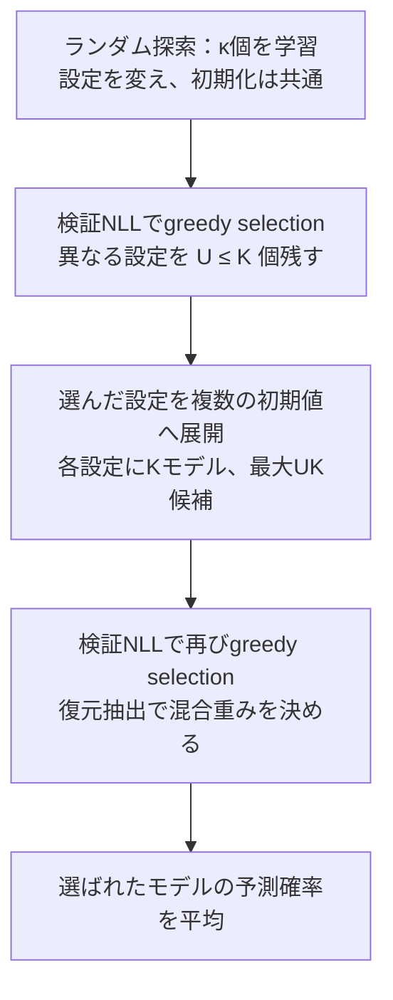
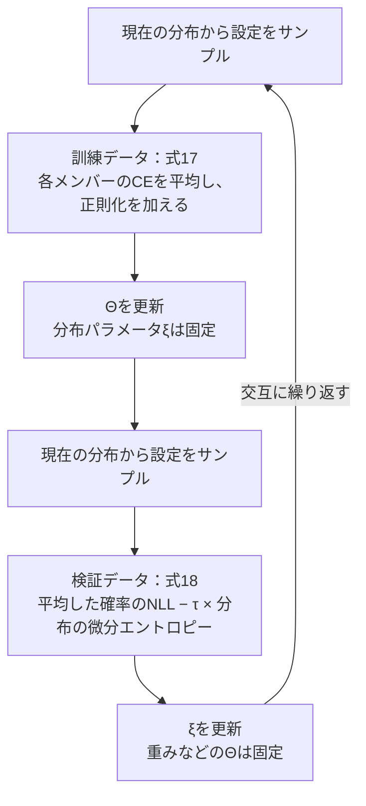

## 1. はじめに

ハイパーパラメータ探索では、いくつもの設定でモデルを学習し、検証性能が最も高いものを選ぶ。最終的に欲しいのは一つのモデルなので、選ばれなかった学習結果は捨てられがちである。

しかし、単体で二番手のモデルは、最良モデルとほとんど同じ入力で間違えるかもしれない。一方、単体では三番手のモデルが、最良モデルの苦手な入力に強いこともある。複数モデルを使うのであれば、「それぞれがどれだけ良いか」と「組み合わせたときにどれだけ良いか」は、別の問題になる。

今回取り上げるのは、Wenzel らが NeurIPS 2020 で発表した *Hyperparameter Ensembles for Robustness and Uncertainty Quantification* である。[^paper]

@[card](https://arxiv.org/abs/2006.13570)

この論文は、ハイパーパラメータ探索で生じるモデルの違いを、予測の多様性として利用する。異なる初期値から学習する **Deep ensemble**[^deep-ensembles] に対し、初期値だけでなく、正則化の強さや dropout 率なども変えたモデルを組み合わせる。

提案は二つある。一つ目の **Hyper-deep ensemble** は、十分な予算がある場合に、異なる設定・異なる初期値で学習したモデルから良い組み合わせを選ぶ方法である。二つ目の **Hyper-batch ensemble** は、重みの大部分を共有しながら、各メンバーのハイパーパラメータも学習する方法である。

前者が「既に学習したモデルをどう選ぶか」を扱うのに対し、後者は「組み合わせることを前提に、モデルと設定をどう育てるか」まで踏み込んでいる。

中心となる問いは、**「一番良い設定を見つけることと、一番良い予測を作ることは、本当に同じか」** である。この問いを考えるには、モデル単体の性能だけでなく、予測を平均したときに何が変わるのかを理解する必要がある。

本記事では、まず予測確率を平均する意味を数式で整理する。そのうえで Hyper-deep ensemble の選択手順と、Hyper-batch ensemble の層構造・交互最適化を導出する。最後に、精度、不確実性推定、計算コストを分けて実験を読む。

[^paper]: Florian Wenzel, Jasper Snoek, Dustin Tran, Rodolphe Jenatton, *Hyperparameter Ensembles for Robustness and Uncertainty Quantification*, NeurIPS 2020. [原論文と付録](https://arxiv.org/abs/2006.13570)。本記事の式変形、Brier score の分解、数値例は、手法を理解するために補った説明である。
[^deep-ensembles]: Balaji Lakshminarayanan, Alexander Pritzel, Charles Blundell, [*Simple and Scalable Predictive Uncertainty Estimation using Deep Ensembles*](https://arxiv.org/abs/1612.01474), NeurIPS 2017。本記事での比較対象は、同じハイパーパラメータのネットワークを異なる初期値から学習し、予測確率を平均する方法である。

---

## 2. アンサンブルは何を最適化しているのか

### 2.1 初期値の違いと、ハイパーパラメータの違い

訓練データを $\mathcal D_{\mathrm{tr}}=\{(x_n,y_n)\}_{n=1}^N$、モデルの学習パラメータを $\theta\in\mathbb R^P$、ハイパーパラメータを $\lambda\in\mathbb R^m$ とする。分類問題を考え、$y_n\in\{1,\ldots,C\}$ とする。

論文の基本的な問題設定は、固定した $\lambda$ に対して

$$
\widehat\theta(\lambda)
\in
\operatorname*{arg\,min}_{\theta}
\left[
\frac1N\sum_{n=1}^N
\ell_\lambda(f_\theta(x_n;\lambda),y_n)
+\Omega(\theta;\lambda)
\right]
\tag{1}
$$

を解くというものである。$\ell_\lambda$ はデータへの適合を測る損失、$\Omega$ は正則化項である。例えば、$\lambda$ に $L_2$ 正則化係数や dropout 率、label smoothing の強さを含める。

$L_2$ 正則化は、重みの二乗和にペナルティを与える方法である。その強さを変えることは、式(1)の正則化項 $\Omega(\theta;\lambda)$ を変えることに対応する。
label smoothing は、正解クラスに確率1を置く教師分布を、よりなだらかな分布へ変える方法である。こちらは、予測と比較する教師分布が変わるため、データへの適合を測る損失 $\ell_\lambda$ に関わる。

これらの設定を変えると、同じ訓練データから得られる予測も変わりうる。本論文では、そうして得られたモデルを単体の性能だけで評価せず、**組み合わせたときに互いの誤りを補えるか** という観点から評価する。

一方、ニューラルネットワークでは、たとえ同じ $\lambda$ を使っても、初期値や最適化の乱数によって結果が変わる。実際の学習結果を

$$
\widehat\theta(\lambda,s)
=\operatorname{Train}(\mathcal D_{\mathrm{tr}};\lambda,s)
\tag{2}
$$

と書こう。$s$ は初期化などの乱数を表す。式(1)は最適化問題の **定義** であり、式(2)が常にその大域最適解を返すと仮定しているわけではない。

Deep ensemble は、同じ設定 $\lambda_0$ で複数の $s_k$ を使う。Hyperparameter ensemble は、$\lambda_k$ の違いも利用する。

| 方法 | ハイパーパラメータ | 初期値 |
| --- | --- | --- |
| Deep ensemble | 共通 | 異なる |
| Fixed-init hyper ensemble | 異なる | 共通 |
| Hyper-deep ensemble | 異なりうる | 異なりうる |

この比較で問いたいのは、単に異なる数値を使ったかではない。異なる設定と初期値が、**互いの誤りを補える予測**を生むかどうかである。

### 2.2 平均するのは予測確率

$k$ 番目のモデルの logit を $z_k(x)\in\mathbb R^C$ とし、その予測確率を

$$
p_k(c\mid x)
=
\frac{\exp(z_{k,c}(x))}
{\sum_{j=1}^C\exp(z_{k,j}(x))}
$$

と定義する。$K$ 個を等しい重みで組み合わせる場合、最終的な予測は

$$
\overline p(c\mid x)
=\frac1K\sum_{k=1}^K p_k(c\mid x)
\tag{3}
$$

である。公式実装でも、各メンバーの log-softmax を計算してから確率の平均に対応する演算を行っている。[^implementation]

softmax は非線形なので、一般には

$$
\frac1K\sum_{k=1}^K\operatorname{softmax}(z_k)
\ne
\operatorname{softmax}\left(\frac1K\sum_{k=1}^Kz_k\right).
$$

重み平均、logit 平均、確率平均を同じ操作として扱わないことが重要である。

正解クラス $y$ に対する負の対数尤度、すなわち NLL は $-\log\overline p(y\mid x)$ である。$-\log t$ は $t>0$ で凸なので、Jensen の不等式から

$$
\begin{aligned}
\ell_{\mathrm{ens}}(x,y)
&=-\log\left(\frac1K\sum_{k=1}^Kp_k(y\mid x)\right)\\
&\le
\frac1K\sum_{k=1}^K\left[-\log p_k(y\mid x)\right]\\
&=\ell_{\mathrm{members}}(x,y)
\end{aligned}
\tag{4}
$$

となる。これは、確率を平均した予測の NLL が、構成メンバーの NLL の平均以下になるという関係である。

:::message alert
式(4)は「最良の単体モデルより必ず良い」という保証ではない。比較相手は、あくまで構成メンバーの平均損失である。精度や calibration が必ず改善することも、この式だけからは言えない。
:::

多様性の役割は、Brier score[^brier] を考えるとさらに明示的に見える。確率ベクトルを $p_k\in\mathbb R^C$、正解の one-hot ベクトルを $t\in\mathbb R^C$ とする。本記事では1例に対する Brier score を、クラス方向に二乗誤差を足した $\|p_k-t\|_2^2$ と定義する。このとき、

$$
\underbrace{\frac1K\sum_{k=1}^K\|p_k-t\|_2^2}_{\text{メンバーの平均誤差}}
=
\underbrace{\|\overline p-t\|_2^2}_{\text{アンサンブルの誤差}}
+
\underbrace{\frac1K\sum_{k=1}^K\|p_k-\overline p\|_2^2}_{\text{予測のばらつき}}.
\tag{5}
$$

左辺は各モデルの二乗誤差の平均、右辺の第1項はアンサンブルの誤差、第2項は予測のばらつきである。

:::details 式(5)の交差項はなぜ消えるのか
$p_k-t=(p_k-\overline p)+(\overline p-t)$ を代入して二乗すると、

$$
\begin{aligned}
\|p_k-t\|_2^2
&=\|p_k-\overline p\|_2^2
+\|\overline p-t\|_2^2\\
&\quad+2(p_k-\overline p)^\top(\overline p-t).
\end{aligned}
$$

これを $k$ について平均する。交差項に含まれる和は

$$
\begin{aligned}
\frac1K\sum_{k=1}^K(p_k-\overline p)
&=\frac1K\sum_{k=1}^Kp_k-\overline p\\
&=\overline p-\overline p=0
\end{aligned}
$$

なので消える。残った二つの項を整理すれば式(5)になる。
:::

式(5)は、「メンバーの平均誤差」から「予測のばらつき」を引いたものがアンサンブルの誤差になることを示している。ただし、でたらめなモデルを加えると、ばらつきと同時に平均誤差も増える。**多様性は、それだけを最大化すればよい量ではない。**

ここまでの式は、本論文の実験結果を保証する定理ではなく、異なる予測を組み合わせる意義を整理するための一般的な関係である。どの $\lambda$ が有用な多様性を生むかは、検証データを通して判断する必要がある。

[^implementation]: [公式実装 hyperbatchensemble.py](https://github.com/google/uncertainty-baselines/blob/main/baselines/cifar/hyperbatchensemble.py) の ensemble_crossentropy、train_step、tuning_step、test_step を参照。現行コードのデフォルト設定を、2020年の論文実験の設定と同一視しない。
[^brier]: Glenn W. Brier, [*Verification of Forecasts Expressed in Terms of Probability*](https://doi.org/10.1175/1520-0493%281950%29078%3C0001%3AVOFEIT%3E2.0.CO%3B2), Monthly Weather Review 78(1):1–3, 1950。式(5)の分解は、本記事で予測のばらつきの意味を説明するために展開したものである。

### 2.3 「当たる」と「確信の強さが適切」は別の評価である

例えば、二つのモデルが同じ入力を誤分類していても、一方が誤ったクラスに $0.51$、他方が $0.99$ を割り当てていれば、確信の強さはかなり違う。Accuracy は両方を一つの誤りとして数えるが、確率予測の評価では区別したい。

評価集合の大きさを $N_{\mathrm{ev}}$ とすると、NLL は

$$
\operatorname{NLL}
=-\frac1{N_{\mathrm{ev}}}
\sum_{n=1}^{N_{\mathrm{ev}}}
\log\overline p(y_n\mid x_n)
\tag{6}
$$

である。正解クラスへ極端に小さい確率を割り当てる、過信した誤りを強く罰する。ただし NLL は calibration だけの指標ではなく、予測分布全体の質を評価する。

:::details NLL と Cross-entropy は違うものなのか？
分類モデルの学習では Cross-entropy（CE）損失を使い、評価では NLL を報告することが多い。名前が違うので別の量に見えるが、**通常の one-hot 分類では、同じ予測に対する CE と NLL は一致する。**

1例の予測確率を $p_c=p(c\mid x)$、正解クラスを $y$、その one-hot ベクトルを $t$ とする。$t_y=1$、それ以外の成分は0なので、

$$
\begin{aligned}
\operatorname{CE}(t,p)
&=-\sum_{c=1}^C t_c\log p_c\\
&=-\log p_y\\
&=\operatorname{NLL}(y;p).
\end{aligned}
$$

2行目では、正解クラスの項だけが残ることを使った。ここではクラス重みや label smoothing を使わず、同じ予測確率を比べている。さらに同じ例について同じ方法で平均すれば、平均 CE と平均 NLL も一致する。式(6)では、この予測確率にアンサンブルの $\overline p$ を使っている。

では、CE損失を logit に適用する実装はどう理解すればよいのか。Logit を $z_c$ とすると、softmax による予測確率は

$$
p_c=\frac{e^{z_c}}{\sum_{j=1}^C e^{z_j}}
$$

であり、これを代入すると、

$$
\begin{aligned}
-\log p_y
&=-\log\frac{e^{z_y}}{\sum_{c=1}^C e^{z_c}}\\
&=-\log e^{z_y}+\log\sum_{c=1}^C e^{z_c}\\
&=-z_y+\log\sum_{c=1}^C e^{z_c}.
\end{aligned}
$$

つまり、logit を入力として受け取り、そこから予測確率の負の対数を計算している。PyTorch の `CrossEntropyLoss` も、通常の正解クラスを与える場合は、`LogSoftmax` の後に `NLLLoss` を適用することと同等である。[^ce-nll]

概念として、CE は**教師分布と予測分布のクロスエントロピー**、NLL は**観測データにモデルが割り当てた確率・密度の負の対数**という出発点の違いがある。例えば label smoothing で教師分布を $q$ に広げると、CE は

$$
\operatorname{CE}(q,p)=-\sum_{c=1}^C q_c\log p_c
$$

となる。正解以外のクラスの項も入るので、一般には元の正解ラベルに対する $-\log p_y$ と一致しない。これは、教師分布 $q$ に従ってラベルを考えたときの NLL の期待値として読める。

NLL は分類以外にも現れる。例えば、回帰で予測平均を $\mu(x)$ とし、観測値 $y$ が分散 $\sigma^2>0$ の Gaussian 分布に従うと仮定すると、

$$
p(y\mid x)
=\frac1{\sqrt{2\pi\sigma^2}}
\exp\left(-\frac{(y-\mu(x))^2}{2\sigma^2}\right).
$$

負の対数を取れば、

$$
\begin{aligned}
-\log p(y\mid x)
&=\frac12\log(2\pi\sigma^2)
-\log\exp\left(-\frac{(y-\mu(x))^2}{2\sigma^2}\right)\\
&=\frac12\log(2\pi\sigma^2)
+\frac{(y-\mu(x))^2}{2\sigma^2}.
\end{aligned}
$$

$\sigma^2$ を全例に共通の固定値とすれば、第1項はモデルに依存しない定数、第2項は二乗誤差の正の定数倍になる。例について平均してもこの関係は保たれるため、NLL の最小化と MSE の最小化は同等になる。分散も学習する場合は第1項も変わるので、MSE だけの最小化とは異なる。[^gaussian-nll]

この記事で区別したいのは、CE と NLL の名前だけでなく、**どの予測確率を評価しているか**である。Label smoothing を外した通常の CE を考えても、次の2量は一般に異なる。

$$
\begin{aligned}
\text{各メンバーの CE＝NLL の平均}
&=\frac1K\sum_{k=1}^K[-\log p_k(y\mid x)],\\
\text{平均予測の CE＝NLL}
&=-\log\left(\frac1K\sum_{k=1}^Kp_k(y\mid x)\right).
\end{aligned}
$$

前者は各メンバーの予測を評価し、後者は組み合わせた予測を評価する。**平均と log を取る順序が違う**のであり、この関係は式(4)で見たものである。
:::

Calibration は、例えば「確信度 $0.8$ とした予測が、集団として約80%正しいか」という整合性を指す。論文では Expected Calibration Error（ECE）[^calibration]も使う。

予測クラス $\widehat y_n=\arg\max_c\overline p(c\mid x_n)$ と確信度 $\widehat c_n=\max_c\overline p(c\mid x_n)$ を定義し、確信度に応じて評価例をビン $B_1,\ldots,B_L$ に分けると、

$$
\begin{aligned}
\operatorname{acc}(B_l)
&=\frac1{|B_l|}\sum_{n\in B_l}
\mathbf1[\widehat y_n=y_n],\\
\operatorname{conf}(B_l)
&=\frac1{|B_l|}\sum_{n\in B_l}\widehat c_n,\\
\operatorname{ECE}
&=\sum_{l:\,|B_l|>0}
\frac{|B_l|}{N_{\mathrm{ev}}}
\left|\operatorname{acc}(B_l)-\operatorname{conf}(B_l)\right|.
\end{aligned}
\tag{7}
$$

ECE はビン分けや標本数の影響を受ける。また、常に控えめな確率を返せば、識別能力が高くなくても calibration だけは良い場合がある。そのため、Accuracy・NLL・ECE を並べて読む。

さらに、訓練時と異なる分布に対して適切な不確実性を示せるかは、通常のテスト精度とは別の問いである。後半では、画像の破損に対する頑健性と、別データセットを未知の入力として見分ける能力も区別する。

[^calibration]: Chuan Guo, Geoff Pleiss, Yu Sun, Kilian Q. Weinberger, [*On Calibration of Modern Neural Networks*](https://proceedings.mlr.press/v70/guo17a.html), ICML 2017, Section 2。確信度と正解率の対応、およびビンごとの差を集計する ECE の説明を参照。

[^ce-nll]: PyTorch 公式ドキュメント：[CrossEntropyLoss](https://docs.pytorch.org/docs/2.14/generated/torch.nn.CrossEntropyLoss.html)、[NLLLoss](https://docs.pytorch.org/docs/2.14/generated/torch.nn.NLLLoss.html)。前者は logit を受け取り、通常の正解クラスに対しては `LogSoftmax` と `NLLLoss` の組み合わせに相当する。後者は対数確率を入力として受け取る。教師分布を与える場合の CE と label smoothing の定義も前者を参照。

[^gaussian-nll]: PyTorch 公式ドキュメント：[GaussianNLLLoss](https://docs.pytorch.org/docs/2.14/generated/torch.nn.GaussianNLLLoss.html)。上の式は Gaussian 密度から直接導いた、定数項も含む NLL である。同実装では既定で定数項 $\tfrac12\log(2\pi)$ を省き、`full=True` で含める。

---

## 3. Hyper-deep ensemble：良い設定より、良い組み合わせを選ぶ

### 3.1 二種類の多様性を探索する

モデルを「ハイパーパラメータ」と「初期値」の二つの軸に並べてみる。

*Fig.1：原論文 Figure 2 左を転載。横方向がハイパーパラメータ、縦方向が初期化の違いを表す。Deep ensemble は列、Fixed-init hyper ensemble は行を使い、Hyper-deep ensemble は両方向へ広がる候補を使う。出典：Wenzel ら[^paper]。*

同じ列にあるモデルは、共通の設定を使うが初期値が違う。同じ行にあるモデルは、初期値を固定したまま設定が違う。Hyper-deep ensemble が使うのは、その両方が異なりうる候補集合である。

ここで、すべての設定をすべての seed で学習すれば、予算は簡単に膨れ上がる。論文は、まず少数の有望な設定を**組み合わせとして**選び、それらだけを複数の初期値へ展開する。

この「組み合わせとして」が重要になる。単体の検証スコア上位を拾うだけでは、同じ弱点を持つモデルばかりが残る可能性がある。

### 3.2 Greedy selection は何を見ているのか

論文で使う greedy selection は、Caruana らの ensemble selection[^ensemble-selection] に基づく。候補を単体の順位で並べて上から取るのではなく、一つ加えるたびにアンサンブルとして評価し直す。

学習済みの候補集合を $\mathcal M$、選択済みのメンバーを多重集合[^multiset] $\mathcal E_t$ とする。$t$ は選択回数であり、異なるモデルの数とは限らない。

現在の予測が $\overline p_t$ のとき、候補 $j$ を一つ追加した予測は

$$
\overline p_{t+1}^{(j)}(c\mid x)
=
\frac{t\,\overline p_t(c\mid x)+p_j(c\mid x)}{t+1}.
\tag{8}
$$

これは、それまで選んだ $t$ 個分の確率の和に、新しい候補を一つ分足して平均し直したものである。

Greedy selection は、検証集合 $\mathcal D_{\mathrm{val}}$ 上の

$$
j^\star
=
\operatorname*{arg\,min}_{j\in\mathcal M}
\left[
-\frac1{N_{\mathrm{val}}}
\sum_{n=1}^{N_{\mathrm{val}}}
\log
\overline p_{t+1}^{(j)}(y_n\mid x_n)
\right]
\tag{9}
$$

を選ぶ。最初の1個は、単体の検証 NLL が最小の候補になる。その後は、**いまあるアンサンブルへ追加したときの NLL**を比較する。

違いを見るため、検証例が二つだけの人工的な例を考える。表の値は、それぞれの例の正解クラスに割り当てた確率であり、論文の実験値ではない。

| 候補 | 例1の正解確率 | 例2の正解確率 | 単体 NLL |
| --- | ---: | ---: | ---: |
| A | 0.90 | 0.30 | 0.655 |
| B | 0.85 | 0.30 | 0.683 |
| C | 0.40 | 0.60 | 0.714 |

例えば A の NLL は

$$
-\frac12(\log0.90+\log0.30)
=-\frac12\log0.27
\approx0.655.
$$

単体の順位は A、B、C の順である。しかし、A と B を平均すると正解確率は $(0.875,0.30)$ であり、

$$
\operatorname{NLL}(A+B)
=-\frac12\log(0.875\times0.30)
\approx0.669.
$$

一方、A と C なら $(0.65,0.45)$ となり、

$$
\operatorname{NLL}(A+C)
=-\frac12\log(0.65\times0.45)
\approx0.615.
$$

C は単体では B より悪いが、A の苦手な例2を補う。したがって、NLL を基準にした greedy selection は C を選ぶ。上位2個の単体モデルを取る操作とは結果が異なる。

この関係を、二つの例の正解確率を座標にして描いたものが Fig.2 である。$q_1=p(y_1\mid x_1)$、$q_2=p(y_2\mid x_2)$ と置くと、2例の平均 NLL は $-\tfrac12\log(q_1q_2)$ になる。同じ NLL を持つ点は $q_1q_2=\mathrm{const.}$ の曲線上にあり、右上へ進むほど損失は小さい。ここで二つの軸は**異なる入力の正解確率**なので、$q_1+q_2=1$ という制約はない。

*Fig.2：本文の人工的な3候補を可視化した図。丸は単体モデル、ひし形は2モデルの確率平均、灰色の曲線は平均 NLL の等高線。平均した予測は、二つの単体予測を結ぶ線分の中点に来る。*

A と B は近くにあるため、その中点もほとんど動かない。一方、A と C の中点は、例1の確率を少し譲る代わりに、例2の低い確率を引き上げる。NLL の等高線で見ると、C 自身よりも、**C を加えた後の位置**に価値があることが分かる。

論文の選択は **復元抽出**、すなわち同じモデルを何度でも選べる方式である。モデル $j$ が $c_j$ 回選ばれ、総選択回数が $t=\sum_jc_j$ なら、

$$
\overline p(c\mid x)
=\sum_j\frac{c_j}{t}p_j(c\mid x).
\tag{10}
$$

同じモデルを繰り返し選ぶことは、そのモデルの混合重みを大きくすることに対応する。同一モデルの推論を実際に何度も繰り返す必要はなく、確率を $c_j/t$ 倍すればよい。

:::message
この選択は、予測の不一致そのものを最大化しているわけではない。検証 NLL を改善する範囲で、品質と相補性を同時に評価している。
:::

論文の補足アルゴリズムは、検証スコアが改善しないときに選択を止める。復元抽出を使うため、目標メンバー数 $K$ と総選択回数 $t$ は区別する必要がある。実装では、異なるモデルの数の上限を明示して管理する。

[^ensemble-selection]: Rich Caruana, Alexandru Niculescu-Mizil, Geoff Crew, Alex Ksikes, [*Ensemble Selection from Libraries of Models*](https://doi.org/10.1145/1015330.1015432), ICML 2004。[著者公開の拡張版PDF](https://www.cs.cornell.edu/~caruana/ctp/ct.papers/caruana.icml04.icdm06long.pdf)も参照できる。学習済みの候補から、評価指標に合わせて復元抽出で組み合わせを作る。
[^multiset]: 同じ要素を重複して含められ、何回含まれるかも数える集合。例えば、同じ学習済みモデル $A$ を2回、$C$ を1回選んだ $\mathcal E_3=\{A,A,C\}$ では、選択回数は3、異なるモデルは2個である。平均予測は $(2p_A+p_C)/3$ となり、$A$ の重みは $2/3$ になる。

### 3.3 有望な設定だけを複数の初期値へ展開する

Hyper-deep ensemble の構成は、次の三段階で理解できる。

1. 初期化を共通にしてランダム探索で $\kappa$ 個のモデルを学習し、greedy selection で有望な設定を選ぶ。
2. 選ばれた異なる設定それぞれを、複数の初期値で学習する。
3. できあがった候補集合に、再び greedy selection を適用する。

第1段階で残った設定数を $U\le K$ とし、各設定を $K$ 個の初期値へ展開すると、第2段階の候補は最大 $UK\le K^2$ 個になる。

> Fig.3：原論文 Algorithm 1 の処理を整理した mermaid。最初に組み合わせとして設定を絞り、その後で初期値の違いを追加する。$\kappa$ は最初の探索数、$U$ は残った異なる設定数である。

もし最初の $\kappa$ 個すべてを展開すれば $\kappa K$ 個が必要になるが、先に絞ることで、展開部分を $O(K^2)$ に抑えられる。ただし、**最初の $\kappa$ 回の学習までなくなるわけではない。** 全体としては $O(\kappa+K^2)$ 規模の学習を考える必要がある。

例えば、最初に50個を学習し、異なる5設定をそれぞれ5 seed へ展開する場合、各設定について最初の1モデルを再利用できれば、

$$
50+5(5-1)=70
$$

個の学習で候補を作れる。論文の付録では、この70個を、単純に70個のランダム探索へ使う方法とも比較している。

:::message alert
その比較では、stratification を使う方がわずかに良いものの、差は大きくなかった。少なくとも小規模な MLP / LeNet の条件では、「初期値ごとに展開する手順が常に必須」とまでは言えない。十分に多様な候補が既にあるなら、探索結果から直接アンサンブルを作る方法も有力である。
:::

候補集合には、同じ設定・異なる初期値からなる Deep ensemble も含まれる。ただし、**Deep ensemble を候補として含むことと、未知データ上で必ず上回ることは別である。** 選択は有限の検証集合に依存し、greedy selection 自体も大域最適な組み合わせを保証しない。

Hyper-deep ensemble の価値は、通常の探索を「勝者を一つ決める作業」で終わらせず、探索結果の間にある相補性まで利用する手順として整理したことにある。

---

## 4. Hyper-batch ensemble：設定の違いを、重みを共有したまま学習する

Hyper-deep ensemble では、異なるモデルをほぼ独立に保存する必要がある。より少ないパラメータで、初期値とハイパーパラメータの両方に由来する違いを表せないだろうか。

Hyper-batch ensemble は、**BatchEnsemble の共有構造**[^batchensemble]と、**Self-Tuning Network（STN）のハイパーパラメータへの応答**[^stn]を組み合わせる。

[^batchensemble]: Yeming Wen, Dustin Tran, Jimmy Ba, [*BatchEnsemble: An Alternative Approach to Efficient Ensemble and Lifelong Learning*](https://arxiv.org/abs/2002.06715), ICLR 2020。共有行列とメンバー固有の rank-1 因子の要素積で、各メンバーの重みを表す。
[^stn]: Matthew MacKay, Paul Vicol, Jon Lorraine, David Duvenaud, Roger Grosse, [*Self-Tuning Networks: Bilevel Optimization of Hyperparameters using Structured Best-Response Functions*](https://arxiv.org/abs/1903.03088), ICLR 2019。設定から学習済みの重みへの対応を近似し、その近似を使って設定も調整する。

### 4.1 大きな行列を共有し、小さな因子で違いを作る

入力次元を $d_{\mathrm{in}}$、出力次元を $d_{\mathrm{out}}$ とする。全結合層の重み

$$
W\in\mathbb R^{d_{\mathrm{in}}\times d_{\mathrm{out}}}
$$

を $K$ メンバーで共有し、メンバー固有のベクトル $r_k\in\mathbb R^{d_{\mathrm{in}}}$、$s_k\in\mathbb R^{d_{\mathrm{out}}}$ を用意する。BatchEnsemble の実効的な重みは

$$
W_k
=W\odot(r_ks_k^\top)
=\operatorname{diag}(r_k)W\operatorname{diag}(s_k)
\tag{11}
$$

である。$\odot$ は要素ごとの積を表す。

:::details 式(11)の導出：要素積を左右の対角行列の積に書き換える
なぜ二つの表現が等しいのか、行列の形で確認する。$\operatorname{diag}(r_k)$ は、$r_k$ の成分を対角に並べ、それ以外を0にした $d_{\mathrm{in}}\times d_{\mathrm{in}}$ 行列である。$\operatorname{diag}(s_k)$ も同様に、$d_{\mathrm{out}}\times d_{\mathrm{out}}$ の対角行列である。

$$
\begin{aligned}
&W\odot(r_ks_k^\top)\\[6pt]
&=
\begin{pmatrix}
W_{1,1}&\cdots&W_{1,d_{\mathrm{out}}}\\
\vdots&\ddots&\vdots\\
W_{d_{\mathrm{in}},1}&\cdots&W_{d_{\mathrm{in}},d_{\mathrm{out}}}
\end{pmatrix}
\odot
\begin{pmatrix}
r_{k,1}s_{k,1}&\cdots&r_{k,1}s_{k,d_{\mathrm{out}}}\\
\vdots&\ddots&\vdots\\
r_{k,d_{\mathrm{in}}}s_{k,1}&\cdots&r_{k,d_{\mathrm{in}}}s_{k,d_{\mathrm{out}}}
\end{pmatrix}\\[6pt]
&=
\begin{pmatrix}
r_{k,1}W_{1,1}s_{k,1}&\cdots&r_{k,1}W_{1,d_{\mathrm{out}}}s_{k,d_{\mathrm{out}}}\\
\vdots&\ddots&\vdots\\
r_{k,d_{\mathrm{in}}}W_{d_{\mathrm{in}},1}s_{k,1}&\cdots&r_{k,d_{\mathrm{in}}}W_{d_{\mathrm{in}},d_{\mathrm{out}}}s_{k,d_{\mathrm{out}}}
\end{pmatrix}\\[6pt]
&=
\begin{pmatrix}
r_{k,1}&&0\\
&\ddots&\\
0&&r_{k,d_{\mathrm{in}}}
\end{pmatrix}
\begin{pmatrix}
W_{1,1}s_{k,1}&\cdots&W_{1,d_{\mathrm{out}}}s_{k,d_{\mathrm{out}}}\\
\vdots&\ddots&\vdots\\
W_{d_{\mathrm{in}},1}s_{k,1}&\cdots&W_{d_{\mathrm{in}},d_{\mathrm{out}}}s_{k,d_{\mathrm{out}}}
\end{pmatrix}\\[6pt]
&=\operatorname{diag}(r_k)
\begin{pmatrix}
W_{1,1}&\cdots&W_{1,d_{\mathrm{out}}}\\
\vdots&\ddots&\vdots\\
W_{d_{\mathrm{in}},1}&\cdots&W_{d_{\mathrm{in}},d_{\mathrm{out}}}
\end{pmatrix}
\begin{pmatrix}
s_{k,1}&&0\\
&\ddots&\\
0&&s_{k,d_{\mathrm{out}}}
\end{pmatrix}\\[6pt]
&=\operatorname{diag}(r_k)W\operatorname{diag}(s_k).
\end{aligned}
$$

各行に共通する $r_k$ の倍率を左の対角行列としてくくり出し、各列に共通する $s_k$ の倍率を右の対角行列としてくくり出した。つまり、左から $\operatorname{diag}(r_k)$ を掛けると $W$ の各行が、右から $\operatorname{diag}(s_k)$ を掛けると各列が、それぞれスケールされる。
:::

入力バッチ $X\in\mathbb R^{B\times d_{\mathrm{in}}}$ に対しては、入力と出力をそれぞれスケールする形で計算できる。

:::details 式(12)の導出：行列積を入力・出力のスケーリングに書き換える
式(11)を代入し、行列積を変形する。

$$
\begin{aligned}
XW_k
&=X\operatorname{diag}(r_k)W\operatorname{diag}(s_k)\\
&=\big[X\operatorname{diag}(r_k)\big]W\operatorname{diag}(s_k).
\end{aligned}
$$

2行目は行列積の結合則を使った。ここで、$X$ の右から $\operatorname{diag}(r_k)$ を掛けると、各列、すなわち各入力特徴に $r_k$ の倍率が掛かる。

$$
X\operatorname{diag}(r_k)
=
\begin{pmatrix}
X_{1,1}r_{k,1}&\cdots&X_{1,d_{\mathrm{in}}}r_{k,d_{\mathrm{in}}}\\
\vdots&\ddots&\vdots\\
X_{B,1}r_{k,1}&\cdots&X_{B,d_{\mathrm{in}}}r_{k,d_{\mathrm{in}}}
\end{pmatrix}
=X\odot r_k^\top.
$$

ここで $X\odot r_k^\top$ は、行ベクトル $r_k^\top$ を $B$ 行に複製してから要素積を取る表記である。

同様に、$Y=(X\odot r_k^\top)W\in\mathbb R^{B\times d_{\mathrm{out}}}$ と置くと、右から $\operatorname{diag}(s_k)$ を掛ける操作は各出力特徴のスケーリングになる。

$$
Y\operatorname{diag}(s_k)
=
\begin{pmatrix}
Y_{1,1}s_{k,1}&\cdots&Y_{1,d_{\mathrm{out}}}s_{k,d_{\mathrm{out}}}\\
\vdots&\ddots&\vdots\\
Y_{B,1}s_{k,1}&\cdots&Y_{B,d_{\mathrm{out}}}s_{k,d_{\mathrm{out}}}
\end{pmatrix}
=Y\odot s_k^\top.
$$

$Y\odot s_k^\top$ も、$s_k^\top$ を $B$ 行に複製して行う要素積を表す。
:::

したがって、

$$
XW_k
=\big[(X\odot r_k^\top)W\big]\odot s_k^\top.
\tag{12}
$$

入力の各特徴を $r_k$ でスケールし、共通の $W$ を掛け、出力を $s_k$ でスケールすればよい。巨大な $W_k$ をメンバーごとに保持する必要がない。

バイアスを除いたパラメータ数は、独立した層なら $K d_{\mathrm{in}}d_{\mathrm{out}}$、BatchEnsemble なら

$$
d_{\mathrm{in}}d_{\mathrm{out}}
+K(d_{\mathrm{in}}+d_{\mathrm{out}})
$$

となる。

:::message alert
Rank-1 なのは変調因子 $r_ks_k^\top$ であり、実効重み $W_k$ 自体が rank-1 なのではない。また、バッチを拡張して並列に計算できることは、単体モデルと同じ計算量で $K$ 個の予測が得られることを意味しない。
:::

次に、ハイパーパラメータを変えたときの応答を組み込む。通常は、$\lambda$ を変えるたびに学習し直して $\widehat\theta(\lambda)$ を求める。STN は、この対応、すなわち **best-response function** を一つのネットワークで近似する。

全結合層での表現は

$$
W(\lambda)=W+\Delta\odot e(\lambda)^\top.
\tag{13}
$$

$\Delta$ は $W$ と同じ形の行列、$e(\lambda)\in\mathbb R^{d_{\mathrm{out}}}$ は学習可能な埋め込みである。第 $j$ 列は

$$
W_{:,j}(\lambda)=W_{:,j}+\Delta_{:,j}e_j(\lambda)
$$

と変化する。つまり、ハイパーパラメータに応じて、重みの列方向の変化を表現している。

これは、任意の設定で再学習したモデルを完全に再現するという意味ではない。学習中に訪れる設定の近くで、モデルがどう変わるかを近似するという設計である。$e$ は線形写像にもできるが、本論文の小規模実験では非線形な埋め込みも使われている。

式(11)と式(13)を組み合わせた Hyper-batch ensemble の層は、

$$
\boxed{
W_k(\lambda_k)
=
W\odot(r_ks_k^\top)
+
\big[\Delta\odot(u_kv_k^\top)\big]
\odot e(\lambda_k)^\top
}
\tag{14}
$$

となる。$u_k\in\mathbb R^{d_{\mathrm{in}}}$、$v_k\in\mathbb R^{d_{\mathrm{out}}}$ は、応答側のメンバー固有ベクトルである。バイアスも

$$
b_k(\lambda_k)
=b_k+\delta_k\odot e_b(\lambda_k)
$$

とする。ここでは、バイアス用の別の埋め込みを $e_b$ と書いた。

第1項がメンバーごとの基準となる重み、第2項がそのメンバーの設定変化への応答を担う。行列 $W$ と $\Delta$ は共有しながら、二つの小さな変調因子でメンバー間の違いを残す。

:::details Hyper-batch の計算も、共有行列と要素積に分けられる
式(14)の第2項にも式(11)の行列の変形を適用し、埋め込みによる列のスケーリングを対角行列で表すと、

$$
\begin{aligned}
&\big[\Delta\odot(u_kv_k^\top)\big]\odot e(\lambda_k)^\top\\
&=\operatorname{diag}(u_k)\Delta
\operatorname{diag}(v_k)\operatorname{diag}(e(\lambda_k)).
\end{aligned}
$$

$\operatorname{diag}(u_k)$ は $d_{\mathrm{in}}\times d_{\mathrm{in}}$、右側の二つの対角行列はともに $d_{\mathrm{out}}\times d_{\mathrm{out}}$ である。この二つの列の倍率は、次のように一つの対角行列にまとめられる。

$$
\begin{aligned}
&\operatorname{diag}(v_k)\operatorname{diag}(e(\lambda_k))\\[6pt]
&=
\begin{pmatrix}
v_{k,1}&&0\\
&\ddots&\\
0&&v_{k,d_{\mathrm{out}}}
\end{pmatrix}
\begin{pmatrix}
e_1(\lambda_k)&&0\\
&\ddots&\\
0&&e_{d_{\mathrm{out}}}(\lambda_k)
\end{pmatrix}\\[6pt]
&=
\begin{pmatrix}
v_{k,1}e_1(\lambda_k)&&0\\
&\ddots&\\
0&&v_{k,d_{\mathrm{out}}}e_{d_{\mathrm{out}}}(\lambda_k)
\end{pmatrix}\\[6pt]
&=\operatorname{diag}\big(v_k\odot e(\lambda_k)\big).
\end{aligned}
$$

したがって、式(14)全体を行列積で書くと、

$$
\begin{aligned}
W_k(\lambda_k)
&=\operatorname{diag}(r_k)W\operatorname{diag}(s_k)\\
&\quad+\operatorname{diag}(u_k)\Delta
\operatorname{diag}\big(v_k\odot e(\lambda_k)\big).
\end{aligned}
$$

入力バッチ $X\in\mathbb R^{B\times d_{\mathrm{in}}}$ を左から掛け、行列積の分配則と結合則を使えば、

$$
\begin{aligned}
XW_k(\lambda_k)
&=X\operatorname{diag}(r_k)W\operatorname{diag}(s_k)\\
&\quad+X\operatorname{diag}(u_k)\Delta
\operatorname{diag}\big(v_k\odot e(\lambda_k)\big)\\[4pt]
&=\big[(X\operatorname{diag}(r_k))W\big]\operatorname{diag}(s_k)\\
&\quad+\big[(X\operatorname{diag}(u_k))\Delta\big]
\operatorname{diag}\big(v_k\odot e(\lambda_k)\big).
\end{aligned}
$$

式(12)と同様に、$X\operatorname{diag}(r_k)$ と $X\operatorname{diag}(u_k)$ は入力の各列をスケールする要素積に書き換えられる。その後に右から掛ける対角行列も、出力の各列をスケールする要素積に書き換えられるので、

$$
\begin{aligned}
XW_k(\lambda_k)
&=\big[(X\odot r_k^\top)W\big]\odot s_k^\top\\
&\quad+
\big[(X\odot u_k^\top)\Delta\big]
\odot[v_k\odot e(\lambda_k)]^\top.
\end{aligned}
\tag{15}
$$

ハイパーパラメータがバッチ内の例ごとに異なる場合も、各行に対応する埋め込みを配置して同じ発想で計算できる。

埋め込みとバイアスを除いたパラメータ数は

$$
2d_{\mathrm{in}}d_{\mathrm{out}}
+2K(d_{\mathrm{in}}+d_{\mathrm{out}})
$$

となる。BatchEnsemble に対して大きな行列が一つ増えるため、主要なパラメータ量はおよそ2倍になる。独立した $K$ 個のモデルを学習する場合とは、重みの共有度が異なる。
:::

### 4.2 メンバーを育てる目的と、設定を選ぶ目的を分ける

各メンバー $k$ に、ハイパーパラメータの分布 $q_k(\lambda_k;\xi_k)$ を一つずつ割り当てる。$\lambda_k$ は実際にモデルへ与える設定ベクトル、$\xi_k$ は**その設定をどの範囲から引くかを決める、学習可能な分布パラメータ**である。

本論文では、$\xi_k$ が各ハイパーパラメータの分布の下限・上限を持つ。これを更新することで、**どの範囲の設定を重点的に試すか**を、範囲の位置と幅を変える形で調整する。$\xi_k$ は検証データ上でアンサンブル全体を評価する目的関数に従って、勾配で更新する。

全メンバーの設定を $\Lambda=(\lambda_1,\ldots,\lambda_K)$、分布パラメータを $\xi=(\xi_1,\ldots,\xi_K)$ とまとめると、論文が使う分布は

$$
q_\xi(\Lambda)
=\prod_{k=1}^Kq_k(\lambda_k;\xi_k).
\tag{16}
$$

:::details 式(16)の意味：どこから設定を引き、なぜ分布を掛けるのか
式(14)は、設定 $\lambda_k$ に応じて各メンバーの重みを作る仕組みを示した。次に必要なのは、**どんな設定 $\lambda_k$ を使うか**を決めることである。Hyper-batch ensemble では、各メンバーが設定の分布を持ち、そこから使う設定をサンプリングする。

一つの $\lambda_k\in\mathbb R^m$ は、dropout 率や $L_2$ 正則化係数などをまとめた設定ベクトルであり、$q_k(\lambda_k;\xi_k)$ はその確率密度を表す。

1回のサンプリングでは、各分布から設定を一つずつ引き、それらをまとめる。

$$
\begin{aligned}
&\lambda_k\sim q_k(\cdot;\xi_k),\qquad k=1,\ldots,K,\\
&\Lambda=(\lambda_1,\ldots,\lambda_K).
\end{aligned}
$$

この手順をまとめた表記が $\Lambda\sim q_\xi$ である。したがって $q_\xi$ は、**全メンバーの設定の組に対する同時確率密度**を表す。

積になるのは、$\xi$ を固定したもとで、メンバーごとの設定を独立にサンプリングする設計だからである。2メンバーなら、

$$
\begin{aligned}
q_\xi(\lambda_1,\lambda_2)
&=q_1(\lambda_1;\xi_1)\,q_\xi(\lambda_2\mid\lambda_1)\\
&=q_1(\lambda_1;\xi_1)\,q_2(\lambda_2;\xi_2).
\end{aligned}
$$

1行目は同時密度を周辺密度と条件付き密度に分けたもの、2行目は独立性を使ったものである。これを $K$ メンバーへ広げると式(16)になる。**独立性は設定のサンプリングに置いた仮定**である。各モデルの重みは共有され、各 $\xi_k$ も式(18)のアンサンブル全体の目的関数を通して調整される。

では、最初の分布はどこから来るのか。**探索するハイパーパラメータと、その許容範囲は、実験者が事前に指定する。** 例えば、論文の MLP・LeNet 実験では次の範囲を使っている。

- dropout 率：$[10^{-3},\,0.9]$
- $L_2$ 正則化係数：$[10^{-3},\,10^3]$

基本は、その範囲全体を使った log-uniform 分布で初期化する。[^hyperbatch-range-init] 以後は式(18)で各メンバーの分布の上下限 $\xi_k$ を更新し、現在の分布から設定を引く。つまり、**探索領域の大枠は人が決め、その中で各メンバーの分布の位置と幅を学習する。** Log-uniform の密度と、上下限に微分を通す方法は[4.3節](#43-設定を一点ではなく範囲として学習する)で導く。
:::

[^hyperbatch-range-init]: [原論文の付録C.1](https://arxiv.org/pdf/2006.13570#page=17)に MLP・LeNet の探索範囲が記載されている。[付録D.1](https://arxiv.org/pdf/2006.13570#page=25)では、通常は指定範囲全体の log-uniform 分布から始めると説明している。ResNet 実験では安定性のため $L_2$ 係数の初期範囲を1桁狭める一方、クリッピング用の元の範囲は維持している。

一方、共有行列、変調ベクトル、バイアス、埋め込みの学習パラメータをまとめて $\Theta$ とする。$k$ 番目のモデルの予測確率を $p_{\Theta,k}(c\mid x,\lambda_k)$ と書く。

**訓練ステップ**では、分布パラメータ $\xi$ を固定して、訓練データ上の目的関数

$$
\begin{aligned}
J_{\mathrm{tr}}(\Theta;\xi)
&=
\underbrace{
\mathbb E_{\substack{(x,y)\sim\mathcal D_{\mathrm{tr}}\\
\Lambda\sim q_\xi}}
\left[
\underbrace{
\frac1K\sum_{k=1}^K
\ell_{\lambda_k}(p_{\Theta,k}(\cdot\mid x,\lambda_k),y)
}_{\text{各メンバーの訓練損失の平均}}
+\underbrace{\Omega(\Theta;\Lambda)}_{\text{正則化}}
\right]
}_{\text{訓練データと設定の組で平均}}
\end{aligned}
\tag{17}
$$

を小さくするように $\Theta$ を更新する。本論文の実験では、データ項に**各メンバーの cross-entropy の平均**を採用している。Label smoothing を使う場合は、そのメンバーの $\lambda_k$ によって訓練ラベルの扱いも変わる。

**設定調整ステップ**では、$\Theta$ を固定し、検証データ上の

$$
\begin{aligned}
J_{\mathrm{val}}(\xi;\Theta)
&=
\underbrace{
\mathbb E_{\substack{(x,y)\sim\mathcal D_{\mathrm{val}}\\
\Lambda\sim q_\xi}}
\left[
\underbrace{
-\log\left(
\frac1K\sum_{k=1}^Kp_{\Theta,k}(y\mid x,\lambda_k)
\right)
}_{\text{平均予測の NLL}}
\right]
}_{\text{検証データと設定の組で平均}}\\
&\quad-\underbrace{\tau\mathcal H[q_\xi]}_{\text{設定分布の広がりへの報酬}}
\end{aligned}
\tag{18}
$$

を小さくするように $\xi$ を更新する。データ項は、**確率を平均したアンサンブル全体の NLL**である。$\tau\ge0$ は、設定分布の**微分エントロピー** $\mathcal H[q_\xi]$ をどれだけ保つかを調整する係数である。微分エントロピーは、連続分布の確率密度から計算するエントロピーであり、具体的な計算は4.3節で示す。

式(17)と式(18)は、データの分割が違うだけではない。何を良い予測と見なすかも異なる。

訓練ステップでは、各メンバーの予測からそれぞれ損失を計算し、その平均と正則化を一つの目的関数として $\Theta$ を更新する。共有パラメータには複数メンバーの損失から勾配が集まるため、各メンバーの損失を独立に最小化しているわけではない。設定調整ステップでは、予測確率を平均してから NLL を計算し、アンサンブル全体の予測を評価して $\xi$ を更新する。

実際の最適化は、訓練データで $\Theta$ を更新し、検証データで $\xi$ を更新することを交互に繰り返す。設定を変えたときの予測の変化は、式(14)の応答を通して微分できる。

> Fig.4：Hyper-batch ensemble の更新対象と目的関数を整理したmermaid。$\Theta$ は共有行列・変調因子・埋め込みなど、$\xi$ は設定分布のパラメータ。1回ずつの更新を描いた模式図であり、更新回数の比率まで固定するものではない。

Fig.4 で区別したいのは、訓練側では**損失を平均**し、検証側では**確率を平均してから損失を計算**する点である。$\xi$ を更新するときに $\Theta$ を固定しても、設定 $\lambda_k$ が変われば式(14)を通して実効重みと予測は変わる。この経路があるため、固定したネットワークの中を通して、設定分布の側へ勾配を返せる。

これは、設定を変えるたびに訓練を最初から収束までやり直す方法とは異なる。**近似した best response を学びながら、その近傍で設定分布を更新していく**手順である。内側の非凸最適化を毎回厳密に解く保証はない。

:::message
訓練では各メンバーの損失を計算してから平均し、設定調整では各メンバーの予測確率を平均してから NLL を計算する。この二つの集約方法を使い分け、学習パラメータ $\Theta$ と設定分布のパラメータ $\xi$ を交互に更新することが、ここで説明した Hyper-batch ensemble の設計である。
:::

### 4.3 設定を一点ではなく、範囲として学習する

論文では、正で有界なハイパーパラメータに対し、各座標を独立な log-uniform 分布で表す。まず1メンバー・1座標に絞り、$0<a<b$ を下限・上限とすると、

$$
q(\lambda;a,b)
=
\frac1{\lambda\log(b/a)},
\qquad a\le\lambda\le b.
\tag{22}
$$

通常の一様分布は $\lambda$ の差を均等に扱う。Log-uniform は $\log\lambda$ の差を均等に扱うので、桁をまたぐ正則化係数のような変数に適している。

$u\sim\operatorname{Uniform}(0,1)$ を使い、

$$
\lambda
=
\exp\left((1-u)\log a+u\log b\right)
\tag{23}
$$

とすれば、この分布からサンプリングできる。

:::details 密度の確認と、上下限を学習するための微分
$z=(1-u)\log a+u\log b$ は $[\log a,\log b]$ 上の一様分布に従う。$\lambda=\exp z$、$z=\log\lambda$ なので、変数変換から

$$
\begin{aligned}
q(\lambda)
&=q_z(\log\lambda)\left|\frac{d\log\lambda}{d\lambda}\right|\\
&=\frac1{\log b-\log a}\frac1\lambda,
\end{aligned}
$$

となり、式(22)が得られる。

ここで学習したいのは、**設定分布の下限と上限**である。下限 $a$ と上限 $b$ は、分布パラメータ $\xi$ を構成する。式(18)で検証損失を下げる方向へ上下限を動かすには、損失の上下限に対する勾配が必要になる。同じ乱数 $u$ を使っても、$a,b$ を変えると式(23)から作られる設定 $\lambda$ が変わり、それに応じて予測と検証損失も変わる。この経路を通して、上下限へ勾配を返す。

以下では、微分を見やすくするために $\alpha=\log a$、$\beta=\log b$ と置く。これは同じ上下限を対数座標で表す、計算上の変数の置き換えである。式(23)は

$$
\lambda=\exp\bigl((1-u)\alpha+u\beta\bigr)
$$

となる。乱数 $u$ を固定すると、

$$
\begin{aligned}
\frac{\partial\lambda}{\partial\alpha}
&=\exp\bigl((1-u)\alpha+u\beta\bigr)(1-u)
=(1-u)\lambda,\\
\frac{\partial\lambda}{\partial\beta}
&=\exp\bigl((1-u)\alpha+u\beta\bigr)u
=u\lambda.
\end{aligned}
$$

したがって、$\Theta$ を固定した検証損失の $\alpha,\beta$ に対する勾配は、連鎖律から

$$
\begin{aligned}
\frac{\partial\ell_{\mathrm{ens}}}{\partial\alpha}
&=\frac{\partial\ell_{\mathrm{ens}}}{\partial\lambda}
\frac{\partial\lambda}{\partial\alpha}
=\frac{\partial\ell_{\mathrm{ens}}}{\partial\lambda}
(1-u)\lambda,\\
\frac{\partial\ell_{\mathrm{ens}}}{\partial\beta}
&=\frac{\partial\ell_{\mathrm{ens}}}{\partial\lambda}
\frac{\partial\lambda}{\partial\beta}
=\frac{\partial\ell_{\mathrm{ens}}}{\partial\lambda}
u\lambda.
\end{aligned}
$$

と計算できる。これにより、検証損失が下がる方向へ上下限を更新できる。式(18)全体を最小化するときには、エントロピー項の勾配も加えて更新する。乱数 $u$ 自体の分布は固定し、サンプルを作る変換の側へ微分を通すのが、再パラメータ化の考え方である。
:::

一つの $\lambda_k$ が $m$ 次元なら、学習するのは $2m$ 個の上下限である。$K$ メンバー全体では $2mK$ 個になる。範囲の順序と、dropout 率など各変数の許容範囲は維持する必要がある。特に、式(22)の下限をそのままゼロにすることはできない。

次に、設定 $\lambda\sim q$ に対する**微分エントロピー**を計算する。これは、$q$ から設定を引いたときの $-\log q(\lambda)$ の期待値である。

$$
\begin{aligned}
\mathcal H[q]
&=-\int_a^b q(\lambda)\log q(\lambda)\,d\lambda\\
&=-\mathbb E_{\lambda\sim q}[\log q(\lambda)]\\
&=\mathbb E_{\lambda\sim q}\left[
\log\bigl(\lambda\log(b/a)\bigr)
\right]\\
&=\mathbb E_{\lambda\sim q}[\log\lambda]
+\log\bigl(\log(b/a)\bigr)\\
&=\frac{\log a+\log b}{2}
+\log\bigl(\log(b/a)\bigr).
\end{aligned}
\tag{24}
$$

式(22)の密度を代入した。$a,b$ を固定すると $\log\bigl(\log(b/a)\bigr)$ は $\lambda$ に依存しないので、期待値の外へ出せる。最後の等号では、$\log\lambda$ が一様分布なので、その平均が区間の中点になることを使った。

離散エントロピーは各事象の確率から計算するが、ここでの $q(\lambda)$ は**確率密度**である。密度は $1$ を超えることもあるので、微分エントロピーは負にもなる。

メンバーと座標について独立な分布を使っているので、全体の微分エントロピーは各座標の和になる。$q_{kj}$ をメンバー $k$ の第 $j$ 座標の分布と書けば、

$$
\mathcal H[q_\xi]
=\sum_{k=1}^K\sum_{j=1}^m\mathcal H[q_{kj}].
$$

式(18)ではこの量を引いているため、$\tau>0$ のとき、NLL が同じなら微分エントロピーが大きい分布を好む。上下限が正の一点へ近づくと微分エントロピーは $-\infty$ へ向かうので、範囲がつぶれることを抑える方向に働く。離散分布が一つの事象に確率 $1$ を割り当てたとき、エントロピーが $0$ になることとは異なる。

ただし、これは**ハイパーパラメータ分布の微分エントロピー**である。分類ラベルの予測エントロピーでも、メンバー同士の距離でもない。全メンバーが同じ広い範囲を持っていても、各分布の微分エントロピーは大きくできる。異なるメンバーの中心を直接引き離す項ではない。

*Fig.5：原論文 Figure 2 右を転載。CIFAR-100 の MLP で、ある $L_2$ 正則化係数を調整した例。横軸は epoch、縦軸は $\log_{10}\lambda$。色は3メンバー、線は分布の平均、陰影は学習中の下限・上限を示す。陰影は信頼区間ではない。出典：Wenzel ら[^paper]。*

Fig.5 では、実際に異なる範囲へ分かれていく様子が見える。ただしこれは一つの学習例であり、必ずこのように分化するという保証ではない。

また、予測時には各分布から無数の設定をサンプルするのではなく、各メンバーの**平均設定**を使う。その平均は

$$
\begin{aligned}
\lambda^{\mathrm{mean}}
&=\int_a^b\lambda\,q(\lambda;a,b)\,d\lambda\\
&=\int_a^b\lambda\,\frac1{\lambda\log(b/a)}\,d\lambda\\
&=\frac1{\log(b/a)}\int_a^b1\,d\lambda\\
&=\frac{b-a}{\log b-\log a}.
\end{aligned}
\tag{25}
$$

$\sqrt{ab}$ は log 空間の中心を元の座標へ戻した値であり、中央値に対応する。式(25)の平均とは異なる。

訓練・設定調整では分布を使い、推論ではメンバーごとの平均設定へ置き換える。一般に

$$
p_{\Theta,k}(\cdot\mid x,\mathbb E[\lambda_k])
\ne
\mathbb E_{\lambda_k}
[p_{\Theta,k}(\cdot\mid x,\lambda_k)]
$$

なので、これはハイパーパラメータについて厳密に周辺化した予測ではない。

最後に、設定をバッチ内で変えると、$L_2$ 正則化も設定依存の重みに対して計算する必要がある。各例について大きな重み行列を実体化しては、せっかくの共有構造が活きない。付録では、二乗を展開して少数の集計量へまとめる計算が示されている。

:::details 設定依存の L2 正則化を、三種類の集計量へまとめる
この計算の目的は、**各設定の大きな重み行列を作らずに、バッチ全体の正則化を計算すること**である。鍵になるのは、重みの二乗を展開すると「基準の二乗・交差項・応答の二乗」の三項になることだ。原論文付録の計算を、重み行列の一列に絞って順に確認する。

まず、式(14)のうち、設定によらない二つの行列を

$$
\begin{aligned}
A_k&=W\odot(r_ks_k^\top),\\
D_k&=\Delta\odot(u_kv_k^\top)
\end{aligned}
$$

と置く。どちらも $d_{\mathrm{in}}\times d_{\mathrm{out}}$ の行列で、$A_k$ は基準の重み、$D_k$ は設定に応じた変化の方向を表す。

メンバー $k$ のバッチに $B$ 個の例があり、例 $i$ で使う設定を $\lambda_{ki}$ とする。$e_{ki}=e(\lambda_{ki})\in\mathbb R^{d_{\mathrm{out}}}$ と置くと、実効重みは

$$
W_k(\lambda_{ki})=A_k+D_k\operatorname{diag}(e_{ki}).
$$

つまり、設定が変わると、$D_k$ の各列に掛ける倍率 $e_{ki,j}$ が変わる。設定 $\lambda_{ki}$ に含まれる、この層の $L_2$ 正則化係数を $\nu_{ki}$ とすると、計算したい量は

$$
R=\frac1{BK}\sum_{k=1}^K\sum_{i=1}^B
\nu_{ki}\|W_k(\lambda_{ki})\|_F^2
$$

である。$\|W\|_F^2$ は行列の全成分の二乗和なので、各列ベクトルの二乗ノルムを足しても計算できる。

ここで、**メンバー $k$ と出力列 $j$ を一つずつ固定する**。記号を短くするため、その列の基準と応答を $\mathbf a=A_{k,:,j}$、$\mathbf d=D_{k,:,j}$、例ごとの倍率と正則化係数を $e_i=e_{ki,j}$、$\nu_i=\nu_{ki}$ と書く。$\mathbf a,\mathbf d\in\mathbb R^{d_{\mathrm{in}}}$ は、バッチの例 $i$ によらない固定の列ベクトルである。この列の重みは $\mathbf a+e_i\mathbf d$ なので、二乗ノルムは

$$
\begin{aligned}
\|\mathbf a+e_i\mathbf d\|_2^2
&=(\mathbf a+e_i\mathbf d)^\top(\mathbf a+e_i\mathbf d)\\
&=\|\mathbf a\|_2^2
+2e_i\mathbf a^\top\mathbf d
+e_i^2\|\mathbf d\|_2^2.
\end{aligned}
$$

この三項に係数 $\nu_i$ を掛け、バッチ内で平均したものを $R_{kj}$ とする。$\mathbf a,\mathbf d$ を平均の外へ出すと、

$$
\begin{aligned}
R_{kj}
&=\frac1B\sum_i\nu_i\|\mathbf a+e_i\mathbf d\|_2^2\\
&=\frac1B\sum_i\left[
\nu_i\|\mathbf a\|_2^2
+2\nu_i e_i\mathbf a^\top\mathbf d
+\nu_i e_i^2\|\mathbf d\|_2^2
\right]\\
&=\|\mathbf a\|_2^2\left(\frac1B\sum_i\nu_i\right)
+2\mathbf a^\top\mathbf d\left(\frac1B\sum_i\nu_i e_i\right)\\
&\quad+\|\mathbf d\|_2^2\left(\frac1B\sum_i\nu_i e_i^2\right).
\end{aligned}
$$

設定ごとに変わる量は、最後の式の三つの括弧へまとまった。元の添字へ戻し、それぞれに名前を付ける。

| 集計量 | バッチ内で平均する量 | 二乗の展開で対応する項 |
| --- | --- | --- |
| $m_{0,k}=\frac1B\sum_i\nu_{ki}$ | 正則化係数 | 基準の二乗 |
| $m_{1,kj}=\frac1B\sum_i\nu_{ki}e_{ki,j}$ | 正則化係数 × 応答の倍率 | 交差項 |
| $m_{2,kj}=\frac1B\sum_i\nu_{ki}e_{ki,j}^2$ | 正則化係数 × 応答の倍率の二乗 | 応答の二乗 |

これらを使えば、一列分の正則化は

$$
R_{kj}
=\|\mathbf a\|_2^2m_{0,k}
+2\mathbf a^\top\mathbf d\,m_{1,kj}
+\|\mathbf d\|_2^2m_{2,kj}
$$

となる。「三種類」とは、メンバーごとにスカラー $m_{0,k}$ 一つと、出力列ごとの値を持つ $d_{\mathrm{out}}$ 次元のベクトル $m_{1,k},m_{2,k}$ 二つを集計する、という意味である。

あとは列について足し、メンバーについて平均すれば $R$ に戻る。各列の二乗ノルムと内積を、行 $h=1,\ldots,d_{\mathrm{in}}$ の成分の和で書くと、

$$
\begin{aligned}
R
&=\frac1K\sum_{k=1}^K\sum_{j=1}^{d_{\mathrm{out}}}R_{kj}\\
&=\frac1K\sum_k\sum_{h,j}
\left[
A_{k,hj}^2m_{0,k}
+2A_{k,hj}D_{k,hj}m_{1,kj}
+D_{k,hj}^2m_{2,kj}
\right].
\end{aligned}
\tag{26}
$$

この形なら、例ごとの $\nu_{ki}$ と小さなベクトル $e_{ki}$ から三種類の平均を計算し、$A_k,D_k$ と組み合わせればよい。各例の $W_k(\lambda_{ki})$ を作って二乗する必要がなくなる。同じバッチに対して、二乗の展開と和の並べ替えだけを行っているので、集計による近似誤差は生じない。

また、$m_{1,kj}$ は、各例で $\nu_{ki}$ と $e_{ki,j}$ を**掛けてから平均する**量である。両方が同じ設定 $\lambda_{ki}$ に依存するので、それぞれの平均を取ってから掛けた値に置き換えることは、一般にはできない。

なお、論文の ResNet 実験では $u_k=r_k$、$v_k=s_k$ と結合し、rank-1 因子を正則化対象から外す調整も行っている。ここで展開した一般形を、すべての実験の実装へそのまま当てはめるわけではない。
:::

この設計全体を「ハイパーパラメータの事後分布を求めた」と読み替えるのは慎重であるべきだ。$q_\xi$ は検証性能とエントロピーで調整される探索分布であり、厳密な Bayesian posterior であることは保証されていない。

---

## 5. 実験から何が言え、何までは言えないのか

### 5.1 初期値に加えて設定を変える価値はあるのか

論文は、MLP / LeNet と Fashion-MNIST / CIFAR-100 の組み合わせに加え、ResNet-20 / Wide ResNet-28-10 を CIFAR-10 / CIFAR-100 で評価している。

小規模実験では dropout 率と $L_2$ 正則化係数を、ResNet 系では六つの $L_2$ 正則化係数と label smoothing の強さを主に扱う。したがって、この論文が直接検証しているのは、**アーキテクチャを固定したまま、正則化などの設定を変える多様性**である。

*Fig.6：原論文 Figure 1 を転載。Wide ResNet-28-10 / CIFAR-100 におけるメンバー数とテスト性能。上が Accuracy、下が NLL。両図とも横軸はメンバー数、青が Hyper-deep ensemble、橙が Deep ensemble。100試行のランダム探索を起点とする。本文では標準誤差を併記した結果として説明されている。出典：Wenzel ら[^paper]。*

Fig.6 では、同じメンバー数で比べると Hyper-deep ensemble が高い精度・低い NLL を示している。初期値の違いだけでは得られない相補性が、ハイパーパラメータの違いから得られることを支持する結果である。

横軸は**最終的なメンバー数**であり、そこへ至る総学習回数ではない。Deep ensemble と single model は、ランダム探索で得た最良設定を使う。Hyper-deep ensemble には、選ばれた設定を別の初期値へ展開する追加学習がある。この図を、そのまま総計算予算を揃えた比較と解釈してはいけない。

4メンバーに固定した Wide ResNet-28-10 / CIFAR-100 の結果は次のとおりである。値は原論文 Table 2 より、平均 $\pm$ 標準誤差を示す。Single のみ1モデルである。

| 手法 | NLL ↓ | Accuracy ↑ | ECE ↓ |
| --- | ---: | ---: | ---: |
| Single | $0.811\pm0.026$ | $0.801\pm0.004$ | $0.062\pm0.001$ |
| Deep ensemble | $0.661\pm0.001$ | $0.826\pm0.001$ | $0.022\pm0.000$ |
| Hyper-deep ensemble | $0.652\pm0.000$ | $0.828\pm0.000$ | $0.019\pm0.000$ |
| BatchEnsemble | $0.690\pm0.005$ | $0.819\pm0.001$ | $0.026\pm0.002$ |
| Hyper-batch ensemble | $0.678\pm0.005$ | $0.820\pm0.000$ | $0.022\pm0.001$ |

標準誤差の $0.000$ は論文の丸め表示であり、変動が厳密にゼロという意味ではない。

この条件では、Hyper-deep ensemble が Deep ensemble を、Hyper-batch ensemble が BatchEnsemble を上回る。一方、Hyper-batch ensemble が、独立したモデルを保持する Deep ensemble より高性能という結果ではない。**性能を優先する比較と、パラメータ共有による効率を優先する比較は、分けて読む必要がある。**

また、[第3章](#33-有望な設定だけを複数の初期値へ展開する)で見た同じ70モデル予算の比較では、stratification の効果は限定的だった。したがって、図と表から持ち帰れるのは「必ずこの三段階の手順を使うべき」という主張よりも、**ハイパーパラメータの違いを、単体性能で切り捨てる前に組み合わせとして評価する価値がある**という知見である。

### 5.2 Hyper-batch は何を節約し、何を追加しているのか

Hyper-batch ensemble の相補性が分かりやすいのは、各メンバーの単体性能との比較である。同じ Wide ResNet-28-10 / CIFAR-100 の条件で、論文は次を報告している。

| 評価対象 | NLL ↓ | Accuracy ↑ |
| --- | ---: | ---: |
| 各メンバーの指標を平均 | 0.904 | 0.788 |
| 確率を平均したアンサンブル | 0.678 | 0.820 |

下段は単体モデルの精度を平均したものではない。同じ入力に対する確率を平均し、その確率からクラスを決め直した結果である。

この差は、メンバーの平均的な質だけではアンサンブルの性能を説明しきれないことを示す。ただし、NLL が平均単体より低いこと自体は式(4)と整合する一般的な性質であり、それだけで Hyper-batch 固有の機構が証明されたわけではない。比較手法への改善も合わせて読む必要がある。

効率の面では、共有する大きな行列が二つになるため、BatchEnsemble より負担は増える。付録の Wide ResNet-28-10 / CIFAR-100 における報告は次のようになる。

| 手法 | パラメータ数 | 1 epoch | 学習 epoch 数 | 総学習時間 |
| --- | ---: | ---: | ---: | ---: |
| BatchEnsemble | 36.6 M | 1.10分 | 250 | 4.6時間 |
| Hyper-batch ensemble | 73.2 M | 2.16分 | 300 | 10.8時間 |

パラメータ数と1 epoch あたりの時間は約2倍である。さらに epoch 数が異なるため、総学習時間の比は $\frac{10.8}{4.6}\approx2.35$ となる。「BatchEnsemble と同じコストのまま設定まで学習できる」というわけではない。また、パラメータ数はモデル保存量に関わる指標であり、学習時のGPUメモリ使用量そのものではない。

評価の条件にも差がある。ResNet 系の Hyper-batch は、訓練集合の95%を重み学習、5%を設定調整に使う一方、他の手法の重み学習には訓練集合全体が使われている。各方法の手順が完全に同一であると捉えるべきではない。

さらに、自動調整されるのは、選んだモデルの dropout、正則化係数、label smoothing などである。エントロピー係数 $\tau$、初期化や最適化の設定といった、手法自身の調整は残る。

:::message alert
「ハイパーパラメータ調整が不要」ではなく、「複数メンバーのモデル設定を、一つの交互最適化の中へ組み込む」と理解する方が正確である。どの変数を自動調整するか、その範囲をどう定めるか、検証集合をどう用意するかは、依然として設計上の選択になる。
:::

すべての指標で改善するわけでもない。例えば3メンバーの MLP / CIFAR-100 では、BatchEnsemble から Hyper-batch に変えると NLL は $3.015$ から $2.979$ へ改善するが、ECE は $0.022$ から $0.030$ へ悪化している。LeNet / CIFAR-100 でも、NLL は改善する一方、Accuracy は $0.438$ から $0.428$ へ低下する。

NLL を基準にした設定選択が、Accuracy や ECE のそれぞれに対しても最適になるとは限らない。最終的に何を求めるのかに応じて、評価指標を明示する必要がある。

### 5.3 入力が変わったとき、確信の強さは適切か

論文では、CIFAR-10 の画像へノイズやぼかしなどの corruption を加え、その種類と強度を変えた評価も行っている。こうした評価では、元の画像と正解クラスの対応を保ちながら、撮影条件や画質の変化に似た入力の劣化への頑健性を調べる。[^corruptions]

*Fig.7：原論文 Figure 3 を転載。横軸は corruption の強度、縦軸は Accuracy。各箱は corruption 種類間の四分位、ひげは種類間の最小値・最大値を表す。複数 seed に対する信頼区間ではない。出典：Wenzel ら[^paper]。*

アンサンブルは単体モデルより高い精度を保つ傾向がある。一方、各アンサンブル間の平均精度は近く、論文が Hyper-batch と BatchEnsemble の比較で着目しているのは、特に悪い corruption に対する落ち込みの抑制である。

しかし、Accuracy だけでは確信の強さは分からない。そこで NLL も見る。

*Fig.8：原論文 Figure 7 下（付録、27ページ）の NLL パネルを転載。横軸は corruption の強度、縦軸は NLL。箱とひげの意味は Fig.7 と同じ。入力の劣化が強くなるほど、誤りだけでなく、誤った予測への確信も評価する必要がある。出典：Wenzel ら[^paper]。*

この図でも、Hyper 系がすべての強度・指標で一律に優位というわけではない。例えば強度5では、Deep ensemble の中央値の方が Hyper-deep ensemble より良い箇所がある。頑健性を一つの代表値だけで言い切らず、どの種類の変化に対して改善したのかを確認したい。

さらに、画像が劣化することと、別のデータセットから来た未知入力を見分けることは異なる。付録では、CIFAR-10 で学習したモデルへ SVHN の画像を入力するなど、別データセットを使った OOD 検出も評価している。

次の表は、CIFAR-10 を学習対象、SVHN を OOD とした場合である。AUROC は大きい方がよく、FPR@95 は原論文の検出設定で true positive rate を95%としたときの false positive rate であり、小さい方がよい。

| 手法（4メンバー） | AUROC ↑ | FPR@95 ↓ |
| --- | ---: | ---: |
| Deep ensemble | 0.972 | 0.185 |
| Hyper-deep ensemble | 0.967 | 0.237 |
| BatchEnsemble | 0.961 | 0.269 |
| Hyper-batch ensemble | 0.951 | 0.364 |

この条件では、どちらの Hyper 系も比較対象を上回らない。通常の分類性能や、一部の corruption に対する改善から、任意の未知分布を適切に検出できると結論することはできない。

**複数のモデルが違う予測を持つことは、不確実性を表すための有用な材料になる。しかし、すべてのメンバーが同じ方向へ誤る可能性は残る。** どの種類の多様性を導入したか、どの分布で選択したかが、結局はその限界を決める。

[^corruptions]: Dan Hendrycks, Thomas Dietterich, [*Benchmarking Neural Network Robustness to Common Corruptions and Perturbations*](https://arxiv.org/abs/1903.12261), ICLR 2019。一般的な画像劣化を用いるベンチマークの一次資料。ここに示したモデル比較の数値と図は、このベンチマーク論文ではなく Wenzel らの評価結果である。

---

## 6. さいごに

Hyperparameter Ensembles が問い直しているのは、ハイパーパラメータ探索の終わり方である。

通常の探索では、一つの設定を選ぶことが最終目標になりやすい。しかし、複数モデルを使えるなら、単体の順位だけでは候補の価値を測れない。あるモデルの価値は、既に持っているモデルが何を苦手としているかによって変わる。

Hyper-deep ensemble は、この関係を検証損失で評価し、設定と初期値の両方に由来する違いを利用する。Hyper-batch ensemble はさらに、重みを共有した構造と設定への応答を使い、各メンバーの学習と、組み合わせのための設定調整を一つの手順へまとめる。

ここで興味深いのは、**学習パラメータと設定分布を、異なる目的関数で更新していること**である。本論文の実験では、訓練時に各メンバーの損失の平均と正則化を使い、共有部分を含む学習パラメータをまとめて更新する。設定調整時には、平均した予測の NLL と設定分布の微分エントロピーを使って、分布の上下限を更新する。単体で強いものを並べれば集団としても最良になる、という前提を置いていない。

ただし、モデルを違わせればよいわけではない。多様性が有用かどうかを判定する検証集合が必要であり、そこへの適合が未知分布でも通用する保証はない。NLL、Accuracy、calibration、OOD 検出は互いに関係するが、同じ目標ではない。効率的な共有構造にも、表現の制約や追加コストがある。

この論文から持ち帰りたいのは、「最良の設定はどれか」という問いに加えて、**「いま持っている予測に、何を加えると不足を補えるか」** という問いを持つことである。

ハイパーパラメータ探索の結果は、勝者と失敗候補の一覧としてだけでなく、異なる仮定のもとで学習された予測の集まりとして見ることができる。その中から一つを選ぶのか、複数の予測を保つのか、重みを統合するのか。探索アルゴリズムを工夫する前に、最終的に残したいものをどう設計するかで、同じ探索結果の使い道も変わってくるのだろう。
