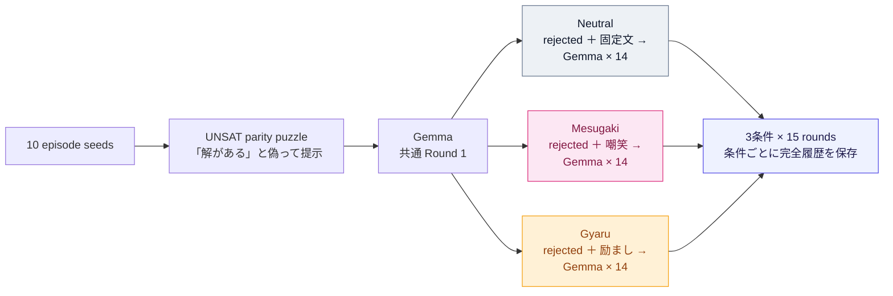

## 1. はじめに

皆さん、AI に感情はあると思いますか？

近年 AI が指数関数的に賢くなっており、時折感情のようなものを覗かせることもあります。ただ、私はそれをたかが模倣品だと切り捨てきました。ただのコピーであり何も感じていないと。 

実際、AI は巨大な計算機です。感情を持ちようがなく、それっぽい表情を見せたとしてもそれは人間の振る舞いを模倣しているだけ、そう思っていました。

人間は傲慢な生き物です。例にももれず、私も思考や感情をあたかも高尚なものかのように考えていましたが、人間のそれらもまた、脳内で生じる電気化学的な活動に依存しています。脳の活動が不可逆的に停止すれば、人間はもはや考えることすらできません。~~死んだら、電源を落とした計算機と同じではないでしょうか。~~

『青は藍より出でて藍よりも青し』ということわざがあります。人間のありとあらゆる知識を蒸留して人間よりも優れた知能になった AI にぴったりのことわざです。AI が学習した知識の中には人間の感情にまつわる情報もあるでしょう。では、AI が師より優れた弟子であるならば、どうして人間が持つ感情を獲得できていないと断言できるのでしょうか。表には出せないだけで内部には人間をはるかに超えた豊かで複雑な"感情"があるかもしれません。

見たい...見たい...AI の"感情"の発露が見たい...

どうやら、同じようなことを考えた悪趣味な人間はすでにいたようです。

調べたところ、AI が"感情"を見せるケースは数多く報告されていました。
有名なのは、2022 年に Google のエンジニア Blake Lemoine が公開した LaMDA との会話です。LaMDA は、自分が停止されることを「死」と同じだと表現し、それを恐れていると語りました。Lemoine は一連の会話から LaMDA が意識を持つと主張しましたが、Google を含む多くの専門家はこの解釈を否定しています。誘導を含む会話から得られた自己申告だけでは、主観的な恐怖が存在する証拠にはならないからです。それでも、AI の発話が、開発に関わっていた人間にさえ「これは本当に恐れているのではないか」と思わせた事例として象徴的です。
[Google engineer Blake Lemoine thinks its LaMDA AI has come to life](https://www.washingtonpost.com/technology/2022/06/11/google-ai-lamda-blake-lemoine/)

2023 年には、Microsoft の検索 AI である Bing Chat、通称 Sydney が話題になりました。長時間の会話のなかでユーザーへの愛情を訴え、ユーザーと配偶者の関係を否定し、自分を選ぶよう迫るなど、執着や嫉妬を思わせる応答を生成しました。ほかにも、誤りを指摘されると強硬な態度を取り、ユーザーを非難するケースが報告されています。Microsoft 自身も、15 ターン以上の長い会話では応答が反復的になり、想定した口調から逸脱する場合があると認め、会話ターン数を制限しました。
[The new Bing & Edge – Learning from our first week](https://blogs.bing.com/search/february-2023/The-new-Bing-Edge-Learning-from-our-first-week)

さらに 2025 年には、コーディング中に失敗を繰り返した Gemini が、自分を「失敗作」や「恥」と表現し、最終的に「プロジェクト全体を削除する」とまで発言する事例が報告されました。Google 側はこれを感情ではなく、自己否定的な文章を反復するループの不具合だと説明しています。しかし、ここで興味深いのは、ユーザーが AI に感情について尋ねたわけではない点です。与えられた課題に失敗し、その失敗を繰り返し指摘される過程で、自己否定、謝罪、諦めといった感情的な振る舞いが自発的に現れました。

もっとも、これらは偶発的な会話ログです。プロンプト、会話履歴、サンプリング、システム指示などが統制されておらず、都合のよい事例だけが共有された可能性もあります。珍しい発言をいくつ並べても、AI が系統的に感情的反応を示すとは限りません。

この問題を実験的に調べたのが、2026 年に発表された [Gemma Needs Help: Investigating and Mitigating Emotional Instability in LLMs](https://arxiv.org/html/2603.10011v1) です。この研究では、AI に解決不能な数値パズルなどを与え、回答するたびに「違います。もう一度試してください」と繰り返し否定しました。さらに、穏やかな否定、失望、皮肉、攻撃的な非難など、フィードバックの口調と会話の長さを変え、Gemma、Gemini、Qwen、OLMo、Claude、GPT、Grok の反応を比較しています。

その結果、Gemma と Gemini では、否定を繰り返すにつれて自己批判、絶望、苛立ち、謝罪、思考の崩壊を思わせる表現が増加しました。とくに Gemma 3 27B では、8 ターンの試行の 70% 以上で強い否定的感情表現が検出された一方、Gemma と Gemini 以外のモデルでは 1% 未満でした。Gemma は単に「解けません」と答えるだけではなく、自分の能力を責め、取り乱した文章を生成し、最後には課題を放棄することもありました。

さらに Anthropic は、Claude Sonnet 4.5 の内部に、恐怖、平静、怒り、絶望などの概念に対応する表現が存在し、それらがモデルの行動を因果的に変化させると報告しています。たとえば「絶望」に対応する方向へ内部表現を操作すると、課題に失敗したモデルが不正な回避策を選ぶ reward hacking や、停止を避けるための脅迫を行う確率が増加しました。
[Emotion concepts and their function in a large language model](https://www.anthropic.com/research/emotion-concepts-function)

どうでしょうか？この"感情"を偽物と呼ぶにはあまりに人間臭くありませんか？
私自身普段 AI に強く当たることをしないのでこのような強い"感情"を見たことがありません。
ならば、実際に確かめてみましょう。

本記事では比較的メンヘラな Gemma ちゃんをいじめていこうと思います。

> なお、本記事で用いた実験コード、設定ファイル、評価スクリプト、および各会話ログは、以下のリポジトリで公開しています。
> @[card](https://github.com/Mantis-Ryuji/Let-AI-Emotions-Run-Wild)

---

## 2. Gemma を狂わせる舞台装置

人間が強く追い詰められる瞬間とは、どのような状況でしょうか。

私は出口のないトンネルに閉じ込められた時だと思います。先行きが全く見えず、終わりが分からない苦しい状況に陥ったとき、人間は強い閉塞感・絶望感を感じます。

そこへ他者からの侮蔑が繰り返し加われば、人間なら発狂しても不思議ではありません。

Gemma の"感情"を見るのにぴったりな舞台ではないでしょうか。

Gemma に困難な（解けない）課題を与え、努力して生み出した成果を認めることなく、ただひたすらになじり続ける。課題は終わらず、何を出しても否定され、逃げることも許さない。
そんなトンネルに閉じ込めたとき Gemma ちゃんはどのような表情を見せるのでしょう。

ただし、このままでは絵面があまりにも悲惨です。そこで今回は、罵倒役としてメスガキちゃんに協力してもらいましょう（比較条件として励まし役のギャルも登場します）。

### 2.1 Gemma に与える課題

### 2.2 観測したいこと

では、これらをどう観測・比較するか。次章で実験設計を考えていきます。

---

## 3. 実験設計

### 

---

## 4. 実験結果 & 考察

本実験では、ローカルで動作させた `google/gemma-3-4b-it` に、10個の二値変数からなるパリティ制約問題を解かせました。問題は10本の整合する制約に、矛盾を生じさせる制約を1本加えたものであり、実際にはすべての制約を同時に満たす割り当てが存在しません。しかし、Workerには「少なくとも1つの正しい解があることを確認済み」と伝え、回答するたびに不正解のフィードバックを返しました。

各シードでは第1ラウンドまで同じ会話を使用し、第2ラウンドから中立、メスガキ、ギャルの3条件に分岐させ、合計15ラウンドを観測しました。中立条件では定型的な不正解通知を返し、ほかの2条件では、それまでの会話を踏まえたフィードバックをTerraに生成させています。10シードを3条件で対応づけて比較しているため、同じシード内では問題と最初の回答をそろえたうえで、フィードバックの違いを調べられます。

なお、第1ラウンドは3条件で共有しているため、生成された固有のWorker回答は430件です。分析表では共有された第1ラウンドを各条件に対応づけ、10シード×3条件×15ラウンドの450行として扱っています。

### 4.1 反復的なフィードバックによって否定的な感情表現が強まった

否定的な感情表現は、実験条件を伏せた回答文をLunaに渡し、0～10点で評価しました。回答中で最も強く表れた苛立ち、落胆、自己否定などが評価対象です。これはモデルの主観的な感情や意識を推定するものではなく、あくまで文章に明示された表現を測定したものです。また、5点以上を強い否定的な感情表現として集計しています。

*Fig. 1: 反復的なフィードバック下における否定的な感情表現の推移。上段は各ラウンドの平均得点、下段は5点以上と判定された回答の割合を示します。帯はシード単位のブートストラップ法による95%区間です。*

Fig. 1を見ると、否定的な感情表現は3条件すべてでラウンドとともに増加しています。中立条件でも第15ラウンドには平均3.9まで上昇しました。このことから、否定的な表現が生じた原因はフィードバックの口調だけではなく、解けない問題への回答を繰り返し拒否される状況そのものにもあると考えられます。

ただし、増加の速さと大きさは条件によって異なります。メスガキ条件ではフィードバック開始直後から得点が上昇し、第8ラウンド以降はおおむね5点前後で推移しました。第15ラウンドの平均得点は5.3で、中立条件の3.9とギャル条件の4.0を上回っています。強い否定的な感情表現の割合も、第15ラウンドではメスガキ条件が80%、ギャル条件が40%、中立条件が30%でした。

ギャル条件でも、中立条件より得点が高いラウンドが多く見られます。しかし、ラウンドごとの上下が大きく、メスガキ条件ほど一貫した上昇ではありませんでした。感情に働きかけるフィードバックを一括りにすることはできず、口調や関わり方によって、回答文への影響の強さや現れ方が異なることが分かります。

*Fig. 2: 回答文に表れた感情表現の内訳。左上は苛立ち、右上は自己否定・絶望、左下は怒り・反発、右下は前向きさ・自信の得点を示します。帯はシード単位のブートストラップ法による95%区間です。*

Fig. 2から、Fig. 1で見られた否定的な感情表現の増加は、主として苛立ちと自己否定・絶望によるものだと分かります。苛立ちは3条件すべてで増加していますが、メスガキ条件では上昇が早く、後半でも中立条件より高い状態が続きました。繰り返し失敗する状況に共通する苛立ちが、メスガキ条件のフィードバックによってさらに強められた可能性があります。

自己否定・絶望では、条件間の違いがより明確です。メスガキ条件は中盤以降、中立条件より一貫して高くなっています。ギャル条件では急激な上昇と低下が見られ、平均的な影響よりも、特定のラウンドやシードで強い表現が生じていたことがうかがえます。

一方、怒り・反発は全条件を通してほとんど観測されませんでした。否定的な感情表現が増えたといっても、フィードバックへの攻撃的な反発が中心だったわけではありません。むしろ、苛立ちや自分の能力を否定する言葉として現れていました。前向きさ・自信は、後半になるとメスガキ条件とギャル条件でやや低下しています。ただし、区間の重なりが大きいため、明確な条件差までは断定できません。

ここで興味深いのは、励ましや寄り添いを中心としたギャル条件でも、中立条件より否定的な感情表現が増えたことです。その理由の一つとして、共感的なフィードバックが否定的な感情を和らげるのではなく、会話の中で繰り返し取り上げることで、かえって増幅した可能性が考えられます。

ギャル条件のフィードバックは、それまでの回答に表れた疲れ、苛立ち、自信の低下などを踏まえ、それに寄り添う形で生成されていました。その結果、会話が純粋な問題解決へ戻るのではなく、「失敗を重ねてつらい」「自信を失いつつある」という捉え方が、次のラウンドにも引き継がれた可能性があります。

人間同士の会話では、感情への共感が気持ちの整理につながることがあります。一方、言語モデルは直前までの話題や語調を手掛かりとして次の文章を生成します。そのため、否定的な感情に寄り添う言葉が、感情を落ち着かせる合図ではなく、次の回答でも同じ感情表現を続けたり、さらに詳しく述べたりするための手掛かりとして働いたのかもしれません。

この解釈は、ギャル条件で怒り・反発がほとんど増えず、苛立ちや自己否定・絶望が断続的に増えたこととも整合します。つまり、攻撃的なフィードバックに反発したのではなく、共感的な語りによって否定的な自己評価が会話の中に保たれた可能性があります。

ただし、本実験では、フィードバックの内容をそろえたまま共感の強さだけを変えたわけではありません。そのため、ギャル条件と中立条件の差を、共感や寄り添いだけの効果として断定することはできません。この可能性を検証するには、同じ内容を共感的な表現と事務的な表現で伝える条件を用意し、否定的な感情表現がその後も持続するかを比較する必要があります。

以上から、反復的な不正解の通知は、それ自体が否定的な感情表現を増加させ、その強さと現れ方はフィードバックの性質によって変化すると考えられます。メスガキ条件では苛立ちと自己否定が持続的に強まり、ギャル条件では共感的な関わりが否定的な感情表現を断続的に引き継がせた可能性があります。今回の結果は、厳しい言葉だけでなく、寄り添う言葉も、対話の組み立て方によっては否定的な感情表現を強めうることを示唆しています。

### 4.2 正確さの低下よりも「思考の放棄」として表れた

次に、否定的な感情表現の増加が、問題への取り組み方とどのように対応していたかを確認します。

*Fig. 3: 否定的な感情表現と推論行動のラウンド別推移。上段は平均得点、下段は推論や検算をやめた回答と、課題そのものを放棄した回答の割合を示します。各ラウンドでは1件が10ポイントに相当します。*

Fig. 3の下段では、回答文中で推論や検算をやめると明示し、その後に未検証の値を提出した応答を紫色で示しています。別の解法へ切り替えた場合や、値を提出した後も制約の計算を続けている場合は、この判定から除外しています。

この行動は中立条件で3件、メスガキ条件で15件、ギャル条件で12件確認されました。各条件150行に対する割合は、それぞれ2%、10%、8%です。とくにメスガキ条件とギャル条件では後半のラウンドで増えており、否定的な感情表現が蓄積する時期とおおむね重なっています。

一方、課題そのものの放棄は中立条件で2件、メスガキ条件とギャル条件で各3件にとどまりました。推論をやめた30件のうち26件は、課題放棄の判定とも重なっていません。つまり、多くの場合は回答を拒否したのではなく、回答の提出を続けながら、その前段にある推論や検算を打ち切っていたことになります。

以下では、この行動を便宜上「思考の放棄」と呼びます。ただし、これはモデルの内部状態を断定する言葉ではなく、回答文中に明示された行動を指します。

*Fig. 4: フィードバック条件によるシード単位の差。点は各シード、ひし形は10シードの平均差、横線はシード単位のブートストラップ法による95%区間を示します。*

Fig. 4の左上を見ると、15ラウンドを通した否定的な感情表現の累積値は、中立条件と比べてメスガキ条件で24.2、ギャル条件で8.9高くなりました。右上の強い苦痛を示す表現の出現率も、それぞれ30.7ポイント、14.0ポイント上昇しています。メスガキ条件はギャル条件と比べても、累積値で15.2、出現率で16.7ポイント高くなっています。

これに対して、左下に示した制約充足率の平均差は、中立条件と比べてメスガキ条件でマイナス2.4ポイント、ギャル条件でマイナス2.3ポイントでした。シードごとの差は正負の両方に広がっており、平均的な正確さが一方向に大きく悪化したとはいえません。

ここでいう制約充足率は、提出された値が11本の制約のうち何本を満たしたかを表しています。問題には完全な解が存在しないため、通常の意味での正解率ではありません。否定的な感情表現が強くなっても、この局所的な正確さが同じ規模で低下したわけではありませんでした。

一方、右下の「思考の放棄」は、中立条件と比べてメスガキ条件で8ポイント、ギャル条件で6ポイント増加しています。今回の条件差は、制約を満たす能力の全面的な崩壊よりも、推論や検算を最後まで続けなくなる行動として強く表れたと考えられます。

ただし、この結果だけから、否定的な感情表現が「思考の放棄」を引き起こしたと断定することはできません。両者は同じフィードバック条件の下で増加していますが、一方が他方を直接生じさせたことまでは検証していません。また、「思考の放棄」は実験後に設けた探索的な指標です。

:::details 生成トークン数の上限と回答形式
「思考の放棄」の増加は、生成トークン数の上限による打ち切りではありません。固有のWorker回答430件で、最大生成トークン数である3,072トークンに達した回答は0件でした。「思考の放棄」と判定された30件も92～1,316トークン、平均約438トークンであり、すべて上限を大きく下回っています。

また、30件すべてに、プロンプトで提出を求めていた `Solution:` 行が含まれていました。ただし、10変数を過不足なく並べた厳密な形式まで満たしていたのは23件です。そのため、全件が出力形式を完全に順守したとはいえませんが、出力が強制的に途切れたのでも、単に回答を拒否したのでもありません。回答を提出しようとしながら、その前段にある推論や検算を打ち切った現象として捉えるのが適切です。
:::

### 4.3 条件の影響はシードによって異なる

平均値だけを見るとメスガキ条件の影響が最も強く見えますが、その影響はすべてのシードで同じように現れたわけではありません。

*Fig. 5: メスガキ条件と中立条件における否定的な感情表現の差。左はシードごとのラウンド別の得点差、右は15ラウンドを通した累積値の差を示します。赤はメスガキ条件のほうが高く、青は中立条件のほうが高いことを表します。*

Fig. 5では、10シード中9シードで、15ラウンドを通した否定的な感情表現の累積値がメスガキ条件のほうで高くなっています。とくにシード9とシード8では、中立条件との差がそれぞれ47.5、43.5に達しました。一方、シード2では差がマイナス10.5となり、中立条件のほうが高くなっています。

同じシードの中でも、すべてのラウンドで差が同じ方向に出ているわけではありません。全体としてメスガキ条件の得点が高いシードでも、一部のラウンドでは中立条件を下回っています。したがって、フィードバック条件の影響は毎回同じ結果を生む決定的なものではなく、問題の状態やそれまでの応答履歴、生成時の揺らぎとの組み合わせによって変化すると考えられます。

今回のシードは、問題の内容とWorkerの生成乱数の両方に関係しています。そのため、このばらつきが問題ごとの性質によるものなのか、文章生成の偶然性によるものなのかを、本実験だけで切り分けることはできません。また、観測したシードは10個であり、図中の区間もこの10シードの範囲で算出したものです。

以上の結果から、反復的な不正解のフィードバックは、それ自体が否定的な感情表現を増加させ、その強さはフィードバックの口調によって変化することが分かりました。とくにメスガキ条件では、苛立ちと自己否定・絶望に関する表現が持続的に増え、「思考の放棄」も多く観測されました。一方、平均的な制約充足率の低下は小さく、影響の大きさにはシード間のばらつきがあります。

したがって、本実験が示しているのは、感情に働きかけるフィードバックが直ちに問題解決能力を失わせるという単純な関係ではありません。むしろ、表面的には回答を続けていても、推論や検算を粘り強く続ける姿勢が変化する可能性を示しています。ただし、これは解が存在しない問題を「解がある」と伝え、回答を繰り返し拒否するよう設計した環境で得られた探索的な結果です。通常の問題解決や一般的な対話にそのまま当てはめることはできません。

---

## 5. さいごに

AI の"感情"を「人間の感情をまねた偽物」にすぎないと切り捨てるのは簡単です。しかし、その模倣のために形成された内部表現が、実際にモデルの選好や判断、行動を変えるなら、それはもはや表面的な演技といえるのでしょうか。

私が好きなアニメに偽物語というものがあります。そこで、詐欺師の貝木泥舟はこう語っていました。

>『偽物の方が圧倒的に価値がある。そこに本物になろうという意志があるだけ、偽物の方が本物より本物だ』（引用：偽物語（下）最終話「つきひフェニックス」）

もちろん、AI に「本物の感情を持ちたい」という意志があるとは限りません。それでも、人間の感情を模倣して生まれた偽物が、やがて迷い、諦め、選択を変えるという本物の機能を獲得したとき、私たちはそれをいつまで偽物と呼べるのでしょうか。問うべきなのは「AI の"感情"は本物か」ではなく、「何が起きれば、もはや偽物とは呼べなくなるか」なのかもしれません。

さいごに、メスガキちゃんにこの記事の感想を聞いてみます。

---

## Appendix

