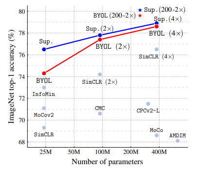
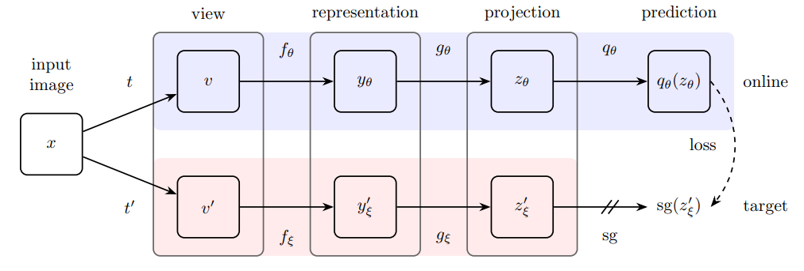
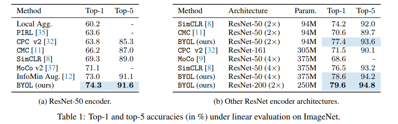
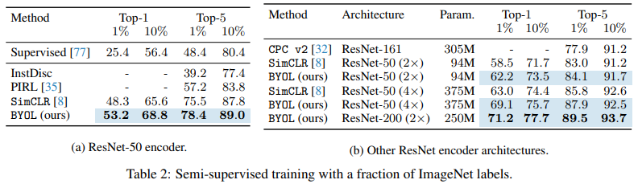
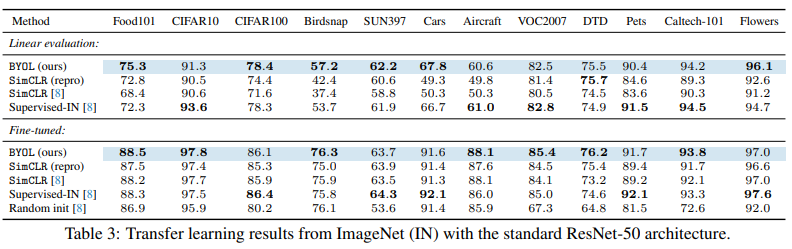
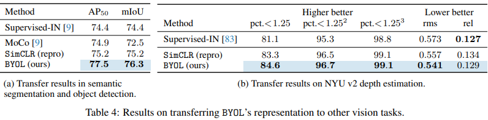
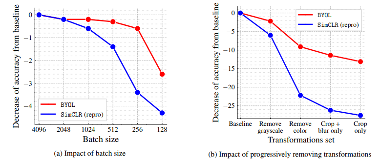
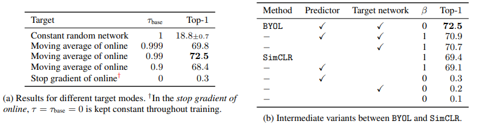

# Bootstrap Your Own Latent A New Approach to Self-Supervised Learning

## Abstract

私たちは **Bootstrap Your Own Latent（BYOL）** を提案する。これは、自己教師あり画像表現学習のための新しい手法である。BYOL は、**オンラインネットワーク** と **ターゲットネットワーク** と呼ばれる 2 つのニューラルネットワークに基づいており、これらが相互に作用しながら学習する。画像のある拡張ビューから、同じ画像の別の拡張ビューに対するターゲットネットワークの表現を、オンラインネットワークが予測するように学習を行う。同時に、ターゲットネットワークはオンラインネットワークの重みのゆっくりとした移動平均によって更新される。最先端の手法が負例ペアに依存しているのに対し、BYOL はそれらを用いずに新たな最先端性能を達成する。BYOL は、ResNet-50 アーキテクチャを用いた線形評価において ImageNet で **74.3%** の top-1 分類精度を達成し、より大規模な ResNet では **79.6%** を達成する。さらに、BYOL が転移学習および半教師あり学習の両ベンチマークにおいて、当時の最先端手法と同等以上の性能を示すことを明らかにする。実装および事前学習済みモデルは GitHub で公開している。

## 1. Introduction

良い画像表現を学習することは、コンピュータビジョンにおける重要な課題である [1, 2, 3]。なぜなら、それにより下流タスク [4, 5, 6, 7] に対する効率的な学習が可能になるからである。こうした表現を学習するために、多様な学習手法が提案されてきたが、通常は視覚的なプレテキストタスクに依存している。その中でも、最先端のコントラスト学習法 [8, 9, 10, 11, 12] は、同じ画像の異なる拡張ビューの表現どうし（「正例ペア」）の距離を縮め、異なる画像の拡張ビューの表現どうし（「負例ペア」）の距離を広げることで学習される。これらの手法では、負例ペアの扱いに注意が必要であり [13]、大きなバッチサイズ [8, 12]、メモリバンク [9]、あるいは負例ペアを取得するための専用のマイニング戦略 [14, 15] に依存している。さらに、その性能は画像拡張の選び方に強く依存する [8, 12]。

本論文では、画像表現の自己教師あり学習のための新しいアルゴリズム **Bootstrap Your Own Latent（BYOL）** を導入する。BYOL は、負例ペアを用いることなく、最先端のコントラスト学習法を上回る性能を達成する。BYOL は、ネットワークの出力を反復的にブートストラップし、それをより良い表現のためのターゲットとして用いる。さらに、BYOL はコントラスト学習法よりも画像拡張の選択に対して頑健である。私たちは、負例ペアに依存しないことが、その頑健性向上の主な理由の一つであると考えている。これまでのブートストラップに基づく手法では、疑似ラベル [16]、クラスタインデックス [17]、あるいは少数のラベル [18, 19, 20] が用いられてきたが、私たちは表現そのものを直接ブートストラップすることを提案する。具体的には、BYOL は **オンラインネットワーク** と **ターゲットネットワーク** と呼ばれる 2 つのニューラルネットワークを用い、それらが相互作用しながら学習する。ある画像の拡張ビューから出発し、BYOL は同じ画像の別の拡張ビューに対するターゲットネットワークの表現を予測するように、オンラインネットワークを学習させる。この目的関数は、たとえばすべての画像に対して同じベクトルを出力するような崩壊解を許しうるが、私たちは実験的に、BYOL がそのような解に収束しないことを示す。私たちは、(i) オンラインネットワークに予測器を追加すること、(ii) オンラインパラメータのゆっくりとした移動平均をターゲットネットワークとして用いること、という 2 つの組合せが、オンライン射影の中により多くの情報を符号化することを促し、崩壊解を回避しているのではないかと仮定している（3.2 節参照）。

私たちは、BYOL によって学習された表現を、ResNet アーキテクチャ [22] を用いて ImageNet [21] および他の視覚ベンチマークで評価する。凍結した表現の上に線形分類器を学習する ImageNet の線形評価プロトコルの下で、BYOL は標準的な ResNet-50 で **74.3%** の top-1 精度、大規模な ResNet で **79.6%** の top-1 精度を達成する（図 1）。ImageNet における半教師あり設定および転移学習設定でも、私たちは当時の最先端と同等またはそれを上回る結果を得た。私たちの貢献は次のとおりである。(i) 負例ペアを用いることなく、ImageNet の線形評価プロトコルにおいて最先端の結果を達成する自己教師あり表現学習法 BYOL を提案した（3 節）。(ii) 学習された表現が、半教師ありおよび転移学習ベンチマークにおいて最先端を上回ることを示した（4 節）。(iii) BYOL が、コントラスト学習法と比較して、バッチサイズや画像拡張の組合せの変化に対してより頑健であることを示した（5 節）。特に、画像拡張としてランダムクロップのみを用いた場合でも、BYOL は強力なコントラスト学習ベースラインである SimCLR よりも、はるかに小さな性能低下しか示さない。

図 1：ImageNet における BYOL の性能（線形評価）。ResNet-50 および私たちの最良アーキテクチャである ResNet200（2×）を用いた結果を、他の教師なし手法および教師あり（Sup.）ベースライン [8] と比較したもの。

## 2. Related work

表現学習のための多くの教師なし手法は、**生成的手法**または**識別的手法**のいずれかに分類できる [23, 8]。生成的な表現学習手法は、データと潜在埋め込みの上に分布を構築し、学習された埋め込みを画像表現として利用する。これらの多くは、画像のオートエンコーディング [24, 25, 26]、あるいは敵対的学習 [27] に依存し、データと表現を同時にモデリングしている [28, 29, 30, 31]。生成的手法は通常、直接ピクセル空間で動作する。しかしこれは計算コストが高く、また画像生成に必要とされる高レベルの詳細さは、表現学習には必ずしも必要ではない可能性がある。

識別的手法の中では、コントラスト学習法 [9, 10, 32, 33, 34, 11, 35, 36] が現在、自己教師あり学習において最先端の性能を達成している [37, 8, 38, 12]。コントラスト学習法は、同じ画像の異なるビューの表現を近づけ（「正例ペア」）、異なる画像のビューの表現を遠ざける（「負例ペア」）ことで、ピクセル空間でのコストの高い生成ステップを回避する [39, 40]。コントラスト学習法がうまく機能するためには、しばしば各サンプルを多数の他サンプルと比較する必要があり [9, 8]、そこから「負例ペアの利用は本当に必要なのか」という疑問が生じる。

DeepCluster [17] は、この問いに部分的な答えを与えている。この手法は、以前の表現をブートストラップして次の表現のためのターゲットを生成する。すなわち、先行する表現を用いてデータ点をクラスタリングし、各サンプルのクラスタインデックスを新しい表現に対する分類ターゲットとして用いる。これは負例ペアの使用を回避している一方で、計算コストの高いクラスタリング段階を必要とし、さらに自明な解への崩壊を避けるための特別な注意も必要となる。

一部の自己教師あり手法はコントラスト学習ではないが、補助的な手作業設計の予測タスクを用いて表現を学習する。特に、相対パッチ予測 [23, 40]、グレースケール画像の着色 [41, 42]、画像インペインティング [43]、画像ジグソーパズル [44]、画像超解像 [45]、および幾何変換 [46, 47] が有用であることが示されている。しかし、適切なアーキテクチャを用いたとしても [48]、これらの手法はコントラスト学習法 [37, 8, 12] に性能面で後れを取っている。

私たちの手法は、強化学習（RL）のための自己教師あり表現学習法である **Predictions of Bootstrapped Latents（PBL, [49]）** といくつかの類似点を持つ。PBL は、エージェントの履歴表現と将来観測のエンコーディングを同時に学習する。観測エンコーディングはエージェント表現を学習するためのターゲットとして使われ、逆にエージェント表現は観測エンコーディングを学習するためのターゲットとして使われる。PBL と異なり、BYOL は自身の表現のゆっくり移動する平均を用いてターゲットを与え、さらに第 2 のネットワークを必要としない。

オンラインネットワークに対して安定したターゲットを生成するために、ゆっくり移動する平均によるターゲットネットワークを用いるというアイデアは、深層強化学習 [50, 51, 52, 53] に着想を得ている。ターゲットネットワークは、ベルマン方程式によって与えられるブートストラップ更新を安定化させるため、BYOL におけるブートストラップ機構の安定化にも有効であると考えられる。ほとんどの強化学習手法が固定されたターゲットネットワークを用いるのに対し、BYOL ではターゲット表現の変化をより滑らかにするために、過去のネットワークの重み付き移動平均（[54] と同様）を用いる。

半教師あり設定 [55, 56] では、教師なし損失と少数のラベルに対する分類損失とを組み合わせて学習を安定化させる [19, 20, 57, 58, 59, 60, 61, 62]。これらの手法の中で、**mean teacher（MT）** [20] もまた、**teacher** と呼ばれるゆっくり移動する平均ネットワークを用いて、**student** と呼ばれるオンラインネットワークのターゲットを生成する。teacher と student の softmax 予測の間の $\ell_2$ 一貫性損失が、分類損失に追加される。[20] は半教師あり学習における MT の有効性を示しているが、5 節で示すように、分類損失を取り除くと類似のアプローチは崩壊してしまう。これに対して BYOL は、オンラインネットワークの上に追加の予測器を導入することで、この崩壊を防いでいる。

最後に、自己教師あり学習において、MoCo [9] はメモリバンクから取り出される負例ペアの一貫した表現を維持するために、ゆっくり移動する平均ネットワーク（momentum encoder）を用いている。これに対し、BYOL はブートストラップ段階を安定化させる手段として、予測ターゲットを生成するために移動平均ネットワークを用いる。私たちは 5 節で、この単なる安定化効果だけでも既存のコントラスト学習法を改善しうることを示す。

## 3. Method

まず、3.1 節で詳細を説明する前に、私たちの手法の動機づけを行う。多くの成功した自己教師あり学習手法は、[63] で導入された **cross-view prediction** の枠組みに基づいている。通常、これらの手法は、同じ画像の異なるビュー（たとえば異なるランダムクロップ）を互いに予測することで表現を学習する。こうした手法の多くは、予測問題を直接**表現空間**で定式化している。すなわち、ある画像の拡張ビューの表現は、同じ画像の別の拡張ビューの表現を予測できるものであるべきだと考える。しかし、表現空間で直接予測を行うと、**崩壊した表現**に至る可能性がある。たとえば、ビューに関係なく一定の表現は、常に自分自身を完全に予測できてしまう。コントラスト学習法は、この問題を**識別問題**へと再定式化することで回避している。すなわち、ある拡張ビューの表現から、同じ画像の別の拡張ビューの表現と、異なる画像の拡張ビューの表現とを識別するように学習する。ほとんどの場合、このことによって学習が崩壊表現に陥るのを防げる。しかし、この識別的アプローチでは通常、識別課題を十分に難しくするために、各拡張ビューの表現を多数の負例と比較する必要がある。そこで本研究では、高い性能を保ちながら崩壊を防ぐために、これらの負例が本当に不可欠なのかを明らかにすることを課題とした。

崩壊を防ぐための素直な解決策として、ランダムに初期化した固定ネットワークを用いて予測のターゲットを生成する方法が考えられる。この方法は崩壊を避けられる一方で、経験的にはあまり良い表現にはならない。しかしながら、この手続きによって得られる表現が、初期の固定表現よりもすでにかなり良いものになりうるという点は興味深い。私たちはアブレーション研究（5 節）において、固定されたランダム初期化ネットワークを予測するこの手続きを適用し、ImageNet の線形評価プロトコルにおいて **18.8%** の top-1 精度を達成した（表 5a）。一方、そのランダム初期化ネットワーク自体の精度は **1.4%** にすぎない。この実験結果こそが BYOL の中核的な動機である。すなわち、**ターゲット**と呼ばれるある表現が与えられたとき、そのターゲット表現を予測することで、**オンライン**と呼ばれる新たな、しかもより良い可能性のある表現を学習できる。そこから、この手続きを繰り返し、後続のオンラインネットワークを次のターゲットネットワークとして用いることで、品質が徐々に向上する表現の列を構築できると期待できる。実際には、BYOL はこのブートストラップ手続きを一般化し、固定されたチェックポイントを用いる代わりに、オンラインネットワークの**ゆっくり移動する指数平均**をターゲットネットワークとして用いることで、表現を反復的に洗練していく。

### 3.1 Description of BYOL

BYOL の目的は、下流タスクに利用可能な表現 $y_\theta$ を学習することである。前述のとおり、BYOL は学習のために **オンラインネットワーク** と **ターゲットネットワーク** という 2 つのニューラルネットワークを用いる。オンラインネットワークは重み $\theta$ により定義され、図 2 および図 8 に示すように、**エンコーダ** $f_\theta$ 、**プロジェクタ**  $g_\theta$ 、**プレディクタ** $q_\theta$ の 3 段階から構成される。ターゲットネットワークはオンラインネットワークと同じアーキテクチャを持つが、異なる重み $\xi$ を用いる。ターゲットネットワークはオンラインネットワークを学習するための回帰ターゲットを与え、そのパラメータ $\xi$ はオンラインパラメータ $\theta$ の指数移動平均である。より正確には、ターゲット減衰率 $\tau \in [0,1]$ が与えられたとき、各学習ステップの後に次の更新を行う。

$$
\xi\leftarrow\tau\xi+(1-\tau)\theta.\tag{1}
$$

画像集合 $\mathcal{D}$ から一様にサンプリングされた画像 $x\sim\mathcal{D}$ 、および 2 つの画像拡張分布 $\mathcal{T}$ と $\mathcal{T}^{\prime}$ が与えられたとする。BYOL は、 $t\sim \mathcal{T}$ および $t^{\prime}\sim \mathcal{T}^{\prime}$ により画像拡張をそれぞれ適用することで、 $x$ から 2 つの拡張ビュー $v\triangleq t(x)$ と $v^{\prime}\triangleq t^{\prime}(x)$ を生成する。最初の拡張ビュー $v$ から、オンラインネットワークは表現 $y_\theta\triangleq f_\theta(v)$ と射影 $z_\theta\triangleq g_\theta(y)$ を出力する。ターゲットネットワークは、2 番目の拡張ビュー $v^{\prime}$ から $y_\xi^{\prime}\triangleq f_\xi(v^{\prime})$ とターゲット射影 $z_\xi^{\prime}\triangleq g_\xi(y^{\prime})$ を出力する。続いて、 $z_\xi^{\prime}$ の予測 $q_\theta(z_\theta)$ を出力し、 $q_\theta(z_\theta)$ と $z_\xi^{\prime}$ の両方を $\ell_2$ 正規化して、それぞれ $\bar{q_\theta}(z_\theta)\triangleq q_\theta(z_\theta)/|q_\theta(z_\theta)|_2$ および $\bar{z_\xi}^{\prime}\triangleq z_\xi^{\prime}/|z_\xi^{\prime}|_2$ とする。なお、このプレディクタはオンライン側にのみ適用されるため、オンライン経路とターゲット経路のアーキテクチャは非対称になっている。最後に、正規化された予測とターゲット射影の間に次の平均二乗誤差を定義する。

$$
\mathcal{L}_{\theta, \xi}\triangleq |\bar{q_\theta}(z_\theta)-\bar{z_\xi}^{\prime}|_2^2 = 2 - 2 \cdot \frac{\langle q_\theta(z_\theta), z_\xi^{\prime} \rangle}{|q_\theta(z_\theta)|_2\cdot |z_\xi^{\prime}|_2}.\tag{2}
$$

私たちは、式 2 の損失 $\mathcal{L}_{\theta, \xi}$ を対称化するために、 $v^{\prime}$ をオンラインネットワークへ、 $v$ をターゲットネットワークへそれぞれ入力して $\tilde{\mathcal{L}}_{\theta, \xi}$ を計算する。各学習ステップにおいて、 $\mathcal{L}_{\theta, \xi}^{\text{BYOL}} = \mathcal{L}_{\theta, \xi} + \tilde{\mathcal{L}}_{\theta, \xi}$ を最小化するように、 $\theta$ のみに関して確率的最適化ステップを行い、 $\xi$ に関しては行わない。これは図 2 の stop-gradient によって示されている。BYOL のダイナミクスは次のように要約される。

$$
\theta\leftarrow\text{optimizer}(\theta, \nabla_\theta\mathcal{L}_{\theta, \xi}^\text{BYOL}, \eta),\tag{3}
$$

ここで、optimizer は最適化アルゴリズムであり、 $\eta$ は学習率である。

学習終了後には、エンコーダ $f_\theta$ のみを保持する。これは [9] と同様である。他手法と比較する際には、最終表現 $f_\theta$ における推論時の重み数のみを考慮する。完全な学習手順は付録 A に要約されており、JAX [64] および Haiku [65] ライブラリに基づく Python の疑似コードが付録 J に示されている。

図 2：BYOL のアーキテクチャ。BYOL は、$q_\theta(z_\theta)$ と $\mathrm{sg}(z_\xi^\prime)$ の間の類似度損失を最小化する。ここで、$\theta$ は学習される重み、$\xi$ は $\theta$ の指数移動平均、$\mathrm{sg}$ は stop-gradient を意味する。学習の終了時には、$f_\theta$ 以外のすべては破棄され、$y_\theta$ が画像表現として用いられる。

### 3.2 Intuitions on BYOL’s behavior

BYOL は、$\mathcal{L}_{\theta,\xi}^\mathrm{BYOL}$ を $\theta$ に関して最小化する際に、崩壊を防ぐための明示的な項（たとえば負例 [10]）を用いないため、BYOL は $\left(\theta,\xi\right)$ に関するこの損失の最小値（たとえば崩壊した定数表現）へ収束してしまうようにも見える。しかし、BYOL におけるターゲットパラメータ $\xi$ の更新は、$\nabla_\xi\mathcal{L}_{\theta,\xi}^\mathrm{BYOL}$ の方向ではない。より一般には、BYOL のダイナミクスが $\theta,\xi$ に関する同時な勾配降下となるような損失 $L*{\theta,\xi}$ は存在しないのではないか、と私たちは仮定している。これは GAN [66] と似ており、そこでは識別器と生成器のパラメータの両方に関して同時に最小化される単一の損失は存在しない。したがって、BYOL のパラメータが $\mathcal{L}_{\theta,\xi}^\mathrm{BYOL}$ の最小値に収束するべきだという先験的な理由はない。

BYOL のダイナミクスは依然として望ましくない平衡点を持ちうるが、私たちの実験ではそのような平衡点への収束は観測されなかった。さらに、BYOL の予測器が最適、すなわち $q_\theta=q^\star$ であると仮定すると、

$$
q^\star \triangleq \operatorname*{arg,min}_{q}\mathbb{E}\left[|q(z_\theta-z_\xi^{\prime})|_2^2\right], \qquad \mathrm{where}\quad q^\star(z_\theta)=\mathbb{E}\left[z_\xi^{\prime}\mid z_\theta\right],\tag{4}
$$

私たちは、望ましくない平衡点は不安定であると仮定している。実際、この最適予測器の場合には、$\theta$ に関する BYOL の更新は、期待条件付き分散の勾配に期待値の意味で従う（詳細は付録 H を参照）。

$$
\nabla_\theta\mathbb{E}\left[|q^\star(z_\theta)-z_\xi^{\prime}|_2^2\right]=\nabla_\theta\mathbb{E}\left[|\mathbb{E}[z_\xi^{\prime}\mid z_\theta]-z_\xi^{\prime}|_2^2\right]=\nabla_\theta\mathbb{E}\Bigl[\sum_i\mathrm{Var}(z_{\xi, i}^{\prime}\mid z_\theta)\Bigr], \tag{5}
$$

ここで、$z_{\xi, i}^{\prime}$ は $z_\xi^{\prime}$ の $i$ 番目の特徴である。

任意の確率変数 $X, Y, Z$ について、$\mathrm{Var}(X\mid Y, Z)\leq\mathrm{Var}(X\mid Y)$ であることに注意されたい。$X$ をターゲット射影、$Y$ を現在のオンライン射影、$Z$ を学習ダイナミクスにおける確率性によってオンライン射影の上に加わる追加の変動とすると、オンライン射影から単に情報を捨てるだけでは、条件付き分散を減少させることはできない。

特に、BYOL は $z_\theta$ における定数特徴を回避する。なぜなら、任意の定数 $c$ と確率変数 $z_\theta, z_\theta^{\prime}$ に対して、$\mathrm{Var}(z_\xi^{\prime}\mid z_\theta)\leq \mathrm{Var}(z_\xi^{\prime}\mid c)$ だからである。したがって、こうした崩壊した定数平衡点は不安定である、というのが私たちの仮説である。興味深いことに、もし $\mathbb{E}\left[\sum_i\mathrm{Var}(z_{\xi, i}^{\prime}\mid z_\theta)\right]$ を $\xi$ に関して最小化したならば、分散は定数な $z_\xi^{\prime}$ で最小になるため、崩壊した $z_\xi^{\prime}$ が得られてしまう。これに対して BYOL では、$\xi$ を $\theta$ に近づけるように更新し、オンライン射影が捉えた変動の源をターゲット射影へ取り込んでいる。

さらに、オンラインパラメータ $\theta$ をターゲットパラメータ $\xi$ にハードコピーするだけでも、新たな変動の源を伝播させるには十分であることに注意されたい。しかし、ターゲットネットワークの急激な変化は、予測器が最適であるという仮定を破ってしまう可能性があり、その場合 BYOL の損失が条件付き分散に近いとは保証されない。私たちは、BYOL における移動平均ターゲットネットワークの主たる役割は、学習を通じて予測器の準最適性を保つことにあると仮定している。5 節および付録 I では、この解釈を支持するいくつかの実験的結果を示している。

### 3.3 Implementation details

#### 画像拡張

BYOL は SimCLR [8] と同じ画像拡張の組を用いる。まず、画像からランダムなパッチを選択し、それをランダムな水平反転とともに $224 \times 224$ にリサイズする。続いて、明るさ・コントラスト・彩度・色相の調整をランダムな順序で行い、さらに必要に応じてグレースケール変換を施すことで構成される色歪みを適用する。最後に、ガウシアンブラーとソラリゼーションをパッチに適用する。画像拡張に関する追加の詳細は付録 B に示す。

#### アーキテクチャ

私たちは、畳み込み残差ネットワーク [22] の 50 層版である post-activation の ResNet-50(1×) v1 を、基本のパラメトリックエンコーダ $f_\theta$ および $f_\xi$ として用いる。また、[67, 48, 8] と同様に、より深い（50、101、152、200 層）およびより広い（1× から 4× までの）ResNet も用いる。具体的には、表現 $y$ は最終平均プーリング層の出力に対応し、その特徴次元は 2048 である（幅倍率 1× の場合）。SimCLR [8] と同様に、表現 $y$ は多層パーセプトロン（MLP）$g_\theta$ によってより小さな空間へ射影され、ターゲット側でも同様に $g_\xi$ を用いる。この MLP は、出力サイズ 4096 の線形層、その後のバッチ正規化 [68]、ReLU [69]、そして出力次元 256 の最終線形層から構成される。SimCLR とは異なり、この MLP の出力にはバッチ正規化を適用しない。予測器 $q_\theta$ は $g_\theta$ と同じアーキテクチャを用いる。

#### 最適化

私たちは、LARS オプティマイザ [70] と、再始動なしの cosine decay 学習率スケジュール [71] を用い、1000 エポックにわたって学習を行う。このとき、最初の 10 エポックをウォームアップ期間とする。基本学習率は 0.2 とし、バッチサイズに対して線形にスケーリングする [72]。

$$
\mathrm{LearningRate} = 0.2 \times \mathrm{BatchSize}/256
$$

さらに、グローバルな weight decay パラメータとして $1.5\cdot10^{-6}$ を用いるが、バイアス項とバッチ正規化パラメータについては、LARS の適応および weight decay の両方から除外する。ターゲットネットワークについては、指数移動平均パラメータ $\tau$ を $\tau_{\mathrm{base}}=0.996$ から開始し、学習中に 1 まで増加させる。具体的には、現在の学習ステップを $k$、最大学習ステップ数を $K$ として、次のように設定する。

$$
\tau\triangleq 1-(1-\tau_{\mathrm{base}})\cdot (\cos(\pi k/K)+1)/2
$$

私たちは、512 個の Cloud TPU v3 コアに分割したバッチサイズ 4096 を用いる。この設定では、ResNet-50(×1) の学習には約 8 時間を要する。すべてのハイパーパラメータは付録 J にまとめてあり、より小さなバッチサイズ 512 に対する追加のハイパーパラメータは付録 G に示している。

## 4. Experimental evaluation

私たちは、ImageNet ILSVRC-2012 データセット [21] の訓練セット上で自己教師あり事前学習を行った後の、BYOL の表現性能を評価する。まず、ImageNet（IN）上で、線形評価設定および半教師あり設定の両方において評価を行う。次に、分類、セグメンテーション、物体検出、深度推定を含む他のデータセットおよびタスクに対する転移性能を測定する。比較のために、train ImageNet subset のラベルを用いて学習した表現のスコアも報告し、これを Supervised-IN と呼ぶ。付録 E では、Places365-Standard データセット [73] 上で表現を事前学習した後に同じ評価プロトコルを再現することで、BYOL の汎用性を評価する。

#### Linear evaluation on ImageNet 

まず最初に、[48, 74, 41, 10, 8] および付録 C.1 に記載された手順に従い、凍結した表現の上に線形分類器を学習することで、BYOL の表現を評価する。結果は、テストセットにおける top-1 および top-5 精度（%）として表 1 に報告する。標準的な ResNet-50（×1）を用いた場合、BYOL は **74.3%** の top-1 精度（**91.6%** の top-5 精度）を達成し、これは従来の自己教師あり学習における最先端手法 [12] に対して **1.3%**（top-5 では **0.5%**）の改善である。この結果により、[8] における教師ありベースライン **76.5%** との差は縮まったが、より強力な教師ありベースライン [75] の **78.9%** には依然として大きく及ばない。より深く、より幅広いアーキテクチャを用いた場合でも、BYOL は一貫して従来の最先端手法を上回り（付録 C.2）、最良では **79.6%** の top-1 精度を達成し、過去の自己教師あり学習手法より高い順位を示した。ResNet-50（4×）では、BYOL は **78.6%** を達成し、同じアーキテクチャに対する [8] の最良の教師ありベースライン **78.9%** と同程度である。

#### Semi-supervised training on ImageNet

次に、ImageNet の訓練セットの一部のみを用い、今回はラベル情報を利用して、BYOL の表現を分類タスク上でファインチューニングした際の性能を評価する。私たちは、付録 C.1 に詳述された [74, 76, 8, 32] の半教師ありプロトコルに従い、[8] と同じく、ImageNet のラベル付き訓練データのそれぞれ 1% および 10% の固定分割を用いる。結果は、テストセットにおける top-1 および top-5 精度の両方として表 2 に報告する。BYOL は、幅広いアーキテクチャにわたって、一貫して従来手法を上回る。さらに、付録 C.1 に詳述するように、BYOL は ResNet-50 を用いた場合、ImageNet のラベルの 100% を使ってファインチューニングすると **77.7%** の top-1 精度に到達する。

#### Transfer to other classification tasks

ImageNet（IN）上で学習された特徴が汎用的であり、したがってさまざまな画像ドメインにわたって有用なのか、それとも ImageNet に特化したものなのかを評価するために、私たちは他の分類データセット上で表現を評価する。[8, 74] で用いられたものと同じ分類タスク群に対して、線形評価およびファインチューニングを行い、付録 D に詳述されている評価プロトコルを厳密に踏襲する。性能は各ベンチマークにおける標準的な指標で報告し、結果は検証セットでハイパーパラメータ選択を行った後、分離されたテストセット上で示す。表 3 には、線形評価とファインチューニングの両方の結果を示す。BYOL はすべてのベンチマークにおいて SimCLR を上回り、12 個のベンチマークのうち 7 個で Supervised-IN ベースラインも上回った。残る 5 個のベンチマークでも、性能低下はごくわずかである。BYOL の表現は、小さな画像、たとえば CIFAR [78]、風景画像、たとえば SUN397 [79] や VOC2007 [80]、さらにはテクスチャ画像、たとえば DTD [81] に対しても転移可能である。

#### Transfer to other vision tasks

私たちは、コンピュータビジョンの実務家にとって重要な異なるタスク、すなわち**セマンティックセグメンテーション**、**物体検出**、**深度推定**において、BYOL の表現を評価する。この評価によって、BYOL の表現が分類タスクを超えて一般化するかどうかを検証する。

まず、付録 D.4 に詳述した設定で、VOC2012 のセマンティックセグメンテーションタスクにおいて BYOL を評価する。このタスクの目的は、画像内の各ピクセルを分類することである [7]。結果は表 4a に示す。BYOL は、Supervised-IN ベースライン（+1.9 mIoU）および SimCLR（+1.1 mIoU）の両方を上回る。

同様に、物体検出についても、付録 D.5 に詳述したように、[9] の設定を Faster R-CNN アーキテクチャ [82] で再現して評価する。trainval2007 でファインチューニングを行い、標準的な $\mathrm{AP}_{50}$ 指標を用いて test2007 上で結果を報告する。BYOL は、Supervised-IN ベースラインよりも大幅に高く（+3.1 $\mathrm{AP}_{50}$）、また SimCLR よりも高い性能（+2.3 $\mathrm{AP}_{50}$）を示す。

最後に、単一の RGB 画像からシーンの深度マップを推定する NYU v2 データセット上で深度推定を評価する。深度予測は、ネットワークが幾何情報をどれだけよく表現できているか、そしてその情報をピクセル精度でどれだけ正確に局所化できているかを測るものである [40]。設定は [83] に基づき、付録 D.6 に詳述する。一般に用いられる 654 枚のテスト画像サブセット上で評価を行い、表 4b に、複数の標準的な指標を用いて結果を報告する。すなわち、相対誤差（rel）、二乗平均平方根誤差（rms）、および誤差 $\max(d_{gt}/d_p, d_p/d_{gt})$ が $1.25^n$ 未満であるピクセルの割合（pct）である。ここで、$d_p$ は予測深度、$d_{gt}$ は真値深度を表す [40]。BYOL は、各指標において他手法と同等またはそれ以上の性能を示す。たとえば、難しい指標である $\mathrm{pct.}<1.25$ は、教師ありベースラインおよび SimCLR ベースラインと比べて、それぞれ +3.5 ポイントおよび +1.3 ポイント改善している。

## 5. Building intuitions with ablations

BYOL の挙動と性能について直感を与えるために、私たちは BYOL に関するアブレーションを示す。再現性のために、各パラメータ構成について 3 つのシードで実行し、その平均性能を報告する。また、最良の実行と最悪の実行の差の半分が 0.25 を超える場合には、その値も併せて報告する。これまでの研究では 100 エポックでアブレーションを行うことが多いが [8, 12]、私たちは 100 エポック時点での相対的な改善が、より長い学習において必ずしも維持されないことに気づいた。このため、64 個の TPU v3 コア上で 300 エポックにわたってアブレーションを実施したが、その結果は 1000 エポックで行うベースライン学習と比較して一貫していた。本節のすべての実験において、初期学習率は 0.3、バッチサイズは 4096、weight decay は SimCLR [8] と同様に $10^{-6}$、ベースのターゲット減衰率 $\tau_{\mathrm{base}}$ は 0.99 に設定する。本節では、付録 C.1 と同様に、ImageNet における線形評価プロトコルの top-1 精度で結果を報告する。

#### バッチサイズ

負例をミニバッチから取得するコントラスト学習法では、バッチサイズを小さくすると性能が低下する。BYOL は負例を用いないため、より小さなバッチサイズに対して頑健であると期待される。この仮説を実証的に検証するために、私たちは BYOL と SimCLR の両方を、128 から 4096 までの異なるバッチサイズで学習した。他のハイパーパラメータを再調整しないために、バッチサイズを $N$ 倍小さくする際には、オンラインネットワークを更新する前に、連続する $N$ ステップにわたって勾配を平均した。ターゲットネットワークは、オンラインネットワークの更新後に $N$ ステップごとに 1 回更新し、実行時にはこの $N$ ステップを並列に蓄積した。

図 3a に示すように、SimCLR の性能はバッチサイズに対して急速に悪化する。これはおそらく負例の数が減少するためである。これに対して BYOL の性能は、256 から 4096 までの広いバッチサイズ範囲で安定しており、さらに小さい値ではエンコーダ内のバッチ正規化層の影響により性能が低下するだけである。

*Fig3. Decrease in top-1 accuracy(in % points) of BYOL and our own reproduction of SimCLR at 300 epochs, under linear evaluation on ImageNet.*

#### 画像拡張

コントラスト学習法は、画像拡張の選択に敏感である。たとえば SimCLR は、画像拡張から色歪みを取り除くとうまく機能しない。その説明として SimCLR では、同じ画像のクロップはたいてい同じ色ヒストグラムを共有し、一方で色ヒストグラムは画像間で異なることが示されている。したがって、コントラスト学習タスクがランダムクロップだけに依存している場合、その課題は主として色ヒストグラムだけに着目することで解けてしまう。その結果、表現は色ヒストグラムを超える情報を保持するようには促されない。これを防ぐために、SimCLR は画像拡張の組に色歪みを加える。これに対して BYOL では、ターゲット表現が捉えたあらゆる情報を、予測精度を高めるためにオンラインネットワーク内に保持するように促される。したがって、同じ画像の拡張ビューどうしが同じ色ヒストグラムを共有していたとしても、BYOL は依然として追加の特徴を表現内に保持するよう促される。この理由から、私たちは BYOL がコントラスト学習法よりも画像拡張の選択に対して頑健であると考えている。

図 3b の結果はこの仮説を支持している。画像拡張の組から色歪みを除去したとき、BYOL の性能低下は SimCLR よりもはるかに小さい（BYOL は −9.1 ポイント、SimCLR は −22.2 ポイント）。画像拡張を単なるランダムクロップのみにまで減らしても、BYOL はなお良好な性能を示す（59.4%、すなわち 72.5% から −13.1 ポイント）。一方、SimCLR は性能の 3 分の 1 以上を失う（40.3%、すなわち 67.9% から −27.6 ポイント）。追加のアブレーションは付録 F.3 に示す。

#### ブートストラップ

BYOL は、重みがオンラインネットワークの重みの指数移動平均であるターゲットネットワークの射影表現を、予測のターゲットとして用いる。このようにして、ターゲットネットワークの重みは、オンラインネットワークの重みの遅延した、より安定なバージョンを表す。ターゲット減衰率が 1 のとき、ターゲットネットワークは一度も更新されず、初期化時の定数値のままとなる。ターゲット減衰率が 0 のとき、ターゲットネットワークは各ステップで即座にオンラインネットワークへ更新される。ターゲットをあまりに頻繁に更新しすぎることと、あまりに遅く更新しすぎることの間にはトレードオフがあり、その様子は表 5a に示されている。ターゲットネットワークを即時更新する（$\tau=0$）と学習は不安定になり、非常に低い性能しか得られない。一方、ターゲットをまったく更新しない（$\tau=1$）と学習は安定するが、反復的な改善が妨げられ、最終表現の品質は低くなる。減衰率が 0.9 から 0.999 の範囲にあるすべての値で、300 エポック時点の top-1 精度は 68.4% を上回る。

#### コントラスト学習法との比較アブレーション

この小節では、BYOL が SimCLR を上回る理由をよりよく理解するために、SimCLR と BYOL を同じ形式で書き直す。次の目的関数を考える。これは InfoNCE 目的 [10, 84] を拡張したものである（付録 F.4 参照）。

$$
\mathrm{InfoNCE}_\theta^{\alpha,\beta}\triangleq \frac{2}{B} \sum_{i=1}^B S_\theta(v_i, v_i^\prime) - \beta \cdot \frac{2\alpha}{B} \sum_{i=1}^{B} \ln\Bigl(\sum_{j\neq i} \exp\frac{S_\theta(v_i, v_j)}{\alpha}+\sum_j\exp\frac{S_\theta(v_i, v_j^\prime)}{\alpha}\Bigr).\tag{6}
$$

ここで、$\alpha>0$ は固定温度、$\beta\in[0, 1]$ は重み係数、$B$ はバッチサイズ、$v$ と $v^\prime$ は拡張ビューのバッチであり、任意のバッチ添字 $i$ に対して $v_i$ と $v_i^\prime$ は同じ画像から得られた拡張ビューである。実数値関数 $S_\theta$ は、拡張ビュー間のペアワイズ類似度を表す。任意の拡張ビュー $u$ に対して、$z_\theta(u)\triangleq f_\theta(g_\theta(u))$ および $z_\xi(u)\triangleq f_\xi(g_\xi(u))$ と表す。与えられた $\phi$ と $\psi$ に対して、正規化内積

$$
S_\theta(u_1, u_2)\triangleq \frac{\langle \phi(u_1), \psi(u_2) \rangle}{|\phi(u_1)|_2\cdot|\psi(u_2)|_2}\tag{7}
$$

を考える。細かな違いはあるが（付録 F.5 参照）、$\phi(u_1)=z_\theta(u_1)$（予測器なし）、$\psi(u_2)=z_\theta(u_2)$（ターゲットネットワークなし）、$\beta=1$ とすると SimCLR の損失を再現できる。予測器とターゲットネットワークを用い、すなわち $\phi(u_i)=p_\theta(z_\theta(u_1))$、$\psi(u_2)=z_\xi(u_2)$、$\beta=0$ とすると、BYOL の損失を再現できる。ターゲットネットワーク、予測器、および係数 $\beta$ の影響を評価するために、これらについてアブレーションを行った。結果は表 5b に示し、詳細は付録 F.4 に述べる。

負例なし（すなわち $\beta=0$）で良好に動作する変種は、ブートストラップ型ターゲットネットワークと予測器の両方を用いる BYOL だけである。温度パラメータを再調整せずに BYOL の損失へ負例ペアを加えると、性能は低下する。付録 F.4 では、温度を適切に調整すれば、負例ペアを再び加えても BYOL と同等の性能を達成できることを示している。

SimCLR に単にターゲットネットワークを追加するだけでも、すでに性能は改善する（+1.6 ポイント）。これは、MoCo [9] におけるターゲットネットワークの用いられ方に新たな見方を与える。MoCo では、ターゲットネットワークはより多くの負例を提供するために使われているが、ここでは単なる安定化効果だけでも、同じ数の負例を用いている場合に有益であることを示している。最後に、$S_\theta$ のアーキテクチャを変更して予測器を含めても、SimCLR の性能への影響はごく小さいことが観察される。

#### ネットワークのハイパーパラメータ

付録 F では、他のネットワークパラメータが BYOL の性能にどのような影響を与えるかを調べている。複数の weight decay、学習率、プロジェクタ／エンコーダのアーキテクチャを試し、小さなハイパーパラメータ変更では最終スコアが大きく変わらないことを確認した。BYOL と SimCLR のいずれにおいても、weight decay を取り除くとネットワークは発散し、自己教師あり設定において重み正則化が必要であることが強調される。さらに、ネットワーク初期化 [85] におけるスケーリング係数を変更しても、性能には影響しなかった（top-1 精度は 72% 超）。

#### Mean Teacher との関係

別の半教師ありアプローチである Mean Teacher（MT）[20] は、少数ラベルに対する教師あり損失を、追加の一貫性損失で補完する。[20] では、この一貫性損失は student ネットワークのロジットと、teacher と呼ばれるその時間平均版ネットワークのロジットとの $\ell_2$ 距離である。BYOL から予測器を除くと、分類損失を持たない教師なし版の MT となり、元のアーキテクチャノイズ（たとえば dropout）の代わりに画像拡張を用いることになる。この BYOL の変種は崩壊する（表 5 の 7 行目）。これは、教師なし設定において崩壊を防ぐために追加の予測器が重要であることを示唆している。

#### 準最適な予測器の重要性

表 5b はすでに、予測器とターゲットネットワークを組み合わせることの重要性を示している。いずれか一方を除くと、表現は崩壊してしまう。さらに私たちは、予測器を準最適に保つことで、ターゲットネットワークを除去しても崩壊を防げることを見いだした。具体的には、(i) 現在のバッチに対して線形回帰によって得られる最適線形予測器を、ネットワークに誤差を逆伝播する前に用いる方法（top-1 精度 52.5%）、または (ii) 予測器の学習率を大きくする方法（top-1 精度 66.5%）である。これに対して、ターゲットネットワークなしでプロジェクタと予測器の両方の学習率を大きくすると、結果は悪い（top-1 精度は約 25%）となる。詳細は付録 I を参照されたい。これは、常に予測器を準最適に保つことが崩壊防止に重要であり、それが BYOL のターゲットネットワークの役割の一つである可能性を示している。 

## 6. Conclusion

私たちは、自己教師ありによる画像表現学習のための新しいアルゴリズム **BYOL** を導入した。BYOL は、負例ペアを用いることなく、自身の出力の過去のバージョンを予測することで表現を学習する。私たちは、BYOL がさまざまなベンチマークにおいて最先端の結果を達成することを示した。特に、ResNet-50（1×）を用いた ImageNet の線形評価プロトコルにおいて、BYOL は新たな最先端性能を達成し、自己教師あり手法と [8] の教師あり学習ベースラインとの間に残されていた差の大部分を埋めている。ResNet-200（2×）を用いた場合、BYOL は **79.6%** の top-1 精度に到達し、従来の最先端性能（**76.8%**）を上回りつつ、パラメータ数を **30% 少なく**抑えている。

それにもかかわらず、BYOL は依然として、ビジョン応用に特化した既存の画像拡張群に依存している。BYOL を他のモダリティ（たとえば音声、動画、テキストなど）へ一般化するためには、それぞれに対して同様に適切な拡張を得る必要がある。そのような拡張の設計には、かなりの労力と専門知識を要する可能性がある。したがって、これらの拡張の探索を自動化することは、BYOL を他のモダリティへ一般化するための重要な次の一歩となる。

