# Masked Autoencoders Are Scalable Vision Learners

## Abstract

本論文は，masked autoencoder（MAE）がコンピュータビジョンにおけるスケーラブルな自己教師あり学習手法であることを示している．我々のMAEアプローチは単純であり，入力画像のパッチをランダムにマスクし，欠損した画素を再構成するというものである．この手法は二つの中核的な設計に基づいている．第一に，我々は非対称なエンコーダ・デコーダ構造を設計した．ここでエンコーダは，可視なパッチの部分集合のみに対して動作し（mask tokenは用いない），軽量なデコーダが潜在表現とmask tokenから元の画像を再構成する．第二に，我々は，たとえば75%のように入力画像の高い割合をマスクすることが，自明ではなく意味のある自己教師あり学習タスクを生み出すことを見出した．これら二つの設計を組み合わせることで，大規模モデルを効率的かつ効果的に学習できるようになる．すなわち，学習を高速化し（3倍以上），精度も向上させる．このスケーラブルなアプローチにより，高容量で汎化性能の高いモデルの学習が可能となる．例えば，標準的なViT-Hugeモデルは，ImageNet-1Kデータのみを用いる手法の中で最高精度（87.8%）を達成した．下流タスクへの転移性能は教師あり事前学習を上回り，有望なスケーリング特性も示している．

---

## 1. Introduction

深層学習では，能力と容量が継続的に増大するアーキテクチャが爆発的に増えてきた [33, 25, 57]．ハードウェア性能の急速な向上にも支えられ，今日のモデルは100万枚の画像に対して容易に過学習できるようになっており [13]，しばしば公開されていない数億枚規模のラベル付き画像を必要とし始めている [16]．

このようなデータ需要は，自然言語処理（NLP）においては自己教師あり事前学習によってうまく対処されてきた．GPT [47, 48, 4] における自己回帰言語モデリングや，BERT [14] におけるmasked autoencoding に基づくこれらの手法は，概念的には単純である．すなわち，データの一部を取り除き，取り除かれた内容を予測するよう学習する．これらの手法により，現在では1000億を超えるパラメータを持つ汎化可能なNLPモデルの学習が可能になっている [4]．

masked autoencoder という考え方は，より一般的な denoising autoencoder [58] の一形態であり，コンピュータビジョンにおいても自然で適用可能なものである．実際，ビジョン分野における密接に関連した研究 [59, 46] はBERTに先行していた．しかし，BERTの成功を受けてこの考え方への関心が大きく高まったにもかかわらず，ビジョンにおけるautoencoding手法の進展はNLPに後れを取っている．我々は次の問いを立てる．masked autoencoding は，なぜビジョンと言語で異なるのか．我々はこの問いに対して，以下の観点から答えようと試みる．

(i) つい最近まで，アーキテクチャが異なっていた．ビジョンでは，この10年間，畳み込みネットワーク [34] が支配的であった [33]．畳み込みは通常，規則的なグリッド上で動作するため，mask token [14] や positional embedding [57] のような「指示子」を畳み込みネットワークに統合することは容易ではない．しかし，このアーキテクチャ上の隔たりは Vision Transformer（ViT） [16] の導入によって解消されており，もはや障害ではないはずである．

(ii) 言語とビジョンでは情報密度が異なる．言語は人間によって生成された信号であり，高度に意味的で情報密度が高い．1文あたり数語の欠損語を予測するようモデルを訓練するだけで，高度な言語理解が誘導されるように見える．これに対して画像は，自然信号であり，空間的冗長性が大きい．たとえば，欠損したパッチは，部分・物体・シーンに関する高次の理解がほとんどなくても，隣接パッチから復元できてしまう．この違いを乗り越え，有用な特徴の学習を促すために，我々は，コンピュータビジョンでは単純な戦略が有効であることを示す．すなわち，ランダムパッチの非常に高い割合をマスクすることである．この戦略は冗長性を大きく減らし，低レベルな画像統計を超えた全体的理解を必要とする，困難な自己教師ありタスクを作り出す．我々の再構成タスクの定性的な感触については，図2〜4を参照されたい．

(iii) 潜在表現を入力へと写像し戻すautoencoderのデコーダは，テキスト再構成と画像再構成とで異なる役割を果たす．ビジョンでは，デコーダは画素を再構成するため，その出力は一般的な認識タスクよりも意味レベルが低い．これは，デコーダが豊かな意味情報を含む欠損語を予測する言語の場合とは対照的である．BERTではデコーダは単純なもの（MLP）でもよい [14] が，画像においては，デコーダ設計が学習される潜在表現の意味レベルを決定するうえで重要な役割を果たすことが分かった．

この分析に基づき，我々は視覚表現学習のための，単純で有効かつスケーラブルな masked autoencoder（MAE）を提案する．我々のMAEは，入力画像からランダムなパッチをマスクし，欠損パッチを画素空間で再構成する．このモデルは非対称なエンコーダ・デコーダ設計を持つ．エンコーダは可視パッチの部分集合のみに作用し（mask tokenは用いない），デコーダは軽量であり，潜在表現とmask tokenを用いて入力を再構成する（図1）．この非対称なエンコーダ・デコーダ設計において，mask token を小さなデコーダ側へ移すことで，計算量を大幅に削減できる．この設計のもとでは，非常に高いマスキング率（たとえば75%）によって，精度を最適化しつつエンコーダがわずかなパッチ（たとえば25%）だけを処理すればよいという，いわば一石二鳥の状況を実現できる．その結果，全体の事前学習時間を3倍以上短縮し，同様にメモリ消費も削減でき，大規模モデルへのMAEのスケールアップが容易になる．

我々のMAEは，非常に高容量で汎化性能の高いモデルを学習する．MAE事前学習を用いることで，ViT-Large / ViT-Huge [16] のようなデータ要求量の大きいモデルを，ImageNet-1K 上でより優れた汎化性能で学習できる．標準的な ViT-Huge モデルでは，ImageNet-1K 上で fine-tuning した際に 87.8% の精度を達成した．これは，ImageNet-1K データのみを用いる従来のすべての結果を上回る．さらに，我々は物体検出，インスタンスセグメンテーション，セマンティックセグメンテーションにおける転移学習も評価する．これらのタスクにおいて，我々の事前学習は教師あり事前学習に対応する手法よりも良い結果を示し，さらに重要なことに，モデルを大規模化することで顕著な性能向上が観測された．これらの観察は，NLP における自己教師あり事前学習 [14, 47, 48, 4] で見られてきたものと整合的であり，我々は，この分野においても同様の軌跡を探求することを可能にすると期待している．

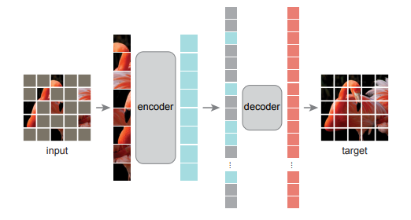
図1．**我々のMAEアーキテクチャ**．事前学習時には，画像パッチの大きなランダム部分集合（たとえば75%）をマスクする．エンコーダは，可視パッチの小さな部分集合に対して適用される．mask token はエンコーダの後に導入され，符号化されたパッチ全体と mask token の集合が，小さなデコーダによって処理され，元画像を画素単位で再構成する．事前学習後は，デコーダは破棄され，認識タスクのためにエンコーダが損傷のない画像（完全なパッチ集合）に適用される．

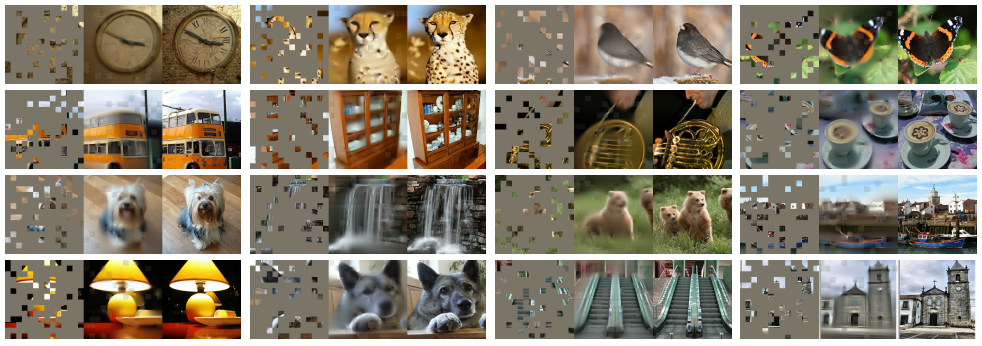
図2．ImageNet 検証画像における結果例．各3枚組について，マスクされた画像（左），我々の MAE による再構成†（中央），および正解画像（右）を示す．マスキング率は80%であり，196個のパッチのうち39個のみが残されている．追加の例は付録に示す．†可視パッチに対しては損失を計算しないため，可視パッチ上のモデル出力は定性的にはやや劣る．視覚品質を改善するには，出力に可視パッチを単純に重ね合わせればよい．ここでは，手法の挙動をより包括的に示すため，意図的にその処理を行っていない．

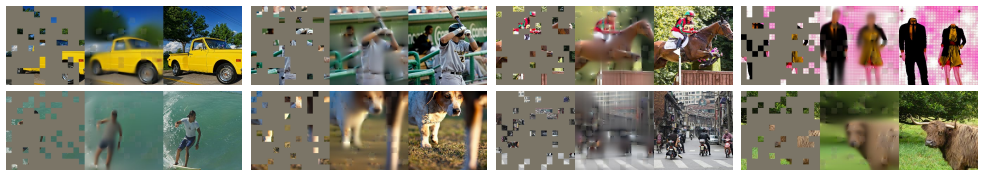
図3．COCO 検証画像における結果例．ImageNet で学習した MAE を用いている（図2と同じモデル重み）．右端の二つの例における再構成は，正解画像とは異なるものの，意味的にはもっともらしいことに注目されたい．

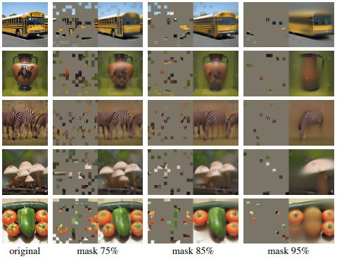
図4．マスキング率75%で事前学習された MAE を，用途時にはより高いマスキング率の入力に適用した場合の，ImageNet 検証画像の再構成結果．予測は元画像ともっともらしく異なっており，本手法が汎化できることを示している．

## 2. Related Work

**Masked language modeling** とその自己回帰型の対応物，たとえば BERT [14] や GPT [47, 48, 4] は，NLP における事前学習の非常に成功した手法である．これらの手法では，入力系列の一部を取り除き，欠損した内容を予測するようモデルを学習させる．これらの手法は非常に優れたスケーラビリティを持つことが示されており [4]，また，このようにして事前学習された表現がさまざまな下流タスクによく汎化することを示す豊富な証拠がある．

**Autoencoding** は，表現学習のための古典的手法である．これは，入力を潜在表現へ写像するエンコーダと，入力を再構成するデコーダを持つ．たとえば，PCA や k-means は autoencoder とみなせる [29]．Denoising autoencoder（DAE）[58] は，入力信号を破損させ，元の破損していない信号を再構成するよう学習する autoencoder の一種である．たとえば，画素をマスクする [59, 46, 6]，あるいは色チャネルを取り除く [70] といった異なる破損のもとで，一連の手法は一般化された DAE とみなすことができる．我々の MAE も denoising autoencoding の一形態であるが，多くの点で古典的な DAE とは異なる．

**Masked image encoding** 手法は，マスキングによって破損した画像から表現を学習する．先駆的研究である [59] は，DAE におけるノイズの一種としてマスキングを提示した．Context Encoder [46] は，畳み込みネットワークを用いて大きく欠損した領域を補完する．NLP における成功に動機づけられ，最近の関連手法 [6, 16, 2] は Transformer [57] に基づいている．iGPT [6] は画素列を対象として動作し，未知の画素を予測する．ViT 論文 [16] は，自己教師あり学習のための masked patch prediction を検討している．そしてごく最近では，BEiT [2] が離散トークン [44, 50] を予測する手法を提案している．

**Self-supervised learning** のアプローチは，コンピュータビジョンにおいて大きな関心を集めており，しばしば事前学習のためのさまざまな pretext task に焦点を当てている [15, 61, 42, 70, 45, 17]．近年では，contrastive learning [3, 22] が広く用いられており，たとえば [62, 43, 23, 7] のように，二つ以上の view 間で画像の類似性と非類似性（あるいは類似性のみ [21, 8]）をモデル化する．Contrastive 系および関連手法は，データ拡張に強く依存している [7, 21, 8]．これに対して autoencoding は，概念的に異なる方向性を追求するものであり，後に示すように，その振る舞いも異なっている．

## 3. Approach

我々の masked autoencoder（MAE）は，部分的な観測が与えられたときに元の信号を再構成する，単純な autoencoding アプローチである．すべての autoencoder と同様に，我々の手法も，観測された信号を潜在表現へ写像するエンコーダと，潜在表現から元の信号を再構成するデコーダを持つ．古典的な autoencoder とは異なり，我々は非対称な設計を採用しており，これによりエンコーダは部分的に観測された信号のみに対して動作し（mask token は用いない），軽量なデコーダが潜在表現と mask token から完全な信号を再構成することができる．この考え方を図1に示し，以下で説明する．

**Masking.** ViT [16] に従い，我々は画像を規則的で互いに重ならないパッチに分割する．次に，パッチの部分集合をサンプルし，残りをマスクする（すなわち除去する）．我々のサンプリング戦略は単純である．一様分布に従って，重複なしにランダムパッチをサンプリングする．我々はこれを単に「ランダムサンプリング」と呼ぶ．高いマスキング率（すなわち除去されたパッチの割合）におけるランダムサンプリングは，冗長性を大幅に取り除き，その結果，可視な隣接パッチからの外挿だけでは容易に解けないタスクを作り出す（図2〜4参照）．一様分布を用いることで，潜在的な中心バイアス（すなわち画像中心付近でより多くのパッチがマスクされること）を防ぐことができる．最後に，このような非常に疎な入力は，次に述べる効率的なエンコーダ設計の機会を生み出す．

**MAE encoder.** 我々のエンコーダは ViT [16] であるが，可視でマスクされていないパッチのみに適用される．標準的な ViT と同様に，我々のエンコーダは線形射影に位置埋め込みを加えることでパッチを埋め込み，その結果得られる集合を一連の Transformer ブロックで処理する．ただし，我々のエンコーダは完全な集合のうちごく一部（たとえば25%）にしか作用しない．マスクされたパッチは除去され，mask token も用いない．これにより，計算量とメモリのほんの一部だけで，非常に大きなエンコーダを学習することが可能になる．完全な集合の処理は，次に述べる軽量なデコーダが担う．

**MAE decoder.** MAE デコーダへの入力は，(i) 符号化された可視パッチと，(ii) mask token からなる完全なトークン集合である．図1を参照されたい．各 mask token [14] は，予測すべき欠損パッチの存在を示す，共有された学習可能ベクトルである．我々はこの完全な集合に含まれるすべてのトークンに位置埋め込みを加える．これがなければ，mask token は画像中の位置に関する情報をまったく持たないことになる．デコーダもまた，別の一連の Transformer ブロックを持つ．

MAE デコーダは，事前学習中に画像再構成タスクを行うためだけに用いられる（画像認識のための表現生成にはエンコーダのみが用いられる）．したがって，デコーダのアーキテクチャは，エンコーダ設計とは独立に柔軟に設計することができる．我々は，エンコーダよりも幅が狭く，層も浅い，非常に小さなデコーダを実験する．たとえば，我々のデフォルトのデコーダは，トークンあたりの計算量がエンコーダの10%未満である．この非対称設計により，完全なトークン集合は軽量なデコーダによってのみ処理されるため，事前学習時間が大幅に削減される．

**Reconstruction target.** 我々の MAE は，各マスクパッチに対する画素値を予測することで入力を再構成する．デコーダ出力の各要素は，あるパッチを表す画素値ベクトルである．デコーダの最終層は線形射影であり，その出力チャネル数は1パッチ内の画素値数に等しい．デコーダの出力は，再構成画像を形成するように reshape される．損失関数は，画素空間における再構成画像と元画像との平均二乗誤差（MSE）を計算する．BERT [14] と同様に，損失はマスクされたパッチ上でのみ計算する．

また，我々は，各マスクパッチの正規化された画素値を再構成目標とする変種についても検討する．具体的には，あるパッチ内の全画素の平均と標準偏差を計算し，それらを用いてそのパッチを正規化する．再構成目標として正規化画素を用いることで，我々の実験では表現品質が向上した．

**Simple implementation.** 我々の MAE の事前学習は効率的に実装でき，しかも重要なことに，特別な疎演算を必要としない．まず，我々はすべての入力パッチに対してトークンを生成する（位置埋め込みを加えた線形射影によって）．次に，トークン列をランダムにシャッフルし，マスキング率に応じて列の後ろの部分を取り除く．この過程により，エンコーダ用の小さなトークン部分集合が得られ，これは重複なしパッチサンプリングと等価である．エンコード後，我々は mask token の列を符号化済みパッチ列の末尾に付け加え，この完全な列を元に戻すように unshuffle する（ランダムシャッフル操作を逆にする）ことで，全トークンをそれぞれの目標に対応づける．その後，この完全な列に対してデコーダを適用する（位置埋め込みを加えた上で）．上述の通り，疎演算は一切必要ない．この単純な実装は，シャッフルおよび unshuffle 操作が高速であるため，無視できる程度のオーバーヘッドしか導入しない．

## 4. ImageNet Experiments

我々は ImageNet-1K（IN1K）[13] の訓練セット上で自己教師あり事前学習を行う．その後，(i) エンドツーエンドの fine-tuning，あるいは (ii) linear probing によって表現を評価するための教師あり学習を行う．評価指標として，224×224 の単一クロップに対する top-1 validation accuracy を報告する．詳細は Appendix A.1 に示す．

**Baseline: ViT-Large.** 我々はアブレーション研究におけるバックボーンとして ViT-Large（ViT-L/16）[16] を用いる．ViT-L は非常に大規模であり（ResNet-50 [25] より1桁大きい），過学習しやすい傾向がある．以下に，scratch から学習した ViT-L と，我々のベースライン MAE から fine-tuning した ViT-L の比較を示す．

| scratch, original | scratch, our impl. | baseline MAE |
| :---------------: | :----------------: | :----------: |
|        76.5       |        82.5        |     84.9     |

教師ありで ViT-L を scratch から学習するのは容易ではなく，強い正則化を備えた良いレシピが必要であることに注意したい（82.5%，Appendix A.2 参照）．それでもなお，我々の MAE 事前学習は大きな改善をもたらしている．ここで fine-tuning は50エポックしか行っていない（scratch からの場合は200エポック）ことから，fine-tuning の精度は事前学習に強く依存していることが分かる．

### 4.1. Main Properties

我々は，Table 1 のデフォルト設定（キャプション参照）を用いて MAE のアブレーションを行う．いくつかの興味深い性質が観察される．

**Masking ratio.** Figure 5 はマスキング率の影響を示している．最適な比率は驚くほど高い．75% という比率は，linear probing と fine-tuning の両方において良好である．この振る舞いは，典型的なマスキング率が 15% である BERT [14] とは対照的である．また，我々のマスキング率は，コンピュータビジョンにおける関連研究 [6, 16, 2]（20%〜50%）よりもかなり高い．

モデルは，欠損パッチを推論して，元画像とは異なるがもっともらしい出力を生成する（Figure 4）．それは，線やテクスチャを単純に延長するだけでは補完できない，物体やシーンの全体像を理解している．我々は，このような推論的な振る舞いが，有用な表現の学習と結びついていると仮定している．

Figure 5 はまた，linear probing と fine-tuning の結果が異なる傾向に従うことも示している．linear probing では，精度は最適点に達するまでマスキング率とともに着実に上昇し，精度差は最大で約 20%（54.6% vs. 73.5%）に達する．fine-tuning では，結果は比率に対してそれほど敏感ではなく，広い範囲のマスキング率（40〜80%）が良好に機能する．Figure 5 における fine-tuning の全結果は，scratch からの学習（82.5%）よりも良い．

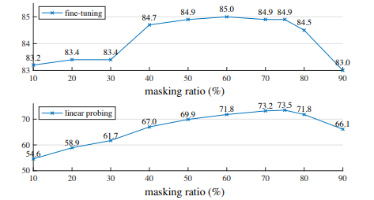
Figure 5. **Masking ratio.** 高いマスキング率（75%）は，fine-tuning（上）と linear probing（下）の両方で良好に機能する．本論文中のすべてのプロットにおいて，y 軸は ImageNet-1K validation accuracy（%）である．

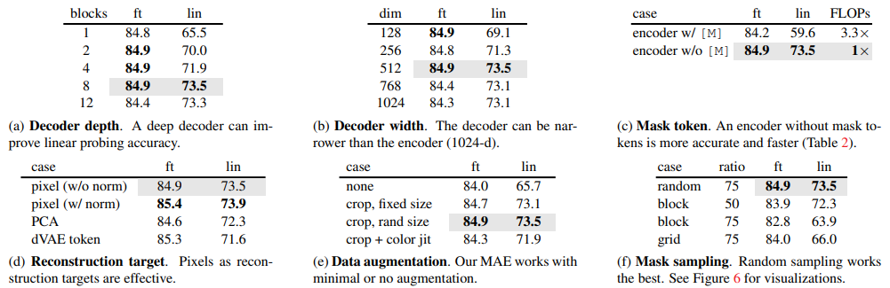
Table 1. **MAE のアブレーション実験**．ImageNet-1K 上で ViT-L/16 を用いる．fine-tuning（ft）および linear probing（lin）の精度（%）を報告する．特に指定がない場合のデフォルト設定は次の通りである：デコーダは depth 8，width 512，再構成目標は非正規化ピクセル，データ拡張は random resized cropping，マスキング率は 75%，事前学習長は 800 epochs である．デフォルト設定は `gray` で示す．

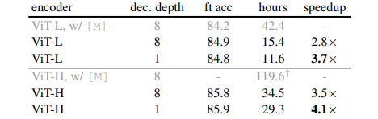
Table 2. 128 個の TPU-v3 コアと TensorFlow を用いてベンチマークした，我々の MAE 学習（800 epochs）の実時間．高速化率は，エンコーダが mask token を持つエントリ（gray）に対する相対値である．デコーダ幅は 512，マスク率は 75% である．†：このエントリは 10 epochs の学習から推定した値である．

**Decoder design.** 我々の MAE デコーダは柔軟に設計でき，その点を Table 1a および 1b で検討している．

Table 1a では，デコーダの depth（Transformer blocks の数）を変化させている．十分に深いデコーダは linear probing にとって重要である．これは，画素再構成タスクと認識タスクとの間のギャップによって説明できる．autoencoder における最後の数層は再構成により特化する一方で，認識にはあまり関係しない．適度に深いデコーダは，その再構成への特化を担うことができ，その結果，潜在表現をより抽象的なレベルに保つことができる．この設計により，linear probing では最大 8% の改善が得られる（Table 1a の ‘lin’）．しかし，fine-tuning を用いる場合には，エンコーダの最後の層を認識タスクに適応するよう調整できる．そのため，デコーダ depth は fine-tuning の改善にはそれほど大きな影響を持たない（Table 1a の ‘ft’）．

興味深いことに，単一ブロックのデコーダを持つ我々の MAE でも，fine-tuning において強い性能（84.8%）を示すことができる．単一の Transformer block は，可視トークンから mask token へ情報を伝播させるための最小要件であることに注意されたい．このような小さなデコーダは，さらに学習を高速化できる．

Table 1b では，デコーダ width（チャネル数）を検討している．我々はデフォルトで 512-d を用いており，これは fine-tuning と linear probing の両方で良好に機能する．より狭いデコーダも，fine-tuning では良好に機能する．

全体として，我々のデフォルト MAE デコーダは軽量である．それは 8 blocks と 512-d の width を持つ（Table 1 の `gray`）．ViT-L（24 blocks，1024-d）と比較して，トークンあたりの FLOPs はわずか 9% である．したがって，デコーダは全トークンを処理するものの，その計算量は全体計算量のごく一部に過ぎない．

**Mask token.** 我々の MAE の重要な設計の一つは，エンコーダ内では mask token [M] を省略し，後で軽量なデコーダにおいて適用することである．Table 1c ではこの設計を検討している．エンコーダが mask token を用いる場合，性能は悪化する．linear probing における精度は 14% 低下する．この場合，事前学習時と実運用時の間にギャップが生じる．すなわち，このエンコーダは事前学習時には入力中に多数の mask token を含むが，そのようなものは破損していない画像には存在しない．このギャップが，実運用時の精度を低下させる可能性がある．エンコーダから mask token を除去することで，エンコーダが常に実際のパッチだけを見るよう制約し，その結果として精度が向上する．

さらに，エンコーダで mask token を省略することにより，学習計算量を大幅に削減できる．Table 1c では，全体の学習 FLOPs を 3.3× 削減している．これにより，我々の実装では実時間で 2.8× の高速化が得られる（Table 2 参照）．より小さなデコーダ（1-block），より大きなエンコーダ（ViT-H），あるいはその両方の場合には，実時間での高速化はさらに大きくなる（3.5〜4.1×）．75% のマスキング率では，自己注意の計算量が二次であることもあって，高速化率が 4× を超えうる点に注意されたい．加えて，メモリ消費も大きく削減されるため，さらに大きなモデルの学習や，大バッチ学習による一層の高速化も可能になる．この時間・メモリ効率の良さにより，我々の MAE は非常に大規模なモデルの学習に適している．

**Reconstruction target.** Table 1d では，異なる再構成目標を比較している．これまでの結果は，（パッチごとの）正規化を行わないピクセルに基づいている．正規化したピクセルを用いると精度は向上する．このパッチごとの正規化は，局所的にコントラストを強調する．別の変種では，パッチ空間で PCA を行い，最大の PCA 係数（ここでは 96）を目標として用いる．これを行うと精度は低下する．両方の実験は，高周波成分が我々の手法において有用であることを示唆している．

また，我々は BEiT [2] で用いられている目標，すなわちトークンを予測する MAE 変種も比較している．この変種では具体的に，[2] に従って DALLE により事前学習された dVAE [50] を tokenizer として用いる．ここで MAE デコーダは，cross-entropy loss を用いてトークン index を予測する．この tokenization は，非正規化ピクセルに対して fine-tuning 精度を 0.4% 改善するが，正規化ピクセルに対しては優位性がない．また，linear probing 精度は低下する．さらに §5 では，転移学習において tokenization が不要であることを示す．

我々の pixel-based MAE は，tokenization よりもはるかに単純である．dVAE tokenizer は追加の事前学習段階をもう一つ必要とし，その際に追加データ（2.5 億枚の画像 [50]）へ依存する可能性がある．dVAE encoder は大規模な畳み込みネットワークであり（ViT-L の FLOPs の 40%），無視できないオーバーヘッドを加える．ピクセルを用いる場合，こうした問題は生じない．

**Data augmentation.** Table 1e では，我々の MAE 事前学習に対するデータ拡張の影響を検討している．

我々の MAE は，固定サイズあるいはランダムサイズの cropping のみの拡張でも良好に動作する（どちらもランダムな horizontal flipping を含む）．color jittering を加えると結果は悪化するため，他の実験では用いていない．

驚くべきことに，我々の MAE はデータ拡張をまったく用いない場合でも（center-crop のみ，flipping なし），そこそこの性能を示す．この性質は，データ拡張に強く依存する contrastive learning および関連手法 [62, 23, 7, 21] とは著しく異なる．[21] では，cropping-only augmentation を用いると，BYOL [21] と SimCLR [7] でそれぞれ 13% および 28% 精度が低下することが観察されている．加えて，contrastive learning が拡張なしで機能するという証拠はない．なぜなら，画像の二つの view が同一になり，容易に自明解を満たしてしまうからである．

MAE では，データ拡張の役割は主としてランダムマスキングによって果たされる（次でアブレーションする）．マスクは各 iteration ごとに異なるため，データ拡張の有無にかかわらず新たな訓練サンプルを生成する．pretext task はマスキングによって困難化されており，学習の正則化に必要な拡張も少なくて済む．

**Mask sampling strategy.** Table 1f では，Figure 6 に示す異なるマスクサンプリング戦略を比較する．

block-wise masking 戦略は，[2] によって提案されたものであり，大きなブロックを取り除く傾向がある（Figure 6 中央）．block-wise masking を用いた我々の MAE は，50% の比率ではそれなりにうまく機能するが，75% の比率では性能が低下する．このタスクはランダムサンプリングよりも難しく，より高い training loss が観察される．また，再構成もよりぼやける．

我々はまた，4 個のパッチごとに 1 個を規則的に残す grid-wise sampling も検討する（Figure 6 右）．これはより容易なタスクであり，training loss も低い．再構成はより鮮明である．しかし，表現品質は低い．

単純なランダムサンプリングが，我々の MAE にとって最も良い．それは，より高いマスキング率を可能にし，高い高速化の利点を与えると同時に，良好な精度も実現する．

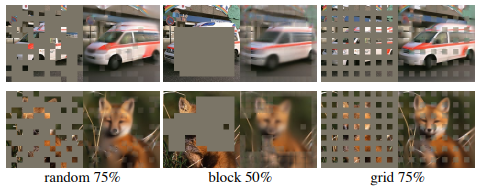
Figure 6. マスクサンプリング戦略は pretext task の難易度を決定し，それが再構成品質と表現に影響する（Table 1f）．ここで各出力は，指定したマスキング戦略で学習した MAE から得られたものである．左：ランダムサンプリング（我々のデフォルト）．中央：大きなランダムブロックを取り除く block-wise sampling [2]．右：4 個のパッチごとに 1 個を残す grid-wise sampling．画像は validation set からのものである．

**Training schedule.** これまでのアブレーションは 800-epoch の事前学習に基づいている．Figure 7 は，学習スケジュール長の影響を示している．精度は，より長い学習とともに着実に向上する．実際，1600 epochs においても linear probing 精度の飽和は観察されていない．この挙動は contrastive learning 手法とは異なる．たとえば MoCo v3 [9] は，ViT-L に対して 300 epochs で飽和する．なお，MAE エンコーダは 1 epoch あたりパッチの 25% しか見ない一方で，contrastive learning ではエンコーダは 1 epoch あたり 200%（two-crop）あるいはそれ以上（multi-crop）のパッチを見ることに注意されたい．

Figure 7. Training schedules. より長い学習スケジュールは，明確な改善をもたらす．ここで各点は，完全な学習スケジュールを表している．モデルは，Table 1 のデフォルト設定を用いた ViT-L である．

### 4.2. Comparisons with Previous Results

**自己教師あり手法との比較.** Table 3 では，自己教師あり ViT モデルの fine-tuning 結果を比較する．ViT-B では，すべての手法の性能は近い．一方で ViT-L では，手法間の差がより大きく，より大きなモデルにおける課題の一つが過学習の抑制であることを示唆している．

我々の MAE は容易にスケールアップ可能であり，モデルを大きくすることで着実な改善を示してきた．ViT-H（224 サイズ）を用いて 86.9% の精度を得る．さらに 448 サイズで fine-tuning することで，IN1K データのみを用いて 87.8% の精度を達成する．IN1K データのみを用いる全手法の中で，従来の最高精度は，高度なネットワークに基づく 87.1%（512 サイズ）[67] である．我々は，競争の激しい IN1K ベンチマーク（外部データなし）において，state-of-the-art を無視できない差で更新した．我々の結果は標準的な ViT に基づくものであり，より高度なネットワークではさらに良い性能が得られると期待される．

BEiT [2] と比較すると，我々の MAE はより高精度でありながら，より単純かつ高速である．我々の手法は画素を再構成するのに対し，BEiT はトークンを予測する．BEiT では，ViT-B において画素再構成を行うと 1.8% の性能低下が報告されている [2]．我々は dVAE の事前学習を必要としない．さらに，我々の MAE は，Table 1c で検討した理由により，BEiT よりもかなり高速である（1 epoch あたり 3.5×）．

Table 3 における MAE モデルは，より高い精度のために 1600 epochs 事前学習されている（Figure 7）．それにもかかわらず，同じハードウェアで学習した場合，我々の総事前学習時間は他手法より短い．たとえば，128 個の TPU-v3 コアで ViT-L を学習する場合，我々の MAE の学習時間は 1600 epochs で 31 時間であるのに対し，MoCo v3 は 300 epochs で 36 時間である [9]．

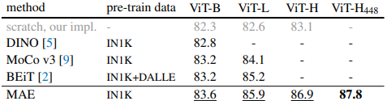
Table 3. **ImageNet-1K における従来結果との比較.** 事前学習データは ImageNet-1K の訓練セットである（ただし，BEiT の tokenizer のみは 2.5 億枚の DALLE データ [50] で事前学習されている）．すべての自己教師あり手法は，end-to-end fine-tuning によって評価される．ViT モデルは B/16，L/16，H/14 [16] である．各列で最良の結果には下線を付している．すべての結果は画像サイズ 224 におけるものであり，ViT-H についてのみ 448 の追加結果がある．ここで我々の MAE は正規化ピクセルを再構成し，1600 epochs の事前学習を行っている．

**教師あり事前学習との比較.** 元の ViT 論文 [16] では，ViT-L は IN1K 上で学習すると性能が低下する．我々の教師あり学習実装（A.2 参照）はより良く機能するが，精度は飽和する．Figure 8 を参照されたい．

IN1K のみを用いた我々の MAE 事前学習は，より良く汎化することができる．scratch からの学習に対する利得は，より高容量のモデルほど大きい．この傾向は，[16] における JFT-300M を用いた教師あり事前学習に類似している．この比較は，我々の MAE がモデルサイズのスケールアップに寄与できることを示している．

Figure 8. **MAE 事前学習 vs. 教師あり事前学習,** ImageNet-1K（224 サイズ）での fine-tuning により評価．元の ViT の結果 [16] と比較しており，それらは IN1K または JFT-300M で学習されている．

### 4.3. Partial Fine-tuning

Table 1 は，linear probing と fine-tuning の結果が大きく相関していないことを示している．linear probing はここ数年で一般的なプロトコルとなってきたが，それは強力ではあるが非線形な特徴を追求する機会を見落としている．そして，まさにそこが深層学習の強みである．その中間的な立場として，我々は partial fine-tuning のプロトコルを検討する．すなわち，最後の数層のみを fine-tune し，それ以外は凍結する．このプロトコルは初期の研究，たとえば [65, 70, 42] でも用いられていた．

Figure 9 はその結果を示している．特筆すべきは，Transformer block を1つだけ fine-tune するだけで，精度が 73.5% から 81.0% へと大きく向上することである．さらに，最後の block の「半分」のみ（すなわちその MLP sub-block）を fine-tune した場合でも，79.1% を得ることができ，linear probing より大幅に良い．この変種は，本質的には MLP head を fine-tune しているのと同じである．数個の block（たとえば 4 個または 6 個）を fine-tune すれば，full fine-tuning に近い精度を達成できる．

Figure 9 ではまた，ViT-L の結果が利用可能な contrastive 手法である MoCo v3 [9] とも比較している．MoCo v3 は linear probing 精度ではより高いが，partial fine-tuning の結果はすべて MAE より劣る．4 blocks を調整した場合の差は 2.6% である．MAE の表現は線形分離可能性という点では低いものの，より強力な非線形特徴であり，非線形 head を調整すると良好に機能する．

これらの観察は，線形分離可能性だけが表現品質を評価する唯一の指標ではないことを示唆している．また，linear probing は，たとえば物体検出のような転移学習性能と十分には相関しないことも指摘されている（例：[8]）．我々の知る限り，事前学習のベンチマークとして，NLP では線形評価はあまり用いられていない．

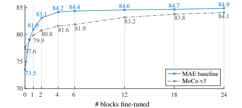
Figure 9. **Partial fine-tuning**．Table 1 のデフォルト設定において，fine-tune する Transformer blocks の数に対する ViT-L の結果．0 blocks の調整は linear probing，24 blocks は full fine-tuning に対応する．我々の MAE 表現は線形分離可能性は低いが，1 個以上の block を調整した場合には，一貫して MoCo v3 より優れている．

## 5. Transfer Learning Experiments

事前学習済みモデルとして Table 3 のモデルを用い，下流タスクにおける転移学習を評価する．

**物体検出とセグメンテーション.** COCO [37] において，Mask R-CNN [24] を end-to-end で fine-tune する．ViT バックボーンは FPN [36] で利用できるように適応する（A.3 参照）．このアプローチを Table 4 のすべてのエントリに適用する．物体検出については box AP，インスタンスセグメンテーションについては mask AP を報告する．

教師あり事前学習と比較して，我々の MAE はすべての設定でより良い性能を示す（Table 4）．より小さい ViT-B では，我々の MAE は教師あり事前学習より 2.4 ポイント高い（50.3 vs. 47.9, APbox）．さらに重要なことに，より大きい ViT-L では，我々の MAE 事前学習は教師あり事前学習を 4.0 ポイント上回る（53.3 vs. 49.3）．

pixel-based MAE は token-based BEiT と比較して，同等以上の性能を示す一方で，MAE の方がはるかに単純かつ高速である．MAE と BEiT はいずれも MoCo v3 より優れており，MoCo v3 は教師あり事前学習と同程度である．

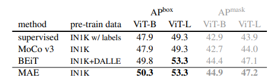
Table 4. **COCO における物体検出とセグメンテーション**．ViT Mask R-CNN ベースラインを用いる．すべてのエントリは我々の実装に基づく．自己教師ありのエントリは，ラベルなしの IN1K データを用いる．Mask AP も box AP と同様の傾向に従う．

**セマンティックセグメンテーション.** ADE20K [72] において UperNet [63] を用いて実験を行う（A.4 参照）．Table 5 は，我々の事前学習が教師あり事前学習に対して結果を大幅に改善することを示している．たとえば ViT-L では 3.7 ポイントの改善である．我々の pixel-based MAE は token-based BEiT よりも優れている．これらの観察は COCO における結果と整合的である．

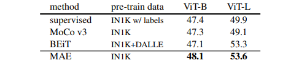
Table 5. **ADE20K セマンティックセグメンテーション**（mIoU）．UperNet を使用する．BEiT の結果は公式コードを用いて再現した．その他のエントリは我々の実装に基づく．自己教師ありのエントリはラベルなしの IN1K データを用いる．

**分類タスク.** Table 6 では，iNaturalists [56] および Places [71] タスクにおける転移学習を検討する（A.5 参照）．iNat では，我々の手法は強いスケーリング特性を示し，より大きなモデルによって精度が大きく向上する．我々の結果は，従来の最良結果を大きく上回る．Places では，我々の MAE は，数十億枚の画像での事前学習によって得られた従来の最良結果 [19, 40] を上回っている．

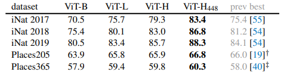
Table 6. **分類データセットにおける転移学習精度**．IN1K で事前学習した MAE を用い，その後 fine-tune した結果である．従来の最良結果とのシステムレベル比較も示す．

**Pixels vs. tokens.** Table 7 では，MAE の再構成目標として pixels と tokens を比較する．dVAE tokens を用いる方が非正規化ピクセルよりは良いが，我々が試したすべてのケースにおいて，正規化ピクセルを用いる場合と統計的に同等である．これは，再び tokenization が我々の MAE に必須ではないことを示している．

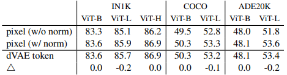
Table 7. **MAE の再構成目標としての pixels と tokens**．$\triangle$ は，dVAE tokens を用いた場合と正規化ピクセルを用いた場合との差を表す．その差は統計的に有意ではない．

## 6. Discussion and Conclusion

深層学習の中核にあるのは，うまくスケールする単純なアルゴリズムである．NLP においては，単純な自己教師あり学習法（たとえば [47, 14, 48, 4]）が，指数関数的にスケールするモデルの恩恵を可能にしている．コンピュータビジョンにおいては，自己教師あり学習の進展があるにもかかわらず，実用的な事前学習パラダイムは依然として教師ありが支配的である（たとえば [33, 51, 25, 16]）．本研究では，我々は ImageNet および転移学習において，autoencoder という，NLP の技法に類似した単純な自己教師あり手法が，スケーラブルな利点をもたらすことを観察した．ビジョンにおける自己教師あり学習も，いまや NLP と同様の軌道に乗り始めているのかもしれない．

一方で，我々は，画像と言語が本質的に異なる種類の信号であり，この違いには慎重に対処しなければならないことを指摘する．画像は，視覚における「単語」に相当するような意味的分解を持たない，単なる記録された光である．我々は物体を取り除こうとするのではなく，意味的なセグメントを形成していない可能性が高いランダムパッチを取り除く．同様に，我々の MAE は，意味的実体ではない画素を再構成する．それにもかかわらず，我々は（たとえば Figure 4 に示すように）MAE が複雑で全体的な再構成を推論することを観察しており，これは MAE が多くの視覚概念，すなわち意味情報を学習していることを示唆している．我々は，この振る舞いが，MAE 内部の豊かな潜在表現を通じて生じているのではないかと仮定している．この観点が，将来の研究を刺激することを期待している．

**より広い影響.** 提案手法は，学習データセットの統計に基づいて内容を予測するため，負の社会的影響を持ちうるものを含め，それらのデータに含まれるバイアスを反映する．また，モデルは実在しない内容を生成する可能性もある．これらの問題は，本研究を基に画像生成へ発展させる際に，さらなる研究と慎重な検討を要する．