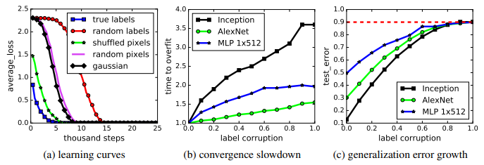
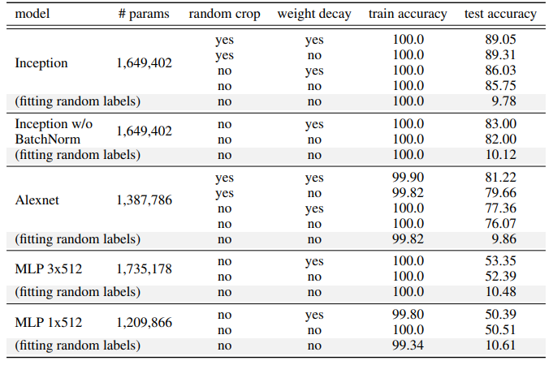
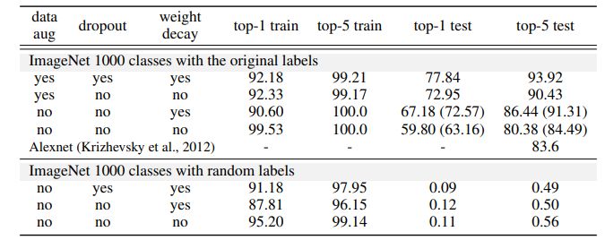
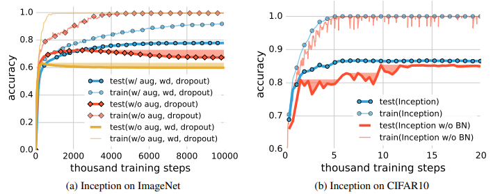
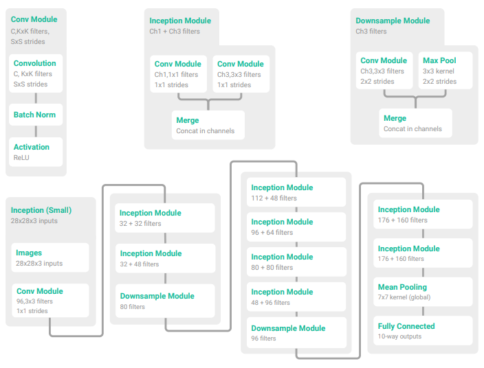

# UNDERSTANDING DEEP LEARNING REQUIRES RETHINKING GENERALIZATION

## ABSTRACT

大規模であるにもかかわらず、成功している深層人工ニューラルネットワークは、訓練性能とテスト性能の差が驚くほど小さいことがある。一般的な見方では、このような小さな汎化誤差は、モデル族そのものの性質、あるいは学習時に用いられる正則化手法によって説明されると考えられてきた。広範かつ体系的な実験を通して、我々は、これらの伝統的な説明では、なぜ大規模ニューラルネットワークが実際に高い汎化性能を示すのかを説明できないことを示す。具体的には、我々の実験は、確率的勾配法によって学習された最先端の画像分類用畳み込みネットワークが、訓練データに対するランダムなラベル付けでさえ容易に適合できることを明らかにした。この現象は、明示的な正則化の有無によって本質的に変わらず、さらに真の画像を完全に構造のないランダムノイズに置き換えた場合であっても生じる。さらに我々は、この実験的知見を理論的にも裏づけるため、パラメータ数がデータ点数を上回るとき――これは実際の応用でしばしば見られる状況である――単純な2層ニューラルネットワークでさえ有限サンプルに対して完全な表現能力を持つことを示す構成を与える。最後に、これらの実験結果を従来のモデルとの比較を通して解釈する。

## 1. INTRODUCTION

深層人工ニューラルネットワークは、しばしば、学習に用いられるサンプル数をはるかに上回る数の学習可能なモデルパラメータを持つ。それにもかかわらず、これらのモデルの一部は、きわめて小さな汎化誤差、すなわち「訓練誤差」と「テスト誤差」の差を示す。一方で、汎化性能の低い自然なモデルアーキテクチャを考えることは確かに容易である。では、よく汎化するニューラルネットワークと、そうでないものを分けているものは何なのだろうか。この問いに対する満足のいく答えは、ニューラルネットワークをより解釈可能にする助けとなるだけでなく、より原理的で信頼性の高いモデルアーキテクチャ設計にもつながる可能性がある。このような問いに答えるため、統計的学習理論は、汎化誤差を制御しうるさまざまな複雑さ尺度を提案してきた。これには、VC次元（Vapnik, 1998）、Rademacher複雑度（Bartlett & Mendelson, 2003）、一様安定性（Mukherjee et al., 2002; Bousquet & Elisseeff, 2002; Poggio et al., 2004）が含まれる。さらに、パラメータ数が大きい場合には、小さな汎化誤差を保証するために何らかの正則化が必要であることが理論的に示唆されている。正則化は、早期終了のように暗黙的な形で作用する場合もある。

### 1.1 OUR CONTRIBUTIONS

本研究では、従来の汎化観が、汎化性能が著しく異なる異種のニューラルネットワークを区別できないことを示すことで、その見方自体に疑問を投げかける。 

#### ランダム化テスト

我々の方法論の中心にあるのは、ノンパラメトリック統計においてよく知られたランダム化検定（Edgington & Onghena, 2007）の変種である。最初の一連の実験では、真のラベルをランダムなラベルに置き換えたデータの複製に対して、いくつかの標準的なアーキテクチャを学習させる。我々の中心的な発見は、次のように要約できる。 

```math
\text{深層ニューラルネットワークはランダムラベルを容易に適合できる。}
```

より正確には、真のデータに対して完全にランダムなラベル付けを施して学習させると、ニューラルネットワークは訓練誤差 0 を達成する。もちろん、訓練ラベルとテストラベルの間には相関がないため、テスト誤差はランダム推測より良くはならない。言い換えれば、ラベルをランダム化するだけで、モデルそのもの、そのサイズ、ハイパーパラメータ、あるいはオプティマイザを一切変えることなく、モデルの汎化誤差を大きく跳ね上がらせることができる。我々はこの事実を、CIFAR10 および ImageNet の画像分類ベンチマーク上で学習された複数の標準的アーキテクチャについて確認する。この観察は一見単純だが、統計的学習の観点から深い含意を持つ。 

1. ニューラルネットワークの実効容量は、データセット全体を記憶するのに十分である。
2. ランダムラベルに対する最適化でさえ依然として容易である。実際、学習時間は真のラベルで学習した場合に比べて、わずかな定数倍しか増加しない。
3. ラベルのランダム化は純粋にデータ変換にすぎず、学習問題のそれ以外の性質はすべて不変である。 

この最初の実験群をさらに拡張し、我々は真の画像そのものも完全にランダムな画素値（たとえばガウス雑音）に置き換えた。その結果、畳み込みニューラルネットワークはなおも訓練誤差 0 でデータに適合し続けることが分かった。これは、畳み込みニューラルネットワークが、その構造を持ちながらもランダムノイズに適合できることを示している。さらに我々は、ランダム化の量を変化させ、ノイズなしのケースから完全ノイズのケースまで滑らかに補間する。その結果、ラベルにある程度の信号がなお残っている中間的な学習問題の連続体が得られる。我々は、ノイズ水準を高めるにつれて汎化誤差が着実に悪化することを観察する。これは、ニューラルネットワークがデータ中に残された信号を捉える一方で、ノイズ成分を力任せに適合していることを示している。 

以下でさらに詳しく議論するように、これらの観察は、最先端のニューラルネットワークの汎化性能を説明するものとして、VC 次元、Rademacher 複雑度、一様安定性のいずれも成立しえないことを示している。 

#### 明示的正則化の役割

モデルアーキテクチャそのものが十分な正則化として機能しないのであれば、次に問題となるのは、明示的正則化がどの程度役立つのかである。我々は、weight decay、dropout、データ拡張といった明示的な正則化の形態が、ニューラルネットワークの汎化誤差を十分には説明できないことを示す。言い換えれば、次の通りである。 

```math
\text{明示的正則化は汎化性能を改善しうるが、汎化誤差を制御するために必要でも、それだけで十分でもない。}
```

古典的な凸経験リスク最小化では、明示的正則化は自明な解を排除するために必要であるのに対し、深層学習において正則化はかなり異なる役割を果たしていることが分かった。それは、しばしばモデルの最終的なテスト誤差の改善を助けるチューニングパラメータのようなものであり、すべての正則化を取り除いたからといって、必ずしも汎化誤差が悪化するとは限らない。Krizhevsky et al. (2012) が報告しているように、$\ell_2$ 正則化（weight decay）は、ときには最適化そのものを助けることすらあり、これは深層学習においてその性質が十分に理解されていないことを示している。 

#### 有限サンプル表現能力

我々は経験的観察を補完するために、一般に十分大きなニューラルネットワークは、訓練データに対するいかなるラベル付けも表現できることを示す理論的構成を与える。より厳密には、$d$ 次元におけるサイズ $n$ の任意の標本に対する任意のラベル付けを表現できる、パラメータ数 $p = 2n + d$ の非常に単純な 2 層 ReLU ネットワークを構成する。Livni et al. (2014) による先行研究も類似の結果を示しているが、そのために必要なパラメータ数ははるかに多く、$O(dn)$ であった。我々の深さ 2 のネットワークは必然的に幅が大きいものの、深さ $k$ のネットワークであって各層のパラメータ数が $O(n/k)$ にすぎないものも構成できる。 

従来の表現能力に関する結果は、ニューラルネットワークが定義域全体でどのような関数を表現できるかに焦点を当てていたが、我々は代わりに、有限標本に対するラベル付けという観点からの表現能力に注目する。関数空間における既存の深さ分離結果（Delalleau & Bengio, 2011; Eldan & Shamir, 2016; Telgarsky, 2016; Cohen & Shashua, 2016）とは対照的に、我々の結果は、線形サイズの深さ 2 ネットワークであっても、訓練データに対する任意のラベル付けをすでに表現できることを示している。 

#### 暗黙的正則化の役割

dropout や weight decay のような明示的正則化が汎化に本質的ではないとしても、訓練データによく適合するすべてのモデルがよく汎化するわけではないのは確かである。実際、ニューラルネットワークでは、我々はほとんど常に、確率的勾配降下法を実行した結果として得られる出力をモデルとして選んでいる。線形モデルとの類比に基づいて、我々は SGD がどのように暗黙的正則化として働くかを分析する。線形モデルでは、SGD は常にノルムの小さい解へと収束する。したがって、アルゴリズムそのものが暗黙的に解を正則化しているのである。実際、小規模データセットにおいては、ガウスカーネル法でさえ正則化なしに良好な汎化を示しうることを我々は示す。もちろん、これはなぜあるアーキテクチャが別のアーキテクチャよりよく汎化するのかを説明するものではない。しかし少なくとも、SGD によって学習されたモデルがどのような性質を受け継いでいるのかを正確に理解するためには、さらなる検討が必要であることを示唆している。 

### 1.2 RELATED WORK

Hardt et al. (2016) は、確率的勾配降下法によって学習されたモデルの汎化誤差に対して、勾配降下法が何ステップ進んだかに基づく上界を与えている。彼らの解析は、一様安定性（Bousquet & Elisseeff, 2002）という概念を通じて行われる。本研究で指摘するように、学習アルゴリズムの一様安定性は、訓練データのラベル付けとは独立である。したがって、この概念は、真のラベルで学習されたモデル（小さい汎化誤差）と、ランダムラベルで学習されたモデル（大きい汎化誤差）とを区別するには十分に強くない。このことはまた、非凸最適化に対する Hardt et al. (2016) の解析が、データに対する反復回数をごく少数回しか許さないという点で、かなり悲観的であった理由も浮き彫りにしている。我々の結果は、ニューラルネットワークを経験的に学習させた場合であっても、多数回のデータ反復に対しては一様安定ではないことを示している。したがって、この方向でさらに前進するには、より弱い安定性の概念が必要である。

ニューラルネットワークの表現能力については、多層パーセプトロンに対する普遍近似定理（Cybenko, 1989; Mhaskar, 1993; Delalleau & Bengio, 2011; Mhaskar & Poggio, 2016; Eldan & Shamir, 2016; Telgarsky, 2016; Cohen & Shashua, 2016）に始まる多くの研究がある。これらの結果はいずれも母集団レベルの議論であり、ある種のニューラルネットワーク族が定義域全体にわたってどのような数学的関数を表現できるかを特徴づけている。これに対して我々は、サイズ $n$ の有限標本に対するニューラルネットワークの表現能力を考察する。すると、$O(n)$ サイズの 2 層パーセプトロンでさえ、有限標本に対して普遍的な表現能力を持つことが、非常に簡潔に証明できる。

Bartlett (1998) は、シグモイド活性化を持つ多層パーセプトロンの fat-shattering dimension に関する上界を、各ノードにおける重みの $\ell_1$ ノルムによって与えた。この重要な結果は、ネットワークサイズに依存しないニューラルネットワークの汎化境界を与える。しかし、ReLU ネットワークでは $\ell_1$ ノルムはもはや有益な情報を与えない。そこから、大規模ニューラルネットワークの汎化誤差を抑える別の形の容量制御が存在するのか、という問いが生じる。この問いは、Neyshabur et al. (2014) の示唆に富む研究で提起されており、彼らは実験を通して、ネットワークサイズはニューラルネットワークにおける主要な容量制御の形ではないと論じた。さらに、行列分解とのアナロジーによって、暗黙的正則化の重要性が示された。

## 2. EFFECTIVE CAPACITY OF NEURAL NETWORKS

我々の目標は、フィードフォワードニューラルネットワークの実効的なモデル容量を理解することである。この目的に向けて、我々はノンパラメトリックなランダム化検定に着想を得た方法論を採用する。具体的には、ある候補アーキテクチャを取り上げ、それを真のデータと、真のラベルをランダムラベルに置き換えたデータの複製の両方で学習させる。後者の場合、インスタンスとクラスラベルの間にはもはやいかなる関係も存在しない。その結果、学習は不可能になるはずである。直観的には、この不可能性は、たとえば学習が収束しない、あるいは著しく遅くなるといった形で、学習過程に明確に現れるはずである。ところが驚くべきことに、複数の標準的アーキテクチャにおける学習過程のいくつかの性質は、このラベル変換の影響をほとんど受けない。これは概念的な挑戦を突きつける。というのも、もともと小さな汎化誤差を期待する根拠としていたものは何であれ、ランダムラベルの場合にはもはや当てはまらないはずだからである。



Figure 1: CIFAR10 におけるランダムラベルおよびランダム画素への適合。(a) は、さまざまな実験設定における訓練損失が、学習ステップの進行とともに減衰していく様子を示す。(b) は、ラベルの破損率を変化させたときの相対的な収束時間を示す。(c) は、異なるラベル破損率のもとでのテスト誤差（訓練誤差が 0 であるため、これはそのまま汎化誤差でもある）を示す。

この現象をさらに深く理解するために、我々は、ラベルノイズがまったくない場合からラベルが完全に破損した場合までの連続体を探索する形で、異なるランダム化の水準について実験を行う。また、ラベルではなく入力そのものに対する異なるランダム化も試み、同様の一般的結論に到達する。

これらの実験は、2つの画像分類データセット、すなわち CIFAR10 データセット（Krizhevsky & Hinton, 2009）と ImageNet（Russakovsky et al., 2015）ILSVRC 2012 データセット上で実施される。我々は、ImageNet では Inception V3（Szegedy et al., 2016）アーキテクチャを、CIFAR10 ではその小型版である Inception、AlexNet（Krizhevsky et al., 2012）、および MLP を評価対象とする。実験設定の詳細については、付録の Section A を参照されたい。

### 2.1 FITTING RANDOM LABELS AND PIXELS

我々は、ラベルおよび入力画像に対して以下の変更を加えた条件で実験を行う。

* **True labels:** 元のデータセットをそのまま用いる。
* **Partially corrupted labels:** 各画像のラベルを、確率 $p$ で独立に一様ランダムなクラスへと破損させる。
* **Random labels:** すべてのラベルをランダムなものに置き換える。
* **Shuffled pixels:** 画素に対するランダムな置換を 1 つ選び、その同じ置換を訓練集合およびテスト集合のすべての画像に適用する。
* **Random pixels:** 各画像に対して、それぞれ独立に異なるランダムな置換を適用する。
* **Gaussian:** 元の画像データセットと平均および分散が一致するガウス分布を用いて、各画像のランダム画素を生成する。

驚くべきことに、ハイパーパラメータ設定を一切変えなくても、確率的勾配降下法は、画像とラベルの関係を完全に破壊してしまうランダムラベルに対してさえ、重みを最適化して完全に適合させることができる。さらに我々は、画像の画素をシャッフルすることで画像の構造を壊し、さらにはガウス分布からランダム画素を完全に再サンプリングすることまで試みた。しかし、我々が検証したネットワークはなおも適合可能であった。

図 1a は、CIFAR10 データセットにおける Inception モデルの各種設定下での学習曲線を示している。ランダムラベルでは、各訓練サンプルに対するラベル割当てが初期状態では無相関であるため、目的関数が減少し始めるまでにより時間がかかると予想される。したがって、大きな予測誤差が逆伝播され、パラメータ更新のための大きな勾配が生じる。しかし、ランダムラベルは各エポックを通じて固定され一貫しているため、ネットワークは訓練集合を複数回見た後に適合を開始する。ランダムラベルへの適合に関して、我々は次の観察を非常に興味深いと考える。(a) 学習率スケジュールを変更する必要がない。(b) いったん適合が始まると、急速に収束する。(c) 訓練集合に対して完全に（過剰に）適合する形で収束する。また、「random pixels」および「Gaussian」は「random labels」よりも速く収束を開始する点にも注意されたい。これは、ランダム画素の場合、もともと同じカテゴリに属していた自然画像よりも入力同士が互いにより分離しているため、任意のラベル割当てに対応するネットワークを構築しやすいからかもしれない。

CIFAR10 データセットでは、AlexNet および MLP もすべて訓練集合上で損失 0 に収束する。表 1 の網掛けされた行には、正確な数値と実験設定が示されている。我々はまた、ImageNet データセットでもランダムラベルを試した。付録の表 2 の最後の 3 行に示されているように、top-1 精度 100% には到達しないものの、1000 カテゴリにわたる 100 万件のランダムラベルに対して 95.20% の精度はなお非常に驚くべき結果である。なお、真のラベルからランダムラベルへ切り替える際に、我々はハイパーパラメータ調整を一切行っていない。ハイパーパラメータを多少修正すれば、ランダムラベルに対して完全精度を達成できる可能性は高い。また、明示的正則化を有効にした場合であっても、ネットワークは約 90% の top-1 精度に到達している。

#### 部分的に破損したラベル

さらに我々は、CIFAR10 データセットにおいて、ラベル破損の度合いを 0（破損なし）から 1（完全なランダムラベル）まで変化させたときのニューラルネットワーク学習の振る舞いを詳しく調べる。ネットワークは、いずれの条件においても、破損した訓練集合に対して完全に適合する。図 1b は、ラベルノイズの水準が上がるにつれて収束時間がどのように遅くなるかを示している。図 1c は、収束後のテスト誤差を描いている。訓練誤差は常に 0 であるため、テスト誤差はそのまま汎化誤差と一致する。ノイズ水準が 1 に近づくにつれて、汎化誤差は 90% に収束する。これは、CIFAR10 におけるランダム推測の性能に対応する。

### 1.2 IMPLICATIONS

我々は、ランダム化実験の結果を踏まえて、汎化を論じるためのいくつかの伝統的アプローチに対し、我々の知見がどのような挑戦を突きつけるかを議論する。

#### Rademacher 複雑度と VC 次元

Rademacher 複雑度は、仮説クラスの複雑さを測るために広く用いられている柔軟な尺度である。データセット ${x_1,\ldots,x_n}$ 上における仮説クラス $\mathcal{H}$ の経験的 Rademacher 複雑度は、次のように定義される。

```math
\hat{\mathcal{R}_n}(\mathcal{H})=\mathbb{E}\Bigl[\underset{h\in\mathcal{H}}{\mathrm{sup}}\frac{1}{n}\sum_{i=1}^n \sigma_i h(x_i)\Bigr]\tag{1}
```

ここで、$\sigma_1,\ldots,\sigma_n\in{\plusmn 1}$ は独立同分布に従う一様ランダム変数である。この定義は、我々のランダム化テストと非常によく似ている。具体的には、$\hat{\mathcal{R}_n}(\mathcal{H})$ は、$\mathcal{H}$ がランダムな $\pm 1$ の二値ラベル割当てにどれだけ適合できるかを測っている。我々が扱っているのは多クラス問題ではあるが、同様の実験的観察が成り立つ対応する二値分類問題を考えることは容易である。我々のランダム化テストは、多くのニューラルネットワークがランダムラベルに対しても訓練集合を完全に適合できることを示唆しているため、対応するモデルクラス $\mathcal{H}$ に対しては $\hat{\mathcal{R}_n}(\mathcal{H})\approx 1$ であると期待される。もちろん、これは Rademacher 複雑度に対する自明な上界であり、現実的な設定において有用な汎化境界にはつながらない。同様の議論は、ネットワークにさらなる制約を課さない限り、VC 次元やその連続的類似物である fat-shattering dimension に対しても当てはまる。Bartlett (1998) は、ネットワーク重みの $\ell_1$ ノルム制約に基づいて fat-shattering dimension の上界を示しているが、この境界は、ここで我々が考えている ReLU ネットワークには適用できない。この結果は Neyshabur et al. (2015) によって他のノルムにも一般化されたが、それでもなお、我々が観察する汎化挙動を説明しているようには見えない。

#### 一様安定性

仮説クラスの複雑さ尺度から離れて、代わりに学習に用いられるアルゴリズムの性質を考えることもできる。これは通常、一様安定性（Bousquet & Elisseeff, 2002）のような何らかの安定性概念によって行われる。アルゴリズム A の一様安定性は、1 個のサンプルを別のものに置き換えたときに、そのアルゴリズムがどれだけ敏感に反応するかを測る。しかし、それはあくまでアルゴリズムそのものの性質にすぎず、データの具体的性質やラベル分布の詳細を考慮に入れない。より弱い安定性概念を定義することも可能である（Mukherjee et al., 2002; Poggio et al., 2004; Shalev-Shwartz et al., 2010）。最も弱い安定性尺度は、汎化誤差の上界を与えることと直接同値であり、実際にデータも考慮に入れる。しかし、このより弱い安定性概念を有効に活用することは難しかった。

## 3. THE ROLE OF REGULARIZATION

我々のランダム化テストの大部分は、明示的正則化を無効にした状態で行われている。正則化は、パラメータ数がデータ点数を上回る領域において過学習を緩和するための、理論・実践の両面で標準的な手法である（Vapnik, 1998）。基本的な考え方は、もとの仮説クラスがそのままでは十分に汎化できないほど大きすぎるとしても、正則化によって学習を複雑さが制御可能な仮説空間の部分集合に閉じ込めることができる、というものである。たとえば、最適解のノルムにペナルティを課すような明示的正則化を加えることで、ありうる解の有効 Rademacher 複雑度は大幅に低下する。

これから見るように、深層学習においては、明示的正則化はかなり異なる役割を果たしているように見える。付録の表 2 の下段が示すように、dropout と weight decay を用いた場合であっても、InceptionV3 はランダムな訓練集合に対して、完全でないにせよ、依然としてきわめてよく適合できる。明示的には示していないが、CIFAR10 では、Inception も MLP も、weight decay を有効にしたままでランダムな訓練集合に対してなお完全に適合する。しかし、weight decay を有効にした AlexNet は、ランダムラベルに対しては収束しない。深層学習における正則化の役割を調べるために、我々は、正則化ありの場合となしの場合とで深層ネットワークの学習挙動を明示的に比較する。

深層学習のために提案されてきたあらゆる種類の正則化技法を網羅的に調査する代わりに、我々は単に、いくつかの一般的によく用いられるネットワークアーキテクチャを取り上げ、それらに備わっている正則化を無効にしたときの挙動を比較する。対象とする正則化は以下の通りである。

* **Data augmentation:** ドメイン固有の変換によって訓練集合を拡張する。画像データでは、一般によく用いられる変換として、ランダムクロッピング、明るさ・彩度・色相・コントラストのランダム摂動などがある。
* **Weight decay:** 重みに対する $\ell_2$ 正則化と等価であり、また、weight decay の強さによって半径が決まるユークリッド球内に重みを制約するハード制約とも等価である。
* **Dropout**（Srivastava et al., 2014）: ある層の出力の各要素を、与えられた dropout 確率でランダムにマスクする。我々の実験では、ImageNet に対する Inception V3 のみが dropout を用いている。

Table 1: CIFAR10 データセットにおける各種モデルの訓練精度およびテスト精度（%）を示す。データ拡張および weight decay の有無による性能を比較している。また、ランダムラベルへの適合結果も含めている。



表 1 は、CIFAR10 における Inception、AlexNet、MLP の結果を示しており、データ拡張および weight decay の使用有無を切り替えて比較している。両方の正則化手法は汎化性能の改善に寄与しているが、すべての正則化を無効にした場合であっても、すべてのモデルは依然として非常に良好に汎化する。

付録の表 2 は、ImageNet データセットに対する同様の実験を示している。すべての正則化を無効にすると、top-1 精度は 18% 低下する。具体的には、正則化なしの top-1 精度は 59.80% であるのに対し、ImageNet におけるランダム推測の top-1 精度はわずか 0.1% でしかない。さらに注目すべきことに、データ拡張のみを有効にし、その他の明示的正則化を無効にした場合でも、Inception は 72.95% の top-1 精度を達成できる。実際、既知の対称性を用いてデータ拡張を行う能力は、単に weight decay を調整したり、訓練誤差が低くなりすぎるのを防いだりすることよりも、はるかに強力であるように見える。

また、Inception は正則化なしでも top-5 精度 80.38% を達成しており、これは ILSVRC 2012 の優勝モデル（Krizhevsky et al., 2012）が報告した 83.6% にかなり近い。したがって、正則化は重要ではあるものの、より大きな改善は、単にモデルアーキテクチャを変更するだけで達成されうる。深層ネットワークの汎化能力において、正則化が本質的な相転移をもたらすものだとまでは言いがたい。

表 2 は、ImageNet における真のラベルの場合とランダムラベルの場合、それぞれの性能を示している。



### 3.1 IMPLICIT REGULARIZATIONS

早期終了は、いくつかの凸学習問題において暗黙的な正則化として働くことが示されている（Yao et al., 2007; Lin et al., 2016）。付録の表 2 では、学習過程における最良のテスト精度を括弧内に示している。これは、早期終了が汎化性能を改善しうることを裏づけている。図 2a は、ImageNet における訓練精度とテスト精度を示している。網掛け部分は、早期終了によって得られうる潜在的性能向上の参照として、累積的な最良テスト精度を表している。しかし、CIFAR10 データセットでは、我々は早期終了による明確な利点を観察していない。

バッチ正規化（Ioffe & Szegedy, 2015）は、各ミニバッチ内で層応答を正規化する演算である。これは Inception（Szegedy et al., 2016）や Residual Networks（He et al., 2016）など、多くの現代的ニューラルネットワークアーキテクチャで広く採用されている。明示的に正則化を目的として設計されたものではないが、バッチ正規化は通常、汎化性能を改善することが知られている。Inception アーキテクチャは多数のバッチ正規化層を用いている。バッチ正規化の影響を調べるために、我々は、図 3 に示した Inception とまったく同一だが、すべてのバッチ正規化層を取り除いた “Inception w/o BatchNorm” アーキテクチャを作成した。図 2b は、すべての明示的正則化を無効にした状態での、CIFAR10 におけるこの 2 つの Inception 変種の学習曲線を比較している。正規化演算は学習ダイナミクスの安定化には役立つが、汎化性能への影響は 3〜4% にとどまる。正確な精度は、表 1 の “Inception w/o BatchNorm” の節にも記載されている。

要するに、明示的正則化と暗黙的正則化の両方に関する我々の観察は一貫して、正則化は適切に調整されれば汎化性能の改善に役立ちうることを示している。しかし、すべての正則化を取り除いた後でもネットワークはなお良好な性能を示し続けるため、正則化が汎化の根本的理由である可能性は低い。



Figure 2: 暗黙的正則化が汎化性能に及ぼす影響。aug は data augmentation、wd は weight decay、BN は batch normalization を表す。網掛け領域は、早期終了によって得られうる潜在的性能向上の指標として、累積的な最良テスト精度を示している。(a) 他の正則化が存在しない場合、早期終了は汎化を改善する可能性がある。(b) CIFAR10 では早期終了が必ずしも有効とは限らないが、batch normalization は学習過程を安定化し、汎化を改善する。



Figure 3: CIFAR10 データセット向けに調整した小型 Inception モデル。左側には Conv モジュール、Inception モジュール、および Downsample モジュールを示しており、これらを用いて右側の Inception アーキテクチャを構成している。

## 4. FINITE-SAMPLE EXPRESSIVITY

ニューラルネットワークの表現能力を特徴づけるために、多くの努力が注がれてきた。たとえば、Cybenko (1989)、Mhaskar (1993)、Delalleau & Bengio (2011)、Mhaskar & Poggio (2016)、Eldan & Shamir (2016)、Telgarsky (2016)、Cohen & Shashua (2016) などである。これらの結果のほとんどすべては「母集団レベル」の議論であり、同じ数のパラメータを持つある種のニューラルネットワーククラスが、定義域全体にわたるどのような関数を表現でき、どのような関数を表現できないかを示している。たとえば、母集団レベルでは、深さ $k$ は一般に深さ $k-1$ よりも強い表現力を持つことが知られている。

我々は、実際により重要なのは、サイズ $n$ の有限標本上におけるニューラルネットワークの表現力であると主張する。母集団レベルの結果を有限標本レベルの結果へ移すことは、一様収束定理を用いれば可能である。しかし、そのような一様収束境界を得るには、標本サイズが入力次元に対して多項式的に大きく、かつネットワークの深さに対して指数的に大きくなければならず、実用上は明らかに非現実的な要請となる。

そこで我々は、ニューラルネットワークの有限標本に対する表現能力を直接解析し、それによって状況が劇的に単純化されることを指摘する。具体的には、ネットワークのパラメータ数 $p$ が $n$ を上回りさえすれば、単純な 2 層ニューラルネットワークであっても、入力標本上の任意の関数を表現できる。我々は、ニューラルネットワーク $C$ が、$d$ 次元におけるサイズ $n$ の標本上の任意の関数を表現できるとは、任意の標本 $S\subseteq\mathbb{R}^d$ で $|S|=n$ を満たすものと、任意の関数 $f:S\rightarrow\mathbb{R}$ に対して、$C$ の重みを適切に設定することで、すべての $x\in S$ について $C(x)=f(x)$ が成り立つことをいう。

$$
\begin{aligned}
&\textbf{定理 1.}\\
&\text{ReLU 活性化を持ち、重み数が }2n+d\text{ である 2 層ニューラルネットワークで、}\\
&\text{サイズ }n\text{、}d\text{ 次元の標本上の任意の関数を表現できるものが存在する。}
\end{aligned}
$$

証明は付録の Section C に与えられており、そこではさらに、深さ $k$ のときに幅を $O(n/k)$ にする方法についても議論している。なお、我々の構成における係数ベクトルの重みに対して上界を与えることは容易である。補題 1 は、行列 $A$ の最小固有値に対する上界を与える。これを用いることで、解 $w$ の重みに対しても妥当な上界を与えることができる。

## 5. IMPLICIT REGULARIZATION: AN APPEAL TO LINEAR MODELS

深層ニューラルネットワークが多くの理由で依然として謎に包まれているとはいえ、本節では、線形モデルにおいても汎化の源泉を理解することが必ずしも容易ではない点に注意したい。実際、線形モデルという単純な場合に立ち返ることは、ニューラルネットワークをよりよく理解する助けとなる並行的な洞察が得られるかを考えるうえで有益である。 

$n$ 個の相異なるデータ点 ${(x_i, y_i)}$ を集めたとしよう。ここで、$x_i$ は $d$ 次元の特徴ベクトル、$y_i$ はラベルである。さらに、$\mathrm{loss}(y,y)=0$ を満たす非負の損失関数を $\mathrm{loss}$ として、次の経験リスク最小化（ERM）問題を考える。 

$$
\underset{w\in\mathbb{R}^d}{\min}\frac{1}{n}\sum_{i=1}^n\mathrm{loss}(w^\top x_i, y_i)\tag{2}
$$

もし $d\geq n$ であれば、任意のラベル付けに適合できる。では、このように非常に豊かなモデルクラスで、しかも明示的正則化なしに汎化することは可能なのだろうか。 

$X$ を、$i$ 行目が $x_i^\top$ である $n\times d$ のデータ行列とする。もし $X$ の階数が $n$ であれば、連立方程式 $Xw=y$ は、右辺が何であっても無限個の解を持つ。したがって、線形系を解くだけで、ERM 問題 (2) の大域最小解を見つけることができる。 

しかし、すべての大域最小解は同じ程度によく汎化するのだろうか。ある大域最小解は汎化し、別のものは汎化しない、という違いを見分ける方法はあるのだろうか。極小解の質を理解するためのよく知られた方法の一つは、その解における損失関数の曲率を見ることである。しかし線形の場合、すべての最適解において曲率は同じである（Choromanska et al., 2015）。これを見るために、$y_i$ がスカラーである場合には、 

$$
\nabla^2\frac{1}{n}\sum_{i=1}^n\mathrm{loss}(w^\top x_i, y_i)=\frac{1}{n}X^\top\mathrm{diag}(\beta)X,\qquad\Bigl(\beta_i:=\left.\frac{\partial^2\mathrm{loss}(z,y_i)}{\partial z^2}\right|_{z=y_i},\quad\forall i\Bigr)
$$

が成り立つ。$y$ がベクトル値の場合にも、同様の式を得ることができる。特に、ヘッセ行列は $w$ の選び方に依存しない。さらに、ヘッセ行列はすべての大域最適解において退化している。 

曲率が大域最小解を区別しないのだとすれば、何が区別するのだろうか。有望な方向は、代表的アルゴリズムである確率的勾配降下法（SGD）を考え、SGD がどの解へ収束するかを調べることである。SGD の更新は $w_{t+1}=w_t-\eta_t e_t x_{i_t}$ という形をとる。ここで、$\eta_t$ はステップサイズ、$e_t$ は予測誤差損失である。もし $w_0=0$ であれば、解はある係数 $\alpha$ を用いて $w=\sum_{i=1}^n\alpha_i x_i$ という形を持たなければならない。したがって、SGD を走らせると $w=X^\top\alpha$ となり、これはデータ点たちの張る部分空間に属する。さらにラベルを完全に補間するならば $Xw=y$ も成り立つ。この二つの条件を同時に課すと、問題は次の一つの方程式に帰着する。 

$$
XX^\top\alpha=y\tag{3}
$$

これは一意解を持つ。なお、この方程式はデータ点 $x_i$ 同士の内積のみに依存している。これにより、やや回りくどい形ではあるが、「カーネルトリック」（Scholkopf et al., 2001）を導いたことになる。 

したがって、データに対する Gram 行列（すなわちカーネル行列）$K=XX^\top$ を作り、線形系 $K\alpha=y$ を $\alpha$ について解くことで、任意のラベル集合に完全に適合できる。これは $\alpha\times\alpha$ の線形系であり、CIFAR10 や MNIST のような小規模ベンチマークのように $n$ が 10 万未満であれば、標準的なワークステーション上で十分に解くことができる。 

非常に驚くべきことに、訓練ラベルに正確に適合させるだけで、凸モデルにおいて優れた性能が得られる。MNIST では、前処理なしであっても、単に (3) を解くだけでテスト誤差 1.2% を達成できる。もっとも、これはまったく簡単というわけではなく、カーネル行列を保存するには 30GB のメモリが必要である。それでも、この線形系は、24 コア・256GB RAM を備えた一般的なワークステーション上で、通常の LAPACK 呼び出しにより 3 分未満で解くことができる。さらに、まずデータに Gabor ウェーブレット変換を施してから (3) を解くと、MNIST における誤差は 0.6% まで低下する。驚くべきことに、正則化を加えても、どちらのモデルの性能も改善しない。 

CIFAR10 でも同様の結果が得られる。画素に対して単純に Gaussian カーネルを適用し、正則化なしで用いるだけで、テスト誤差 46% を達成する。さらに、32,000 個のランダムフィルタを持つランダム畳み込みニューラルネットワークで前処理を行うと、このテスト誤差は 17% まで下がる。$\ell_2$ 正則化を追加すると、この値はさらに 15% まで下がる。なお、これはいかなるデータ拡張も行っていない場合の結果である。 

このカーネル解は、暗黙的正則化という観点から魅力的な解釈を持つことにも注意したい。簡単な代数計算により、これは $Xw=y$ の最小 $\ell_2$ ノルム解と等価であることが分かる。すなわち、データに厳密に適合するすべてのモデルの中で、SGD はしばしば最小ノルムの解へ収束する。$Xw=y$ の解であっても汎化しないものを構成するのは容易である。たとえば、Gaussian カーネルをデータに適用し、その中心をランダムな点に置くことができる。あるいは、テストデータに対してランダムラベルを無理やり適合させることもできる。どちらの場合も、その解のノルムは最小ノルム解よりもかなり大きい。 

しかし残念ながら、この最小ノルムという考え方だけでは、汎化性能を予測することはできない。たとえば MNIST の例に戻ると、前処理なしの場合の最小ノルム解の $\ell_2$ ノルムはおよそ 220 である。ところが、ウェーブレット前処理を行うと、そのノルムは 390 に跳ね上がる。それにもかかわらず、テスト誤差は 2 分の 1 に低下する。したがって、この最小ノルムの直観は新しいアルゴリズム設計に対して一定の指針を与えるかもしれないが、汎化の物語全体から見れば、ごく小さな一部分にすぎない。 

## 6. CONCLUSION

本研究では、機械学習モデルの実効的な容量という概念を定義し理解するための、単純な実験的枠組みを提示した。我々が行った実験は、いくつかの成功したニューラルネットワークアーキテクチャの実効容量が、訓練データをシャッタリングできるほど十分に大きいことを強調している。したがって、これらのモデルは原理的には訓練データを記憶できるほど豊かな表現力を持っている。この状況は、伝統的なモデル複雑さ尺度では大規模な人工ニューラルネットワークの汎化能力を説明することが難しいため、統計的学習理論に対して概念的な挑戦を突きつける。我々は、このような巨大なモデルが単純であるとみなせるような、厳密で形式的な尺度がまだ発見されていないのだと主張する。我々の実験から得られるもう一つの洞察は、得られたモデルが汎化しない場合であっても、最適化そのものは経験的には依然として容易であり続けるという点である。これは、なぜ最適化が経験的に容易なのかという理由と、汎化の真の原因とは別のものでなければならないことを示している。

---

## Appendix.C PROOF OF THEOREM 1

**補題 1.** 実数列 $b_1<x_1<b_2<x_2\cdots<b_n<x_n$ のように交互に並ぶ任意の 2 つの長さ $n$ の列に対して、$n\times n$ 行列 $A=[\max{x_i-b_j, 0}]_{i,j}$ はフルランクである。その最小固有値は $\min_i (x_i-b_i)$ である。

**証明.** 定義より、行列 $A$ は下三角行列である。すなわち、$i<j$ を満たす成分はすべて 0 である。線形代数の基本事実として、下三角行列がフルランクであることと、その対角成分がすべて 0 でないこととは同値である。ここで $x_i>b_i$ であるから、$\max{x_i-b_i,0}>0$ が成り立つ。したがって、$A$ は可逆である。第 2 の主張は、下三角行列の固有値がすべて主対角成分上に現れるという事実から直接従う。これはさらに、$A-\lambda I$ の階数が落ちうるのは、$\lambda$ が対角成分のいずれかに一致する場合に限る、という最初の事実から従う。$\square$

**定理 1 の証明.** 重みベクトル $w,b\in\mathbb{R}^n$ および $a\in\mathbb{R}^d$ に対して、関数 $c:\mathbb{R}^n\rightarrow\mathbb{R}$ を

$$
c(x)=\sum_{j=1}^n w_j\max{\langle a,x\rangle-b_j,0}
$$

と定める。$c$ が ReLU 活性化を持つ深さ 2 のネットワークとして表現できることは容易に分かる。

いま、サイズ $n$ の標本 $S={z_1,\ldots,z_n}$ と目標ベクトル $y\in\mathbb{R}^n$ を固定する。定理を示すには、すべての $i\in{1,\ldots,n}$ について $y_i=c(z_i)$ となるような重み $a,b,w$ を見つければよい。

まず、$x_i=\langle a,z_i\rangle$ とおいたときに、$b_1<x_1<b_2<x_2\cdots<b_n<x_n$ という交互配置性が成り立つように $a$ と $b$ を選ぶ。これは、すべての $z_i$ が互いに異なるので可能である。次に、未知数 $w$ に関する $n$ 本の方程式

$$
y_i=c(z_i)\qquad i\in{1,\ldots,n}
$$

を考える。

ここで $c(z_i)=Aw$ と書ける。ただし、$A=[\max{x_i-b_j,0}]$ は補題 1 で現れた行列である。$a$ と $b$ は補題が適用できるように選んであるので、$A$ はフルランクである。したがって、線形系 $y=Aw$ を解くことで、適切な重み $w$ を求めることができる。$\square$

前の証明における構成は、深さが 2 である以上、必然的に幅が大きくなる。しかし、幅と深さはトレードオフ可能である。構成は次の通りである。証明中の記法を用い、一般性を失うことなく $x_1,\ldots,x_n\in[0,1]$ と仮定する。区間 $[0,1]$ を $b$ 個の互いに素な区間 $I_1,\ldots,I_b$ に分割し、各区間 $I_j$ が $n/b$ 個の点を含むようにする。層 $j$ では、証明で用いた構成を $I_j$ 内のすべての点に適用する。これには層 $j$ において $O(n/b)$ 個のノードが必要である。この構成により、幅 $O(n/b)$、深さ $b+1$ の回路が得られるが、この時点では各層から 1 つずつ、合計 $b$ 個の出力を持っている。残るのは、与えられた入力 $x$ がどの区間に属するかに応じて、これら $b$ 個の出力のうち 1 つを選択するマルチプレクサを実装することである。これは、各区間 $I_j$ に対して 1 つの（近似的な）指示関数 $f_j$ を実装し、

$$
\sum_{j=1}^b f_j(x)o_j
$$

を出力すればよいことに帰着する。ここで $o_j$ は層 $j$ の出力である。これにより、単一出力の回路が得られる。1 つの指示関数を実装するには、ReLU 活性化を用いれば定数サイズ・定数深さで十分である。したがって、最終的な構成全体のサイズは $O(n)$、深さはある定数 $c$ を用いて $b+c$ となる。ここで $k=b-c$ とおけば、次の系を得る。

**系 1.** 任意の $k\geq 2$ に対して、深さ $k$、幅 $O(n/k)$、重み数 $O(n+d)$ を持つ ReLU 活性化ニューラルネットワークであって、$d$ 次元におけるサイズ $n$ の標本上の任意の関数を表現できるものが存在する。
