# ON LARGE-BATCH TRAINING FOR DEEP LEARNING: GENERALIZATION GAP AND SHARP MINIMA

## ABSTRACT

確率的勾配降下法（SGD）およびその派生手法は、多くの深層学習タスクにおいて標準的に選択されるアルゴリズムである。これらの手法は小バッチ領域で動作する。すなわち、学習データの一部、たとえば 32〜512 個程度のデータ点をサンプリングし、それを用いて勾配の近似を計算する。実務上、大きなバッチサイズを用いると、モデルの品質が低下することが観察されている。ここでいう品質とは、モデルの汎化能力によって測られるものである。本研究では、大バッチ領域においてこの汎化性能の低下が生じる原因を調査し、大バッチ手法は学習関数およびテスト関数の鋭い最小解に収束しやすい、という見方を支持する数値的証拠を提示する。よく知られているように、鋭い最小解はより悪い汎化性能につながる。対照的に、小バッチ手法は一貫して平坦な最小解に収束する。我々の実験は、これは勾配推定に内在するノイズによるものだ、という広く受け入れられている見方を支持している。最後に、大バッチ手法がこの汎化ギャップを解消できるようにするための、いくつかの戦略について議論する。

## 1 INTRODUCTION

深層学習は、大規模機械学習の中核の一つとして台頭してきた。深層学習モデルは、コンピュータビジョン、自然言語処理、強化学習を含む幅広いタスクにおいて、最先端の結果を達成するために用いられている。詳細については Bengio et al.（2016）およびその参考文献を参照されたい。

これらのネットワークを訓練する問題は、非凸最適化の問題である。数学的には、これは次のように表される。

$$
\underset{x\in\mathbb{R}^n}{\min}\quad f(x):=\frac{1}{M}\sum_{i=1}^M f_i(x), \tag{1}
$$

ここで、$f_i$ はデータ点 $i \in \{1, 2,\cdots, M\}$ に対する損失関数であり、モデルの予測とデータとのずれを表す。また、$x$ は最適化対象である重みベクトルである。この関数を最適化する過程は、ネットワークの訓練とも呼ばれる。深層ネットワークの訓練には、確率的勾配降下法（Stochastic Gradient Descent; SGD）（Bottou, 1998; Sutskever et al., 2013）およびその派生手法がしばしば用いられる。

これらの手法は、目的関数 $f$ を最小化するために、反復的に次の形の更新を行う。

$$
x_{k+1}=x_k-\alpha_k\Bigl(\frac{1}{|B_k|}\sum_{i\in B_k}\nabla f_i(x_k)\Bigr), \tag{2}
$$

ここで、$B_k \subset \{1, 2, \cdots, M\}$ はデータセットからサンプリングされたバッチであり、$\alpha_k$ は反復 $k$ におけるステップサイズである。

これらの手法は、ノイズを含む勾配を用いた勾配降下法として解釈できる。この勾配は、しばしばミニバッチ勾配と呼ばれ、そのバッチサイズは $|B_k|$ で表される。SGD およびその派生手法は小バッチ領域で用いられる。すなわち、$|B_k| \ll M$ であり、典型的には $|B_k| \in \{32, 64, \cdots, 512\}$ である。

このような設定は、多数の応用において実際に成功を収めてきた。たとえば Simonyan and Zisserman（2014）、Graves et al.（2013）、Mnih et al.（2013）などを参照されたい。

これらの手法については、多くの理論的性質が知られている。それらには、次のような保証が含まれる。

- (a) 強凸関数に対する最小解への収束、および非凸関数に対する停留点への収束（Bottou et al., 2016）
- (b) 鞍点の回避（Ge et al., 2015; Lee et al., 2016）
- (c) 入力データに対する頑健性（Hardt et al., 2015）

しかし、確率的勾配法には大きな欠点がある。反復計算が逐次的であり、かつバッチサイズが小さいため、並列化の余地が限られている点である。深層学習における SGD の並列化についてはいくつかの試みがなされてきたが（Dean et al., 2012; Das et al., 2016; Zhang et al., 2015）、得られる高速化やスケーラビリティは、小さなバッチサイズによって制限されることが多い。

並列性を向上させる自然な方法の一つは、バッチサイズ $|B_k|$ を大きくすることである。これにより、1 回の反復あたりの計算量が増加し、その計算を効果的に分散できるようになる。しかし、実務家たちは、この方法が汎化性能の低下を引き起こすことを観察してきた。たとえば LeCun et al.（2012）を参照されたい。言い換えると、大バッチ手法で訓練した場合、小バッチ手法で訓練した場合に比べて、テストデータセット上でのモデル性能が悪化することが多い。我々の実験では、比較的小さなネットワークであっても、汎化性能の低下、すなわち汎化ギャップが最大 5% に達することを確認した。

本論文では、大バッチ手法におけるこの欠点を明らかにする数値的結果を提示する。我々は、汎化ギャップが、大バッチ手法によって得られる最小解の顕著な鋭さと相関していることを観察した。このことは、汎化問題を改善する取り組みを動機づける。なぜなら、汎化性能を犠牲にすることなく大バッチを用いる訓練アルゴリズムが実現できれば、現在可能な規模よりもはるかに多くのノードへスケールできるようになるからである。これは潜在的に、訓練時間を桁違いに短縮しうる。我々は、この主張を支持するために、付録 C に理想化された性能モデルを示す。

本論文の構成は以下の通りである。本節の残りでは、本論文で用いる記法を定義する。第 2 節では、我々の主な発見と、それを支持する数値的証拠を提示する。第 3 節では、小バッチ手法の性能を調べる。第 4 節では、我々の結果と近年の理論研究との関係について簡潔に議論する。最後に、汎化ギャップ、鋭い最小解、そして大バッチ訓練を実用可能にするための修正方法に関する未解決問題を述べて結論とする。付録 E では、大バッチ訓練の問題を克服するためのいくつかの試みを示す。

### 1.1 NOTATION

我々は、$f_i$ という記法を、$i$ 番目のデータ点に対応する損失関数と予測関数の合成を表すものとして用いる。重みベクトルは $x$ で表し、反復を表すために添字 $k$ を付ける。本論文では、小バッチ（small-batch; SB）手法という用語を、SGD、あるいは ADAM（Kingma and Ba, 2015）や ADAGRAD（Duchi et al., 2011）のようなその派生手法を指すものとして用いる。ただし、ここでは勾配近似が小さなミニバッチに基づいていることを条件とする。我々の設定では、バッチ $B_k$ はランダムにサンプリングされ、そのサイズはすべての反復において固定される。また、大バッチ（large-batch; LB）手法という用語を、大きなミニバッチを用いる任意の訓練アルゴリズムを指すものとして用いる。我々の実験では、小バッチ手法と大バッチ手法の両方の振る舞いを調べるために ADAM を用いる。

## 2 DRAWBACKS OF LARGE-BATCH METHODS

### 2.1 OUR MAIN OBSERVATION

第1節で述べたように、実務家たちは、深層学習モデルの訓練に大バッチ手法を用いると汎化ギャップが生じることを観察してきた。興味深いことに、これは、大バッチ手法が通常、小バッチ手法と同程度の学習関数の値を与えるにもかかわらず生じる。この現象の原因として、次のような可能性を挙げることができる。（i）LB 手法がモデルを過学習させている。（ii）LB 手法が鞍点に引き寄せられている。（iii）LB 手法は SB 手法がもつ探索的性質を欠いており、初期点に最も近い最小解に集中してしまう傾向がある。（iv）SB 手法と LB 手法は、汎化特性の異なる、質的に異なる最小解に収束する。本論文で提示するデータは、最後の 2 つの推測を支持している。

本論文の主な観察結果は次の通りである。

汎化能力の欠如は、大バッチ手法が学習関数の *鋭い最小解* に収束する傾向があるという事実に起因する。これらの最小解は、$\nabla^2 f(x)$ における多数の大きな正の固有値によって特徴づけられ、汎化性能が低くなる傾向がある。これに対して、小バッチ手法は、$\nabla^2 f(x)$ に多数の小さな固有値をもつことによって特徴づけられる *平坦な最小解* に収束する。我々は、深層ニューラルネットワークの損失関数の景観が、大バッチ手法を鋭い最小解をもつ領域へ引き寄せるようなものであり、また小バッチ手法とは異なり、大バッチ手法はこれらの最小解の吸引域から脱出できないことを観察した。

鋭い最小解と平坦な最小解という概念は、統計学および機械学習の文献で議論されてきた。Hochreiter and Schmidhuber（1997）は、平坦な最小解 $\bar{x}$ を、$\bar{x}$ の比較的大きな近傍において関数がゆっくり変化するような点として、非形式的に定義している。これに対して、鋭い最小解 $\hat{x}$ とは、$\hat{x}$ の小さな近傍において関数が急速に増加するような点である。平坦な最小値は低い精度で記述できるのに対し、鋭い最小値には高い精度が必要である。鋭い最小解における学習関数の大きな感度は、訓練済みモデルが新しいデータに汎化する能力に負の影響を与える。仮想的な説明図については図1を参照されたい。これは、記述に必要なビット数が少ない、すなわち低複雑度の統計モデルほどよく汎化するという最小記述長（MDL）理論の観点から説明できる（Rissanen, 1983）。平坦な最小解は鋭い最小解よりも低い精度で指定できるため、より良い汎化性能をもつ傾向がある。別の説明は、学習のベイズ的見方（MacKay, 1992）や、自由ギブズエネルギーの観点から提示されている。たとえば Chaudhari et al.（2016）を参照されたい。

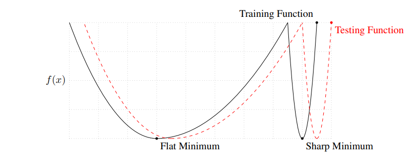
図1：平坦な最小値と鋭い最小値の概念図。Y軸は損失関数の値を示し、X軸は変数、すなわちパラメータを示す。

### 2.2 NUMERICAL EXPERIMENTS

本節では、上記の観察結果を支持するための数値結果を提示する。この目的のために、（Goodfellow et al., 2014b）で用いられた可視化手法と、提案する鋭さのヒューリスティックな指標（式（4））を用いる。我々の実験では、6つの多クラス分類ネットワーク構成を考える。それらは表1に示されている。データセットおよびネットワーク構成の詳細は、それぞれ付録Aおよび付録Bに示す。この種の問題で一般的であるように、目的関数 $f$ として平均クロスエントロピー損失を用いる。

これらのネットワークは、AlexNet（Krizhevsky et al., 2012）や VGGNet（Simonyan & Zisserman, 2014）のように、実務で用いられる代表的な構成を例示するために選ばれた。他のネットワーク、他の初期化戦略、活性化関数、データセットを用いた結果でも、同様の挙動が示された。本研究の目的は、これらのタスクで最先端の精度や解に到達するまでの時間を達成することではなく、LB 手法と SB 手法における最小解の性質を特徴づけることであるため、本文では最終的なテスト精度のみを記述し、収束傾向については扱わない。

表1：ネットワーク構成
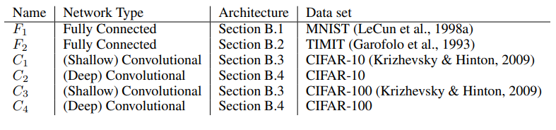

すべての実験において、大バッチ実験では訓練データの10%をバッチサイズとして用い、小バッチ実験では256個のデータ点を用いた。両方の設定で ADAM オプティマイザを用いた。大バッチ実験において、ADAGRAD（Duchi et al., 2011）、SGD（Sutskever et al., 2013）、adaQN（Keskar & Berahas, 2016）を含む他のオプティマイザを用いた実験でも、同様の結果が得られた。すべての実験は、異なる（一様分布に従うランダムな）初期点から5回実施し、測定量の平均と標準偏差の両方を報告する。我々の設定におけるベースライン性能を表2に示す。これより、すべてのネットワークにおいて、どちらの手法も高い訓練精度を達成する一方で、汎化性能には大きな差があることが観察できる。ネットワークは、予算や制限を設けず、損失関数が改善しなくなるまで訓練された。

表2：表1に示した6つのネットワークにおける、ADAM の小バッチ（SB）および大バッチ（LB）変種の性能
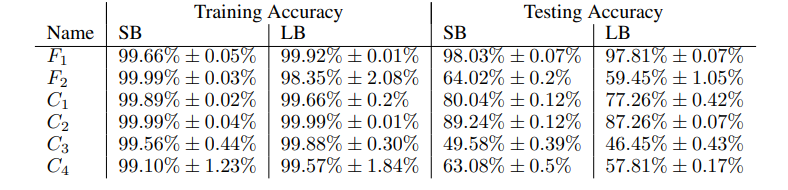

我々は、汎化ギャップが、統計学で一般に観察されるような過学習や過剰訓練によるものではないことを強調する。この現象は、ある反復時点でテスト精度曲線がピークに達し、その後、モデルが訓練データ固有の癖を学習することによって低下する、という形で現れる。しかし、我々の実験で観察されるのはこれではない。残りのネットワークを代表するものとして、$F_2$ および $C_1$ ネットワークの訓練精度・テスト精度曲線を図2に示す。したがって、モデルの過学習を防ぐことを目的とした early stopping のヒューリスティックは、汎化ギャップの低減には役立たない。これらのネットワークにおける訓練精度とテスト精度の差は、ネットワークの具体的な選択、たとえば AlexNet や VGGNet などに起因するものであり、本研究の焦点ではない。むしろ我々の目的は、与えられたネットワークモデルにおいて、SB と LB という2つの設定の間で生じるテスト性能の差の原因を調べることである。

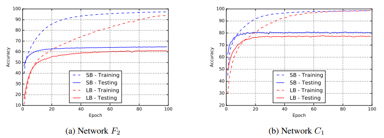
図2：エポック数の関数としての、SB 手法および LB 手法における訓練精度とテスト精度。

#### 2.2.1 PARAMETRIC PLOTS

まず、（Goodfellow et al., 2014b）で記述されている関数のパラメトリックな1次元プロットを示す。$x_s^\star$ および $x_l^\star$ を、それぞれ小バッチサイズおよび大バッチサイズを用いて ADAM を実行することで得られた解とする。訓練データセットおよびテストデータセットの両方について、これら2点を含む線分上で損失関数をプロットする。具体的には、$\alpha\in[-1, 2]$ に対して、関数 $f(\alpha x_l^\star + (1-\alpha)x_s^\star)$ をプロットし、さらに中間点における分類精度も重ねて表示する。図3[^1] を参照されたい。

[^1]: 代表的なネットワークに対してこのパラメトリックプロットを再現するためのコードは、我々の GitHub リポジトリ [https://github.com/keskarnitish/large-batch-training](https://github.com/keskarnitish/large-batch-training) にある。

この実験では、表2のデータを生成するために用いた5回の試行の中から、SB の最小解と LB の最小解の組をランダムに1組選んだ。プロットは、この1次元多様体上において、LB の最小値が SB の最小値よりも著しく鋭いことを示している。図3のプロットは関数の線形な切片のみを調べたものであるが、付録Dの図7では、2つの最小解の間の曲線経路に沿って関数を観察するために、$f(\sin(\frac{\alpha\pi}{2})x_l^\star + \cos(\frac{\alpha\pi}{2})x_s^\star)$ をプロットしている。そこでも、最小値の相対的な鋭さは明らかである。

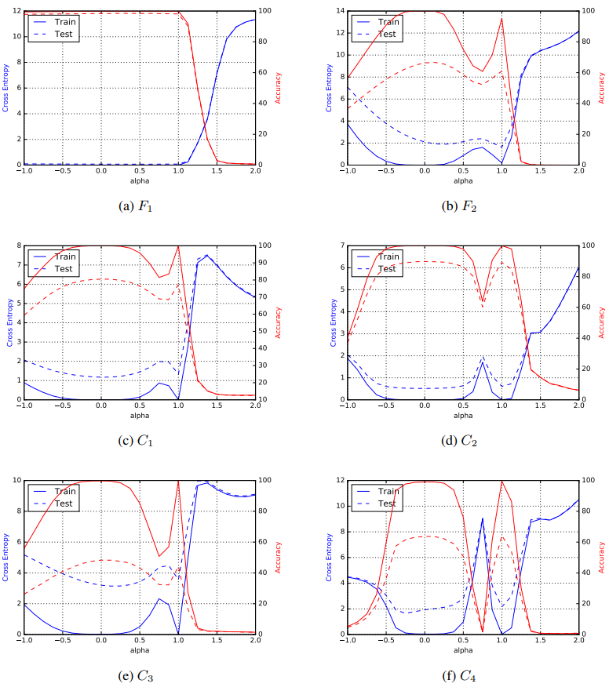
図3：パラメトリックプロット ― 線形（左の縦軸はクロスエントロピー損失 $f$ に対応し、右の縦軸は分類精度に対応する。実線は訓練データセットを示し、破線はテストデータセットを示す。$\alpha = 0$ は SB の最小解に対応し、$\alpha = 1$ は LB の最小解に対応する。）

#### 2.2.2 SHARPNESS OF MINIMA

ここまで、我々は「鋭い最小解」という用語を緩やかに用いてきたが、この概念は文献において注目されてきたことを述べた（Hochreiter & Schmidhuber, 1997）。最小解の鋭さは、$\nabla^2f(x)$ の固有値の大きさによって特徴づけることができる。しかし、深層学習の応用においてこの計算は非常に高コストであるため、我々は、完全ではないものの、大規模ネットワークに対しても計算可能な感度指標を用いる。これは、ある解の小さな近傍を探索し、その近傍において関数 $f$ が取りうる最大値を計算することに基づいている。我々は、その値を用いて、与えられた局所最小解における学習関数の感度を測る。

ただし、最大化過程は正確ではなく、また $\mathbb{R}^n$ のごく小さな部分空間においてのみ $f$ が大きな値を取る場合に誤って解釈してしまうことを避けるため、我々は空間全体 $\mathbb{R}^n$ における最大化と、ランダム多様体上での最大化の両方を行う。そのために、列がランダムに生成された $n\times p$ 行列 $A$ を導入する。ここで $p$ は多様体の次元を決定し、我々の実験では $p = 100$ とした。

具体的には、$\mathcal{C}_\epsilon$ を、解の周囲にある、$f$ の最大化を行うための箱型領域とし、$A\in\mathbb{R}^{n\times p}$ を上で定義した行列とする。鋭さが問題次元およびスパース性に対して不変となるように、制約集合 $\mathcal{C}_\epsilon$ を次のように定義する。

$$
\mathcal{C}_\epsilon = \{z\in\mathbb{R}^p\;:\; -\epsilon(|(A^+ x)_i|+1)\leq z_i \leq \epsilon(|(A^+ x)_i|+1)\quad\forall i\in{1, 2, \cdots, p}\},\tag{3}
$$

ここで、$A^+$ は $A$ の擬似逆行列を表す。したがって、$\epsilon$ は箱型領域の大きさを制御する。これにより、我々の鋭さ、あるいは感度の指標を定義できる。

**Metric 2.1.** $x\in\mathbb{R}^n, \epsilon > 0$ および $A\in\mathbb{R}^{n\times p}$ が与えられたとき、$x$ における $f$ の $(\mathcal{C}_\epsilon, A)$-sharpness を次のように定義する。

$$
\phi_{x, f}(\epsilon, A):=\frac{\bigl(\max_{y\in\mathcal{C}_\epsilon} f(x+Ay)\bigr)-f(x)}{1+f(x)}\times 100. \tag{4}
$$

特に断らない限り、本論文の残りでは鋭さの指標としてこの指標を用いる。$A$ が指定されていない場合、それは単位行列 $I_n$ であると仮定する。なお、凸最適化の文献では、sharp minimum という用語は異なる定義をもつが（Ferris, 1988）、その概念は我々の目的には有用ではない。

表3および表4では、さまざまな問題の最小解に対して、鋭さ指標（4）の値を示す。表3では全空間、すなわち $A = I_n$ の場合を調べ、表4ではランダムにサンプリングされた $n \times 100$ 次元行列 $A$ を用いる。$\epsilon$ については、$10^{−3}$ および $5 \cdot 10^{-4}$ の2つの値で結果を報告する。すべての実験において、式（4）の最大化問題は、L-BFGS-B（Byrd et al., 1995）を10反復適用することで不正確に解いた。反復回数にこの制限を設けたのは、真の目的関数 $f$ の評価コストが大きいためである。両方の表は、我々の指標の値が SB 領域と LB 領域の間で 1〜2 桁異なることを示している。これらの結果は、大バッチ手法によって得られる解が、学習関数の感度がより大きい点を定義する、という見方を補強するものである。

付録Eでは、LB 手法におけるこの汎化問題を改善しようとするアプローチについて述べる。これらのアプローチには、データ拡張、保守的訓練、敵対的訓練が含まれる。我々の予備的な知見では、これらのアプローチは汎化ギャップを小さくする助けにはなるものの、依然として相対的に鋭い最小解をもたらすため、問題を完全に解決するものではない。

Metric 2.1 は、$\nabla^2 f(x)$ のスペクトルと密接に関係していることに注意されたい。$\epsilon$ が十分小さいと仮定すると、$A=I_n$ の場合、値（4）は $\nabla^2 f(x)$ の最大固有値と関係し、$A$ がランダムにサンプリングされた場合には、$A$ の列空間に射影された $\nabla^2 f(x)$ のリッツ値を近似する。

本節の最後に、我々の実験で特定された鋭い最小解は円錐のような形状をしているわけではない、すなわち、関数がすべて、あるいは大半の方向に沿って急速に増加するわけではないことを述べておく。LB 解の近傍において損失関数をサンプリングすると、損失は低次元部分空間、たとえば全空間の 5% 程度に沿ってのみ急峻に増加し、それ以外の大半の方向では、関数は比較的平坦であることが観察される。

表3：全空間における最小値の鋭さ。$\epsilon$ は（3）で定義される。
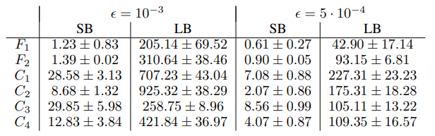

表4：次元100のランダム部分空間における最小値の鋭さ
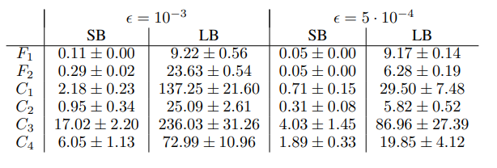

## 3 SUCCESS OF SMALL-BATCH METHODS

問題に対してバッチサイズを大きくしていくと、ある閾値を超えたあたりからモデルの品質が低下することがよく報告されている。この挙動は、図4の $F_2$ および $C_1$ ネットワークにおいて観察できる。これら2つの実験では、あるバッチサイズ（$F_2$ ではおよそ 15000、$C_1$ ではおよそ 500）を超えると、テスト精度が大きく低下している。また、この閾値付近では、鋭さの値の上昇傾向もかなり弱まっていることに注意されたい。同様の閾値は、表1の他のネットワークについても存在する。

次に、ステップ計算においてノイズを含む勾配を用いる SB 手法の挙動を考える。前節で報告した結果からは、勾配中のノイズが反復点を鋭い最小解の吸引域から押し出し、ノイズによってその吸引域から抜け出すことのない、より平坦な最小解への移動を促しているように見える。上で述べた閾値よりもバッチサイズが大きい場合には、確率勾配に含まれるノイズは、初期の吸引域から反復点を押し出すのに十分ではなく、その結果、より鋭い最小解へ収束することになる。

これをより詳しく調べるために、次の実験を考える。まず、バッチサイズ 256 の ADAM を用いてネットワークを 100 エポック訓練し、各エポック後の反復点をメモリに保持する。これら 100 個の反復点を初期点として用い、大バッチ手法でネットワークをさらに 100 エポック訓練することで、100 個の piggybacked（あるいは warm-start された）大バッチ解を得る。図5には、これらの大バッチ解のテスト精度と鋭さを、小バッチ反復点のテスト精度とともに示している。初期の数エポックしか warm-start に用いない場合には、LB 手法は汎化性能の改善をもたらさないことに注意されたい。それに対応して、反復点の鋭さも高いままである。一方で、ある程度のエポック数だけ warm-start を行った後では、精度が向上し、大バッチ反復点の鋭さは低下する。これは、SB 手法が探索段階を終えて平坦な最小解を発見したときに起こるようであり、その後 LB 手法はその最小解へ向かって収束できるため、良好なテスト精度が得られる。

LB 手法は初期点 $x_0$ に近い最小解に引き寄せられる傾向がある一方で、SB 手法はそこから離れ、より遠くの最小解を見つけるのではないかと推測されてきた。我々の数値実験はこの見方を支持している。実際、$\|x_s^\star-x_0\|$ と $\|x_l^\star-x_0\|$ の比は 3〜10 の範囲にあることが観察された。

SB 手法と LB 手法によって得られる解の質的な違いをさらに示すために、図6では、$F_2$ および $C_1$ ネットワークにおける1回のランダム試行について、我々の鋭さ指標（4）を損失関数（クロスエントロピー）に対してプロットしている。損失関数の値が大きい領域、すなわち初期点付近では、SB 手法と LB 手法は類似した鋭さの値を示す。損失関数が減少するにつれて、LB 手法に対応する反復点の鋭さは急速に増大する。一方、SB 手法では鋭さは最初は比較的一定に保たれ、その後減少する。これは、探索段階を経た後に平坦な最小解へ収束することを示唆している。

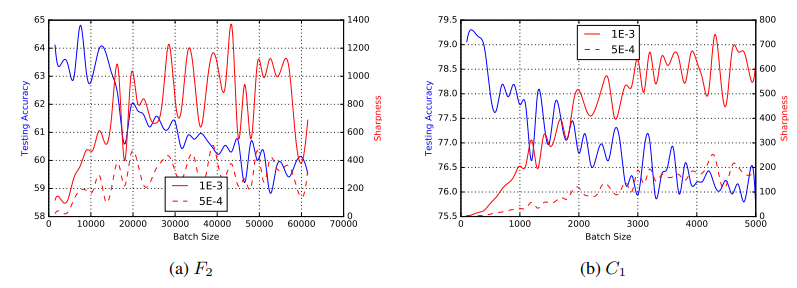
Figure 4: テスト精度および鋭さとバッチサイズの関係。X 軸は、ネットワークを 100 エポック訓練する際に用いたバッチサイズに対応する。左の Y 軸は最終反復点におけるテスト精度に対応し、右の Y 軸はその反復点の鋭さに対応する。鋭さは、$\epsilon$ の2つの値 $10^{−3}$ および $5 \cdot 10^{−4}$ に対して報告している。

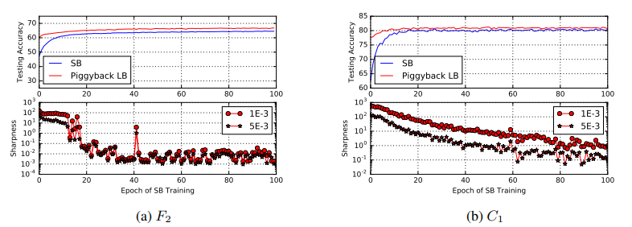
Figure 5: Warm-starting 実験。上段の図は、SB 手法のテスト精度（青線）と、warm-start された（piggybacked）LB 手法のテスト精度（赤線）を、SB 手法のエポック数の関数として示している。下段の図は、piggybacked LB 手法によって得られた解に対する鋭さ指標（4）を、SB 手法の warm-start エポック数に対してプロットしたものである。

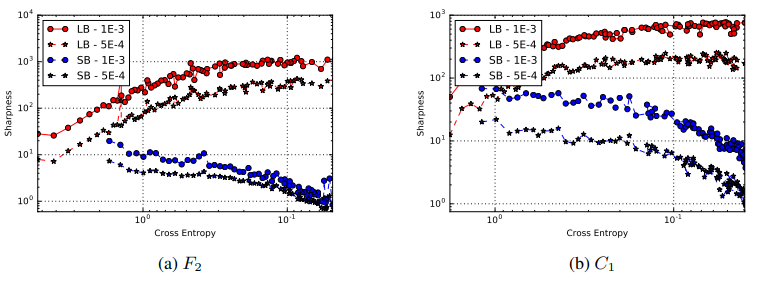
Figure 6: SB 手法および LB 手法における鋭さとクロスエントロピー損失の関係。

## 4 DISCUSSION AND CONCLUSION

本論文では、鋭い最小解への収束が、深層学習における大バッチ手法の悪い汎化性能を生じさせるという見方を支持する数値実験を提示する。この目的のために、さまざまな深層学習アーキテクチャについて、1次元のパラメトリックプロットと摂動に基づく鋭さ指標を示した。付録Eでは、データ拡張、保守的訓練、ロバスト最適化を含め、この問題を改善しようとした我々の試みについて述べる。我々の予備的な調査は、これらの戦略が問題を修正するものではないことを示唆している。すなわち、これらは大バッチ手法の汎化性能を改善するものの、依然として相対的に鋭い最小値へと至る。別の有望な改善策として、反復が進むにつれてバッチサイズを徐々に大きくする動的サンプリングの利用がある（Byrd et al., 2012; Friedlander & Schmidt, 2012）。このアプローチが有効である可能性は、我々の warm-starting 実験によって示唆される。そこでは、小バッチ手法によって warm-start された大バッチ手法を用いることで、高いテスト精度が達成されている（図5参照）。

近年、多くの研究者が、深層ニューラルネットワークの損失曲面に関する興味深い理論的性質を記述している。たとえば（Choromanska et al., 2015; Soudry & Carmon, 2016; Lee et al., 2016）を参照されたい。彼らの研究は、ある種の正則性仮定のもとで、深層学習モデルの損失関数には多数の局所最小解が存在し、その多くが類似した損失関数値に対応することを示している。我々の結果は、これらの観察と整合している。なぜなら、我々の実験では、鋭い最小解と平坦な最小解のいずれも、非常に類似した損失関数値をもつからである。しかし、上で述べた理論モデルが、損失曲面における鋭い最小解の存在や密度について情報を与えるかどうかは分かっていない。

我々の結果はいくつかの問いを示唆している。(a) 大バッチ (LB) 手法が、深層学習の訓練関数における鋭い最小解へ典型的に収束することを証明できるか。（本論文では、いくつかの数値的証拠を示したにすぎない。）(b) 2種類の最小値の相対的な密度はどの程度か。(c) さまざまなタスクに対して、LB 手法の性質に適したニューラルネットワークアーキテクチャを設計できるか。(d) LB 手法が成功できるような形でネットワークを初期化できるか。(e) アルゴリズム的手段または正則化的手段によって、LB 手法を鋭い最小解から遠ざけるように誘導することは可能か。

---

## Appendix C: PERFORMANCE MODEL

第1節で述べたように、汎化ギャップを被ることなく大バッチ領域で動作する訓練アルゴリズムがあれば、現在可能な規模よりもはるかに多くのノードへスケールできる可能性がある。そのようなアルゴリズムは、より速い収束を通じて訓練時間を改善する可能性もある。我々は、この目標を示す理想化された性能モデルを提示する。

LB 手法が SB 手法と競合するためには、LB 手法は、(i) よく汎化する最小解へ収束し、かつ (ii) それを妥当な回数の反復で達成しなければならない。ここでは後者を解析する。$I_s$ および $I_l$ を、それぞれ SB 手法および LB 手法が同程度のテスト精度に到達するために必要な反復回数とする。また、$B_s$ および $B_l$ を対応するバッチサイズ、$P$ を訓練に用いるプロセッサ数とする。$P < B_l$ を仮定し、$f_s(P)$ を SB 手法の並列効率とする。簡単のため、LB 手法の並列効率 $f_l(P)$ は 1.0 であると仮定する。言い換えると、大きなバッチサイズを用いるため、LB 手法は完全にスケールすると仮定する。

LB が SB よりも高速であるためには、次を満たさなければならない。

$$
I_l \frac{B_l}{P} < I_s \frac{B_s}{P f_s(P)}.
$$

言い換えると、LB の反復回数と SB の反復回数の比は、次を満たす必要がある。

$$
\frac{I_l}{I_s} < \frac{B_s}{f_s(P)B_l}.
$$

たとえば、$f_s(P) = 0.2$ かつ $B_s/B_l = 0.1$ である場合、性能上の利点を得るためには、LB 手法は SB 手法の少なくとも半分以下の反復回数で収束しなければならない。バッチサイズが性能に与える影響に関するより詳細なモデルと解説については、（Das et al., 2016）を参照されたい。

## Appendix E: ATTEMPTS TO IMPROVE LB METHODS

本節では、大バッチ手法における悪い汎化性能の問題を改善することを目的とした、いくつかの戦略について議論する。第2節と同様に、大バッチ実験ではバッチサイズを訓練データの10%とし、小バッチ手法では256とする。すべての実験において、バッチサイズに関係なく、オプティマイザとして ADAM を用いる。

### E.1 DATA AUGMENTATION

大バッチ手法が鋭い最小解に引き寄せられているように見えることを踏まえると、損失関数の幾何を、大バッチ手法にとってより扱いやすいものとなるよう修正できるか、という問いが生じる。損失関数は、目的関数の幾何と、訓練セットの大きさおよび性質の両方に依存する。我々が検討する一つのアプローチは、データ拡張である。たとえば（Krizhevsky et al., 2012; Simonyan & Zisserman, 2014）を参照されたい。この手法の適用はドメイン依存であるが、一般には、訓練データに対して制御された変更を加えることでデータセットを拡張することを含む。たとえば画像認識の場合、訓練セットは、訓練データに対する平行移動、回転、せん断、反転によって拡張できる。この手法はネットワークの正則化をもたらし、いくつかのデータセットにおけるテスト精度の向上のために用いられてきた。

我々の実験では、4つの画像ベース（畳み込み型）ネットワークを、強いデータ拡張を用いて訓練し、その結果を表6に示す。拡張としては、水平方向の反転、最大 10° のランダム回転、および画像サイズの 0.2 倍までのランダム平行移動を用いる。表から明らかなように、LB 手法は SB 手法（こちらも訓練データを拡張した場合）に匹敵する精度を達成する一方で、最小解の鋭さは依然として存在しており、これは訓練集合にもテスト集合にも含まれない画像に対する感度を示唆している。本節では、紙幅の都合と、第2.2節で示したものとの類似性のため、SB 手法に対するパラメトリックプロットと鋭さの値は省略する。

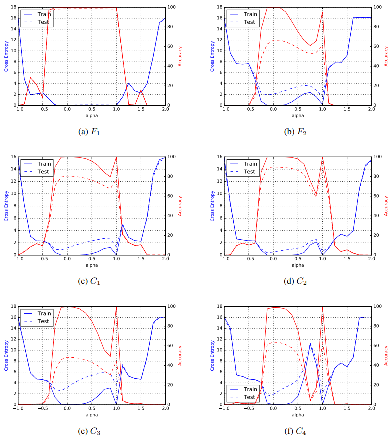
Figure 7: パラメトリックプロット ― 曲線経路（左の縦軸はクロスエントロピー損失 $f$ に対応し、右の縦軸は分類精度に対応する。実線は訓練データセットを示し、破線はテストデータセットを示す。$\alpha = 0$ は SB の最小解に対応し、$\alpha = 1$ は LB の最小解に対応する）

表6：データ拡張の効果
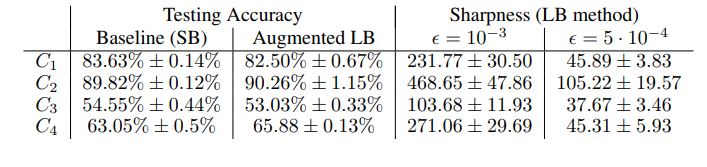

表7：保守的訓練の効果
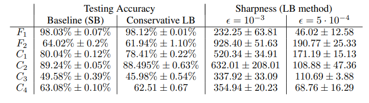

### E.2 CONSERVATIVE TRAINING

（Li et al., 2014）では、著者らは、大バッチ設定における SGD の収束速度は、次の近接部分問題を通じて反復点を得ることで改善できると主張している。

$$
x_{k+1}=\underset{x}{\arg\min}\frac{1}{|B_k|}\sum_{i\in B_k} f_i(x) + \frac{\lambda}{2}|x-x_k|_2^2 \tag{5}
$$

この戦略の動機は、大バッチ手法の文脈において、次のバッチへ移る前に1つのバッチをより有効に利用することである。この最小化問題は、勾配降下法、座標降下法、または L-BFGS を 3〜5 反復用いることで不正確に解かれる。（Li et al., 2014）は、これにより SGD の収束速度が改善されるだけでなく、凸機械学習問題における経験的性能も改善されると報告している。

バッチを活用するという基礎にある考え方は凸問題に特有のものではなく、理論的保証はないものの、同じ枠組みを深層学習にも適用できる。実際、深層学習に対しては、（Zhang et al., 2015）および（Mobahi, 2016）で類似のアルゴリズムが提案されている。前者は小バッチ SGD の並列化と非同期性に重点を置いており、後者は訓練のための拡散・継続メカニズムに重点を置いている。

保守的訓練アプローチを用いた結果を図7に示す。すべての実験において、問題（5）は ADAM を3反復用いて解き、正則化パラメータ $\lambda$ は $10^{−3}$ に設定した。ここでも、大バッチ手法のテスト精度には統計的に有意な改善が見られるが、感度の問題を解決するものではない。

### E.3 ROBUST TRAINING

鋭い最小値を避ける自然な方法は、ロバスト最適化の技法を用いることである。これらの手法は、名目的な（あるいは真の）コストではなく、最悪の場合のコストを最適化しようとする。数学的には、$\epsilon > 0$ が与えられたとき、これらの手法は次の問題を解く。

$$
\underset{x}{\min}\quad\phi(x):=\underset{|\Delta x|\leq\epsilon}{\max}f(x+\Delta x)\tag{6}
$$

幾何学的に言えば、古典的な（名目的な）最適化は谷の最も低い点を見つけようとするのに対し、ロバスト最適化は損失曲面の上に半径 $\epsilon$ の円板を押し下げようとする。非凸ロバスト最適化の概説については、（Bertsimas et al., 2010）およびその参考文献を参照されたい。しかし、この技法を我々の文脈に直接適用することは現実的ではない。なぜなら、各反復において大規模な二次錐計画（SOCP）を解く必要があり、計算コストが極めて大きいからである。

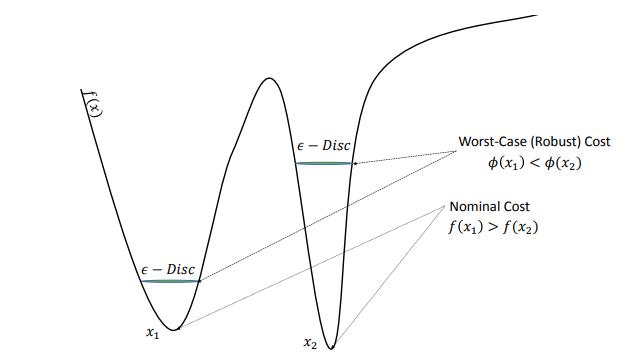
Figure 8: ロバスト最適化の模式図

深層学習の文脈では、相互に依存した2種類のロバスト性がある。すなわち、データに対するロバスト性と、解に対するロバスト性である。前者は、関数 $f$ が本質的に統計モデルであるという事実を利用するのに対し、後者は $f$ をブラックボックス関数として扱う。（Shaham et al., 2015）では、著者らは、解のロバスト性（データに関して）と敵対的訓練（Goodfellow et al., 2014a）との等価性を証明している。

データ拡張戦略が部分的な成功を収めたことを踏まえると、敵対的訓練の有効性を問うのは自然である。（Goodfellow et al., 2014a）で述べられているように、敵対的訓練もまた訓練集合を人工的に増やすことを目的としているが、ランダム化されたデータ拡張とは異なり、モデルの感度を利用して新たな例を構成する。直感的には魅力的であるにもかかわらず、我々の実験では、この戦略は汎化性能を改善しなかった。同様に、（Zheng et al., 2016）によって提案された stability training からも、汎化性能の向上は観察されなかった。いずれの場合も、テスト精度、鋭さの値、およびパラメトリックプロットは、第2節で議論した無修正の（ベースラインの）場合と類似していた。敵対的訓練（あるいは他の形式のロバスト訓練）が、大バッチ訓練の実用性を高めうるかどうかは、今後の課題である。
