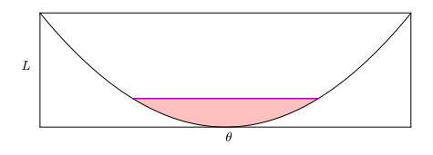
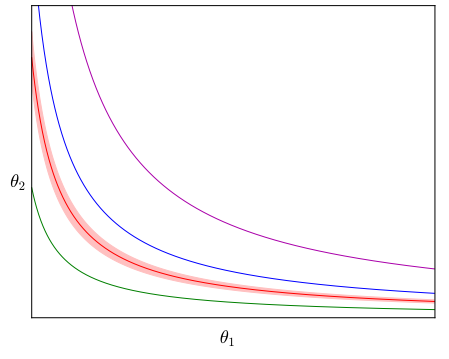
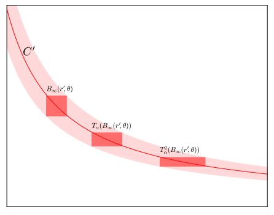
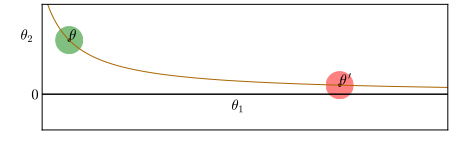
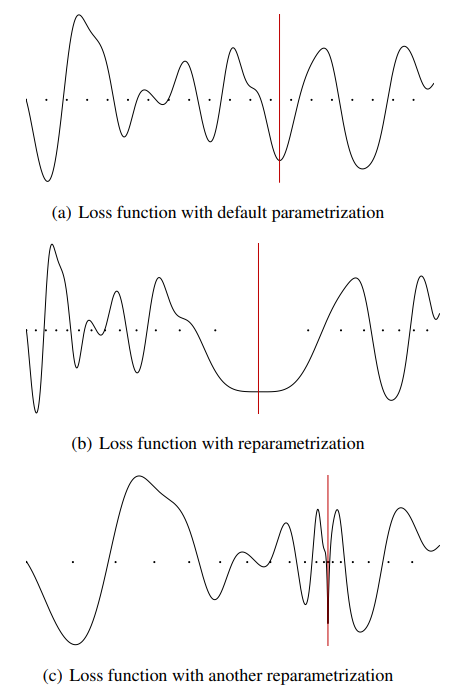

# Sharp Minima Can Generalize For Deep Nets

## Abstract

深層学習アーキテクチャは、過学習しうる圧倒的な能力を持つにもかかわらず、未知データに対して比較的よく汎化する傾向があり、そのため実用上の展開が可能になっている。しかし、なぜそうなるのかを説明することは、依然として未解決の研究課題である。現在、広まりつつある有力な仮説の一つに、Hochreiter & Schmidhuber (1997) や Keskar et al. (2017) などで述べられているように、確率的勾配法に基づく手法によって見つかる損失関数の極小点の平坦性が、良好な汎化をもたらすというものがある。

本論文では、平坦性に関する多くの概念は深層モデルに対して問題を含んでおり、汎化を説明するために直接適用することはできないと主張する。具体的には、rectifier ユニットを持つ深層ネットワークに着目すると、これらのアーキテクチャが本質的に持つ対称性によって誘導されるパラメータ空間の特有の幾何構造を利用することで、任意に鋭い極小点に対応する等価なモデルを構成できる。さらに、関数の再パラメータ化を許すならば、そのパラメータの幾何構造は、汎化特性に影響を与えることなく大きく変化しうる。

## 1. Introduction

深層学習技術は、画像における物体認識（例：Krizhevsky et al., 2012; Simonyan & Zisserman, 2015; Szegedy et al., 2015; He et al., 2016）、機械翻訳（例：Cho et al., 2014; Sutskever et al., 2014; Bahdanau et al., 2015; Wu et al., 2016; Gehring et al., 2016）、音声認識（例：Graves et al., 2013; Hannun et al., 2014; Chorowski et al., 2015; Chan et al., 2016; Collobert et al., 2016）など、いくつかの領域で大きな成功を収めてきた。これらの経験的結果を正当化するために、いくつかの議論が提示されてきた。表現能力の観点からは、深層ネットワークがある種の関数を効率的に近似できることが論じられている（例：Montufar et al., 2014; Raghu et al., 2016）。他の研究（例：Dauphin et al., 2014; Choromanska et al., 2015）では、これらのモデルがどの程度訓練可能であるかを分析するために、誤差曲面の構造に着目している。最後に、もう一つの議論の焦点は、これらのモデルがどの程度よく汎化できるかである（Nesterov & Vial, 2008; Keskar et al., 2017; Zhang et al., 2017）。これらはそれぞれ、Bottou (2010) によって述べられた、低い近似誤差、最適化誤差、推定誤差に対応している。

本研究は、推定誤差の分析に焦点を当てる。特に、確率的勾配降下法がなぜよく汎化する解をもたらすのかという問いに対して、これまでさまざまなアプローチが用いられてきた（Bottou & LeCun, 2005; Bottou & Bousquet, 2008）。例えば、Duchi et al. (2011)、Nesterov & Vial (2008)、Hardt et al. (2016)、Bottou et al. (2016)、Gonen & Shalev-Shwartz (2017) は、確率近似あるいは一様安定性（Bousquet & Elisseeff, 2002）の概念に依拠している。近年 Keskar et al. (2017) によって検討され、Hochreiter & Schmidhuber (1997) にまで遡ることのできるもう一つの仮説は、与えられた解の周辺における損失関数の幾何に依拠するものである。この仮説では、平坦性を何らかの形で定義したとき、平坦な極小点はより良い汎化をもたらすと主張される。本研究はこの特定の仮説に焦点を当て、深層ニューラルネットワークに平坦な極小点の概念を適用する際には重大な問題があり、そもそも平坦性とは何を意味するのかを再考する必要があると論じる。

平坦な極小点という概念は明確に定義されているわけではなく、研究によってやや異なる意味を持つが、その直観は比較的単純である。誤差を一次元の曲線として考えるなら、ある極小点の周囲にほぼ同じ誤差を持つ広い領域が存在する場合、その極小点は平坦である。一方、そうでなければ、その極小点は鋭いとされる。高次元空間へ移ると、平坦性を定義することはより複雑になる。Hochreiter & Schmidhuber (1997) では、訓練損失が比較的似た値を取る、極小点周辺の連結領域の大きさとして定義されている。これに対して Chaudhari et al. (2017) は、極小点周辺の二次構造の曲率に依拠している。一方、Keskar et al. (2017) は、極小点の有界近傍における最大損失に着目している。これらの研究はいずれも、平坦性が低精度演算やパラメータ空間におけるノイズに対するロバスト性をもたらすという事実に依拠しており、最小記述長に基づく議論を用いることで、期待される過学習が小さいことを示唆している。

しかし、深層学習における一般的なアーキテクチャやパラメータ化のいくつかは、すでにこの仮説と整合しない部分を持っており、少なくともその主張には一定の精緻化が必要である。特に本研究では、平坦性や鋭さに関するいくつかの尺度を考えたとき、対応するパラメータ空間の幾何構造が、予測関数間の順位付けをどのように変えうるかを示す。この矛盾の理由は、平坦な極小点の汎化能力を正当化するためになされた KL ダイバージェンスに関するベイズ的議論に由来すると考えている（Hinton & Van Camp, 1993）。実際、Kullback-Leibler ダイバージェンスはパラメータ変換に対して不変であるのに対し、「平坦性」の概念はそうではない。Hochreiter & Schmidhuber (1997) の実証は、ギブス形式におおよそ基づいており、離散的な関数空間を仮定することを含む強い仮定と近似に依拠している。そのため、それらは議論の適用可能性を損なう可能性がある。

## 2. Definitions of flatness/sharpness

簡潔さのため、本論文では教師ありのスカラー出力問題に限定するが、本論文のいくつかの結論は他の問題にも適用できる。入力空間 $\mathcal{X}$ から要素 $x$ を入力として受け取り、スカラー $y$ を出力する関数 $f$ を考える。予測関数を $f_\theta$ と表す。この予測関数は、パラメータ空間 $\Theta$ に属するパラメータベクトル $\theta$ によってパラメータ化される。多くの場合、この予測関数は過剰パラメータ化されており、任意の $x \in\mathcal{X}$ に対して $f_\theta(x)=f_{\theta'}(x)$ を満たす、すなわち至るところで同じ予測関数を与える二つのパラメータ $(\theta, \theta')\in\Theta^2$ は、観測上等価であると呼ばれる。モデルは、予測関数 $f_\theta$ を引数に取る連続な損失関数 $L$ を最小化するように訓練される。本論文ではしばしば、損失 $L$ を $\theta$ の関数として考え、$L(θ)$ という表記を用いる。

極小点の平坦性／鋭さの概念は相対的なものである。そのため、本節では、二つの極小点の間で相対的な平坦性を比較するために用いることができる尺度について議論する。本節では、文献で用いられてきた三つの平坦性の定義を定式化する。

Hochreiter & Schmidhuber (1997) は、平坦な極小点を「重み空間における、誤差がほぼ一定に保たれる大きな連結領域」と定義している。本論文では、この定式化を次のように解釈する。

**定義 1.** $\epsilon>0$、極小点 $\theta$、損失 $L$ が与えられたとする。このとき、$C(L,\theta,\epsilon)$ を、$\theta$ を含み、かつ任意の $\theta'\in C(L,\theta,\epsilon)$ に対して $L(\theta')<L(\theta)+\epsilon$ を満たす最大の連結集合として定義する。ただし、最大性は $\Theta$ の部分集合上の包含関係を半順序として用いる。このとき、$\epsilon$-flatness は $C(L,\theta,\epsilon)$ の体積として定義される。この尺度を、体積 $\epsilon$-flatness と呼ぶ。

図 1：平坦性の概念の図示。$\theta$ の関数としての損失 $L$ を黒で示している。赤い領域の高さが $\epsilon$ である場合、その幅は体積 $\epsilon$-flatness を表す。幅が $2\epsilon$ である場合、その高さは $\epsilon$-sharpness を表す。色付きで見るのが最も分かりやすい。

図 1 において、赤い領域の高さが $\epsilon$ である場合、$C(L,\theta,\epsilon)$ は赤い領域の上端にある紫色の線であり、その体積は単にその紫色の線の長さになる。

平坦性は、極小点が臨界点である場合、その周辺における損失関数の局所曲率を用いて定義することもできる。Chaudhari et al. (2017) および Keskar et al. (2017) は、この情報がヘッセ行列の固有値に符号化されていると示唆している。しかし、ある極小点が別の極小点と比べてどの程度平坦であるかを比較するためには、固有値を単一の数値に縮約する必要がある。ここでは、行列の固有値に関する典型的な二つの測度である、ヘッセ行列のスペクトルノルムとトレースを考える。

さらに Keskar et al. (2017) は、$\epsilon$-sharpness の概念を定義している。証明をより読みやすくするため、本論文ではその定義をわずかに修正する。ただし、有限次元空間におけるノルム同値性により、本論文の結果は元の定義を全空間に適用した場合にも移行する。本論文で用いる修正版の定義は次の通りである。

**定義 2.** $B_2(\epsilon,\theta)$ を、極小点 $\theta$ を中心とし、半径 $\epsilon$ を持つユークリッド球とする。このとき、非負値の損失関数 $L$ に対して、$\epsilon$-sharpness は次に比例する量として定義される。

$$
\frac{\max_{\theta'\in B_2(\epsilon,\theta)}\Bigl(L(\theta')-L(\theta)\Bigr)}{1+L(\theta)}.
$$

図 1 において、赤い領域の幅が $2\epsilon$ である場合、赤い領域の高さは $\max_{\theta'\in B_2(\epsilon,\theta)}\Bigl(L(\theta')-L(\theta)\Bigr)$ である。

$\epsilon$-sharpness は、ヘッセ行列のスペクトルノルムと関係づけることができる。実際、臨界点である極小点の周りで $L$ を二次のテイラー展開すると、

$$
L(\theta')=L(\theta)+\frac{1}{2}(\theta'-\theta)(\nabla^2 L)(\theta)(\theta'-\theta)^\top+o(\|\theta'-\theta\|_2^2).
$$

と書ける。この二次近似のもとでは、$\theta$ における $\epsilon$-sharpness は

$$
\frac{||| (\nabla^2 L)(\theta) |||_2 \epsilon^2}{2\bigl(1+L(\theta)\bigr)}.
$$

となる。

## 3. Properties of Deep Rectified Networks

先に本論文の結果へ進む前に、本節では以降で用いる記法を導入する。明確さのため、本論文の結果の大部分は、以下で述べる線形出力層を持つ深層 rectified feedforward network に関するものとする。ただし、それらは他のアーキテクチャ、例えば畳み込みネットワークなどにも容易に拡張できる。

**定義 3.** $K$ 個の重み行列 $(\theta_k)_{k\leq K}$ が与えられ、$n_k=\mathrm{dim}\bigl(\mathrm{vec}(\theta_k)\bigr)$ および $n=\sum_{k=1}^K n_k$ とする。このとき、線形出力層を持つ深層 rectified feedforward network の出力 $y$ は次のように表される。

$$
y = \phi_{\mathrm{rect}}\Bigl(\phi_{\mathrm{rect}}\bigl(\cdots\phi_{\mathrm{rect}}(x\cdot\theta_1)\cdots\bigr)\cdot\theta_{K-1}\Bigr)\cdot\theta_K,
$$

ここで、

* $x$ はモデルへの入力であり、高次元ベクトルである。
* $\phi_{\mathrm{rect}}$ は要素ごとの rectified activation function（Jarrett et al., 2009; Nair & Hinton, 2010; Glorot et al., 2011）であり、正の部分 $(z_i)_i\mapsto(\max(z_i, 0))_i$ である。
* $\mathrm{vec}$ は行列をベクトルへ変形する操作である。

なお、この定義では、通常あらゆるニューラルアーキテクチャに含まれるバイアス項を除外している。これは主に便宜上の理由によるものであり、議論の提示を単純化するためである。ただし、本論文の議論はバイアスを含む場合にも拡張できる（付録 B を参照）。もう一つの選択は、線形出力層を用いることである。出力活性化関数を持つことも、本論文の議論には影響しない。なぜなら、損失は出力活性化の関数であるため、線形な pre-activation の関数として言い換えることができるからである。

深層 rectifier モデルは、第 4 節で極小点の平坦性を任意に操作することを可能にする、ある性質を持っている。

ニューラルネットワークの最適化における重要な話題の一つは、ニューラルアーキテクチャによって課されるパラメータ空間の非ユークリッド幾何を理解することである（例えば Amari, 1998 を参照）。原理的には、パラメータ空間で一歩進むとき、我々が制御したいと考えるのはモデルの振る舞いの変化、すなわち入力 $x$ から出力 $y$ への写像の変化である。原理的には、我々はパラメータそのものに関心があるのではなく、それらが表す写像にのみ関心がある。

モデルの振る舞いの変化に対する測度を定義できるならば、これはいくつかの仮定のもとで可能であるが、その測度を用いて、パラメータ空間の各点において、モデルの振る舞いの単位変化に対応するパラメータの等価な変化を表す計量を定義できる。結局のところ、ニューラルネットワークでは、この計量は $\Theta$ 上で一定ではない。直観的には、この計量は曲率に関係しており、ニューラルネットワークは高度に非線形でありうるため、曲率は一定ではない。詳細については Amari (1998) および Pascanu & Bengio (2014) を参照されたい。極小点の平坦性や鋭さという概念に戻ると、この計量こそが平坦性を定義すべきである。

しかし、パラメータ空間の幾何はさらに複雑である。ニューラルネットワークの二つの具体化を比較するためにどのような測度を選んだとしても、モデルの構造により、まったく同じ振る舞いをもたらす多数の対称な構成が存在する。rectifier 活性化は、すぐ後で見るように非負同次性を持つため、同じ振る舞いをもたらす点の連続体を構成することができ、したがって計量は特異になる。これは、モデルが変化しないこれらの方向を利用することで、極小点周辺の近傍を変形できることを意味する。その結果、平坦性に関する多くの定義のもとで、この性質を制御できる。視覚的な説明として図 2 を参照されたい。ここでは、平坦性は異なる等高線間の距離として与えられており、曲線に沿って移動することで変化させることができる。

図 2：非負同次性の効果の図示。このグラフは、$\theta_1$ と $\theta_2$ を軸とする二次元パラメータ空間に埋め込まれた、損失 $L$ の振る舞いの等高線を表している。具体的には、ある色の各線は、観測上同じ予測関数 $f_\theta$ をもたらすパラメータ割当て $(\theta_1,\theta_2)$ に対応する。色付きで見るのが最も分かりやすい。

便宜上、非負同次性（Neyshabur et al., 2015; Lafond et al., 2016）を以下で再定義する。なお、この性質に加えて、rectified linear activation を研究対象とする理由は、それが広く採用されているためである（Krizhevsky et al., 2012; Simonyan & Zisserman, 2015; Szegedy et al., 2015; He et al., 2016）。

**定義 4.** ある関数 $\phi$ が、次を満たすとき、非負同次であるという。

$$
\forall(z,\alpha)\in\mathbb{R}\times\mathbb{R}^+,\quad\phi(\alpha,z)=\alpha\phi(z)
$$

**定理 1.** rectified function $\phi_{\mathrm{rect}}(x)=\max(x,0)$ は非負同次である。

*証明.* $\alpha>0$ という制約から自明に従う。なぜなら、$\alpha>0$ である場合に限り、$x>0\Rightarrow\alpha x>0$ が成り立つからである。

深層 rectified neural network では、これは次を意味する。

$$
\phi_{\mathrm{rect}}\Bigl(x\cdot(\alpha\theta_1)\Bigr)\cdot\theta_2=\phi_{\mathrm{rect}}(x\cdot\theta_1)\cdot(\alpha,\theta_2),
$$

これは、この一つの隠れ層を持つニューラルネットワークにおいて、パラメータ $(\alpha\theta_1,\theta_2)$ が $(\theta_1,\alpha\theta_2)$ と観測上等価であることを意味する。この観測上の等価性は、畳み込み層についても同様に成り立つ。

この非負同次性が与えられると、$(\theta_1,\theta_2)\neq(0, 0)$ であれば、${(\alpha\theta_1,\alpha^{-1}\theta_2),\alpha>0}$ は観測上等価なパラメータの無限集合であり、この学習状況に強い非識別性をもたらす。深層線形ネットワーク（Saxe et al., 2013）、leaky rectifier（He et al., 2015）、maxout network（Goodfellow et al., 2013）などの他のモデルも、この非負同次性を持っている。

以下では、このような変換に依拠する。特に、次の定義に依拠する。

**定義 5.** 一つの隠れ層を持つ rectifier feedforward network に対して、変換族

$$
T_\alpha : (\theta_1,\theta_2)\mapsto(\alpha\theta_1,\alpha^{-1}\theta_2)
$$

を定義し、これを $\alpha$-scale transformation と呼ぶ。

なお、$\alpha$-scale transformation は汎化に影響を与えない。なぜなら、関数の振る舞いが同一だからである。また、この変換は一層の rectified feedforward network に対してのみ定義されているが、単一の rectified network をサブモジュールとして持つ任意のアーキテクチャ、例えば深層 rectified feedforward network などに自明に拡張できる。単純さと読みやすさのため、本論文ではこの定義に依拠する。

## 4. Deep Rectified networks and flat minima

本節では、その結果として生じる強い非識別性を利用し、平坦性に関するいくつかの定義の短所を示す。$\alpha$-scale transformation は、表現される関数には影響を与えないにもかかわらず、平坦性に関するいくつかの尺度を大幅に低下させることを可能にする。別の平坦性の定義に対しては、$\alpha$-scale transformation により、すべての極小点が同程度に平坦であることが示される。

### 4.1 Volume $\epsilon$ -flatness

**定理 2.** 次の形を持つ一つの隠れ層の rectified neural network

$$
y = \phi_{\mathrm{rect}}(x\cdot\theta_1)\cdot\theta_2,
$$

および、$\theta_1\neq 0$ かつ $\theta_2\neq 0$ を満たす極小点 $\theta=(\theta_1,\theta_2)$ に対して、任意の $\epsilon>0$ について、$C(L,\theta,\epsilon)$ は無限の体積を持つ。

重み行列 $\theta_1,\theta_2$ のいずれかがゼロである解 $\theta$、すなわち $\theta_1=0$ または $\theta_2=0$ となる解は考えない。この場合、定数関数が得られるため、訓練性能は低いと仮定する。$\alpha>0$ に対して、$\alpha$-scale transformation

$$
T_\alpha : (\theta_1,\theta_2)\mapsto(\alpha\theta_1,\alpha^{-1}\theta_2)
$$

は、ヤコビアン行列式 $\alpha^{n_1-n_2}$ を持つ。ここで再び、$n_1=\mathrm{dim}\bigl(\mathrm{vec}(\theta_1)\bigr)$ および $n_2=\mathrm{dim}\bigl(\mathrm{vec}(\theta_2)\bigr)$ である。この線形変換のヤコビアン行列式は、$T_\alpha$ によって誘導される体積変化を表しており、また $T_\alpha\circ T_\beta=T_{\alpha\beta}$ が成り立つ。以下では、$\theta$ を含み、無限の体積を持ち、かつ誤差がほぼ一定に保たれる連結領域が存在することを示す。

*証明.* まず、$\theta$ の周囲に、誤差がほぼ一定であり、かつ非ゼロの体積を持つ小さな領域を導入する。$\epsilon>0$ が与えられ、損失関数がパラメータに関して連続であると考えると、$C(L,\theta,\epsilon)$ は $\theta$ を含む開集合である。また、$\theta_1\neq 0$ かつ $\theta_2\neq 0$ であるため、$B_\infty(r,\theta)$ が $C(L,\theta,\epsilon)$ に含まれ、かつ ${\theta',\theta'_1=0}$ との共通部分を持たないような $r>0$ を取ることができる。$v=(2r)^{n_1+n_2}>0$ を $B_\infty(r,\theta)$ の体積とする。

$T_\alpha$ のヤコビアン行列式は、$T_\alpha$ によって誘導される体積の乗法的変化を表すため、$T_\alpha(B_\infty(r,\theta))$ の体積は $v\alpha^{n_1-n_2}$ である。$n_1\neq n_2$ の場合、$n_1>n_2$ なら $\alpha$ を $+\infty$ に近づけ、そうでなければ $\alpha$ を $0$ に近づけることで、$L(\theta)$ の $\epsilon$-区間内の誤差を保ったまま、$T_\alpha(B_\infty(r,\theta))$ の体積を任意に大きくできる。

$n_1=n_2$ の場合、任意の $\alpha'>0$ に対して、$T_{\alpha'}\Bigl(B_\infty(r,\theta)\Bigr)$ は体積 $v$ を持つ。ここで、

$$
C'=\bigcup_{\alpha'>0}T_{\alpha'}\Bigl(B_\infty(r,\theta)\Bigr)
$$

とする。$C'$ は、誤差がほぼ一定、すなわち $L(\theta)$ の $\epsilon$-区間内に保たれる連結領域である。

$$
\alpha=2\frac{\|\theta_1\|_{\infty}+r}{\|\theta_1\|_{\infty}-r}
$$

とする。このとき、

$$
B_\infty(r,\theta) = B_\infty(r,\theta_1) \times B_\infty(r,\theta_2),
$$

である。ただし、$\times$ は集合の直積を表す。したがって、

$$
T_\alpha(B_\infty(r,\theta)) = B_\infty(\alpha r,\alpha\theta_1)\times B_\infty(\alpha^{-1}r,\alpha^{-1}\theta_2).
$$

ゆえに、$T_\alpha(B_\infty(r,\theta))\cap B_\infty(r,\theta)=\emptyset$ である（図 3 を参照）。

同様に、$B_\infty(r,\theta),T_\alpha(B_\infty(r,\theta)),T_{\alpha}^2(B_\infty(r,\theta)),\ldots$ は互いに素であり、それぞれ体積 $v$ を持つ。また、$T_{\alpha}^k(B_\infty(r',\theta))=T_{\alpha^k}(B_\infty(r',\theta))\in C'$ も成り立つ。したがって、$C'$ の体積は $0<v+v+v+\cdots$ によって下から抑えられ、そのため無限大である。したがって、$C(L,\theta,\epsilon)$ も無限の体積を持ち、$\theta$ の体積 $\epsilon$-flatness は無限大となる。$\square$

図 3：$T_\alpha$ を用いて、互いに素な複数の体積をどのように構成するかの図示。この二次元の例では、$T_\alpha(B_\infty(r',\theta))$ と $B_\infty(r',\theta)$ は同じ体積を持つ。したがって、$B_\infty(r',\theta),T_\alpha(B_\infty(r',\theta)),T_\alpha^2(B_\infty(r',\theta)),\ldots$ は、互いに素な一定体積の列となる。したがって、$C'$ は無限の体積を持つ。色付きで見るのが最も分かりやすい。

この定理は、同様の証明によって、一般の rectified neural network にも一般化できる。すべての極小点が、誤差がほぼ一定に保たれる無限に大きな領域を体積の意味で持つため、体積 $\epsilon$-flatness によれば、すべての極小点は無限に平坦であることになる。すべての極小点が同程度に平坦である以上、体積 $\epsilon$-flatness を用いて極小点の汎化特性を評価することはできない。

### 4.2 Hessian-based measures

パラメータ空間の非ユークリッド幾何は、モデルの観測上等価な振る舞いからなる多様体と結びつくことで、実際には関数を変化させることなく、パラメータ空間のある領域から別の領域へ移動し、モデルの曲率を変化させることを可能にする。このアプローチは、高曲率の領域から、より振る舞いのよい曲率を持つ領域へ移動することで、最適化を改善するために成功裏に用いられてきた（例：Desjardins et al., 2015; Salimans & Kingma, 2016）。本節では、ヘッセ行列に関する広く用いられる二つの尺度、すなわちスペクトル半径とトレースに着目し、これらの値のいずれも、実際には関数の振る舞いを変えることなく操作できることを示す。極小点の平坦性がこれらの量のいずれかによって定義されるならば、その平坦性も容易に操作できることになる。

**定理 3.** $\theta$ に関する損失 $L$ の勾配とヘッセ行列は、$T_\alpha$ によって変更できる。

*証明.*

$$
L(\theta_1,\theta_2)=L(\alpha\theta_1,\alpha^{-1}\theta_2)
$$

であるため、微分により次を得る。

$$
\begin{aligned}
&(\nabla L)(\theta_1,\theta_2)=(\nabla L)(\alpha\theta_1,\alpha^{-1}\theta_2)
\begin{bmatrix}
\alpha\mathbb{I}_{n_1} & 0 \\
0 & \alpha\mathbb{I}_{n_2}
\end{bmatrix}\\
\Leftrightarrow
&(\nabla L)(\alpha\theta_1,\alpha^{-1}\theta_2)=(\nabla L)(\theta_1,\theta_2)
\begin{bmatrix}
\alpha^{-1}\mathbb{I}_{n_1} & 0 \\
0 & \alpha\mathbb{I}_{n_2}
\end{bmatrix}
\end{aligned}
$$

また、

$$
(\nabla^2 L)(\alpha\theta_1,\alpha^{-1}\theta_2)
= \begin{bmatrix}
\alpha^{-1}\mathbb{I}_{n_1} & 0 \\
0 & \alpha\mathbb{I}_{n_2}
\end{bmatrix}
(\nabla^2 L)(\theta_1,\theta_2)
\begin{bmatrix}
\alpha^{-1}\mathbb{I}_{n_1} & 0 \\
0 & \alpha\mathbb{I}_{n_2}
\end{bmatrix}.
$$

$\square$

**最も鋭い方向** これらの変換を通じて、非ゼロのヘッセ行列を持つ任意の臨界点であり極小点である点について、そのヘッセ行列が任意に大きなスペクトルノルムを持つ、観測上等価なパラメータを容易に見つけることができる。

**定理 4.** 次の形を持つ一つの隠れ層の rectified neural network

$$
y=\phi_{\mathrm{rect}}(x\cdot\theta_1)\cdot\theta_2,
$$

および、$L$ の極小点である臨界点 $\theta=(\theta_1,\theta_2)$ について、$(\nabla^2L)(\theta)\neq 0$ であるならば、任意の $M >0$ に対して、ある $\alpha>0$ が存在して、

$$
|||(\nabla^2L)(T_\alpha(\theta))|||_2\geq M
$$

が成り立つ。ここで、$|||(\nabla^2L)(T_\alpha(\theta))|||_2$ は $(\nabla^2L)(T_\alpha(\theta))$ のスペクトルノルムである。

*証明.* 対称行列のトレースはその固有値の和であり、実対称行列は $\mathbb{R}$ 上で対角化できる。したがって、ヘッセ行列が非ゼロであれば、非ゼロの正の対角成分が少なくとも一つ存在する。一般性を失うことなく、値 $\gamma>0$ を持つこの非ゼロ成分が $\theta_1$ の要素に対応していると仮定する。したがって、

$$
(\nabla^2 L)(\alpha\theta_1,\alpha^{-1}\theta_2)
= \begin{bmatrix}
\alpha^{-1}\mathbb{I}_{n_1} & 0 \\
0 & \alpha\mathbb{I}_{n_2}
\end{bmatrix}
(\nabla^2 L)(\theta_1,\theta_2)
\begin{bmatrix}
\alpha^{-1}\mathbb{I}_{n_1} & 0 \\
0 & \alpha\mathbb{I}_{n_2}
\end{bmatrix}.
$$

の Frobenius ノルム $|||(\nabla^2L)(T_\alpha(\theta))|||_F$ は、$\alpha^{-2}\gamma$ によって下から抑えられる。

有限次元ではすべてのノルムが同値であるため、すべての対称行列 $A$ に対して

$$
r|||A|||_F\leq|||A|||_2
$$

を満たす定数 $r>0$ が存在する。したがって、

$$
\alpha<\sqrt{\frac{r\gamma}{M}}
$$

を選ぶことで、

$$
|||(\nabla^2L)(T_\alpha(\theta))|||_2\geq M
$$

が保証される。

非ゼロのヘッセ行列を持つ任意の極小点は、そのヘッセ行列が任意に大きなスペクトルノルムを持つ極小点と観測上等価である。したがって、損失関数内の任意の極小点について、もしそれよりもよく汎化する別の極小点が存在するならば、同時に、それよりもよく汎化し、かつヘッセ行列のスペクトルノルムによればより鋭い別の極小点も存在することになる。その結果、臨界点におけるヘッセ行列のスペクトルノルムは、潜在的な汎化誤差の尺度としての関連性が低くなる。さらに、正定値半対称行列に対してスペクトルノルムはトレースを下から抑えるため、トレースについても同じ結論を導くことができる。

**多くの方向** しかし、鋭さに関する一部の概念は、ヘッセ行列の最大固有値ではなく、固有値スペクトル全体を考慮するかもしれない。例えば、Chaudhari et al. (2017) は、非常に少数の大きな固有値の存在を許す wide valleys の概念を述べている。観測上等価なパラメータ間の変換を、$K-1$ 個の隠れ層を持つより深いニューラルネットワークへ一般化できる。すなわち、$\alpha_k>0$ に対して、

$$
T_\alpha:(\theta_k)_{k\leq K}\mapsto(\alpha_k\theta_k)_{k\in K}
$$

であり、

$$
\prod_k^K \alpha_k=1
$$

を満たすものとする。ここで、

$$
D_\alpha = \begin{bmatrix}
\alpha_1^{-1}\mathbb{I}_{n_1} & 0 & \ldots & 0 \\
0 & \alpha_2^{-1}\mathbb{I}_{n_2} & \ldots & 0 \\
\vdots & \vdots & \ddots & \vdots \\
0 & 0 & \ldots & \alpha_K^{-1}\mathbb{I}_{n_K}
\end{bmatrix}
$$

と定義すると、$T_\alpha(\theta)$ における一階微分および二階微分は次のようになる。

$$
\begin{aligned}
(\nabla L)(T_\alpha(\theta))&=(\nabla L)(\theta)D_\alpha \\
(\nabla^2 L)(T_\alpha(\theta))&=D_\alpha(\nabla^2 L)(\theta)D_\alpha .
\end{aligned}
$$

以下では、$\alpha$ を変化させることで、$(\nabla^2 L)(T_\alpha(\theta))$ のいくつかの固有値をどの程度増大させられるかを示す。

**定義 6.** 各 $n\times n$ 行列 $A$ に対して、$A$ の特異値を重複度込みで降順に並べたベクトル $\lambda(A)$ を定義する。

$$
\lambda_1(A)\geq\lambda_2(A)\geq\cdots\geq\lambda_n(A)
$$

である。

$A$ が対称正半定値行列である場合、$\lambda(A)$ はその固有値を降順に並べたベクトルでもある。

**定理 5.** 次の形を持つ、$(K-1)$ 個の隠れ層を持つ rectified neural network

$$
y = \phi_{\mathrm{rect}}\Bigl(\phi_{\mathrm{rect}}\bigl(\cdots\phi_{\mathrm{rect}}(x\cdot\theta_1)\cdots\bigr)\cdot\theta_{K-1}\Bigr)\cdot\theta_K,
$$

および、$L$ の極小点である臨界点 $\theta=(\theta_k)_{k\leq K}$ について、$(\nabla^2 L)(\theta)$ のランクを

$$
r=\mathrm{rank}\bigl((\nabla^2 L)(\theta)\bigr)
$$

とする。このとき、任意の $M>0$ に対して、ある $\alpha>0$ が存在し、

$$
\Bigl(r-\min_{k\leq K}(n_k)\Bigr)
$$

個の固有値が $M$ より大きくなる。

*証明.* 単純化のため、対称正半定値行列 $M$ の主平方根を $\sqrt{M}$ と書く。$\sqrt{M}$ の固有値は $M$ の固有値の平方根であり、またそれらは $\sqrt{M}$ の特異値である。定義により、$\sqrt{(\nabla^2 L)(\theta)}D_\alpha$ の特異値は、$D_\alpha(\nabla^2 L)(\theta)D_\alpha$ の固有値の平方根である。一般性を失うことなく、$\min_{k\leq K}(n_k)=n_K$ とし、すべての $k < K$ について $\alpha_k=\beta^{-1}$、また $\alpha_K=\beta^{K-1}$ と選ぶ。$D_\alpha$ と $\sqrt{(\nabla^2 L)(\theta)}$ は正半定値対称行列であるため、積 $\sqrt{(\nabla^2 L)(\theta)}D_\alpha$ の特異値に対して、乗法的 Horn 不等式（Klyachko, 2000）を適用できる。

$$
\begin{aligned}
&\forall i \leq n, j \leq (n-n_K),\\
&\lambda_{i+j-n}\bigl((\nabla^2 L)(\theta)D_\alpha^2\bigr)\geq\lambda_i\bigl((\nabla^2 L)(\theta)\bigr)\beta^2.
\end{aligned}
$$

ここで、

$$
\beta>\sqrt{\frac{M}{\lambda_r\bigl((\nabla^2 L)(\theta)\bigr)}}
$$

を選ぶ。$\forall i \leq r$ に対して

$$
\lambda_i\bigl((\nabla^2 L)(\theta)\bigr)\leq\lambda_r\bigl((\nabla^2 L)(\theta)\bigr)
$$

が成り立つため、次を結論できる。

$$
\begin{aligned}
&\forall i \leq (r-n_K),\\
&\begin{aligned}
\lambda_i((\nabla^2 L)(\theta)D_\alpha^2)&\geq\lambda_{i+n_k}((\nabla^2 L)(\theta))\beta^2\\
&\geq\lambda_r((\nabla^2 L)(\theta))\beta^2 > M.\qquad\square
\end{aligned}
\end{aligned}
$$

これは、少なくとも

$$
\Bigl(r-\min_{k\leq K}(n_k)\Bigr)
$$

個の任意に大きな固有値を持つ、観測上等価なパラメータが存在することを意味する。Sagun et al. (2016) は、ヘッセ行列のランク欠損がモデルの過剰パラメータ化に起因することを示唆しているように見えるため、薄く深いニューラルネットワークでは

$$
\Bigl(r-\min_{k\leq K}(n_k)\Bigr)
$$

が大きくなり、多数の大きな固有値をもたらす可能性があると推測できる。したがって、等価なパラメータでありながら大きなヘッセ行列固有値を持つ、すなわち複数の方向において鋭いパラメータを得ることは依然として可能である。

### 4.3 $\epsilon$ -sharpness

$\epsilon>0$ に対して、Keskar et al. (2017) の $\epsilon$-sharpness を次のように再定義した。

$$
\frac{\max_{\theta'\in B_2(\epsilon,\theta)}\bigl(L(\theta')-L(\theta)\bigr)}{1+L(\theta)}
$$

ここで、$B_2(\epsilon,\theta)$ は $\theta$ を中心とする半径 $\epsilon$ のユークリッド球である。この修正により、この尺度を潜在的な汎化性能の測度として用いる際の問題点がより明確に示される。$K=2$ とし、$(\theta_1,\theta_2)$ が非定数関数に対応する、すなわち $\theta_1\neq 0$ かつ $\theta_2\neq 0$ であるとする。このとき、$\alpha=\frac{\epsilon}{\|\theta_1\|_2}$ と定義できる。ここで、観測上等価なパラメータ

$$
T_\alpha(\theta_1,\theta_2)=\left(\epsilon\frac{\theta_1}{\|\theta_1\|_2},\alpha^{-1}\theta_2\right)
$$

を考える。$\|\theta_1\|_2\leq\|\theta\|_2$ であることから、$(0,\alpha^{-1}\theta_2)\in B_2(\epsilon,T_\alpha(\theta))$ が成り立つ。したがって、この近傍における最大損失は、少なくとも最良の定数値関数と同程度に高くなり、比較的大きな sharpness を生じる。図 4 は、この証明の可視化を示している。

図 4：非識別性とその特有の幾何を利用して、より鋭い極小点を得る方法の図示。$\theta$ は $\theta_2=0$ の直線から離れているが、観測上等価なパラメータ $\theta'$ はその直線により近い。それぞれの点を中心とする緑色と赤色の円は同じ半径を持つ。色付きで見るのが最も分かりやすい。

rectified neural network では、すべての極小点は、同じように汎化するが高い $\epsilon$-sharpness を持つ極小点と観測上等価である。これは、Keskar et al. (2017) で用いられた full-space $\epsilon$-sharpness を用いる場合にも当てはまる。有限次元ベクトル空間におけるノルム同値性と、$c>0,\epsilon>0$ に対して $\epsilon\leq\epsilon(c+1)$ が成り立つという事実を用いることで、同様にこれを証明できる（Keskar et al. (2017) を参照）。一方、Keskar et al. (2017) で用いられた random subspace $\epsilon$-sharpness、すなわち最大化をランダム部分空間に制限する場合については、同様の問題を示すことはできなかった。これは Chaudhari et al. (2017) によって述べられた wide valleys の概念と関係している可能性がある。

rectified neural network の非ユークリッド幾何と非識別性を利用することで、極小点の典型的な平坦性の定義を汎化の中核的な説明として用いることの限界をいくつか示すことができた。

## 5. Allowing reparametrizations

前節 4 では、固定されたパラメータ化、すなわち深層 rectifier モデルの場合を検討した。本節では、単純な観察を示す。ある関数 $f$ のパラメータ化を変更することが許されるならば、その関数が未知データ上でどのように評価されるかに影響を与えることなく、任意に異なる幾何構造を得ることができる。入力空間の再パラメータ化についても同じことが成り立つ。このことが意味するのは、モデルの特定のパラメータ化を前提としない限り、パラメータ空間の幾何、したがって誤差曲面の幾何と、与えられた関数の振る舞いとの相関には意味がないということである。

### 5.1 Model reparametrization

極小点の平坦性をその潜在的な汎化性能と関連づける際に考慮すべきことの一つは、パラメータ化の選択と、それに付随する幾何構造が任意であるという点である。我々が関心を持っているのは、与えられた関数族の中から予測関数を見つけることであるため、この関数族のいかなる再パラメータ化も、それらの関数の汎化性能に影響を与えるべきではない。$\theta$ への全単射 $g$ が与えられたとすると、新しく変換されたパラメータ $\eta=g^{-1}(\theta)$ を定義できる。$\theta$ と $\eta$ は異なる空間において同じ予測関数を表しているため、同じように汎化するはずである。

新しいパラメータ $\eta$ に関する損失関数を $L_\eta=L \circ g$ と呼ぶことにする。小節 4.2 の導出を一般化すると、次のようになる。

$$
\begin{aligned}
L_\eta(\eta) &= L\bigl(g(\eta)\bigr)\\
\Rightarrow(\nabla L_\eta)(\eta) &= (\nabla L)(g(\eta))(\nabla g)(\eta)\\
\Rightarrow(\nabla^2 L_\eta)(\eta) &= (\nabla g)(\eta)^\top(\nabla^2 L)(g(\eta))(\eta) + (\nabla L)(g(\eta))(\nabla^2 g)(\eta).
\end{aligned}
$$

微分可能な臨界点では、定義により $(\nabla L)(g(\eta))=0$ である。したがって、臨界点における変換後のヘッセ行列は、

$$
(\nabla^2 L_\eta)(\eta) = (\nabla g)(\eta)^\top(\nabla^2 L)(g(\eta))(\nabla g)(\eta).
$$

となる。これは、問題を再パラメータ化することで、損失関数の幾何構造を大きく変更できることを意味する。すなわち、$\theta$ において $L$ の鋭い極小点であったものが、$\eta=g^{-1}(\theta)$ において $L_\eta$ の平坦な極小点に対応するようにでき、その逆も可能である。図 5 は、この点を一次元で示している。いくつかの実用的研究（Dinh et al., 2014; Rezende & Mohamed, 2015; Kingma et al., 2016; Dinh et al., 2016）および理論的研究（Hyvärinen & Pajunen, 1999）は、全単射がどれほど強力でありうるかを示している。また、臨界点における変換後のヘッセ行列の式は、$g$ が可逆でない場合にも適用できることに注意できる。この場合、$g$ は、まったく同じ予測関数族を覆うために、$\Theta$ 上への全射であればよい。

$$
\{f_\theta, \theta\in\Theta\} = \{f_{g(\eta)},\eta\in g^{-1}(\Theta)\}.
$$

付録 A では、有限個の極小点間の相対的な平坦性を摂動できる全単射を示す。

一般に用いられる再パラメータ化の例としては、batch normalization（Ioffe & Szegedy, 2015）、その変種である virtual batch normalization（Salimans et al., 2016）、および weight normalization（Badrinarayanan et al., 2015; Salimans & Kingma, 2016; Arpit et al., 2016）がある。Im et al. (2016) は、batch normalization によって損失関数のランドスケープがどのように影響を受けるかをプロットしている。しかし、本論文では、解析がより単純になるため、weight normalization による再パラメータ化に焦点を当てる。ただし、batch normalization に関する直観も同様である。weight normalization は、非ゼロ重み $w$ を

$$
w=s\frac{v}{\|v\|_2}
$$

として再パラメータ化する。ここで、新しいパラメータはスケール $s$ と、非正規化重み $v\neq 0$ である。

$w$ は $v$ のスケーリングに対して不変であることが観察できるため、第 3 節と同様の議論を、より単純な変換 $T_\alpha': v\mapsto\alpha v$（$\alpha\neq 0$）に対して適用できる。さらに、この変換はより単純な等方的スケーリングであるため、$v$ に関しては、実際にはより強い結論を導くことができる。

* すべての極小点は、無限の体積 $\epsilon$-sharpness を持つ。
* ヘッセ行列の非ゼロ固有値を考えるとき、すべての極小点は、無限に鋭い極小点および無限に平坦な極小点と観測上等価である。
* すべての極小点は、任意に低い full-space および random subspace $\epsilon$-sharpness を持つ極小点、ならびに高い full-space $\epsilon$-sharpness を持つ極小点と観測上等価である。

これは、特定のパラメータ空間があらかじめ指定され、その妥当性が説明されていない場合に、極小点の平坦性と、それに対応する予測関数の汎化特性との結びつきをさらに弱める。

図 5：損失関数の幾何構造が、選択されたパラメータ空間にどれほど依存するかを示す一次元の例。$x$ 軸はパラメータ値、$y$ 軸は損失を表す。点は、デフォルトのパラメータ化における正則格子に対応している。デフォルトのパラメータ化では、すべての極小点はほぼ同じ曲率を持つ。しかし、再パラメータ化を慎重に選ぶことで、ある極小点を他の極小点よりも大幅に平坦、あるいは鋭くすることが可能である。この図における再パラメータ化は、$\eta=(\|\theta-\hat{\theta}\|^2 + b)^a(\theta-\hat{\theta})$ という形を持つ。ここで、$b\geq 0, a>-\frac{1}{2}$ であり、$\hat{\theta}$ は赤い縦線で示されている。

## 5.2 Input representation

損失関数における極小点の平坦性という概念それ自体は、一般の場合にその汎化能力を決定するには十分ではないと結論したため、代わりに予測関数の性質に焦点を当てることもできる。深層ニューラルネットワークにおける adversarial examples に関するいくつかの研究（Szegedy et al., 2014; Goodfellow et al., 2015）に動機づけられるならば、例における予測関数の勾配を分析することで、その汎化特性を判断するという方針を取ることもできる。直観的には、分布から得られる典型的な点において勾配が小さい、あるいは小さな Lipschitz 定数を持つならば、入力の小さな変化は予測の大きな変化を引き起こさないはずである。

しかし、この無限小的な議論もまた、入力空間の局所幾何に強く依存する。可逆な前処理 $\xi^{-1}$、例えば特徴量の標準化、whitening、あるいは gaussianization（Chen & Gopinath, 2001）に対して、前処理済み入力 $u=\xi^{-1}(x)$ 上の予測関数を $f_\xi=f\circ\xi$ と呼ぶことにする。第 5 節の導出を再現すると、次を得る。

$$
\frac{\partial f_\xi}{\partial u^\top}(\xi(u))=\frac{\partial f}{\partial x^\top}(\xi(u))\frac{\partial\xi}{\partial u^\top}(u).
$$

各点における勾配の相対的な大きさを大幅に変えることができるため、入力空間の選択があらかじめ説明されていない場合、予測関数の勾配の大きさを分析することには問題が生じうる。この指摘は、画像、音声、あるいは不変性を持つ他の信号を扱う応用にも当てはまる（Larsen et al., 2015）。例えば Theis et al. (2016) は、画像において 1〜4 ピクセル程度の小さなずれが、$\mathcal{L}_2$ ノルムの意味では大きな差を引き起こしうることを示している。

## 6. Discussion

標準的な深層学習アルゴリズムによって見つかる極小点のうち、よく汎化するものは、よく汎化しない極小点よりも平坦である傾向があることが経験的に観察されている（Chaudhari et al., 2017; Keskar et al., 2017）。しかし、平坦性に関するいくつかの定義に従うと、平坦な極小点は鋭い極小点よりもよく汎化するはずであるという結論は、さらなる文脈なしにそのまま適用することはできないことを示した。これまで用いられてきた定義は、一般的に用いられるいくつかの深層アーキテクチャが持つ複雑な幾何構造を考慮できていない。

特に、対称性によって誘導されるモデルの非識別性により、極小点が表す関数に影響を与えることなく、その平坦性を変化させることが可能になる。さらに、パラメータに関する誤差曲面全体の幾何構造は、異なるパラメータ化のもとで任意に変化させることができる。Swirszcz et al. (2016) の精神に沿えば、本研究は、研究対象となるモデルの幾何における退化を避けるためには、平坦性をより慎重に定義する必要があることを示している。また、そのような概念は、モデルあるいは入力空間の特定のパラメータ化から切り離すことはできない。