## [SimCLR](https://arxiv.org/pdf/2002.05709)

### Abstract

本論文は、視覚表現のコントラスト学習のためのシンプルな枠組みである **SimCLR** を提案する。提案手法は、近年提案されているコントラスト型の自己教師あり学習アルゴリズムを、 **特別なアーキテクチャ** や **メモリバンク** を必要とせずに簡素化する。さらに、コントラスト予測タスクが有用な表現を学習できる要因を理解するため、提案枠組みの主要コンポーネントを体系的に検証する。

その結果、以下を示す。(1) **データ拡張の組み合わせ** が、効果的な予測タスクを定義する上で決定的な役割を果たす。(2) 表現とコントラスト損失の間に **学習可能な非線形変換** を導入すると、学習される表現の品質が大きく向上する。(3) コントラスト学習は、教師あり学習と比べて **より大きなバッチサイズ** と **より多くの学習ステップ** から恩恵を受ける。

これらの知見を組み合わせることで、ImageNet における自己教師あり学習および半教師あり学習において、従来手法を大幅に上回る性能を達成した。SimCLR により自己教師ありで学習した表現に対して線形分類器を学習すると **top-1 精度 76.5%** を達成し、従来の最先端手法に対して **相対 7% の改善** となり、教師ありの ResNet-50 と同等の性能に到達する。また、ラベルの **1%** のみを用いて微調整した場合でも **top-5 精度 85.8%** を達成し、 **100 倍少ないラベル数** で AlexNet を上回る。

### 1. Introduction

人手による監督なしに有効な視覚表現を学習することは、長年にわたる課題である。主流のアプローチの多くは、大きく **生成的（generative）** と **識別的（discriminative）** の二つに分類できる。生成的アプローチは、入力空間におけるピクセルを生成したり、別の形でモデル化したりすることを学習する（Hinton et al., 2006; Kingma & Welling, 2013; Goodfellow et al., 2014）。

<center>

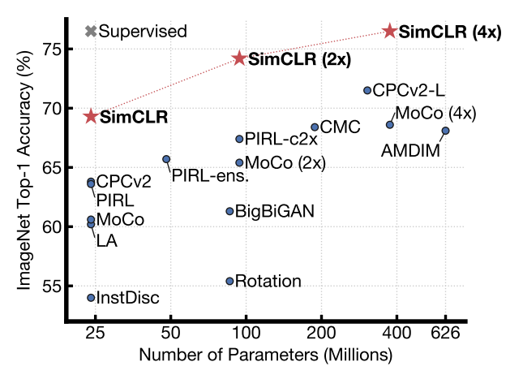
図1. ImageNet 上で事前学習した各種自己教師あり手法により得られた表現に対して、線形分類器を学習したときの Top-1 精度。灰色の×は教師ありの ResNet-50 を示す。本手法 SimCLR を太字で示す。

</center>

しかし、ピクセルレベルでの生成は計算コストが高く、表現学習に必ずしも必要とは限らない。これに対して識別的アプローチは、教師あり学習で用いられる目的関数に類似した目的で表現を学習するが、ラベル付きデータセットではなく、**ラベルなしデータセットから入力とラベルの両方を導出する前処理タスク（pretext task）** をネットワークに解かせることで学習を行う。こうした手法の多くは、前処理タスクを設計するためにヒューリスティックに依存してきた（Doersch et al., 2015; Zhang et al., 2016; Noroozi & Favaro, 2016; Gidaris et al., 2018）。このことは、学習される表現の汎用性を制限する可能性がある。

近年では、潜在空間における **コントラスト学習（contrastive learning）** に基づく識別的アプローチが大きな注目を集めており、最先端の性能を達成している（Hadsell et al., 2006; Dosovitskiy et al., 2014; Oord et al., 2018; Bachman et al., 2019）。

本研究では、視覚表現のコントラスト学習のためのシンプルな枠組み **SimCLR** を提案する。SimCLR は先行研究より高い性能を示すだけでなく（図1）、**特殊なアーキテクチャ**（Bachman et al., 2019; Hénaff et al., 2019）も **メモリバンク**（Wu et al., 2018; Tian et al., 2019; He et al., 2019; Misra & van der Maaten, 2019）も必要としない点で、より簡潔である。

良いコントラスト表現学習を可能にする要因を理解するために、我々は提案枠組みの主要コンポーネントを体系的に検討し、次を示す。

* 複数のデータ拡張操作を組み合わせることは、有効な表現を生むコントラスト予測タスクを定義するうえで重要である。さらに、教師あり学習よりも、教師なしコントラスト学習の方が **より強いデータ拡張** から恩恵を受ける。
* 表現とコントラスト損失の間に **学習可能な非線形変換** を導入すると、学習される表現の品質が大幅に向上する。
* コントラストのクロスエントロピー損失を用いた表現学習では、**正規化された埋め込み** と、適切に調整された **温度パラメータ** が有効である。
* コントラスト学習は、教師あり学習と比べて **大きなバッチサイズ** と **長い学習** から恩恵を受ける。加えて教師あり学習と同様に、より **深い**／より **幅の広い** ネットワークが有利である。

これらの知見を統合することで、ImageNet ILSVRC-2012（Russakovsky et al., 2015）における自己教師あり学習および半教師あり学習で新たな最先端性能を達成した。線形評価プロトコルでは、SimCLR は **Top-1 精度 76.5%** を達成し、従来の最先端手法（Hénaff et al., 2019）に対して **相対 7% の改善**となる。ImageNet のラベルの **1%** のみで微調整した場合でも、SimCLR は **Top-5 精度 85.8%** を達成し、**相対 10% の改善**（Hénaff et al., 2019）となる。さらに、他の自然画像分類データセットで微調整した場合も、12 個中 10 個のデータセットにおいて、強力な教師ありベースライン（Kornblith et al., 2019）と同等かそれ以上の性能を示す。

### 2. Method

#### 2.1. The Contrastive Learning Framework

近年のコントラスト学習アルゴリズム（概観は Section 7 参照）に着想を得て、SimCLR は潜在空間におけるコントラスト損失を通じて、**同一データ例の異なる拡張ビュー間の一致度（agreement）** を最大化することで表現を学習する。図2に示すように、本枠組みは次の4つの主要コンポーネントから構成される。

<center>


図2. 視覚表現のコントラスト学習のためのシンプルな枠組み。同一の拡張ファミリ $\mathcal{T}$ から2つの独立なデータ拡張演算子をサンプリングし（$t\sim\mathcal{T}$ および $t'\sim\mathcal{T}$）、各データ例に適用して相関のある2つのビューを得る。基礎エンコーダネットワーク $f(\cdot)$ と投影ヘッド $g(\cdot)$ を、コントラスト損失により一致度を最大化するよう学習する。学習後は投影ヘッド $g(\cdot)$ を破棄し、下流タスクにはエンコーダ $f(\cdot)$ と表現 $\boldsymbol{h}$ を用いる。

</center>

* **確率的データ拡張モジュール**：与えられたデータ例を確率的に変換し、同一例から相関のある2つのビュー $\tilde{\boldsymbol{x}}_i$ と $\tilde{\boldsymbol{x}}_j$ を生成する。これらを正例ペア（positive pair）とみなす。本研究では、(i) ランダムクロップ後に元サイズへリサイズ、(ii) ランダムな色変形、(iii) ランダムなガウシアンブラー、の3つの単純な拡張を順に適用する。Section 3 で示すように、とくに **ランダムクロップと色変形の組み合わせ**が高性能に不可欠である。
* **基礎エンコーダ $f(\cdot)$**：拡張後のデータ例から表現ベクトルを抽出するニューラルネットワーク。本枠組みはアーキテクチャに制約を設けず、任意のネットワークを選択できる。我々は簡潔さのため、一般的に用いられる ResNet（He et al., 2016）を採用し、
  $$\boldsymbol{h}_i=f(\tilde{\boldsymbol{x}}_i)={\rm ResNet}(\tilde{\boldsymbol{x}}_i),\quad \boldsymbol{h}_i\in\mathbb{R}^d$$
  を得る。ここで $\boldsymbol{h}_i$ は平均プーリング層後の出力である。
* **投影ヘッド $g(\cdot)$**：表現を、コントラスト損失を適用する空間へ写像する小規模なニューラルネットワーク。我々は隠れ層1層の MLP を用い、
  $$\boldsymbol{z}_i=g(\boldsymbol{h}_i)=W^{(2)}\sigma\left(W^{(1)}\boldsymbol{h}_i\right)$$
  とする。ここで $\sigma$ は ReLU 非線形である。Section 4 で示すように、コントラスト損失を $\boldsymbol{h}_i$ ではなく **$\boldsymbol{z}_i$ 上で定義する方が有利**である。
* **コントラスト損失関数**：コントラスト予測タスクのために定義される損失。正例ペア $\tilde{\boldsymbol{x}}_i,\tilde{\boldsymbol{x}}_j$ を含む集合 ${\tilde{\boldsymbol{x}}_i}$ が与えられたとき、コントラスト予測タスクは、与えられた $\tilde{\boldsymbol{x}}_i$ に対して、${\tilde{\boldsymbol{x}}*k}*{k\neq i}$ の中から対応する $\tilde{\boldsymbol{x}}_j$ を識別することを目的とする。

我々は $N$ 個の例からなるミニバッチをランダムにサンプリングし、そのミニバッチから生成した拡張ペアに対してコントラスト予測タスクを定義する。これによりデータ点は $2N$ 個となる。負例（negative example）を明示的にサンプリングすることはせず、正例ペアが与えられたとき（Chen et al., 2017 と同様に）、同一ミニバッチ内の残りの $2(N-1)$ 個の拡張例を負例として扱う。

$\ell_2$ 正規化された $\mathbf{u},\mathbf{v}$ の内積（すなわちコサイン類似度）を
$$\mathrm{sim}(\mathbf{u},\mathbf{v})=\frac{\mathbf{u}^\top\mathbf{v}}{|\mathbf{u}|,|\mathbf{v}|}$$
と定義する。このとき、正例ペア $(i,j)$ に対する損失は

```math
\ell_{i,j} = - \log\frac{\mathrm{exp}\left(\mathrm{sim}(\boldsymbol{z}_i,\boldsymbol{z}_j)/\tau\right)}{\sum_{k=1}^{2N}\mathbb{1}_{k\neq i}\mathrm{exp}\left(\mathrm{sim}(\boldsymbol{z}_i,\boldsymbol{z}_k)/\tau\right)}\tag{1}
```

で与えられる。ここで $\mathbb{1}_{k\neq i}\in\{0,1\}$ は $k\neq i$ のときに1となる指示関数であり、$\tau$ は温度パラメータである。最終的な損失は、ミニバッチ内のすべての正例ペアについて、$(i,j)$ と $(j,i)$ の **両方向**を含めて計算する。この損失は先行研究（Sohn, 2016; Wu et al., 2018; Oord et al., 2018）でも用いられており、便宜上これを **NT-Xent（normalized temperature-scaled cross entropy）損失** と呼ぶ。


<center>

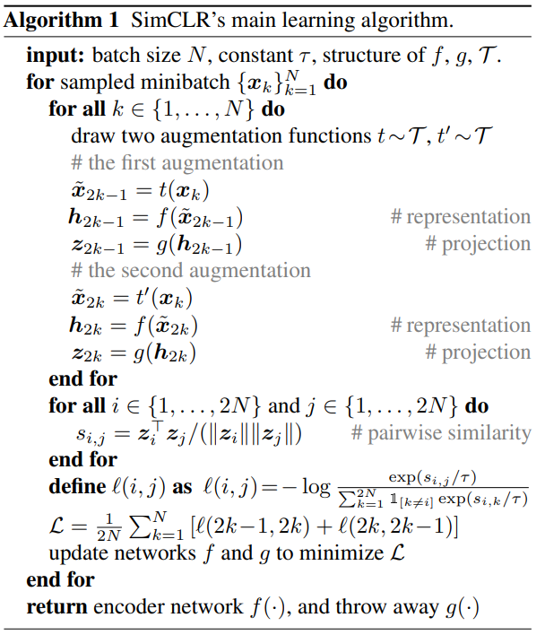
Algorithm (1) summarizes the proposed method.

</center>

#### 2.2. Training with Large Batch Size

簡潔さを保つため、本研究ではメモリバンク（Wu et al., 2018; He et al., 2019）を用いてモデルを学習しない。代わりに、学習時のバッチサイズ $N$ を 256 から 8192 まで変化させる。バッチサイズ 8192 の場合、2つの拡張ビューの両方を用いることで、正例ペア1組あたり **16382 個** の負例を得られる。
一方で、大きなバッチサイズでの学習は、標準的な SGD／Momentum に線形な学習率スケーリング（Goyal et al., 2017）を組み合わせると不安定になり得る。そこで学習を安定化させるため、すべてのバッチサイズに対して LARS オプティマイザ（You et al., 2017）を用いる。学習は Cloud TPU 上で実施し、バッチサイズに応じて 32〜128 コアを使用した。


##### Global BN.

標準的な ResNet はバッチ正規化（Batch Normalization; BN）（Ioffe & Szegedy, 2015）を用いる。データ並列による分散学習では、BN の平均と分散は通常、各デバイス内でローカルに集約して計算される。ところが本研究のコントラスト学習では、正例ペアが同一デバイス上で計算されるため、モデルがこの **ローカルな情報漏洩** を利用して予測精度だけを上げ、表現自体の質を改善しないまま学習が進む可能性がある。

この問題に対処するため、我々は学習中に BN の平均と分散を **全デバイスにわたって集約** して計算する。別の対策としては、デバイス間でデータ例をシャッフルする方法（He et al., 2019）や、BN を layer norm に置き換える方法（Hénaff et al., 2019）がある。


#### 2.3. Evaluation Protocol

ここでは、提案枠組みにおけるさまざまな設計選択を理解することを目的とした、我々の実証研究（実験）のプロトコルを示す。

##### Dataset and Metrics.

ラベルなしでの事前学習（すなわち、ラベルを用いずにエンコーダネットワーク $f$ を学習すること）に関する我々の検討の大部分は、ImageNet ILSVRC-2012 データセット（Russakovsky et al., 2015）を用いて行う。CIFAR-10（Krizhevsky & Hinton, 2009）上での追加の事前学習実験については、付録 B.9 に示す。さらに、事前学習によって得られた結果を、転移学習のために幅広いデータセット上で評価する。
学習された表現を評価するため、我々は広く用いられている **線形評価プロトコル** （Zhang et al., 2016; Oord et al., 2018; Bachman et al., 2019; Kolesnikov et al., 2019）に従う。これは、事前学習済みの基礎ネットワークを凍結したまま、その上に線形分類器のみを学習し、テスト精度を表現品質の代理指標として用いる方法である。線形評価に加えて、半教師あり学習および転移学習においても最先端手法との比較を行う。

##### Default setting.

特に断りがない限り、データ拡張として **ランダムクロップ＋リサイズ（ランダムフリップを含む）**、**色変形**、**ガウシアンブラー**を用いる（詳細は付録A参照）。基礎エンコーダネットワークには **ResNet-50** を用い、2層 MLP の投影ヘッドによって表現を **128 次元の潜在空間**へ射影する。
損失には **NT-Xent** を用い、最適化は **LARS** により行う。学習率は 4.8（= 0.3 × BatchSize/256）、weight decay は $10^{-6}$ とする。バッチサイズ 4096 で 100 エポック学習する。さらに、最初の 10 エポックは線形ウォームアップを行い、その後は restart なしの **コサイン減衰スケジュール**（Loshchilov & Hutter, 2016）で学習率を減衰させる。

### 3. Data Augmentation for Contrastive Representation Learning

##### Data augmentation defines predictive tasks.  

データ拡張は、教師あり・教師なしの表現学習の両方で広く用いられてきたものの（Krizhevsky et al., 2012; Hénaff et al., 2019; Bachman et al., 2019）、**コントラスト予測タスクを体系的に定義する手段** としては十分に検討されてこなかった。既存手法の多くは、アーキテクチャを変更することでコントラスト予測タスクを定義している。例えば、Hjelm et al.（2018）や Bachman et al.（2019）は、ネットワークの受容野を制約することで **グローバルからローカルへのビュー予測** を実現している。一方、Oord et al.（2018）や Hénaff et al.（2019）は、固定の画像分割手順とコンテキスト集約ネットワークにより、**近傍ビューの予測** を実現している。
我々は、このような複雑さは、対象画像に対して単純な **ランダムクロップ（リサイズ付き）** を行うことで回避できることを示す。これにより、図3に示すように、上述の2種類の予測を包含するような予測タスクのファミリを生成できる。この単純な設計選択は、予測タスクをニューラルネットワークのアーキテクチャといった他要素から都合よく切り離すことを可能にする。さらに、拡張のファミリを拡大し、それらを確率的に合成することで、より広範なコントラスト予測タスクを定義できる。

<center>

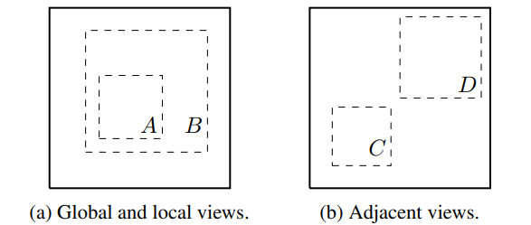
**図3.** 実線の長方形は画像、破線の長方形はランダムクロップを表す。画像をランダムにクロップすることで、グローバルからローカルへのビュー予測 $(B \rightarrow A)$ や、隣接ビュー予測 $(D \rightarrow C)$ を含むコントラスト予測タスクをサンプリングできる。

</center>

#### 3.1. Composition of data augmentation operations is crucial for learning good representations

データ拡張の影響を体系的に調べるため、本研究ではここでいくつかの一般的な拡張を検討する。拡張には大きく2種類ある。
1つ目は、クロップとリサイズ（水平反転を含む）、回転（Gidaris et al., 2018）、cutout（DeVries & Taylor, 2017）といった、データに対する **空間的／幾何学的変換**を伴う拡張である。
2つ目は、色変形（color dropping、明るさ、コントラスト、彩度、色相を含む）（Howard, 2013; Szegedy et al., 2015）、ガウシアンブラー、Sobel フィルタリングといった、**外観（appearance）の変換**を伴う拡張である。
図4では、本研究で検討するこれらの拡張を可視化して示す。

<center>

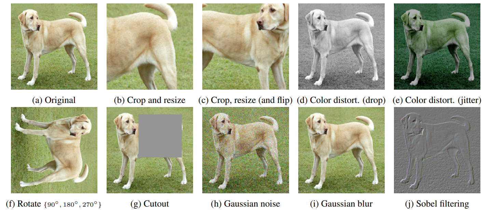
**図4.** 本研究で検討したデータ拡張オペレータの例示。各拡張は、内部パラメータ（例：回転角度、ノイズレベル）に基づいて確率的にデータを変換し得る。なお、これらのオペレータはアブレーションでのみ検証しており、我々のモデル学習に用いる拡張方策には、ランダムクロップ（フリップおよびリサイズを含む）、色変形、ガウシアンブラーのみを含める。（元画像 cc-by: Von.grzanka）

</center>

個々のデータ拡張の効果と、拡張の合成（composition）が重要である理由を理解するため、我々は拡張を **単独** あるいは **2つの組み合わせ** で適用した場合における本枠組みの性能を調べる。ImageNet の画像はサイズが不揃いであるため、常にクロップとリサイズを適用する必要があり（Krizhevsky et al., 2012; Szegedy et al., 2015）、クロッピングなしの条件で他の拡張を検討することが難しい。そこで、この交絡要因を取り除くために、本アブレーションでは **非対称（asymmetric）なデータ変換** の設定を採用する。
具体的には、まず常に画像をランダムにクロップし、同一解像度へリサイズする。その後、狙って検討したい変換（単独または複数）を、図2の枠組みにおける片側のブランチにのみ適用し、もう片側は恒等写像（すなわち $t(\mathbf{x}_i)=\mathbf{x}_i$）のままにする。なお、この非対称なデータ拡張は性能を低下させる。しかし、この設定であっても、個々のデータ拡張やその組み合わせが与える影響そのものは、本質的には変わらないはずである。

<center>

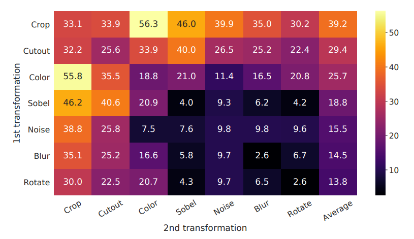
**図5.** 片側のブランチにのみデータ拡張を適用した場合における、個別の拡張および拡張の合成に対する線形評価（ImageNet Top-1 精度）。最後の列を除き、対角成分は単一の変換に対応し、非対角成分は2つの変換の合成（順に逐次適用）に対応する。最後の列は各行の平均を示す。

</center>

図5は、変換を **単独で適用した場合** と **複数を合成して適用した場合** における線形評価の結果を示している。我々は、コントラストタスクにおいてモデルが正例ペアをほぼ完全に識別できるにもかかわらず、**単一の変換だけでは良い表現を学習するには不十分** であることを観察した。
一方で、複数の拡張を合成するとコントラスト予測タスク自体はより難しくなるが、**表現の品質は劇的に向上** する。付録 B.2 では、より広い拡張集合を合成する場合について、追加の検討を示す。

<center>

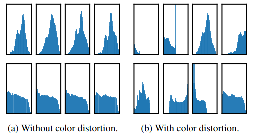
**図6.** 2枚の異なる画像（2行）について、各画像から切り出した複数のクロップに対するピクセル強度（全チャネル）のヒストグラム。1行目の画像は図4から引用している。すべての軸は同一の範囲に揃えている。

</center>

拡張の合成の中でも特に際立って効果的なのは、**ランダムクロップ** と **ランダムな色変形（color distortion）** の組み合わせである。我々は、データ拡張としてランダムクロップのみを用いた場合の重大な問題として、 **同一画像から切り出された多くのパッチが類似した色分布を共有してしまう** 点があると推測する。図6が示すように、 **色ヒストグラムだけでも画像を識別できてしまう** 。その結果、ニューラルネットはこのような近道（shortcut）を利用して予測タスクを解いてしまう可能性がある。
したがって、汎化可能な特徴を学習するためには、クロッピングを色変形と組み合わせることが重要である。

#### 3.2 Contrastive learning needs stronger data augmentation than supervised learning

<center>

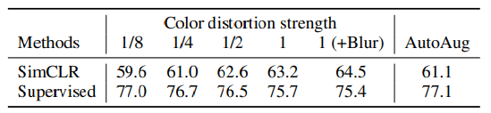
**表1.** 色変形（付録A参照）の強度および他のデータ変換を変化させた条件の下で、線形評価による教師なし ResNet-50 と、教師あり ResNet-50 の Top-1 精度を示す。Strength 1（+Blur）は、我々のデフォルトのデータ拡張方策である。

</center>

色拡張の重要性をさらに示すため、表1に示すように色拡張の強度を調整した。 **より強い色拡張** は、教師なしで学習したモデルの線形評価性能を大きく向上させる。この文脈では、教師あり学習によって探索された高度な拡張方策である AutoAugment（Cubuk et al., 2019）は、単純な「クロップ＋（より強い）色変形」を上回る効果を示さない。
同じ拡張セットを用いて教師ありモデルを学習した場合、 **より強い色拡張は性能を改善しないか、むしろ悪化させる** ことを観察した。したがって本実験は、教師なしのコントラスト学習が、教師あり学習よりも **より強い（特に色の）データ拡張** から恩恵を受けることを示している。
これまでにも、データ拡張が自己教師あり学習に有用であることは報告されてきたが（Doersch et al., 2015; Bachman et al., 2019; Hénaff et al., 2019; Asano et al., 2019）、我々はさらに、 **教師あり学習では精度向上につながらないデータ拡張であっても、コントラスト学習には大きく寄与し得る** ことを示した。

### 4. Architectures for Encoder and Head

#### 4.1. Unsupervised contrastive learning benefits (more) from bigger models

<center>

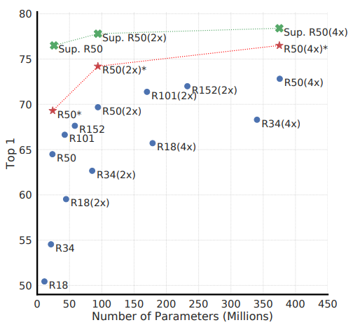
**図7.** 深さと幅を変えたモデルの線形評価結果。青の点は 100 エポック学習した我々のモデル、赤の星印は 1000 エポック学習した我々のモデル、緑の×印は 90 エポック学習した教師あり ResNet（He et al., 2016）を示す。

</center>

図7は、予想どおりではあるが、 **ネットワークの深さ** と **幅** を増やすといずれも性能が向上することを示している。同様の傾向は教師あり学習でも知られているが（He et al., 2016）、我々は、モデルサイズが大きくなるにつれて、 **教師ありモデル** と **教師なしで学習した表現の上に線形分類器を学習した場合** との性能差が縮小することを見いだした。これは、教師あり学習と比べて、教師なし学習の方が **より大きなモデルから相対的に大きな恩恵を受ける** ことを示唆している。

#### 4.2. A nonlinear projection head improves the representation quality of the layer before it

<center>

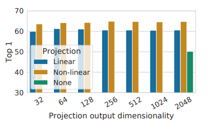
**図8.** 異なる投影ヘッド $g(\cdot)$ と、さまざまな次元の $\boldsymbol{z}=g(\boldsymbol{h})$ を用いた表現の線形評価結果。ここで、投影前の表現 $\boldsymbol{h}$ の次元は 2048 である。

</center>

次に、投影ヘッド（すなわち $g(\boldsymbol{h})$）を含めることの重要性を調べる。図8は、ヘッドのアーキテクチャとして次の3種類を用いた場合の線形評価結果を示している。(1) 恒等写像（identity mapping）、(2) いくつかの先行研究で用いられている線形射影（Wu et al., 2018）、(3) Bachman et al.（2019）と同様に、隠れ層を1層追加し ReLU 活性化を含む、デフォルトの非線形射影である。
観察される結果として、 **非線形射影は線形射影より良く（+3%）** 、さらに **投影なしよりも大幅に良い（>10%）** 。投影ヘッドを用いる場合、出力次元に依らず同様の傾向が得られる。さらに、非線形射影を用いた場合であっても、投影ヘッド直前の層である $\boldsymbol{h}$ は、投影後の層 $\boldsymbol{z}=g(\boldsymbol{h})$ よりも依然として **大幅に良い（>10%）** 。これは、投影ヘッドの直前にある隠れ表現の方が、投影後の表現よりも下流タスクにとって優れた表現であることを示している。

我々は、非線形投影の **手前の表現** を用いることが重要である理由は、コントラスト損失によって誘発される **情報の欠落** にあると推測する。特に、$\boldsymbol{z}=g(\boldsymbol{h})$ はデータ変換に対して不変（invariant）になるよう学習される。したがって $g$ は、下流タスクに有用であり得る情報――たとえば物体の色や向き――を取り除いてしまう可能性がある。
一方で、非線形変換 $g(\cdot)$ を介在させることで、より多くの情報を $\boldsymbol{h}$ 側に形成・保持できる。そこでこの仮説を検証するため、事前学習中に適用された変換を予測するタスクを設定し、$\boldsymbol{h}$ を用いる場合と $g(\boldsymbol{h})$ を用いる場合の両方で実験を行う。ここでは、$g(h)=W^{(2)}\sigma(W^{(1)}h)$ とし、入力次元と出力次元を同一（すなわち 2048）に設定する。表3は、$\boldsymbol{h}$ が適用された変換に関する情報をはるかに多く含む一方で、$g(\boldsymbol{h})$ は情報を失っていることを示している。さらなる解析は付録 B.4 に示す。

<center>

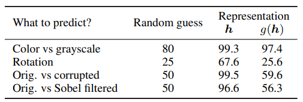
**表3.** 適用された変換を予測するために、異なる表現の上に追加の MLP を学習したときの精度。最後の3行では、クロップと色拡張に加えて、事前学習中に **回転**（${0^\circ, 90^\circ, 180^\circ, 270^\circ}$ のいずれか）、**ガウシアンノイズ**、**Sobel フィルタリング**の各変換を、追加でかつ独立に導入している。$\boldsymbol{h}$ と $g(\boldsymbol{h})$ はいずれも同じ次元（2048）である。

</center>

### 5. Loss Functions and Batch Size

#### 5.1. Normalized cross entropy loss with adjustable temperature works better than alternatives

<center>

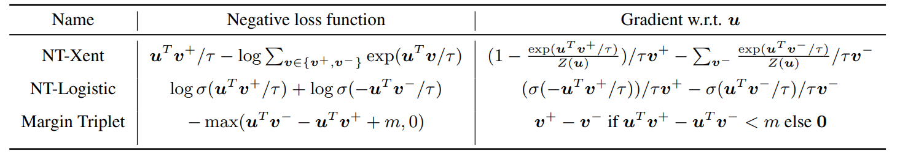
**表2.** 負例を用いる損失関数とそれらの勾配。入力ベクトル（$\boldsymbol{u}, \boldsymbol{v}^-, \boldsymbol{v}^+$）はすべて $\ell_2$ 正規化されている。NT-Xent は “Normalized Temperature-scaled Cross Entropy（正規化付き温度スケーリング交差エントロピー）” の略である。損失関数が異なると、正例および負例に対する重み付けのされ方も異なる。

</center>

我々は、NT-Xent 損失を、ロジスティック損失（Mikolov et al., 2013）やマージン損失（Schroff et al., 2015）といった、他の一般的に用いられるコントラスト損失関数と比較する。表2には、各目的関数と、損失関数の入力に対する勾配が示されている。勾配に着目すると、次の点が観察できる。
1. $\ell_2$ 正規化（すなわちコサイン類似度）と温度パラメータを組み合わせることで、例ごとに効果的な重み付けが行われる。適切な温度設定により、モデルは **ハードな負例（hard negatives）** から学びやすくなる。
2. クロスエントロピーと異なり、他の目的関数は、負例をその **相対的な難しさ** に応じて重み付けしない。
その結果、これらの損失関数では **semi-hard negative mining**（Schroff et al., 2015）が必要になる。すなわち、すべての損失項に対して勾配を計算するのではなく、semi-hard な負例項――具体的には、損失マージン内にあり、距離が最も近い一方で、正例よりは遠い負例――のみを用いて勾配を計算する。

比較を公平にするため、すべての損失関数に対して同一の $\ell_2$ 正規化を用い、ハイパーパラメータをチューニングしたうえで最良の結果を報告する。表4が示すように、（semi-hard）ネガティブマイニングは確かに効果があるものの、最良の結果であっても、我々のデフォルトである **NT-Xent 損失** と比べると依然として大幅に劣っている。

<center>

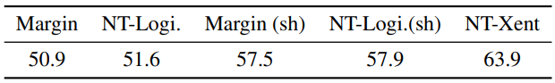
**表4.** 異なる損失関数で学習したモデルの線形評価（Top-1）結果。“sh” は semi-hard negative mining を用いることを意味する。

</center>

次に、デフォルトの NT-Xent 損失における **$\ell_2$ 正規化**（すなわち、コサイン類似度と内積の比較）および **温度パラメータ $\tau$** の重要性を検証する。表5が示すように、正規化と適切な温度スケーリングがない場合、性能は著しく悪化する。
また、$\ell_2$ 正規化を行わない場合、コントラストタスクにおける正例識別精度は高くなるが、線形評価で見たときの表現はむしろ劣化する。

<center>

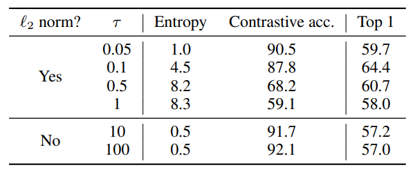
**表5.** NT-Xent 損失において、$\ell_2$ 正規化（$\ell_2$ norm）の有無および温度パラメータ $\tau$ の選択を変えて学習したモデルの線形評価結果。コントラスト分布は 4096 個の例にわたって定義されている。

</center>

#### 5.2. Contrastive learning benefits (more) from larger batch sizes and longer training

<center>

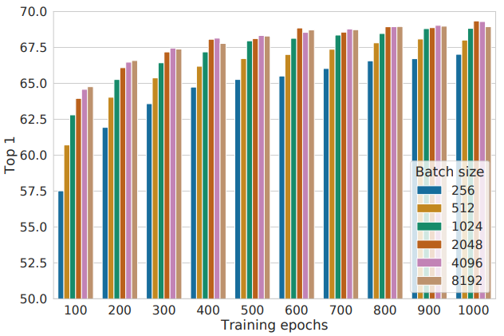
**図9.** 異なるバッチサイズおよび学習エポック数で学習した線形評価モデル（ResNet-50）の結果。各バーはスクラッチからの単一実行を表す。

</center>

図9は、学習エポック数を変えたときに、バッチサイズが与える影響を示している。我々は、学習エポック数が小さい場合（例えば 100 エポック）、 **大きいバッチサイズの方が小さいバッチサイズよりも顕著に有利** であることを見いだした。一方で、学習ステップ／エポック数を増やすと、バッチをランダムに再サンプリングする限り、バッチサイズ間の差は小さくなるか、あるいは消失する。
教師あり学習（Goyal et al., 2017）とは対照的に、コントラスト学習では、大きなバッチサイズはより多くの負例を提供するため、収束を促進する（すなわち、所定の精度に到達するまでに必要なエポック数・ステップ数が少なくて済む）。また、学習を長く行うこと自体も負例の総数を増やすため、結果の改善につながる。さらに長い学習ステップでの結果は付録 B.1 に示す。

### 6. Comparison with State-of-the-art

本小節では、Kolesnikov et al.（2019）および He et al.（2019）と同様に、ResNet-50 について隠れ層の幅を3通り（幅倍率 1×、2×、4×）に設定して用いる。より良い収束のため、ここでのモデルは **1000 エポック** 学習する。

##### Linear evaluation.

<center>

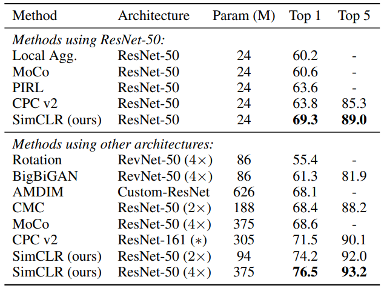
**表6.** 異なる自己教師あり手法で学習した表現に対して線形分類器を学習した場合の、ImageNet における精度。

</center>

表6では、線形評価の設定（付録 B.6 参照）において、我々の結果を先行手法（Zhuang et al., 2019; He et al., 2019; Misra & van der Maaten, 2019; Hénaff et al., 2019; Kolesnikov et al., 2019; Donahue & Simonyan, 2019; Bachman et al., 2019; Tian et al., 2019）と比較する。表1には、各手法間の数値比較がさらに示されている。
我々は、特別に設計されたアーキテクチャを必要とする従来法に対し、 **標準的なネットワーク** を用いながらも大幅に良い結果を得られることを示した。特に、ResNet-50（4×）で得られた最良結果は、教師あり事前学習の ResNet-50 と同等の性能に到達する。

##### Semi-supervised learning.

<center>

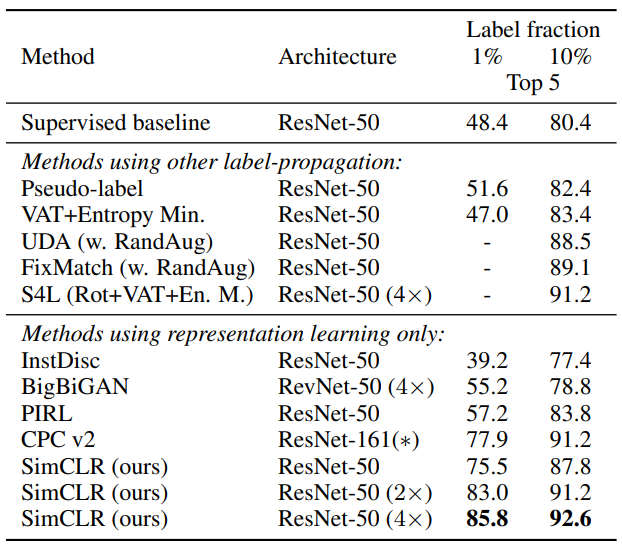
**表7.** 少数のラベルで学習したモデルの ImageNet における精度。

</center>

我々は Zhai et al.（2019）に従い、ILSVRC-12 の学習データからラベル付きデータを **1%** または **10%**、クラスバランスを保つ形でサンプリングする（それぞれ 1 クラスあたり約 12.8 枚、および約 128 枚に相当）。ラベル付きデータに対しては、正則化は用いず（詳細は付録 B.5 参照）、ベースネットワーク全体をそのまま単純にファインチューニングする。
表7は、我々の結果を近年の手法（Zhai et al., 2019; Xie et al., 2019; Sohn et al., 2020; Wu et al., 2018; Donahue & Simonyan, 2019; Misra & van der Maaten, 2019; Hénaff et al., 2019）と比較したものである。（Zhai et al. の）教師ありベースラインは、拡張を含むハイパーパラメータの集中的な探索によって強力な結果となっている。にもかかわらず、我々の手法は、ラベルが **1%** および **10%** のいずれの場合でも、最先端手法を大きく上回る改善を達成する。
さらに興味深いことに、事前学習済みの ResNet-50（2×、4×）を **ImageNet 全体**でファインチューニングすると、スクラッチから学習するよりも有意に良い結果が得られる（最大で 2% の改善。付録 B.2 参照）。

##### Transfer learning.

<center>

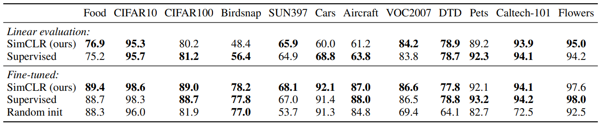
**表8.** ImageNet 上で事前学習した ResNet-50（4×）モデルを用い、12 個の自然画像分類データセットにおける転移学習性能について、我々の自己教師あり手法と教師ありベースラインを比較した結果を示す。最良の結果と比べて有意に劣らないもの（置換検定により *p* > 0.05）は太字で示す。実験の詳細および標準的な ResNet-50 による結果は付録 B.8 を参照されたい。

</center>

我々は、12 個の自然画像データセットにわたり、 **線形評価（特徴抽出器を固定）** と **ファインチューニング** の両設定で転移学習性能を評価する。Kornblith et al.（2019）に従い、各「モデル×データセット」組み合わせごとにハイパーパラメータをチューニングし、検証セット上で最良のハイパーパラメータを選択する。
表8は ResNet-50（4×）モデルでの結果を示す。ファインチューニング時、我々の自己教師ありモデルは 5 つのデータセットで教師ありベースラインを有意に上回る一方、教師ありベースラインが優れるのは 2 つ（Pets と Flowers）のみである。残りの 5 つのデータセットでは、統計的に同等（差が有意でない）である。
実験の詳細および標準的な ResNet-50 アーキテクチャでの結果は、付録 B.8 に示す。

### 7. Related Work

画像に対する小さな変換の下で、その表現同士が一致するようにするという発想は、Becker & Hinton（1992）まで遡る。我々はこの考え方を、近年のデータ拡張、ネットワークアーキテクチャ、そしてコントラスト損失における進展を活用することで発展させた。これと類似した「整合性（consistency）」の発想は、対象がクラスラベル予測である点は異なるものの、半教師あり学習など他の文脈でも検討されている（Xie et al., 2019; Berthelot et al., 2019）。

##### Handcrafted pretext tasks.

近年の自己教師あり学習の再興は、相対パッチ予測（Doersch et al., 2015）、ジグソーパズルの解法（Noroozi & Favaro, 2016）、カラー化（Zhang et al., 2016）、回転予測（Gidaris et al., 2018; Chen et al., 2019）といった、人工的に設計された前処理タスク（pretext task）から始まった。より大規模なネットワークとより長い学習によって良い結果が得られることもあるが（Kolesnikov et al., 2019）、これらの前処理タスクはどこか場当たり的（ad-hoc）なヒューリスティックに依存しており、そのことが学習される表現の汎用性を制限してしまう。

##### Contrastive visual representation learning.

Hadsell et al.（2006）に遡るこれらのアプローチは、 **正例ペア** を **負例ペア** と対比させることで表現を学習する。この流れの中で、Dosovitskiy et al.（2014）は、各インスタンスを特徴ベクトル（パラメトリックな形）で表される **クラス** として扱うことを提案した。Wu et al.（2018）は、インスタンスクラスの表現ベクトルを保存するために **メモリバンク** を用いることを提案し、このアプローチは近年の複数の論文で採用・拡張されている（Zhuang et al., 2019; Tian et al., 2019; He et al., 2019; Misra & van der Maaten, 2019）。
また、メモリバンクの代わりに、負例サンプリングとして **ミニバッチ内のサンプル（in-batch samples）** を用いることを探究する研究もある（Doersch & Zisserman, 2017; Ye et al., 2019; Ji et al., 2019）。

近年の研究では、提案手法の成功を、潜在表現間の **相互情報量（mutual information）** の最大化と関連付けて説明しようとする試みがなされている（Oord et al., 2018; Hénaff et al., 2019; Hjelm et al., 2018; Bachman et al., 2019）。しかし、コントラスト型アプローチの成功が **相互情報量そのもの** によって規定されているのか、それとも **コントラスト損失の具体的な形** によって規定されているのかは明確ではない（Tschannen et al., 2019）。

本枠組みを構成する各要素は、具体的な実装（インスタンス化）は異なる場合があるものの、そのほとんどが先行研究ですでに登場している点に注意されたい。したがって、先行研究に対する本枠組みの優位性は、いずれか単一の設計選択によって説明されるものではなく、 **それらを組み合わせたこと（composition）** によって生じている。我々は、先行研究の設計選択と本研究の設計選択を包括的に比較した内容を付録 C に示す。

### 8. Conclusion

本研究では、視覚表現のコントラスト学習のためのシンプルな枠組みと、その具体的な実装を提示した。我々はその構成要素を丁寧に検討し、異なる設計選択がもたらす影響を示した。これらの知見を統合することで、自己教師あり学習、半教師あり学習、転移学習のいずれにおいても、先行手法を大幅に上回る改善を達成した。

我々のアプローチは、ImageNet における標準的な教師あり学習と比べて、 **データ拡張の選択** 、 **ネットワーク末尾における非線形ヘッドの使用** そして **損失関数** の3点が異なるだけである。この単純な枠組みが強力であるという事実は、近年自己教師あり学習への関心が急速に高まっているにもかかわらず、自己教師あり学習が依然として過小評価されていることを示唆している。