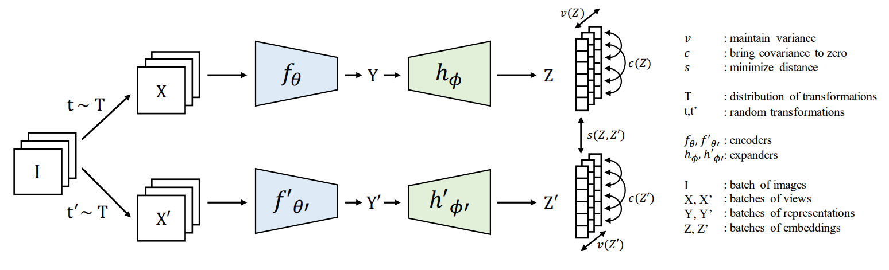
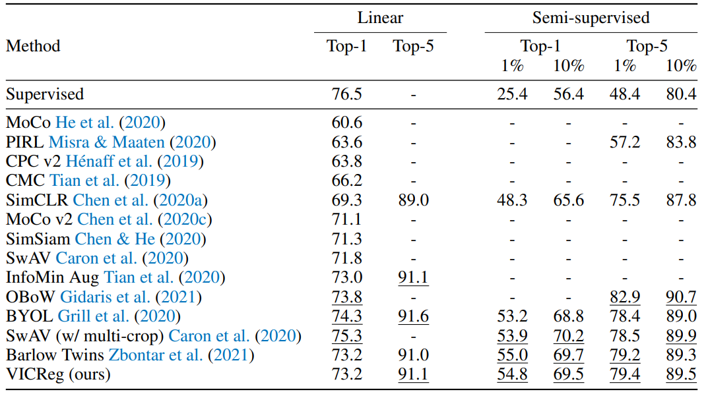
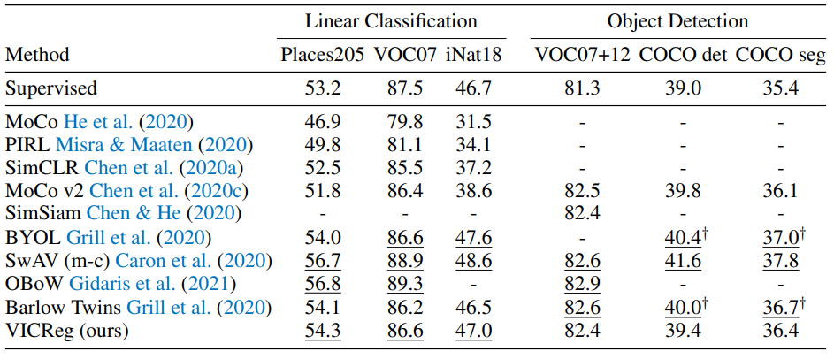
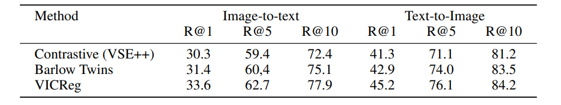
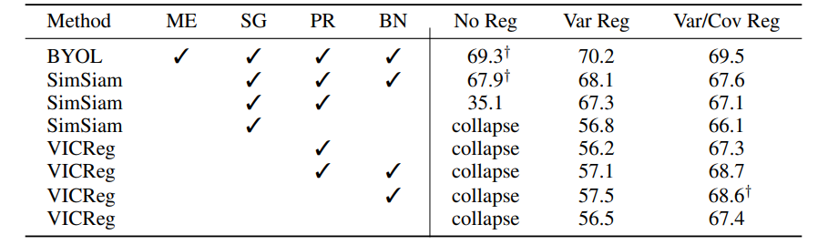
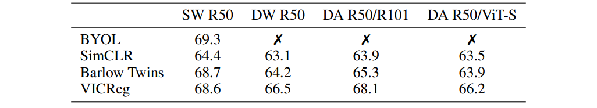
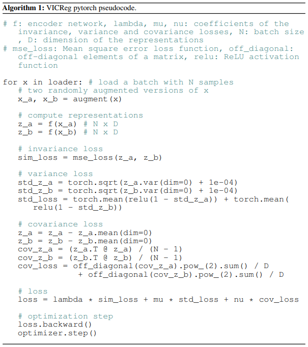
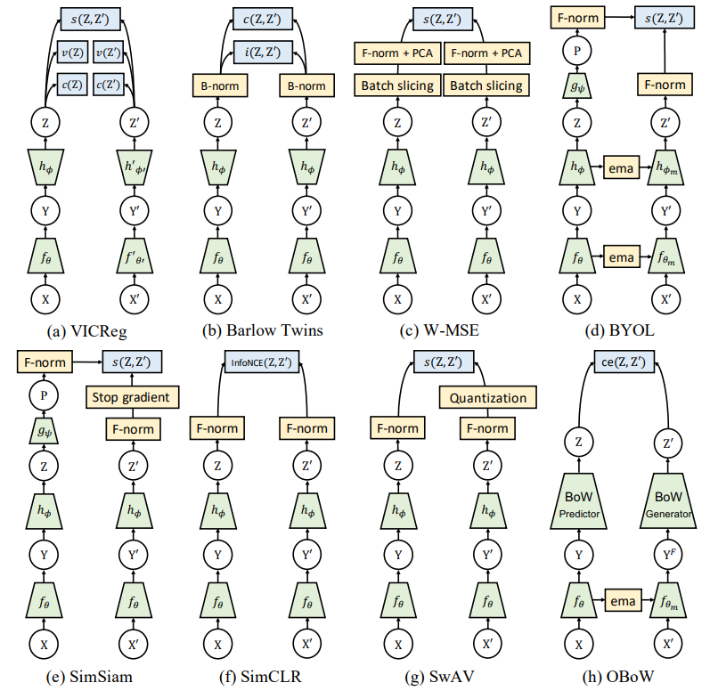
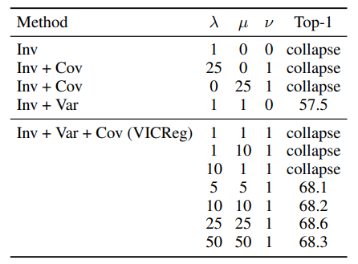
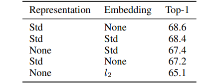

# VICREG: VARIANCE-INVARIANCE-COVARIANCE REGULARIZATION FOR SELF-SUPERVISED LEARNING

## Abstract

近年の画像表現学習における自己教師あり学習手法では、同一画像の異なるビューを入力とするエンコーダが生成する埋め込みベクトル間の一致を最大化する。主な課題は、エンコーダが定数ベクトルや情報を持たないベクトルを出力してしまう崩壊を防ぐことである。
我々はVICReg（Variance-Invariance-Covariance Regularization）を導入する。これは、各埋め込みに個別に適用される二つの正則化項によって、崩壊問題を明示的に回避する手法である。すなわち、(1) 各埋め込み次元の分散を閾値以上に維持する項、(2) 各変数対を無相関化する項、である。
同じ問題に対する他の多くの手法とは異なり、VICRegは、枝間の重み共有、バッチ正規化、特徴ごとの正規化、出力の量子化、stop-gradient、メモリバンクなどの技術を必要としない。それにもかかわらず、複数のダウンストリームタスクにおいて最先端手法に匹敵する結果を達成する。
さらに、我々は、この分散正則化項が他の手法の学習を安定化し、性能向上につながることを示す。

## 1. Introduction

自己教師あり表現学習はここ数年で大きく進展し、多くのダウンストリームタスクにおいて教師ありベースラインにほぼ匹敵する性能に到達している Bachman et al. (2019); Misra & Maaten (2020); He et al. (2020); Tian et al. (2020); Caron et al. (2020); Grill et al. (2020); Chen & He (2020); Gidaris et al. (2021); Zbontar et al. (2021)。近年のいくつかの手法は共同埋め込みアーキテクチャに基づいており、そこでは二つのネットワークが、同一画像の異なるビューに対して類似した埋め込みを生成するよう学習される。代表的な例として、二つのネットワークが同じ重みを共有するSiameseネットワークアーキテクチャ Bromley et al. (1994) がある。共同埋め込みアーキテクチャにおける主な課題は、二つの枝が入力を無視し、同一かつ定数の出力ベクトルを生成してしまう崩壊を防ぐことである。崩壊を防ぐ方法には主に二つあり、コントラスト法と情報最大化法である。
コントラスト法 Bromley et al. (1994); Chopra et al. (2005); He et al. (2020); Hjelm et al. (2019); Chen et al. (2020a) は一般に計算コストが高く、大きなバッチサイズやメモリバンクを必要とし、さらに非類似画像の埋め込み同士を明示的に引き離す損失を用いる傾向がある。また、メモリバンク He et al. (2020) や現在のバッチ Chen et al. (2020a) から問題となる非類似サンプルを探索するマイニング手順を必要とすることが多い。量子化に基づく手法 Caron et al. (2020; 2018) では、異なるサンプルの埋め込みが単位球上の異なるクラスタに属するよう強制する。崩壊は、サンプルのクラスタへの割り当てができるだけ一様になるよう保証することで防がれる。また、二つの枝から得られるクラスタ割り当てスコアベクトルが類似するよう、類似性項が導入される。
より最近では、コントラストサンプルやベクトル量子化に依存せず、それでも高品質な表現を生成する手法がいくつか登場している。例えば、BYOL Grill et al. (2020) や SimSiam Chen & He (2020) である。これらは、バッチ単位または特徴単位の正規化、一方の枝のパラメータベクトルを他方の枝のパラメータベクトルの低域通過フィルタ版とする「モメンタムエンコーダ」 Grill et al. (2020); Richemond et al. (2020)、あるいは一方の枝における stop-gradient 操作 Chen & He (2020) といった複数の工夫を利用している。これらの手法における学習ダイナミクスや、どのように崩壊を回避しているのかは、いまだ十分には理解されていないが、理論的および実証的研究は、バッチ単位または特徴単位の正規化が決定的に重要であることを示している Richemond et al. (2020); Tian et al. (2021)。
最後に、崩壊防止法の別のクラスとして、埋め込みの情報量を最大化することに基づく手法がある Zbontar et al. (2021); Ermolov et al. (2021)。これらの手法は、埋め込みベクトルのあらゆる変数対を無相関化することで、情報的な崩壊を防ぐ。これにより、埋め込みベクトルの情報量が間接的に最大化される。Barlow Twins は、二つの埋め込みの正規化相互相関行列を単位行列へ近づける Zbontar et al. (2021)。一方、Whitening-MSE は、埋め込みベクトルをホワイトニングし、単位球上に広がるようにする Ermolov et al. (2021)。



図1: VICReg：分散・不変性・共分散正則化を備えた共同埋め込みアーキテクチャ。
画像のバッチ $I$ が与えられると、二つの異なるビューのバッチ $X$ と $X^\prime$ が生成され、それぞれ表現 $Y$ と $Y^\prime$ にエンコードされる。これらの表現は、埋め込み $Z$ と $Z^\prime$ を生成する expander に入力される。同一画像に由来する二つの埋め込み間の距離は最小化され、バッチ内における各埋め込み変数の分散は閾値以上に維持され、さらにバッチ内における埋め込み変数の各組の共分散はゼロへ引き寄せられることで、変数同士が無相関化される。
二つの枝は同一アーキテクチャである必要も、重みを共有する必要もないが、我々の実験の大半では、共有重みを持つ Siamese 構成を採用している。エンコーダは出力次元 2048 の ResNet-50 バックボーンである。expander はサイズ 8192 の全結合層を 3 層持つ。

## 2. VICREG: INTUITION

我々はVICReg（Variance-Invariance-Covariance Regularization）を導入する。これは、埋め込みの情報量を保持するという原理に基づき、共同埋め込みアーキテクチャを学習するための自己教師あり手法である。基本的な考え方は、三つの項からなる損失関数を用いることである。

* 不変性（Invariance）：埋め込みベクトル間の平均二乗距離
* 分散（Variance）：埋め込みの各変数の標準偏差（バッチ内で計算）が与えられた閾値以上となるよう維持するためのヒンジ損失。この項は、バッチ内の各サンプルの埋め込みベクトルが互いに異なることを強制する。
* 共分散（Covariance）：埋め込みの各変数対（中心化後）について、その共分散（バッチ内で計算）をゼロへ引き寄せる項。この項は、各埋め込み内の変数同士を無相関化し、変数が一緒に変動したり強く相関したりすることによる情報的崩壊を防ぐ。

分散項と共分散項は、アーキテクチャの両方の枝に対してそれぞれ個別に適用される。これにより、各埋め込みの情報量が一定水準で保持され、二つの枝それぞれについて独立に情報的崩壊が防止される。本論文の主たる貢献は、この分散保持項にある。これは、埋め込みベクトルがゼロへ縮退することによる崩壊を明示的に防ぐものである。共分散基準は Barlow Twins の手法から取り入れたものであり、埋め込み変数間の冗長性による情報的崩壊を防ぐ Zbontar et al. (2021)。VICReg は、アーキテクチャに対する制約が少ないため、前述の多くの手法よりも一般的に適用しやすい。特に、VICReg は次の特徴を持つ。

* 二つの枝の重み共有を必要とせず、アーキテクチャが同一である必要もなく、入力が同種である必要もない。
* メモリバンク、コントラストサンプル、大きなバッチサイズを必要としない。
* バッチ単位の正規化も特徴単位の正規化も必要としない。
* ベクトル量子化や predictor モジュールを必要としない。

他の手法では、SimSiam Chen & He (2020) におけるような非対称な stop-gradient 操作、古典的な Siamese ネットにおけるような二つの枝間の重み共有、あるいは BYOL や MoCo におけるような、一方の枝で stop-gradient を用いながら指数移動平均によって重み共有を行う仕組み He et al. (2020); Grill et al. (2020); Chen et al. (2020c)、SimCLR Chen et al. (2020a) におけるような大規模なコントラストサンプルのバッチ、あるいはバッチ単位および／または特徴単位の正規化 Caron et al. (2020); Grill et al. (2020); Chen & He (2020); Zbontar et al. (2021); Ermolov et al. (2021) を必要とする。VICReg の最も興味深い特徴の一つは、二つの枝が同じパラメータ、同じアーキテクチャ、あるいは同じ入力モダリティを共有する必要がないという点である。これにより、動画や音声のようなマルチモーダル信号に対して、非コントラスト型の自己教師あり共同埋め込み学習を適用する道が開かれる。

我々は、ImageNet Deng et al. (2009) における画像分類の線形評価および半教師あり評価プロトコルを含む複数のダウンストリーム画像認識タスク、さらに他の分類、検出、インスタンスセグメンテーション、検索タスクにおいて、VICReg により学習された表現を評価することで、提案手法の有効性を示す。さらに、他の自己教師あり共同埋め込み手法に分散保持を組み込むことで、学習の安定性が向上し、ダウンストリームタスクでの性能改善が得られることも示す。より一般には、VICReg は、自己教師あり共同埋め込み学習における崩壊を防ぐための、明示的で有効かつ単純な手法であることを示す。

## 3. RELATED WORK

### Contrastive learning.

共同埋め込みアーキテクチャに適用されるコントラスト型自己教師あり学習法では、あるサンプルとその歪ませた版に対する出力埋め込みは互いに近づけられ、他のサンプルおよびその歪ませた版は互いに引き離される。この手法は、多くの場合、二つの枝が同一のアーキテクチャを持ち、重みを共有する Siamese アーキテクチャに適用される Misra & Maaten (2020); He et al. (2020); Bromley et al. (1994); Hjelm et al. (2019); Chen et al. (2020a;c); Hadsell et al. (2006); Ye et al. (2019); Wu et al. (2018); van den Oord et al. (2018); Chen et al. (2020b)。多くの研究者は InfoNCE 損失 van den Oord et al. (2018) を用いており、そこでは参照サンプルにより近いコントラストサンプルほど反発力が大きくなる。これらの手法は良好な性能を示す一方で、十分に機能するためには多数のコントラスト対を必要とする。こうしたコントラスト対は、MoCo He et al. (2020) のようにメモリバンクからサンプリングされる場合もあれば、SimCLR Chen et al. (2020a) のように現在のデータバッチから与えられる場合もあるが、いずれにしても大きなメモリ使用量を伴う。このコントラスト法の欠点が、代替手法の探索を促している。

### Clustering methods. 

各サンプルをそれ自体で一つのクラスとみなす代わりに、クラスタリングに基づく手法では、何らかの類似度尺度に基づいてサンプルをクラスタにグループ化する Caron et al. (2020; 2018); Bautista et al. (2016); Yang et al. (2016); Xie et al. (2016); Huang et al. (2019); Zhuang et al. (2019); Caron et al. (2019); Asano et al. (2020); Yan et al. (2020)。DeepCluster Caron et al. (2018) は、以前の反復で得られた表現の k-means 割り当てを、新しい表現に対する擬似ラベルとして用いるが、これは非同期に実行される高コストなクラスタリング段階を必要とし、そのため手法のスケールアップが難しい。SwAV Caron et al. (2020) は、Sinkhorn-Knopp 変換 Cuturi (2013) によって割り当てのバランスの取れた分割を維持しつつ、クラスタをオンラインに学習することでこの問題を緩和している。これらのクラスタリング手法は、クラスタレベルで行うコントラスト学習とみなすことができ、やはり十分に機能するためには多くのネガティブ比較を必要とする。

### Distillation methods. 

BYOL、SimSiam、OBoW およびその派生手法 Grill et al. (2020); Chen & He (2020); Gidaris et al. (2021); Richemond et al. (2020); Gidaris et al. (2020) のような近年の提案は、知識蒸留 Hinton et al. (2015) に着想を得たアーキテクチャ上の工夫を用いることで、崩壊を回避できることを示している。これらの手法では、学生ネットワークが教師ネットワークの表現を予測するよう学習される。教師ネットワークの重みは、学生ネットワークの重みの移動平均 Grill et al. (2020) とするか、あるいは学生ネットワークと共有されるが、教師側には勾配を逆伝播しない Chen & He (2020)。これらの手法は有効である一方で、なぜ、どのようにして崩壊を回避しているのかについて明確な理解は得られていない。別の考え方として、画像を視覚特徴の辞書に対する bag-of-words として表現することもでき、これは実質的に崩壊を防ぐ。OBoW Gidaris et al. (2020) および Gidaris et al. (2021) では、この辞書はオフラインまたはオンラインのクラスタリングによって得られる。これに対して、我々の手法は二つの枝それぞれにおいて独立に崩壊を明示的に防ぐため、重み共有や同一アーキテクチャを要求せず、共同埋め込み型自己教師あり学習をマルチモーダル信号へ適用する道を開く。

### Information maximization methods. 

崩壊を防ぐための一つの原理は、埋め込みの情報量を最大化することである。このような手法として最近提案されたものに、W-MSE Ermolov et al. (2021) と Barlow Twins Zbontar et al. (2021) がある。W-MSE では、追加のモジュールが埋め込みをその共分散行列の固有空間へ変換し（ホワイトニング、あるいは Karhunen-Loève 変換）、その結果得られるベクトルが単位球上で一様に分布するよう強制する。Barlow Twins では、一方の枝と他方の枝から得られる埋め込みベクトルの正規化相互相関行列が単位行列に近づくようにする損失項を用いる。両手法はいずれも、埋め込み変数同士が互いに無相関になるようにし、その結果、変数が冗長な情報を担ってしまうような情報的崩壊を防ごうとしている。すべての変数はバッチ内で正規化されるため、それらが縮小したり拡大したりする誘因は存在しない。これが崩壊防止には十分であるように見える。我々の手法は、Barlow Twins の無相関化機構を取り入れている。ただし、二つの埋め込みそれぞれの各変数に対して分散保持項を明示的に含むため、いかなる正規化も必要としない。

## 4. VICREG: DETAILED DESCRIPTION

VICReg は、自己教師あり学習における近年の潮流 Caron et al. (2020); Grill et al. (2020); Chen & He (2020); Zbontar et al. (2021); Chen et al. (2020a) に従うものであり、共同埋め込みアーキテクチャに基づいている。従来の多くの手法とは異なり、我々のアーキテクチャは、二つの枝の間で構造やパラメータを一切共有しない完全対称型にも完全非対称型にもなり得る。実験の大半では、二つの枝が同一で重みを共有する Siamese ネットワークアーキテクチャを用いる。各枝は、表現（ダウンストリームタスクで使用される）を出力するエンコーダ $f_\theta$ と、それに続いて表現を損失関数が計算される埋め込み空間へ写像する expander $h_\phi$ から構成される。expander の役割は二つある。すなわち、(1) 二つの表現が異なる原因となる情報を除去すること、(2) 非線形に次元を拡張し、埋め込み変数を無相関化することによって、表現ベクトルの変数間の依存関係を、単なる相関だけでなく、より広く低減することである。損失関数は、データ変換に対する不変性を学習する項 $s$ を用い、これに、ノルムの崩壊を防ぐ分散項 $v$ と、ベクトルの各次元を無相関化することで情報的崩壊を防ぐ共分散項 $c$ による正則化を加える。事前学習後には expander は破棄され、エンコーダの表現がダウンストリームタスクに用いられる。

### 4.1 METHOD

データセット $\mathcal{D}$ からサンプリングされた画像 $i$ が与えられると、分布 $\mathcal{T}$ から二つの変換 $t$ および $t^\prime$ がサンプリングされ、 $i$ の二つの異なるビュー $x=t(i)$ および $x^\prime=t^\prime(i)$ が生成される。これらの変換は、画像のランダムクロップに続いて色変換を施すものである。分布 $\mathcal{T}$ の詳細は付録 C に記載されている。ビュー $x$ と $x^\prime$ は、まず $f_\theta$ によって表現 $y=f_\theta(x)$ および $y^\prime=f_\theta(x^\prime)$ にエンコードされ、その後 expander $h_\phi$ によって埋め込み $z=h_\phi(y)$ および $z^\prime=h_\phi(y^\prime)$ へ写像される。損失は、埋め込みレベルで $z$ および $z^\prime$ に対して計算される。

ここでは、我々の損失関数を構成する分散・不変性・共分散の各項について述べる。画像はバッチ単位で処理され、 $Z=[z_1,\ldots,z_n]$ および $Z^\prime=[z_1^\prime,\ldots,z_n^\prime]$ を、Siamese アーキテクチャの二つの枝から出力される埋め込みからなる二つのバッチとする。ここで、各バッチは次元 $d$ のベクトル $n$ 個から構成される。また、 $z^j$ を、$Z$ に含まれるすべてのベクトルの第 $j$ 次元の値を集めたベクトルとする。分散正則化項 $v$ は、バッチ次元に沿った埋め込みの標準偏差に対するヒンジ関数として次のように定義される。

```math
v(Z) = \frac{1}{d}\sum_{j=1}^{d}\mathrm{max}\left(0, \gamma - S(z^j, \epsilon)\right).\tag{1}
```

ここで $S$ は次のように定義される正則化された標準偏差である。

```math
S(x, \epsilon) = \sqrt{\mathrm{Var}(x)+\epsilon}.\tag{2}
```

$\gamma$ は標準偏差の目標値を表す定数であり、我々の実験では $1$ に固定している。 $\epsilon$ は数値的不安定性を防ぐための小さなスカラーである。この基準は、現在のバッチ内における各次元の分散が $\gamma$ に等しくなるよう促し、すべての入力が同一のベクトルに写像されてしまう崩壊を防ぐ。分散そのものではなく標準偏差を用いることが重要である。実際、ヒンジ関数において $S(x)=\mathrm{Var}(x)$ とすると、 $x$ が $\bar{x}$ に近いとき、 $x$ に関する $S$ の勾配は $0$ に近づく。この場合、 $v$ の勾配もまた $0$ に近づき、埋め込みは崩壊してしまう。 $Z$ の共分散行列は次のように定義する。

```math
C(Z)=\frac{1}{n-1}\sum_{i=1}^{n}(z_i-\bar{z})(z_i-\bar{z})^\top,\quad\mathrm{where}\bar{z}=\frac{1}{n}\sum_{i=1}^{n}z_i.\tag{3}
```

Barlow Twins Zbontar et al. (2021) に着想を得て、共分散正則化項 $c$ を、 $C(Z)$ の非対角成分の二乗和として定義することができる。ここで、基準を次元に応じてスケーリングするために、係数 $1/d$ を掛ける。

```math
c(Z)=\frac{1}{d}\sum_{i\neq j}\left[C(Z)\right]^2_{i,j}.\tag{4}
```

この項は、 $C(Z)$ の非対角成分が $0$ に近づくよう促し、埋め込みの異なる次元同士を無相関化することで、それらが類似した情報を符号化するのを防ぐ。埋め込みレベルでの無相関化は、最終的には表現レベルにおいても無相関化の効果をもたらすが、これは自明ではない現象であり、付録 D で検討している。最後に、 $Z$ と $Z^\prime$ の間の不変性基準 $s$ を、正規化を一切行わずに、各ベクトル対の平均二乗ユークリッド距離として次のように定義する。

```math
s(Z, Z^\prime)=\frac{1}{n}\sum_i\|z_i-z_i^\prime\|_2^2.\tag{5}
```

全体の損失関数は、不変性項、分散項、および共分散項の重み付き平均として定義される。

```math
\ell(Z, Z^\prime)=\lambda s(Z, Z^\prime)+\mu\left[v(Z)+v(Z^\prime)\right]+\nu\left[c(Z)+c(Z^\prime)\right].\tag{6}
```

ここで、 $\lambda$ 、 $\mu$ 、 $\nu$ は、それぞれの損失項の重要度を制御するハイパーパラメータである。我々の実験では $\nu=1$ と設定し、 $\lambda=\mu>1$ という基本条件のもとで、 $\lambda$ および $\mu$ の値についてグリッドサーチを行う。ラベルなしデータセット $\mathcal{D}$ 全体にわたる全画像に対する最終的な目的関数は、次のように与えられる。

```math
\mathcal{L}=\sum_{I\in\mathcal{D}}\sum_{t^\prime\sim\mathcal{T}}\ell\left(Z^I, Z^{\prime I}\right).\tag{7}
```

ここで、 $Z^I$ および $Z^{\prime I}$ は、画像バッチ $I$ に対して変換 $t$ および $t^\prime$ を適用して得られる埋め込みのバッチである。この目的関数は、エンコーダのパラメータ $\theta$ および expander のパラメータ $\phi$ に関して、複数エポックにわたって最小化される。VICReg のアーキテクチャおよび損失関数を図1に示す。

### 4.2 IMPLEMENTATION DETAILS

ラベルなしの 1000 クラス ImageNet データセット上で VICReg を事前学習する際の実装詳細は以下の通りである。係数 $\lambda$ と $\mu$ は 25、 $\nu$ は式 (6) において 1 とし、 $\epsilon$ は式 (1) において 0.0001 とする。損失関数の係数の選定方法に関する詳細は付録 D.4 に示す。エンコーダネットワーク $f_\theta$ には、出力ユニット数 2048 の標準的な ResNet-50 バックボーン He et al. (2016) を用いる。expander $h_\phi$ は、バッチ正規化 `BN` Ioffe & Szegedy (2015) と ReLU を伴う二つの全結合層と、三つ目の線形層から構成される。これら 3 層のサイズはすべて 8192 に設定した。Barlow Twins と同様に、expander 層のサイズが表現の次元より大きい場合に性能が向上する。expander 次元が性能に与える影響については付録 D で検討する。学習プロトコルは BYOL および Barlow Twins に従う。すなわち、LARS オプティマイザ You et al. (2017); Goyal et al. (2017) を 1000 エポック実行し、weight decay は $10^{-6}$ 、学習率は $\mathrm{lr}=\mathrm{batch\_size}/256 \times \mathrm{base\_lr}$ とする。ここで、 $\mathrm{batch\_size}$ のデフォルト値は 2048、 $\mathrm{base\_lr}$ は 0.2 に設定する。学習率は cosine decay スケジュール Loshchilov & Hutter (2017) に従い、初期値 0 から開始し、10 エポックのウォームアップを経て、最終値 0.002 に到達する。

## 5. RESULTS

この節では、ImageNet の訓練セット上で、4節で述べた学習プロトコルを用いて ResNet-50 バックボーン He et al. (2016) を VICReg により 1000 エポック自己教師あり事前学習した後に得られる表現を評価する。さらに、画像とテキストのペアデータでも事前学習を行い、MS-COCO データセット上の検索タスクにおいて評価を行う。

表1: ImageNet における評価。VICReg により事前学習された ResNet-50 バックボーンから得られた表現について、(1) ImageNet における凍結表現の上に線形分類器を載せた線形分類、(2) ImageNet サンプルの 1% および 10% を用いて微調整した表現の上での半教師あり分類、により評価した。評価指標として $\mathrm{Top\text{-}1}$ および $\mathrm{Top\text{-}5}$ 精度（%）を報告する。自己教師あり手法の上位 3 手法には下線を付している。



### 5.1 EVALUATION ON IMAGENET

ImageNet Deng et al. (2009) の線形評価プロトコルに従い、VICReg により事前学習された ResNet-50 バックボーンの凍結表現の上に線形分類器を学習させる。また、Chen et al. (2020a) の分割を用いて、ImageNet の訓練セットのうちラベルの 1% または 10% のみを使用し、線形分類器とともにバックボーンをファインチューニングした場合の性能も評価する。これらのタスクにおける最適化手順の実装詳細は付録 C に示す。4節で述べた学習手順を、異なる 3 通りのランダム初期化で適用した。表1に示した VICReg の数値はその平均スコアであり、線形分類において最悪の実行と最良の実行の差は 0.1% 精度未満であった。このことは、VICReg が非常に安定したアルゴリズムであることを示している。時間的制約のため、半教師あり分類実験および 5.2 節と 6 節の実験について同様の検証は行えなかったが、同様の結論が成り立つと考えられる。表1では、両タスクにおける我々の結果を、ImageNet の検証セット上で他の手法と比較している。VICReg の性能は、SimCLR のネガティブペア、SwAV のクラスタ、OBoW の bag-of-words 表現、あるいは BYOL のモメンタムエンコーダや SimSiam の stop-gradient 操作のような非対称なネットワーク上の工夫を用いることなく、最先端手法と同等である。性能は Barlow Twins にも匹敵しており、これは、分散をより明示的に制約し、ビュー同士を比較する VICReg の方法が、双子の各次元対の相互相関を最大化する方法と同等の力を持つことを示している。VICReg の主な利点は、その目的関数のモジュール性と、マルチモーダル設定への適用可能性にある。

### 5.2 TRANSFER TO OTHER DOWNSTREAM TASKS

Misra & Maaten (2020) の設定に従い、事前学習済みの ResNet-50 バックボーンが学習した凍結表現の上に線形分類器を学習し、さまざまなデータセットで評価を行う。具体的には、Places205 Zhou et al. (2014) のシーン分類データセット、VOC07 Everingham et al. (2010) のマルチラベル画像分類データセット、iNaturalist2018 Horn et al. (2018) の細粒度画像分類データセットを用いる。さらに、これらの表現を他の視覚タスクへ転移させることで表現の質を評価する。対象タスクは、R50-C4 バックボーンを用いた Faster R-CNN Ren et al. (2015) による VOC07+12 Everingham et al. (2010) の物体検出、および R50-FPN バックボーンを用いた Mask R-CNN He et al. (2017) による COCO Lin et al. (2014) のインスタンスセグメンテーションである。性能は表2に示す。

表2: ダウンストリームタスクへの転移学習。VICReg により事前学習された ResNet-50 バックボーンの表現を用いて、(1) 凍結表現の上での線形分類タスクを評価する。Places205 Zhou et al. (2014) および iNat18 Horn et al. (2018) については Top-1 精度%、VOC07 Everingham et al. (2010) については mAP を報告する。(2) ファインチューニングを伴う物体検出では、C4 バックボーンを用いた Faster R-CNN Ren et al. (2015) により、VOC07+12 に対する $\mathrm{AP}_{50}$ を報告する。(3) 物体検出およびインスタンスセグメンテーションでは、FPN バックボーンを用いた Mask R-CNN He et al. (2017) により、COCO Lin et al. (2014) に対する AP を報告する。 $\dagger$ は我々が実行した実験を表す。自己教師あり手法の上位 3 手法には下線を付している。



表3: MS-COCO 5K 検索タスクにおける評価。MS-COCO の訓練セットで事前学習した VICReg を、VSE++ Faghri et al. (2018) のコントラスト損失、および Barlow Twins と比較する。すべての設定において、テキストのエンコーダは単語埋め込みの後に GRU 層を接続したもの、画像のエンコーダは ResNet-152 である。



VICReg は、すべての分類タスクにおいて、同時期のほとんどの手法と同等、かつ Barlow Twins より優れた性能を示すが、検出タスクでは上位 3 手法にわずかに及ばない。

### 5.3 MULTI-MODAL PRETRAINING ON MS-COCO

VICReg と Barlow Twins の本質的な違いの一つは、各枝の正則化の仕方にある。VICReg では、共分散項が各枝に個別に適用されるため、両枝は独立に正則化される。このため、両枝が完全に異なっていたり、異なる種類のアーキテクチャを持っていたり、異なる種類のデータを処理したりする場合に、よりうまく機能する。実際、二つの枝の出力統計は大きく異なる可能性があり、それぞれに必要な正則化の量も大きく異なり得る。これに対して Barlow Twins では、正則化は相互相関行列に対して適用されるため、両枝が類似した統計を持つ出力を生成する状況に適している。

我々は、MS-COCO データセット上で画像と対応するキャプションの組を用いて事前学習を行うマルチモーダル実験において、VICReg の能力を示す。各枝に異なる係数で正則化をかけるが、これは Barlow Twins では不可能である。そして、VICReg が画像検索およびテキスト検索のダウンストリームタスクにおいて Barlow Twins を上回ることを示す。表3には、Faghri et al. (2018) で提案された同一の設定において、VICReg の性能を、VSE++ Faghri et al. (2018) によるコントラスト損失および Barlow Twins と比較した結果を示す。VICReg はこれら二手法を大きく上回っている。

表4: さまざまな手法に分散および共分散正則化を組み込んだ場合の効果。100 エポックの事前学習後における、線形評価プロトコルによる ImageNet の $\mathrm{Top\text{-}1}$ 精度を示す。すべての手法について、事前学習は、我々による再実装を用い、元の手法のアーキテクチャ、最適化、およびデータ拡張プロトコルに従って行う。ME: モメンタムエンコーダ。SG: stop-gradient。PR: predictor。BN: expander における入力後および内部線形層後のバッチ正規化層。No Reg: 追加の正則化なし。Var Reg: 分散正則化。Var/Cov Reg: 分散および共分散正則化。元の未修正設定には $\dagger$ を付している。



## 6. ANALYSIS

この節では、我々の手法を構成する各要素がその性能にどのように寄与しているか、また、それらが他の自己教師あり手法の構成要素とどのように相互作用するかを調べる。さらに、各枝が異なる重みや異なるアーキテクチャを持つさまざまな状況についても評価する。特に断りのない限り、報告する結果はすべて、ResNet-50 バックボーンを用いた線形評価プロトコルによるものであり、100 エポックの事前学習に基づいている。この設定で得られる結果は、1000 エポックの事前学習で得られる結果と整合的である。各実験で用いた最適化設定の詳細は付録 C に記載する。

### Asymmetric networks.

非対称アーキテクチャで用いられるさまざまな構成要素の影響と、分散正則化および共分散正則化を追加したときの効果を、性能と学習安定性の観点から調べる。出発点として、バッチ正規化を持たないエンコーダと expander から成る単純な対称アーキテクチャを用いる。これは、expander にバッチ正規化を含まない VICReg に対応する。そこから段階的に、expander の内部層へのバッチ正規化、predictor、stop-gradient 操作、そして momentum encoder を追加していく。stop-gradient を用いる場合には SimSiam Chen & He (2020) の学習プロトコルおよびアーキテクチャを、momentum encoder を用いる場合には BYOL Grill et al. (2020) の学習プロトコルおよびアーキテクチャを採用する。SimSiam および BYOL で用いられる predictor は、ある画像の一方のビューの埋め込みから他方のビューの埋め込みを予測する学習可能なモジュール $g_\psi$ である。ある画像の二つのビューの埋め込みを $z$ および $z^\prime$ とすると、 $p=g_\psi(z)$ および $p^\prime=g_\psi(z^\prime)$ は各ビューに対する予測となる。このとき、式 (5) の不変性損失関数は、埋め込みのバッチ $Z=[z_1,\ldots,z_n]$ と、それに対応する予測のバッチ $P=[p_1^\prime,\ldots,p_n^\prime]$ の間で計算され、その後対称化される。

```math
s(Z, Z^\prime, P, P^\prime)=\frac{1}{2n}\sum_i D(z_i-p_i^\prime)+\frac{1}{2n}\sum_i D(z_i^\prime-p_i^\prime).\tag{8}
```

ここで、 $D$ は用いる手法に依存する距離関数である。BYOL では $\ell_2$ 正規化されたベクトル間の平均二乗誤差を用い、SimSiam では負のコサイン類似度損失を用い、VICReg では $\ell_2$ 正規化を行わない平均二乗誤差を用いる。分散項および共分散項は expander の出力 $Z$ および $Z^\prime$ を正則化するものであり、predictor の出力を正則化するよりもこの方が経験的にうまく機能することが分かった。表4では、BYOL、SimSiam、VICReg の各元手法におけるデフォルトのデータ拡張、最適化、およびアーキテクチャ設定に基づいて、さまざまな設定を比較している。すべての設定において、BN がないという表記は、predictor を用いる場合には predictor 内の BN も取り除かれていることを意味する。

まず、各設定における分散正則化（VR）の影響を解析する。VR を用いる場合、VICReg に predictor（PR）を追加しても性能に有意な変化は見られず、このことは PR が VR と機能的に重複していることを示している。これに対して、VR を用いない場合には表現は崩壊し、stop-gradient（SG）と PR の両方が必要となる。VICReg において expander の内部層にバッチ正規化（BN）を導入すると、性能は $1.0%$ 向上するが、BN なしで SG と PR を用いた場合の性能が $35.1%$ と非常に低いことを考えると、この改善幅は大きいものではない。

表5: 枝間で重みを共有する場合としない場合の影響。100 エポックの事前学習後における線形分類の Top-1 精度を示す。両枝のエンコーダおよび expander は、同一のアーキテクチャで重みも共有する（SW）、同一のアーキテクチャだが重みは異なる（DW）、あるいは異なるアーキテクチャを持つ（DA）ことができる。エンコーダには ResNet-50、ResNet-101、または ViT-S を用いることができる。



最後に、SG または ME とともに VR を組み込むと、性能はそれぞれ $0.2%$ および $0.9%$ だけさらに向上する。このことは、崩壊を防ぐこれらのアーキテクチャ上の工夫が、表現の分散を完全には維持できていない、すなわち、これらの手法では非常にゆっくりとした崩壊が生じている可能性によって説明できるかもしれない。この直観については、付録 D において、BYOL および SimSiam の事前学習中における表現の標準偏差の推移を調べることで説明する。次に、分散正則化に加えて、追加の共分散正則化（CR）を各設定に導入した場合の影響を解析する。我々は、SG と CR を併用した最適化は困難であることを見いだした。ただし、付録 D における事前学習中の表現の平均相関係数の解析からは、両者が同じ目的を果たしていることが示されている。

BYOL および SimSiam の性能は、PR を除去した場合を除き、VR のみの場合と比べてわずかに低下する。PR を除去すると SG は無意味になる。BN は依然として有効であり、性能を $1.3%$ 向上させる。最後に、CR を導入した場合、PR は性能を損なわず、むしろごくわずかに改善する。1000 エポック事前学習した VICReg+PR は、VICReg と全く同じスコア（線形分類で $73.2%$ ）に達する。

### Weight sharing.

Siamese アーキテクチャに基づく多くの自己教師あり学習手法とは異なり、VICReg にはいくつかの固有の性質がある。すなわち、(1) 枝間で重みを共有する必要がなく、各枝の重みは他方の枝の重みとは独立に更新される、(2) 各枝は独立に正則化され、分散項および共分散項はそれぞれの枝ごとに個別に計算される、(3) 一方の枝が他方の枝の出力を予測する型の手法とは異なり、predictor を必要としない、という点である。我々は、枝の重みを共有する場合（SW）、共有しない場合（DW）、さらにエンコーダが異なるアーキテクチャを持つ場合（DA）というさまざまな状況において、VICReg の頑健性を他手法と比較する。他の自己教師あり手法の中で、これらの状況に対応できるのは SimCLR と Barlow Twins だけである。枝間の不一致に基づく非対称手法では、枝間でアーキテクチャまたは重みのいずれかを共有することが必要となる。共有重みシナリオ（SW）から異なる重みシナリオ（DW）への移行に伴う性能低下は、VICReg では $2.1%$ 、Barlow Twins では $4.5%$ である。異なるアーキテクチャを用いる状況でも、VICReg と Barlow Twins の差は顕著であり、特に ResNet-50/ResNet-101 の組み合わせでは VICReg が Barlow Twins を $2.8%$ 上回り、ResNet-50/ViT-S Dosovitskiy et al. (2021) の組み合わせでも $2.3%$ 上回る。このことは、この種の状況において VICReg が Barlow Twins よりも頑健であることを示している。SimCLR の性能は各シナリオ間で安定しているが、VICReg の性能よりは有意に劣る。重要なのは、枝ごとに異なるパラメータ、異なるアーキテクチャ、異なる入力モダリティを許容しながら機能できる VICReg の性質が、共同埋め込み型自己教師あり学習の適用可能性を、マルチモーダル信号を含む多くの応用へと広げている点である。

## 7. CONCLUSION

我々は VICReg を導入した。これは、三つの目的に基づくシンプルな自己教師あり学習手法である。すなわち、不変性項によって異なるビューに対する不変性を学習し、分散保持項によって表現の崩壊を防ぎ、共分散正則化項によって表現の情報量を最大化する。VICReg は多くのダウンストリームタスクにおいて最先端手法に匹敵する結果を達成する一方で、他の多くの手法に見られるような制約、特に埋め込みを生成する二つの枝が同一であること、あるいは類似していることを必要としない。

## A. ALGORITHM



## B. RELATION TO OTHER SELF-SUPERVISED METHODS

ここでは、手法の観点から VICReg を他の手法と比較し、それらの手法がどのような仕組みによって崩壊を回避し、表現を学習しているのか、またそれらが VICReg とどのように関係しているのかを議論する。これらの手法間の違いは、図2に要約し、図示する。

### Relation to Barlow Twins

VICReg は、埋め込みに対して計算される共分散行列の非対角項に罰則を与えるという、Barlow Twins と同じ無相関化機構を用いる。ただし、Barlow Twins が用いるのは相互相関行列であり、その各要素は Siamese アーキテクチャの二つの枝から得られる二つのベクトル $z^i$ と $z^{\prime i}$ の相互相関である。これに対して我々は、相互相関を用いる代わりに、各枝それぞれの共分散行列を単純に用いる。そして、VICReg の分散項によって標準化を不要にしている。実際、Barlow Twins は同じ次元 $i$ に属するベクトル対 $z^i$ と $z^{\prime i}$ の相関を $1$ にするよう強制する。正規化を行わない場合、この目標値 $1$ は恣意的なものとなり、ベクトルはより広い値域をとることになる。さらに、Barlow Twins では望ましくない現象が生じる。すなわち、標準化前の埋め込みが縮小して、数値精度の範囲で定数になってしまう可能性があり、これが数値的不安定性を引き起こし得る。実際には、この問題は埋め込みの標準化の分母に定数スカラーを加えることで対処されている。正規化を用いない VICReg は、このような境界的な問題を自然に回避する。

### Relation to W-MSE

W-MSE のホワイトニング操作は、埋め込みの逆共分散行列を計算し、その平方根を埋め込みに対するホワイトニング演算子として用いることから成る。この演算子を用いることには二つの欠点がある。第一に、行列の反転は非常に計算コストが高く、かつ不安定になり得る操作である。VICReg では共分散行列の逆行列を計算する必要がない。第二に、Ermolov et al. (2021) で述べられているように、ホワイトニング演算子は複数の連続する反復バッチにわたって構築されるため、高い分散を持つ可能性があり、その結果として平均二乗誤差の推定にバイアスが生じる。この問題は実際には、ランダムに構成したサブバッチ上でホワイトニング演算子を計算するバッチ分割戦略によって克服されている。VICReg は埋め込みに対していかなる演算子も適用せず、代わりに追加の制約によって埋め込みの分散と共分散を正則化する。

### Relation to BYOL and SimSiam

BYOL および SimSiam において崩壊を防ぐ中核的な要素は、非対称アーキテクチャの一方における移動平均重みと stop-gradient 操作であり、これらは他の手法で用いられる反発項の役割を果たしている。付録 D.8 における我々の実験は、これらの要素が崩壊を防ぐだけでなく、無相関化の効果も持つことを示している。さらに、我々は次の実験を行った。SimSiam、BYOL、VICReg、および共分散正則化を除いた VICReg によって得られた最終表現の相関行列を計算し、その平均相関係数を測定した。その結果、この係数は、共分散正則化を持たない VICReg と比べて、SimSiam、BYOL、および VICReg で大幅に小さいことが分かった。図5から、共分散正則化がなくても、SimSiam と BYOL は自然に表現の平均相関係数を最小化していることが分かる。VICReg は、枝間に何らかの依存関係を必要とするアーキテクチャ上の工夫である移動平均重みや stop-gradient 操作を、両方の埋め込みそれぞれに対する分散および共分散の明示的な制約で置き換えている。これにより、表現を無相関化し崩壊を防ぐという同じ目的を達成しつつ、より明確で、解釈しやすく、かつ独立した枝でも機能する。

### Relation to SimCLR, SwAV and OBoW

コントラスト型およびクラスタリング型の自己教師あり学習アルゴリズムは、ネガティブペアを構成する要素同士の直接比較に依存している。SimCLR の場合、ネガティブペアは現在のバッチからマイニングされた埋め込みを含み、そのため大きなバッチサイズが必要となる。SwAV は現在のバッチ内の要素を用いてクラスタを計算するにもかかわらず、バッチサイズへの依存はそれほど大きくないように見える。しかしそれでも、埋め込みとコードの間でネガティブ比較を行うために多くのプロトタイプベクトルを必要とする。VICReg はこのようなネガティブ比較を排除し、その代わりに埋め込みの分散に対する明示的な制約へと置き換えている。この制約は、ベクトル間のネガティブ項の役割を効率的に果たす。SwAV はまた、教師ネットワークが量子化されたベクトルを生成し、それを学生ネットワークの目標として用いる蒸留法として解釈することもできる。量子化ベクトルが異なるビンやクラスタに均等に割り当てられるよう保証することが、実質的に崩壊を防いでいる。OBoW も同じ枠組みで解釈できる。埋め込みは視覚特徴語彙に対する bag-of-words であり、崩壊はその基盤となる量子化操作によって回避される。



図2: 各種自己教師あり学習手法の概念的比較。入力 $X$ および $X^\prime$ は、重み $\theta$ を持つエンコーダ $f$ に入力される。表現 $Y$ および $Y^\prime$ は、さらに重み $\psi$ を持つネットワーク $h$ によって処理される。 $h$ は、表現の次元を縮小する projector（先細りの台形）である場合もあれば、次元を拡張する expander（先広がりの台形）である場合もある。最終的に、埋め込み $Z$ および $Z^\prime$ に対してある基準が適用される。VICReg (a) は、二つの枝が異なるアーキテクチャと、それぞれ異なる重み $\theta$ 、 $\theta^\prime$ を持つエンコーダ $f$ 、 $f^\prime$ から成る場合でも機能する。各枝の分散と共分散は、それぞれ正則化項 $v$ と $c$ によって正則化され、両枝間の距離は平均二乗誤差損失 $s$ によって最小化される。Barlow Twins (b) は、バッチ単位で正規化された（B-Norm）埋め込みにおける異なる次元の組を無相関化するために損失 $c$ を用い、類似する次元同士の相関を高くする損失 $i$ によって不変性を学習する。W-MSE (c) は、バッチを小さなサブバッチへとシャッフルする batch slicing 操作を用い、各サブバッチの特徴単位で正規化された（F-Norm）埋め込みに対して PCA をホワイトニング操作として適用する。BYOL (d) は非対称なアーキテクチャを持ち、一方のエンコーダの重み $\theta_m$ は、他方のエンコーダの重み $\theta$ の指数移動平均（EMA）となっている。学習可能な重みを持つ枝では、重み $\psi$ を持つ predictor $g$ が用いられる。SimSiam (e) は、一方の枝に predictor を用い、もう一方の枝には stop-gradient 操作（sg）を用いる。SimCLR $f$ は InfoNCE コントラスト損失を用い、特徴単位で正規化されたすべての埋め込みをバッチ内で互いに比較する。同じ入力の歪ませた版から得られたサンプル同士は近づけられ、それ以外のサンプル同士は引き離される。SwAV (g) は、一方の枝の特徴単位で正規化された埋め込みを量子化し、それをもう一方の枝の目標として用いる。OBoW (h) は bag-of-words（BoW）表現とクロスエントロピー損失を用い、エンコーダの特徴マップ $Y^F$ から教師ネットワークによって生成された BoW と、学生ネットワークによって予測された BoW とを比較する。緑のブロックはパラメトリック関数、黄色のボックスはノンパラメトリック関数、青のボックスは目的関数を表す。

## C. ADDITIONAL IMPLEMENTATION DETAILS

### C.1 DATA AUGMENTATION

我々は、SimCLR Chen et al. (2020a) で最初に導入され、現在では Siamese ネットワークに基づく類似手法 Caron et al. (2020); Grill et al. (2020); Chen & He (2020); Zbontar et al. (2021) で広く用いられている画像拡張プロトコルに従う。入力画像から二つのランダムクロップをサンプリングし、それらを $224 \times 224$ にリサイズした後、ランダム水平反転、明るさ・コントラスト・彩度・色相に対する color jitter、ガウシアンブラー、およびランダムグレースケールを適用する。各クロップは、ImageNet の平均および標準偏差の画素値を用いて、各色チャネルごとに正規化される。より具体的には、正確な拡張の組は BYOL Grill et al. (2020) のデータ拡張パイプラインに基づいているが、対称化されている。各ビューを生成するために、以下の操作を順に実行する。

* 面積比が $0.08$ から $1.0$ の範囲で一様にサンプリングされるランダムクロップを行い、その後 $224 \times 224$ にリサイズする。
* 確率 $0.5$ でランダム水平反転を行う。
* 明るさ、コントラスト、彩度、色相に対する color jitter を、確率 $0.8$ で適用する。
* 確率 $0.2$ でグレースケール化する。
* 確率 $0.5$ 、カーネルサイズ $23$ でガウシアンブラーを適用する。
* 確率 $0.1$ で solarization を適用する。
* 平均 $\left(0.485, 0.456, 0.406\right)$ 、標準偏差 $\left(0.229, 0.224, 0.225\right)$ による色正規化を行う。

### C.2 IMAGENET EVALUATION

#### Linear evaluation.

標準的な手順に従い、VICReg により事前学習された ResNet-50 の凍結表現の上に線形分類器を学習させる。最適化には SGD を用い、学習率は 0.02、weight decay は $10^{-6}$ 、バッチサイズは 256 とし、100 エポック学習する。学習率は cosine decay に従う。学習時のデータ拡張パイプラインは、比率 0.2 から 1.0 の範囲でのランダムクロップと $224 \times 224$ へのリサイズ、およびランダム水平反転から構成される。評価時には、検証画像に対して単純に center crop を行い、 $224 \times 224$ にリサイズする。

#### Semi-supervised evaluation. 

ラベルの $1%$ および $10%$ を用いて、線形分類器を学習するとともに表現のファインチューニングを行う。最適化には weight decay を用いない SGD を使用し、バッチサイズは 256、学習は 20 エポック行う。エンコーダおよび線形ヘッドの学習率についてグリッドサーチを実施する。ラベルの 10% を用いる場合、エンコーダの学習率は 0.01、線形ヘッドの学習率は 0.1 とする。ラベルの 1% を用いる場合、エンコーダには 0.03、線形ヘッドには 0.08 を用いる。これら二つの学習率はいずれも cosine decay スケジュールに従う。学習時および検証時のデータ拡張パイプラインは、線形評価におけるデータ拡張パイプラインと同一である。

### C.3 TRANSFER LEARNING

線形分類タスクには VISSL ライブラリ Goyal et al. (2021) を、物体検出およびセグメンテーションタスクには detectron2 ライブラリ Wu et al. (2019) を用いる。

#### Linear classification.

標準的なプロトコル Misra & Maaten (2020); Caron et al. (2020); Zbontar et al. (2021) に従い、凍結表現の上に線形モデルを学習する。VOC07 Everingham et al. (2010) については、LIBLINEAR Fan et al. (2008) を用いて線形 SVM を学習する。画像は center crop した後に $224 \times 224$ にリサイズし、 $C$ の値は交差検証によって決定する。Places205 Zhou et al. (2014) については、SGD を用い、学習率 0.003、weight decay 0.0001、momentum 0.9、バッチサイズ 256 で、28 エポック学習する。学習率はエポック (4, 8, 12) で 10 分の 1 に減衰させる。iNaturalist2018 Horn et al. (2018) については、SGD を用い、学習率 0.005、weight decay 0.0001、momentum 0.9、バッチサイズ 256 で、84 エポック学習する。学習率はエポック (24, 48, 72) で 10 分の 1 に減衰させる。

#### Object detection and instance segmentation.

He et al. (2020); Zbontar et al. (2021) の設定に従い、VOC07+12 については、16K 枚の画像から成る train-val 分割を学習に用い、Faster R-CNN の C-4 バックボーンで 24K イテレーション学習を行う。バッチサイズは 16 とする。バックボーンは、我々が事前学習した ResNet-50 バックボーンで初期化する。学習率は 0.1 とし、18K および 22K イテレーションで 10 分の 1 に減衰させる。さらに、1000 イテレーションにわたり傾き 0.333 の線形ウォームアップを行い、region proposal network の損失重みは 0.2 とする。COCO については、Mask R-CNN の FPN バックボーンを用い、バッチサイズ 16 で 90K イテレーション学習する。学習率は 0.04 とし、60K および 80K イテレーションで 10 分の 1 に減衰させ、50 イテレーションのウォームアップを行う。

### C.4 ANALYSIS

ここでは、BYOL および SimSiam を用いた表4の結果に関する実装詳細と、付録 D に含まれるすべてのアブレーションで用いた、100 エポック事前学習における VICReg のデフォルト設定について述べる。BYOL および SimSiam の両実験において、分散基準の係数は $\mu=1$ 、共分散基準の係数は $\nu=0.01$ とする。データ拡張パイプライン、および expander と predictor のアーキテクチャは、それぞれの論文で記述されたパイプラインおよびアーキテクチャに厳密に従う。各手法の線形評価設定も、元論文で記述された設定に密接に従う。

#### BYOL setup.

我々は PyTorch による独自の BYOL 実装を用いる。この実装は、100 エポックの事前学習において元の実装を上回る性能を示し（線形評価プロトコルで元実装の 66.5% に対して 69.3% の精度）、1000 エポックの事前学習では元実装と同等の性能に達する。最適化には LARS オプティマイザ You et al. (2017) を用い、学習率は $\mathrm{base\_lr}\times \mathrm{batch\_size}/256$ とする。ここで $\mathrm{base\_lr}=0.45$ 、 $\mathrm{batch\_size}=4096$ である。weight decay は $10^{-6}$ 、eta 値は 0.001、momentum は 0.9 とし、10 エポックのウォームアップを含めて 100 エポック事前学習を行う。学習率は cosine decay スケジュールに従う。指数移動平均係数の初期値は 0.99 とし、これも cosine decay スケジュールに従う。

#### SimSiam setup.

我々は SimSiam の独自実装を用いる。この実装は、論文 Chen & He (2020) で報告された性能を正確に再現している。最適化には SGD を用い、学習率は $\mathrm{base\_lr}\times \mathrm{batch\_size}/256$ とする。ここで $\mathrm{base\_lr}=0.05$ 、 $\mathrm{batch\_size}=2048$ である。weight decay は 0.0001、momentum は 0.9 とし、10 エポックのウォームアップを含めて 100 エポックの事前学習を行う。エンコーダおよび expander の学習率は cosine decay スケジュールに従う一方で、predictor の学習率は固定のままとする。

#### VICReg setup.

VICReg の実験設定は、事前学習のエポック数を 100、基本学習率を 0.3 とする点を除いて、4.2 節で述べた設定と同一である。バッチサイズに関する検討で用いた基本学習率は、バッチサイズ 128、256、512 に対してそれぞれ 0.8、0.5、0.4 であり、それ以外のすべてのバッチサイズについては 0.3 である。predictor を用いる場合、そのアーキテクチャは 4.2 節で述べた expander と同様であるが、実際には 3 層ではなく 2 層とする方が良い結果を与える。

## D. ADDITIONAL RESULTS

### D.1 OTHER RESNET ARCHITECTURES

表9は、大規模な ResNet アーキテクチャを用いた場合の、線形分類における VICReg の性能を報告している。我々は、より幅の広い ResNet 系列 Zagoruyko & Komodakis (2016) および集約型 ResNet Xie et al. (2017) に注目し、標準的な ResNet を広げる二つの方法を検討する。第一に、近年の自己教師あり学習研究 Caron et al. (2020); Grill et al. (2020); Chen et al. (2020a) における標準的な慣行に従い、すべての畳み込み層におけるフィルタ数を 2 倍または 4 倍にする。この操作は、表現の次元数も同時に増加させる。第二に、Zagoruyko & Komodakis (2016) で元々提案されたように、ボトルネック層におけるフィルタ数のみを増やす。この方法では、表現の次元数は増加しない。我々はこのアーキテクチャを Narrow ResNet（表9では接頭辞 N- を付す）と呼ぶ。
我々が得た主な観察は、VICReg の性能が表現の次元数に依存しているという点である。Narrow アーキテクチャを用いると、VICReg の性能は、ResNet-50 における線形分類の Top-1 精度 $73.2%$ から、Narrow ResNet-50 (x2) では $74.7%$ へと向上し、これは $1.5%$ の改善である。さらに Narrow ResNet-50 (x4) では $76.0%$ となり、 $2.8%$ の改善となる。同様の傾向は、ResNet-50 から ResNet-50 (x2) への拡張でも観察され、こちらは $2.3%$ の改善となる。しかし、ResNet-50 (x4) では性能はほぼ飽和し、ResNet-50 (x2) に対してわずか $0.1%$ の改善にとどまる。
表10は、大規模な ResNet アーキテクチャを用いた場合の半教師あり分類における VICReg の性能を報告している。ResNet-50 (x2) と組み合わせた VICReg は、このエンコーダアーキテクチャを用いた現時点の最先端手法である BYOL および SimCLR を上回る。我々の最大モデルである ResNet-200 (x2) は、ラベルの (1%) を用いる場合には BYOL を下回るが、ラベルの (10%) を用いる場合には同等の性能を示す。これらの結果は、大規模アーキテクチャを用いた場合に VICReg が十分にスケールする能力を持つことを示している。

表6: ESC-50 における評価。生の音声時系列と、それに対応する時間周波数表現を共同で処理することにより、ESC-50 Piczak (2015) 上で VICReg を用いて事前学習した ResNet-18 バックボーンから得られた表現を評価した。教師ありベースラインは、時間周波数表現に対して教師ありで学習した ResNet-18 に対応する。評価指標として、検証セットにおける Top-1 精度（%）を報告する。


### D.2 PRETRAINING AND EVALUATION ON ESC-50 AUDIO CLASSIFICATION

我々は、枝が異なるアーキテクチャを持つ設定でも VICReg が機能する能力を、ESC-50 音声データセット Piczak (2015) 上で事前学習を行うことで示す。ESC-50 は 50 クラスから成る環境音分類データセットである。一方の枝には生の音声時系列表現を、他方の枝にはそれに対応する時間周波数表現を入力し、両者を共同埋め込みした。ESC-50 Piczak (2015) の標準分割を用い、1600 個の訓練用音声サンプルと 400 個の検証用サンプルから構成される。生音声側のエンコーダは、出力次元 384 の 1 次元 ResNet-18 である。時間周波数画像表現には、生音声から得られる 1 チャネルのメルスペクトログラムを用い、これを 0 から 1 の範囲に正規化したうえで、出力次元 512 の ResNet-18 により処理する。最適化には AdamW を用い、学習率 0.0005 で 100 エポック事前学習を行う。

表6は、VICReg および Barlow Twins によって得られた凍結表現の上に学習した線形分類器の性能を、時間周波数表現に対して教師ありで ResNet-18 を学習した単純な教師ありベースラインと比較した結果を示している。VICReg は、我々の教師ありベースラインを $5.7%$ 上回り、Barlow Twins も $3.0%$ 上回った。詳細は付録 ?? に示す。このタスクでおよそ $95%$ の精度を報告している現在の最良手法は、強いデータ拡張や、より大規模な音声・動画データセットでの事前学習といった工夫を用いている。本実験の目的は、ESC-50 における最先端性能を更新することではなく、むしろ VICReg が複数のアーキテクチャや入力モダリティを持つ設定にも適用可能であることを示す点にある。

### D.3 K-NEAREST-NEIGHBORS

近年のプロトコル Caron et al. (2020); Wu et al. (2018); Zhuang et al. (2019) に従い、ImageNet の訓練セット上に構築した K 近傍分類器を用いて学習済み表現を評価し、ImageNet の検証セット上でその性能を測定する。表11には、(K=20) および (K=200) の結果を示す。VICReg は 20-NN の場合には他手法よりわずかに低い性能であるが、200-NN の場合には依然として競争力を保っている。これらの K-NN 分類器による結果は、VICReg が、画像や動画におけるコンテンツ検索のような、最近傍探索に基づくダウンストリームタスクにも応用可能であることを示している。

### D.4 LOSS FUNCTION COEFFICIENTS.

表7は、式 (6) における損失項係数のさまざまな値に対する性能を報告している。分散正則化がない場合、表現は直ちに単一のベクトルへ崩壊し、崩壊を防ぐ反発効果を持たない共分散項は何の影響も持たない。不変性項は絶対に必要であり、これがなければネットワークは良い表現を全く学習できない。不変性項と分散正則化だけを用いた非常に単純なベースラインであっても、VICReg はなお $57.5%$ の精度に到達する。これらの結果は、分散正則化と共分散正則化が相補的な効果を持ち、両方とも必要であることを示している。

ImageNet では、最終的な係数を次のように選定した。まず、 $\lambda$ と $\mu$ に大きく異なる値を用いる場合、あるいは $\lambda=\mu$ として $\nu>\mu$ とする場合、学習は不安定になることが経験的に分かった。一方で、 $\lambda=\mu$ とし、 $\nu<\mu$ とすると安定に収束し、このとき $\mu$ の具体的な値は最終的な線形分類精度にほとんど影響しないことが分かった。我々は、 $\lambda=\mu=25$ 、 $\nu=1$ と設定することが、ImageNet ではわずかな差ではあるが最も良いことを見いだした。また、MNIST、CIFAR-10、および CIFAR-100 においても、これらと全く同じ値を用いて優れた結果を得ている。これら二つのより小さなデータセットについては、検証セット上での交差検証により、これらのパラメータを容易に調整することもできたであろう。

表7: 分散・共分散正則化の影響。Inv は不変性損失を用いることを表し、 $\lambda>0$ である。Var は分散正則化を表し、 $\mu>0$ である。Cov は共分散正則化を表し、 $\nu>0$ である。いずれも式 (6) に対応する。



表8: 正規化の影響。Std は、各変数をバッチ内で中心化し、その標準偏差で割ることを表す。この操作は、埋め込みおよび expander の隠れ層に対して適用する場合としない場合がある。 $\ell_2$ は、埋め込みベクトルに $\ell_2$ 正規化を施すことを表す。



### D.5 NORMALIZATIONS

VICReg は、我々の知る限り、正規化を必要としない共同埋め込みアーキテクチャ向け自己教師あり手法として初めてのものである。SimSiam、W-MSE、SwAV、BYOL などとは異なり、埋め込みベクトルは単位球上へ射影されない。Barlow Twins とも異なり、それらは標準化もされない（これは適応パラメータを持たないバッチ正規化に相当する）。表8は、最良の設定が、バッチ単位であれ特徴単位であれ（ $\ell_2$ 正規化のような）埋め込みの正規化を一切含まないことを示している。埋め込みを標準化すると（表の 3 行目および 5 行目）、式 (3) の共分散行列は、係数が -1 から 1 の範囲に入る正規化自己相関行列となる。これは精度を 0.2% 低下させる。我々は、制約がない場合には共分散行列の係数がより広い値域をとり、それが学習過程を容易にしているように見えることを観察している。標準化は、expander の隠れ層で用いる場合には依然として学習を安定化する重要な要素であり、これを除くと性能は 1.2% 低下する。埋め込みを単位球上へ射影することは、バッチ次元に沿ったその標準偏差を暗黙的に $1/\sqrt{d}$ に制約する。ここで $d$ はベクトルの次元である。我々は、式 (5) の不変性項を $\ell_2$ 正規化されたベクトル間の平均二乗誤差に変更し、さらに式 (1) の分散項における目標値 $\gamma$ を 1 ではなく $1/\sqrt{d}$ に設定することで、標準偏差が $1/\sqrt{d}$ に近づき、ベクトルが単位球上に広がるよう強制する。このことはネットワークにより強い制約を課すことになり、性能は 3.5% 低下する。

### D.6 EXPANDER NETWORK ARCHITECTURE

VICReg は Barlow Twins Zbontar et al. (2021) の無相関化機構を取り入れており、そのため expander ネットワークの次元数に対して同様の依存性を持つことが観察される。表12は、expander ネットワークの幅および深さの影響を報告している。ここでいう次元数とは、事前学習中の expander ネットワークにおける隠れユニット数および出力ユニット数を指す。次元数が増加するにつれて性能は大きく向上し、線形評価における Top-1 精度は、次元数 256 では 55.9% であるのに対し、次元数 16384 では 68.8% に達する。もっとも、性能は次第に飽和する傾向にあり、次元数 8192 と 16384 の差はわずか 0.2% にとどまる。

### D.7 BATCH SIZE

コントラスト法は、多数のネガティブ例を必要とするという問題を抱えており、それが非常に大きなバッチサイズの必要性につながる場合がある Chen et al. (2020a)。表13は、バッチサイズを 128 から 4096 まで変化させたときの線形分類性能を報告している。各バッチサイズに対して、付録 C.4 で述べた基本学習率についてグリッドサーチを実施した。その結果、バッチサイズ 256 および 128 のような小さなバッチサイズでは、精度がそれぞれ 0.7% および 1.2% 低下することが観察されたが、これは Barlow Twins Zbontar et al. (2021) や SimSiam Chen & He (2020) のバッチサイズに対する頑健性と同程度である。また、バッチサイズ 4096 では 0.8% の精度低下が見られたが、これは妥当な範囲であり、我々の手法が複数 GPU 上で非常に容易に並列化できることを示している。