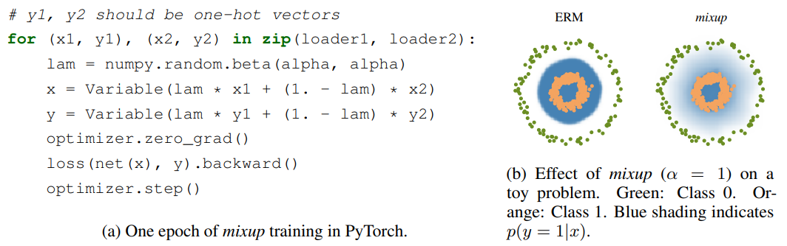
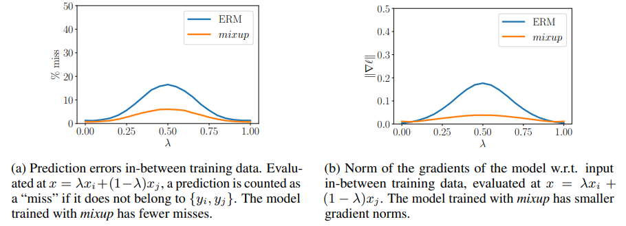
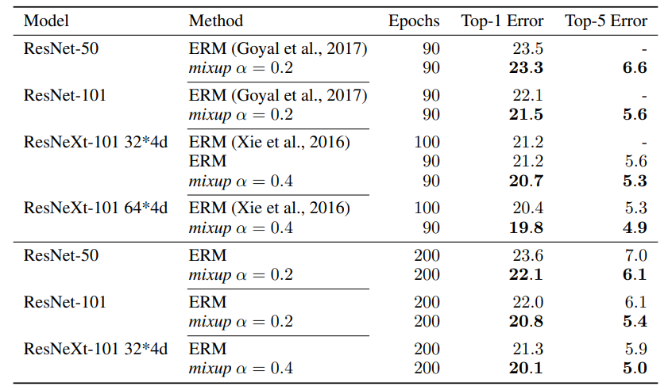
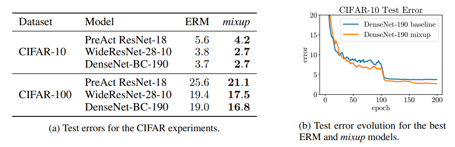
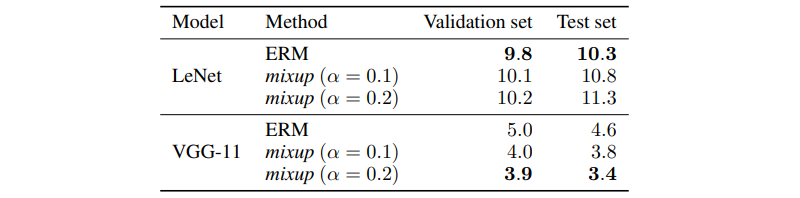
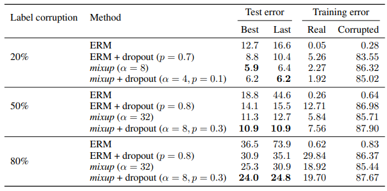
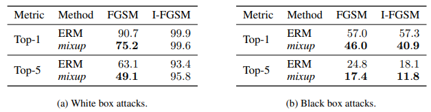
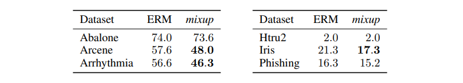
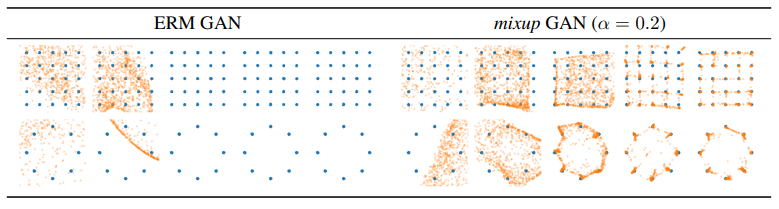
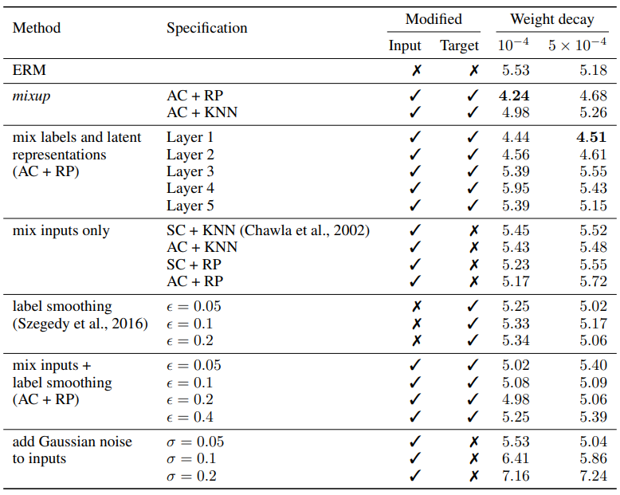

# mixup: BEYOND EMPIRICAL RISK MINIMIZATION

## ABSTRACT

大規模な深層ニューラルネットワークは強力である一方で、記憶への過度な依存や敵対的サンプルに対する脆弱性といった望ましくない振る舞いを示す。
本研究では、これらの問題を緩和するための単純な学習原理として **mixup** を提案する。
その本質は、2つのサンプルとそれぞれのラベルの**凸結合**に対してニューラルネットワークを学習させることにある。
これにより、mixup は訓練サンプル間において単純で線形的な挙動を好むよう、ニューラルネットワークを正則化する。
ImageNet-2012、CIFAR-10、CIFAR-100、Google commands、UCI データセットにおける実験の結果、mixup は最先端のニューラルネットワークアーキテクチャの**汎化性能を向上させる**ことが示された。
さらに、mixup は**誤ったラベルの記憶を抑制し**、**敵対的サンプルに対する頑健性を高め**、加えて **GAN（敵対的生成ネットワーク）の学習を安定化させる**ことも分かった。


## 1. INTRODUCTION

大規模な深層ニューラルネットワークは、コンピュータビジョン（Krizhevsky ら, 2012）、音声認識（Hinton ら, 2012）、強化学習（Silver ら, 2016）といった分野において飛躍的進展をもたらしてきた。
多くの成功した応用において、これらのニューラルネットワークには2つの共通点がある。
第一に、それらは訓練データ上での平均誤差を最小化するよう学習される。この学習則は **経験的リスク最小化（Empirical Risk Minimization; ERM）** の原理としても知られている（Vapnik, 1998）。
第二に、これら最先端のニューラルネットワークの規模は、訓練サンプル数に対して線形にスケールする。
たとえば、Springenberg ら（2015）のネットワークは、CIFAR-10 データセットの $5 \cdot 10^4$ 枚の画像をモデル化するために $10^6$ 個のパラメータを用いた。
また、Simonyan と Zisserman（2015）のネットワークは、ImageNet-2012 データセットの $10^6$ 枚の画像をモデル化するために $10^8$ 個のパラメータを用いた。
さらに、Chelba ら（2013）のネットワークは、One Billion Word データセットの $10^9$ 語をモデル化するために $1 \cdot 10^{10}$ 個のパラメータを用いた。

注目すべきことに、学習理論における古典的な結果（Vapnik と Chervonenkis, 1971）によれば、**経験的リスク最小化（ERM）の収束が保証されるのは、学習機械**（たとえばニューラルネットワーク）の**大きさが訓練データ数に応じて増加しない場合に限られる**。
ここでいう学習機械の大きさとは、その**パラメータ数**、あるいはそれに関連する **VC複雑度**（Harvey ら, 2017）によって測られる。

この矛盾は、近年の研究が示しているように、**現在のニューラルネットワークモデルの学習に ERM が本当に適しているのか**という疑問を投げかけている。
一方で、ERM は大規模なニューラルネットワークに対して、強い正則化が存在する場合であっても、あるいはラベルがランダムに割り当てられた分類問題においてさえ、訓練データを**汎化するのではなく記憶してしまう**ことを許してしまう（Zhang ら, 2017）。
他方で、ERM によって学習されたニューラルネットワークは、訓練分布のすぐ外側にあるサンプルに対して評価すると、その予測を大きく変化させてしまう（Szegedy ら, 2014）。このようなサンプルは **敵対的サンプル（adversarial examples）** とも呼ばれる。
この証拠は、ERM が、訓練データとごくわずかにしか異ならないテスト分布に対する汎化を、十分には説明できず、また保証もできないことを示唆している。
では、**ERM に代わる選択肢は何だろうか。**

訓練データに**似ているが完全には同一ではないサンプル**で学習を行う代表的な方法は、**データ拡張（data augmentation）** として知られており（Simard ら, 1998）、これは **Vicinal Risk Minimization（VRM）** の原理として定式化されている（Chapelle ら, 2000）。
VRM では、訓練データ中の各サンプルのまわりにある**近傍（vicinity, neighborhood）** を記述するために、人手による知識が必要となる。
そのうえで、各訓練サンプルの近傍分布から追加の仮想サンプルを生成することで、訓練分布のサポートを広げることができる。
たとえば画像分類では、1枚の画像の近傍を、その**左右反転**、**わずかな回転**、**軽微なスケーリング**によって得られる画像集合として定義することが一般的である。
データ拡張は一貫して汎化性能の向上をもたらす一方で（Simard ら, 1998）、その手続きは**データセット依存**であり、そのため**専門知識の利用が必要**となる。
さらに、データ拡張は通常、**近傍にあるサンプルは元のサンプルと同じクラスに属する**ことを前提としており、**異なるクラスに属するサンプル同士の近傍関係**はモデル化しない。

### Contribution 

これらの問題意識に動機づけられて、我々は **mixup** と呼ばれる、**単純でデータ非依存なデータ拡張手法**を導入する（第2節）。要するに、mixup は**仮想的な訓練サンプルを構成する**。

```math
\tilde{x} = \lambda x_i + (1 - \lambda) x_j, \qquad \text{where } x_i, x_j \text{ are raw input vectors}\\
\tilde{y} = \lambda y_i + (1 - \lambda) y_j, \qquad \text{where } y_i, y_j \text{ are one-hot encodings}
```

ここで、 $(x_i, x_j)$ および $(y_i, y_j)$ は訓練データからランダムに取り出された 2 つのサンプルであり、 $\lambda \in [0,1]$ である。したがって、mixup は**特徴ベクトルの線形補間に対して、対応するターゲットも線形補間されるべきである**という事前知識を取り入れることで、訓練分布を拡張する。mixup は数行のコードで実装可能であり、計算上のオーバーヘッドもごく小さい。

その単純さにもかかわらず、mixup は CIFAR-10、CIFAR-100、ImageNet-2012 の画像分類データセットにおいて、新たな最先端性能を達成する（第3.1節および第3.2節）。
さらに、mixup は、誤ったラベルを含むデータで学習する場合（第3.4節）や、敵対的サンプルに直面する場合（第3.5節）において、ニューラルネットワークの頑健性を高める。
最後に、mixup は音声データ（第3.3節）および表形式データ（第3.6節）においても汎化性能を向上させ、さらに GAN の学習を安定化するためにも利用できる（第3.7節）。
CIFAR-10 実験を再現するために必要なソースコードは、次の GitHub リポジトリで公開されている：
[https://github.com/facebookresearch/mixup-cifar10](https://github.com/facebookresearch/mixup-cifar10)

mixup におけるさまざまな設計選択の効果を理解するために、我々は包括的な**アブレーション実験**を行う（第3.8節）。
その結果、mixup は先行研究における関連手法よりも有意に優れており、さらに各設計選択が最終的な性能にそれぞれ寄与していることが示唆された。
最後に、先行研究との関連（第4節）を検討し、あわせていくつかの論点について議論を行う（第5節）。

## 2. FROM EMPIRICAL RISK MINIMIZATION TO mixup

教師あり学習では、確率的な特徴ベクトル $X$ と確率的なターゲットベクトル $Y$ の関係を記述する関数 $f \in \mathcal{F}$ を見つけることに関心がある。ここで、 $(X, Y)$ は同時分布 $P(X, Y)$ に従う。
この目的のために、まず予測 $f(x)$ と真のターゲット $y$ との違いを罰する損失関数 $\ell$ を定義する。
ただし、 $(x, y) \sim P$ は分布 $P$ から得られるサンプルである。
そのうえで、データ分布 $P$ 上での損失関数 $\ell$ の平均、すなわち **期待リスク（expected risk）** を最小化する。

```math
R(f) = \int \ell(f(x), y) d P(x, y).
```

しかし残念ながら、ほとんどの実際的な状況では、分布 $P$ は未知である。
その代わりに、通常われわれが利用できるのは、 $\mathcal{D}={(x_i, y_i)}_{i=1}^{n}$ という訓練データ集合であり、すべての $i=1,\ldots,n$ について $(x_i, y_i)\sim P$ が成り立つ。
この訓練データ $\mathcal{D}$ を用いることで、分布 $P$ を**経験分布（empirical distribution）**によって近似することができる。

```math
P_\delta (x, y) = \frac{1}{n}\sum_{i=1}^n \delta (x=x_i, y=y_i),
```

ここで、 $\delta(x=x_i,; y=y_i)$ は $(x_i, y_i)$ を中心にもつ **ディラック測度（Dirac mass）** である。
この経験分布 $P_\delta$ を用いることで、期待リスクを **経験リスク（empirical risk）** によって近似できるようになる。

```math
R_\delta(f) = \int \ell(f(x), y) d P_\delta(x, y) = \frac{1}{n}\sum_{i=1}^n \ell(f(x_i), y_i).\tag{1}
```

式 (1) を最小化することによって関数 $f$ を学習する方法は、**経験的リスク最小化（Empirical Risk Minimization; ERM）** の原理として知られている（Vapnik, 1998）。
経験リスク (1) は計算効率が高い一方で、関数 $f$ の振る舞いを監視しているのは、あくまで有限個の $n$ 個のサンプル上においてのみである。
そのため、パラメータ数が $n$ と同程度に大きい関数、たとえば大規模なニューラルネットワークを考える場合、式 (1) を最小化する自明な方法の一つは、**訓練データを丸ごと記憶してしまうこと**である（Zhang ら, 2017）。
そして、このような記憶は、訓練データの外側における関数 $f$ の望ましくない振る舞いを引き起こす（Szegedy ら, 2014）。



Figure 1: Illustration of mixup, which converges to ERM as $\alpha \rightarrow 0$ .

しかし、単純な推定量 $P_\delta$ は、真の分布 $P$ を近似するための数ある選択肢のうちの一つにすぎない。
たとえば、**Vicinal Risk Minimization（VRM）** の原理（Chapelle ら, 2000）では、分布 $P$ は次のように近似される。

```math
P_\nu (\tilde{x}, \tilde{y}) = \frac{1}{n}\sum_{i=1}^{n} \nu(\tilde{x}, \tilde{y} | x_i, y_i),
```

ここで $\nu$ は **近傍分布（vicinity distribution）** であり、訓練特徴・ターゲット対 $(x_i, y_i)$ の近傍に、仮想的な特徴・ターゲット対 $(\tilde{x}, \tilde{y})$ が存在する確率を測るものである。
特に Chapelle ら（2000）は、 $\nu(\tilde{x}, \tilde{y}\mid x_i, y_i)=\mathcal{N}(\tilde{x}-x_i,\sigma^2),\delta(\tilde{y}=y_i)$ という **ガウス近傍** を考えている。これは、訓練データに **加法的なガウス雑音** を加えてデータ拡張を行うことと等価である。
VRM を用いて学習するためには、この近傍分布をサンプリングして $\mathcal{D}_\nu := {(\tilde{x}_i, \tilde{y}*i)}*{i=1}^{m}$ というデータセットを構成し、**経験的近傍リスク（empirical vicinal risk）** を最小化する。

```math
R_\nu(f) = \frac{1}{m}\sum_{i=1}^m \ell(f(\tilde{x}_i), \tilde{y}_i).
```

本論文の貢献は、**mixup** と呼ばれる汎用的な**近傍分布**を提案することである。

```math
\mu(\tilde{x}, \tilde{y} | x_i, y_i) = \frac{1}{n}\sum_j^n \underset{\lambda}{\mathbb{E}} \left[\delta(\tilde{x} = \lambda\cdot x_i + (1 - \lambda)\cdot x_j, \tilde{y} = \lambda\cdot y_i + (1 - \lambda)\cdot y_j)\right],
```

ここで、 $\lambda \sim \mathrm{Beta}(\alpha,\alpha)$ であり、 $\alpha \in (0,\infty)$ である。
要するに、mixup の近傍分布からサンプリングすることで、**仮想的な特徴ベクトルとターゲットベクトル**が生成される。

```math
\tilde{x} = \lambda x_i + (1 - \lambda) x_j,\\
\tilde{y} = \lambda y_i + (1 - \lambda) y_j, 
```

ここで、 $(x_i, y_i)$ と $(x_j, y_j)$ は、訓練データからランダムに取り出された 2 つの特徴・ターゲットベクトルであり、 $\lambda \in [0,1]$ である。
mixup のハイパーパラメータ $\alpha$ は、特徴・ターゲット対のあいだでどの程度強く補間するかを制御しており、 $\alpha \to 0$ のときには **ERM の原理が再び得られる**。


mixup 学習の実装は容易であり、計算上のオーバーヘッドもごく小さい。
図 1a には、PyTorch で mixup 学習を実装するのに必要な数行のコードが示されている。
最後に、いくつかの代替的な設計選択について述べる。
第一に、予備実験では、Dirichlet 分布から重みをサンプリングして **3 個以上のサンプルの凸結合**を用いても、さらなる性能向上は得られなかった一方で、mixup の計算コストは増加した。
第二に、現在の実装では、1 つのデータローダから 1 つのミニバッチを取得し、その後、その同じミニバッチに対してランダムにシャッフルを施したうえで mixup を適用している。
この戦略は、**I/O 要求を削減しつつも同等にうまく機能する**ことが分かった。
第三に、**同一ラベルをもつ入力同士だけを補間する**方法では、以降で述べる mixup のような性能向上は得られなかった。
より詳細な実験比較は、第 3.8 節に示されている。


### What is mixup doing? 

mixup の近傍分布は、モデル $f$ に対して**訓練サンプル間で線形に振る舞うこと**を促す、一種のデータ拡張として理解できる。我々は、このような線形的挙動によって、訓練サンプルの外側で予測を行う際に生じる**望ましくない振動**が抑えられると考える。
また、**線形性**はオッカムの剃刀の観点からも望ましい**帰納バイアス**である。なぜなら、線形性は考えうる振る舞いの中でも最も単純なものの一つだからである。
図 1b は、mixup によって、クラスからクラスへと**線形に遷移する決定境界**が得られ、より滑らかな不確実性推定が与えられることを示している。
図 2 では、CIFAR-10 データセット上で ERM および mixup を用いて学習された 2 つのニューラルネットワークモデルの平均的な振る舞いが示されている。
両モデルは同一のアーキテクチャを持ち、同一の手順で学習されており、さらにランダムに選ばれた訓練サンプル間の同じ点において評価されている。
mixup で学習されたモデルは、訓練サンプル間において、**モデル予測**および**勾配ノルム**の観点でより安定している。


Figure 2: mixup leads to more robust model behaviors in-between the training data.

## 3. EXPERIMENTS

### 3.1 IMAGENET CLASSIFICATION

我々は、ImageNet-2012 分類データセット（Russakovsky ら, 2015）に対して mixup を評価する。
このデータセットは、全 1,000 クラスから成り、130 万枚の訓練画像と 5 万枚の検証画像を含む。
学習時には、標準的なデータ拡張手法、すなわち**スケールおよびアスペクト比の歪み**、**ランダムクロップ**、**水平反転**を用いる（Goyal ら, 2017）。
評価時には、各画像の **224 × 224 の中央クロップ**のみを用いてテストを行う。
我々は、mixup と ERM を用いて、ImageNet-2012 に対する複数の最先端分類モデルを学習し、その **top-1 error** および **top-5 error** を表 1 に報告する。


Table 1: Validation errors for ERM and mixup on the development set of ImageNet-2012.

この節のすべての実験では、Caffe2 を用いた**データ並列分散学習**を行い、ミニバッチサイズは 1,024 とする。
学習率スケジュールには、Goyal ら（2017）で述べられている方法を用いる。
具体的には、学習率は最初の 5 エポックのあいだに **0.1 から 0.4 まで線形に増加**させる。
その後、90 エポック学習する場合には **30、60、80 エポック後**に学習率を 10 分の 1 にする。
一方、200 エポック学習する場合には **60、120、180 エポック後**に学習率を 10 分の 1 にする。

mixup については、 $\alpha \in [0.1, 0.4]$ の範囲で、ERM よりも性能が向上することが分かった。一方で、 $\alpha$ が大きすぎる場合には**アンダーフィッティング**が生じる。
また、**より大きなモデル容量**をもつモデル、あるいは**より長時間学習させたモデル**ほど、mixup の恩恵を大きく受けることも分かった。
たとえば、90 エポック学習した場合、ResNet-101 および ResNeXt-101 の mixup 版は、それぞれの ERM 版に比べて **0.5% から 0.6%** のより大きな改善を示した。一方、ResNet-50 のような比較的小さなモデルでは、その改善幅は **0.2%** にとどまった。
さらに、200 エポック学習した場合、ResNet-50 の mixup 版における **top-1 error** は、90 エポック学習時と比べてさらに **1.2%** 低下したのに対し、その ERM 版では改善が見られなかった。

### 3.2 CIFAR-10 AND CIFAR-100

mixup の汎化性能をさらに評価するために、CIFAR-10 および CIFAR-100 データセットに対して追加の画像分類実験を行う。
具体的には、以下のモデルについて、ERM 学習と mixup 学習を比較する。

* PreAct ResNet-18（He ら, 2016；実装は Liu, 2017）
* WideResNet28-10（Zagoruyko と Komodakis, 2016a；実装は Zagoruyko と Komodakis, 2016b）
* DenseNet（Huang ら, 2017；実装は Veit, 2017）

DenseNet については、Huang ら（2017）の DenseNet-BC-190 の仕様に合わせるため、**growth rate を 40 に変更**している。mixup では、 $\alpha = 1$ に固定する。このとき、補間係数 $\lambda$ は 0 から 1 のあいだで**一様に分布**する。
すべてのモデルは、単一の Nvidia Tesla P100 GPU 上で PyTorch を用いて、訓練セットに対して **200 エポック**学習される。ミニバッチあたりのサンプル数は **128** とし、評価はテストセット上で行う。
学習率はすべてのモデルで **0.1** から開始し、WideResNet を除いて **100 エポック後**および **150 エポック後**に 10 分の 1 に減衰させる。WideResNet については、Zagoruyko と Komodakis（2016a）に従い、**60、120、180 エポック後**に学習率を 10 分の 1 にする。 Weight decay は $10^{-4}$ に設定する。また、これらの実験では **dropout は使用しない**。

結果の要約を図 3a に示す。
CIFAR-10 および CIFAR-100 のいずれの分類問題においても、mixup を用いて学習したモデルは、ERM で学習した対応モデルを**有意に上回る性能**を示した。
また、図 3b から分かるように、mixup と ERM は、**最良のテスト誤差に到達するまでの収束速度はほぼ同程度**である。
なお、Huang ら（2017）における DenseNet モデルは **300 エポック**学習されており、さらに **150 エポック**および **225 エポック**で追加の学習率減衰が行われている。
このことが、図 3a に報告された DenseNet の性能と、Huang ら（2017）の元論文における結果とのあいだに見られる差異を説明している可能性がある。


Figure 3: Test errors for ERM and mixup on the CIFAR experiments.

### 3.3 SPEECH DATA

次に、Google commands データセット（Warden, 2017）を用いて**音声認識実験**を行う。
このデータセットには **65,000 個の発話**が含まれており、各発話は**約 1 秒**の長さをもち、**30 クラス**のいずれかに属している。
各クラスは、たとえば **yes, no, down, left** といった音声コマンドに対応しており、これらは数千人の異なる話者によって発話されている。
発話の前処理として、まずサンプリング周波数 **16 kHz** の元波形から、**正規化されたスペクトログラム**を抽出する。
次に、スペクトログラムのサイズをそろえるために、**160 × 101** になるようゼロパディングを施す。
音声データに対しては、波形レベルでもスペクトログラムレベルでも mixup を適用することが妥当である。
本研究では、データをネットワークに入力する直前に、**スペクトログラムレベルで mixup を適用**する。

この実験では、LeNet（LeCun ら, 2001）と VGG-11（Simonyan と Zisserman, 2015）のアーキテクチャを比較する。
ただし、ここで用いる各モデルは、**2 つの畳み込み層**と **2 つの全結合層**から構成されている。
各モデルは、**100 サンプルからなるミニバッチ**を用いて **30 エポック**学習し、最適化手法には **Adam**（Kingma と Ba, 2015）を用いる。学習率は初期値を $3 \times 10^{-3}$ とし、**10 エポックごとに 10 分の 1** に減衰させる。
mixup については、初期収束が速くなることが分かったため、最初の **5 エポック**は元の訓練サンプルのみを用いて学習する**ウォームアップ期間**を設ける。
図 4 は、このタスクにおいて mixup が ERM を上回る性能を示すこと、特に**より大きな容量をもつモデルである VGG-11 を用いた場合にその効果が大きい**ことを示している。


Figure 4: Classification errors of ERM and mixup on the Google commands dataset.

### 3.4  MEMORIZATION OF CORRUPTED LABELS

Zhang ら（2017）に従い、ランダムに破損したラベルに対する ERM モデルと mixup モデルの頑健性を評価する。
我々は、mixup の補間強度 $\alpha$ を大きくすると、訓練サンプルからより離れた仮想サンプルが生成され、その結果として**記憶による適合がより困難になる**と仮定する。
特に、ランダムラベルを含む補間を記憶することに比べて、**実際のサンプル同士の補間を学習する方が容易である**はずである。
我々は、公開実装（Zhang, 2017）を改変し、CIFAR-10 の訓練セットに対して、ラベルの **20%**, **50%**, **80%** をそれぞれランダムノイズに置き換えた 3 種類のデータセットを作成する。
一方で、評価に用いるテストラベルはすべて元のまま保持する。
Dropout（Srivastava ら, 2014）は、破損ラベルを含むデータに対する学習において**最先端手法**とみなされている（Arpit ら, 2017）。
そこで本実験では、**mixup**, **dropout**, **mixup + dropout**, **ERM** を比較する。
mixup については、 $\alpha \in {1, 2, 8, 32}$ を用いる。
dropout については、Zagoruyko と Komodakis（2016a）で提案されているように、各 PreAct ブロックにおいて、2 つの畳み込み層のあいだの **ReLU 活性化層の後**に 1 つ dropout 層を挿入する。
dropout 確率は $p \in {0.5, 0.7, 0.8, 0.9}$ とする。
mixup と dropout の併用については、 $\alpha \in {1, 2, 4, 8}, \quad p \in {0.5, 0.5, 0.7}$ を用いる。
これらの実験では、Liu（2017）によって実装された PreAct ResNet-18（He ら, 2016）モデルを使用する。
その他の設定はすべて第 3.2 節と同じである。

結果の要約を表 2 に示す。ここでは、学習過程において達成された**最良のテスト誤差**と、**200 エポック後の最終テスト誤差**を記録している。
また、**記憶の程度**を定量化するために、最終エポックにおける**真のラベル**に対する訓練誤差と、**破損ラベル**に対する訓練誤差も評価している。
学習が進み、学習率がより小さくなると（たとえば 0.01 未満）、ERM モデルは破損ラベルに対して**過学習し始める**。
一方で、dropout は大きな確率（たとえば 0.7 や 0.8）を用いることで、この過学習を効果的に抑制できる。
さらに、 $\alpha$ を大きくした mixup（たとえば 8 や 32）は、**最良時点のテスト誤差**と**最終エポックのテスト誤差**の両方において dropout を上回り、しかも**真のラベルに対する訓練誤差をより低く保ちつつ、ノイズラベルには頑健**であることが分かった。
興味深いことに、**mixup + dropout** はその中でも最も良い性能を示しており、両者の手法が**両立可能である**ことを示している。

### 3.5 ROBUSTNESS TO ADVERSARIAL EXAMPLES

ERM を用いて学習されたモデルの望ましくない帰結の一つは、**敵対的サンプル（adversarial examples）に対する脆弱性**である（Szegedy ら, 2014）。
敵対的サンプルとは、正当な入力サンプルに対して**ごく小さく（見た目にはほとんど知覚できない）摂動**を加えることで、モデルの性能を劣化させたものである。
この敵対的ノイズは、正当なサンプルに関して損失関数の勾配を**上昇方向**にたどることで生成される。
敵対的サンプルに対する頑健性の向上は、現在も活発に研究されているテーマである。

この問題の解決を目指す複数の手法のうち、いくつかはモデルの **Jacobian ノルム**を罰則化することで、その **Lipschitz 定数**を制御しようとしている（Drucker と Le Cun, 1992；Cisse ら, 2017；Bartlett ら, 2017；Hein と Andriushchenko, 2017）。
また別のアプローチでは、敵対的サンプルを生成し、それを用いて学習することでデータ拡張を行う（Goodfellow ら, 2015）。
しかし残念ながら、これらの手法はいずれも ERM に比べて**大きな計算コストの増加**を伴う。
ここで我々は、mixup が、**ERM の速度を損なうことなく**ニューラルネットワークの敵対的サンプルに対する頑健性を大きく改善できることを示す。
その理由は、mixup が、**最ももっともらしい方向**、すなわちたとえば**他の訓練点へ向かう方向**に沿って、ある入力に関する損失の勾配ノルムを実質的に抑制するからである。
実際、表 2 は、通常の ERM と比べて、mixup が**サンプル間における損失**および**勾配ノルム**の小さいモデルをもたらすことを示している。


Table 2: Results on the corrupted label experiments for the best models.

mixup で学習したモデルの敵対的サンプルに対する頑健性を評価するために、3 つの ResNet-101 モデルを用いる。
そのうち 2 つは ImageNet-2012 上で ERM により学習されたモデルであり、残る 1 つは mixup により学習されたモデルである。
最初の実験群では、1 つの ERM モデルと mixup モデルについて、**ホワイトボックス攻撃**に対する頑健性を調べる。
すなわち、それぞれのモデルに対して、その**モデル自身**を用いて敵対的サンプルを生成する。
敵対的サンプルの生成には、**Fast Gradient Sign Method（FGSM）** または **Iterative FGSM（I-FGSM）**（Goodfellow ら, 2015）を用い、各ピクセルあたりの最大摂動量は $\epsilon = 4$ とする。
I-FGSM については、同一のステップサイズで **10 回の反復**を行う。
次の実験群では、**ブラックボックス攻撃**に対する頑健性を評価する。
すなわち、最初の ERM モデルを用いて FGSM および I-FGSM により敵対的サンプルを生成し、その後、そのサンプルに対する **2 つ目の ERM モデル**および **mixup モデル**の頑健性を評価する。

両設定における結果は、表 3 にまとめられている。


Table 3: Classification errors of ERM and mixup models when tested on adversarial examples.

FGSM によるホワイトボックス攻撃に対して、mixup モデルは **Top-1 error の観点で ERM モデルより 2.7 倍頑健**である。また、FGSM によるブラックボックス攻撃に対しては、mixup モデルは **Top-1 error の観点で ERM モデルより 1.25 倍頑健**である。
さらに、ホワイトボックス I-FGSM 攻撃に対しては、mixup も ERM も十分には頑健ではないものの、ブラックボックス I-FGSM 設定では、mixup は ERM よりも**約 40% 高い頑健性**を示す。
総じて、mixup は ERM と比べて追加の計算オーバーヘッドなしに、ホワイトボックス攻撃およびブラックボックス攻撃の両方に対して、**有意に高い頑健性をもつニューラルネットワーク**をもたらす。

### 3.6 TABULAR DATA

画像以外のデータに対する mixup の性能をさらに調べるために、UCI データセット（Lichman, 2013）から抽出した 6 つの任意の分類問題に対して一連の実験を行った。
この節で用いるニューラルネットワークは**全結合ネットワーク**であり、**128 個の ReLU ユニットからなる隠れ層を 2 層**もつ。
これらのニューラルネットワークのパラメータは、Adam（Kingma と Ba, 2015）を**デフォルトのハイパーパラメータ**で用いて学習し、**ミニバッチサイズ 16**、**10 エポック**で訓練する。
表 4 は、mixup が対象とした 6 つのデータセットのうち **4 つで平均テスト誤差を改善**し、しかも **ERM を下回ることは一度もなかった**ことを示している。


Table 4: ERM and mixup classification errors on the UCI datasets.

### 3.7 STABILIZATION OF GENERATIVE ADVERSARIAL NETWORKS (GANS)

**敵対的生成ネットワーク**（Generative Adversarial Networks）、すなわち **GAN**（Goodfellow ら, 2014）は、**暗黙的生成モデル（implicit generative models）**の強力な一群である。
GAN では、**生成器**（generator）と**識別器**（discriminator）が、分布 $P$ をモデル化するために互いに競い合う。
一方で、生成器 $g$ は、 $z \sim Q$ に従うノイズベクトル $z$ を、実サンプル $x \sim P$ に似た偽サンプル $g(z)$ へと変換しようとする。他方で、識別器は、実サンプル $x$ と偽サンプル $g(z)$ を区別しようとする。
数学的には、GAN の学習は次の最適化問題を解くことに等しい。

```math
\underset{\max}{g} \underset{\min}{d} \underset{\mathbb{E}}{x,z} \ell(d(x), 1) + \ell(d(g(z)), 0),
```

ここで、 $\ell$ は **2 値交差エントロピー損失**である。
しかし残念ながら、この min-max 方程式を解くことは、**きわめて難しい最適化問題**としてよく知られている（Goodfellow, 2016）。
その理由は、識別器がしばしば生成器に対して**消失した勾配**しか与えないためである。
我々は、mixup が GAN の学習を安定化すると考える。
なぜなら、mixup は図 1b の二値分類器と同様に、**識別器の勾配に対する正則化**として作用するからである。
そして、識別器が滑らかであることにより、生成器には**安定した勾配情報の供給源**が保証される。
GAN に対する mixup の定式化は次の通りである。

```math
\underset{\max}{g} \underset{\min}{d} \underset{\mathbb{E}}{x,z,\lambda} \ell(d(\lambda x + (1-\lambda)g(z)), \lambda) 
```

図 5 は、2 つの toy データセット（青のサンプル）をモデル化する際に、GAN の学習に対して mixup がもたらす**安定化効果**を示している（オレンジのサンプル）。
これらの実験で用いるニューラルネットワークは**全結合型**であり、**512 個の ReLU ユニットからなる隠れ層を 3 層**もつ。生成器ネットワークは、**2 次元のガウスノイズベクトル**を入力として受け取る。
ネットワークは、デフォルト設定の Adam オプティマイザを用いて、**ミニバッチサイズ 128**、**20,000 ミニバッチ**にわたって学習される。ただし、生成器を 1 回更新するごとに、その前に識別器を **5 回更新**する。
mixup を用いた GAN の学習は、**ハイパーパラメータやアーキテクチャの選択に対して有望な頑健性**を示すように見える。


Figure 5: Effect of mixup on stabilizing GAN training at iterations 10, 100, 1000, 10000, and 20000.

### 3.8 ABLATION STUDIES

mixup は、**生の入力同士のランダムな凸結合**と、それに対応する **one-hot ラベル表現同士の凸結合**という、わずか 2 つの要素だけから成るデータ拡張手法である。しかし、その設計にあたってはいくつかの選択肢が存在する。たとえば、入力の拡張方法として、ニューラルネットワークの**潜在表現**（すなわち特徴マップ）を補間することも考えられる。また、**最近傍同士だけ**を補間することや、**同じクラスに属する入力同士だけ**を補間することも可能である。さらに、補間対象の入力が 2 つの異なるクラスから来ている場合には、生成された合成入力に対して 1 つのラベルだけを割り当てることも考えられる。
たとえば、凸結合においてより大きな重みをもつ入力のラベルを、その合成入力のラベルとする方法がある。mixup をこれらの代替案と比較するために、我々は CIFAR-10 データセット上で PreAct ResNet-18 アーキテクチャを用いた一連の**アブレーション実験**を行う。

具体的には、各データ拡張手法について、2 つの weight decay 設定を検証する。
すなわち、mixup に対して良好に機能する $10^{-4}$ と、ERM に対して良好に機能する $5 \times 10^{-4}$ である。
それ以外の設定およびハイパーパラメータは、すべて第 3.2 節で報告したものと同一である。

**生の入力**を補間する場合と**潜在表現**を補間する場合を比較するために、各 residual block の直前で得られる学習済み表現（Layer 1〜4 と表記）および最上位の「average pooling + fully connected」層の直前の表現（Layer 5 と表記）に対して、ランダムな凸結合を適用して評価する。
**ランダムな入力ペア**（RP: random pairs）の混合と、**最近傍**（KNN: nearest neighbors）の混合を比較するために、まず各訓練サンプルについて、**同一クラス内**（SC: same class）または**全クラス対象**（AC: all classes）のいずれかで、200 個の最近傍を計算する。
その後、学習中には、ミニバッチ中の各サンプルについて、その最近傍集合からランダムに 1 つサンプルを選び、そのサンプルとの凸結合によって元サンプルを合成サンプルに置き換える。
**全クラス間で混合する場合**（AC）と、**同一クラス内のみで混合する場合**（SC）を比較するために、ミニバッチを、そのサンプルインデックスのランダムな置換と凸結合する。
この置換は、**バッチ単位**で行う場合が AC、**クラス単位**で行う場合が SC である。
**入力とラベルの両方を混合する場合**と、**入力のみを混合する場合**を比較するために、ターゲットとして 2 つの one-hot エンコーディングの凸結合を用いる場合と、あるいはより近い訓練サンプルの one-hot エンコーディングのみをターゲットとして選ぶ場合を比較する。
**label smoothing** については、Szegedy ら（2016）に従い、不正解クラスに対して $\frac{\epsilon}{10}$ をターゲット値とし、正解クラスに対して $1 - \frac{9\epsilon}{10}$ をターゲット値とする。
さらに、別のベースラインとして、入力に**ガウス雑音を加える方法**も用いる。
結果は、**最後の 10 エポックにおけるテスト誤差の中央値**として報告する。
結果は表 5 に示されている。


Table 5: CIFAR-10 データセットにおけるアブレーション実験の結果。ここでは、**最後の 10 エポックにおけるテスト誤差の中央値**を報告している。チェックマーク（✓）は、その構成要素が**標準的な ERM 学習とは異なる**ことを意味し、
バツ印（✗）は、**標準的な学習設定に従っている**ことを意味する。

* **AC**: 全クラス間で混合
* **SC**: 同一クラス内で混合
* **RP**: ランダムなペア間で混合
* **KNN**: (k)-近傍同士で混合（(k=200)）

実験の詳細および結果の解釈については、本文を参照されたい。

アブレーション実験の結果から、以下の観察が得られた。
第一に、mixup は、我々が検証した中で**最も優れたデータ拡張手法**であり、**2 番目に良かった手法**（入力の混合 + label smoothing）よりも有意に優れている。
第二に、正則化の効果は、**小さい weight decay** $10^{-4}$ と、**大きい weight decay** $5 \times 10^{-4}$ におけるテスト誤差を比較することで確認できる。
たとえば ERM では、大きい weight decay のほうがより良く機能する一方で、mixup では小さい weight decay のほうが好ましく、このことは mixup 自身が**正則化効果**をもつことを裏づけている。
また、潜在表現のより高い層で補間を行う場合には、大きい weight decay の利点が増していることも分かる。
これは、**高層の潜在表現で補間するほど、正則化の強さが弱まっている**ことを示している。
入力補間に基づくすべての手法の中では、**全クラスにわたるランダムペアの混合**（AC + RP）が、最も強い正則化効果を示した。一方で、**label smoothing** や **ガウス雑音の付加**がもたらす正則化効果は比較的小さい。
最後に、**SMOTE アルゴリズム**（Chawla ら, 2002）は、性能向上において**目立った改善をもたらさなかった**ことも確認された。

## 4. RELATED WORK

データ拡張は、画像分類（Krizhevsky ら, 2012）から音声認識（Graves ら, 2013；Amodei ら, 2016）に至るまで、深層学習のあらゆる成功事例の中核に位置している。
いずれの場合においても、汎化性能を向上させる適切なデータ変換を設計するために、豊富な**ドメイン知識**が活用されている。たとえば画像分類では、訓練データを通してモデルに視覚的に妥当な不変性を学習させるために、**回転**、**並進**、**クロッピング**、**リサイズ**、**反転**（LeCun ら, 2001；Simonyan と Zisserman, 2015）、さらには **random erasing**（Zhong ら, 2017）が日常的に用いられる。
同様に、音声認識においては、学習済みモデルの**頑健性**と**精度**を高めるために、**ノイズ注入**が広く実践されている（Amodei ら, 2016）。

mixup により近い研究として、Chawla ら（2002）は、不均衡データセットにおける少数クラスを拡張するために、**最近傍同士の補間**を提案している。また、DeVries と Taylor（2017）は、**特徴空間**において同一クラスに属する最近傍同士の**補間**および**外挿**が汎化性能を向上させうることを示している。
しかし、これらの提案はいずれも、特定のクラス内における最近傍同士の入力レベルまたは特徴レベルでのみ作用しており、したがって、それに対応する**ラベルの変化**を考慮していない。最近の手法では、ニューラルネットワークの出力分布を **label smoothing**（Szegedy ら, 2016）によって正則化したり、あるいは**高信頼度の softmax 分布**に罰則を課したりする方法（Pereyra ら, 2017）も提案されている。
これらの手法は、従来の ERM のように単一の hard label に依存するのではなく、**複数の滑らかなラベル**に依拠して監督を与えるという意味で、mixup と類似している。
しかし、これらの研究における label smoothing は、対応する特徴量の値とは**独立に**適用または正則化されている。

mixup は、従来のデータ拡張および正則化手法の望ましい性質をいくつも備えつつ、それらの欠点を回避している。
DeVries と Taylor（2017）の手法と同様に、mixup は**多くのドメイン知識を必要としない**。
また、label smoothing と同様に、各サンプルに対する監督は**真のラベルに過度に支配されない**。
しかし、これらの手法とは異なり、mixup による変換は、**データ拡張と監督信号のあいだに線形関係を明示的に導入する**。
我々は、このことが、実験で示されたように汎化性能を向上させる**強力な正則化**につながっていると考えている。
さらに、この**線形性の制約**は、それが近似される関数の導関数に与える影響を通して、mixup をニューラルネットワークの **Sobolev training**（Czarnecki ら, 2017）や **WGAN-GP**（Gulrajani ら, 2017）のような他の手法とも関連づける。

## 5. DISCUSSION

我々は、**データに依存しない**、かつ**簡潔な**データ拡張の原理として **mixup** を提案した。
また、mixup が **Vicinal Risk Minimization** の一形態であり、訓練集合からランダムに選んだ 2 つのサンプルとそのラベルの**線形補間**によって構成される仮想サンプル上で学習を行うことを示した。
既存の学習パイプラインに mixup を組み込むには、数行のコードを追加するだけで十分であり、計算上のオーバーヘッドもほとんど、あるいは全く生じない。
広範な評価を通じて、mixup が ImageNet、CIFAR、音声データ、表形式データにおいて、最先端モデルの**汎化誤差を改善する**ことを示した。
さらに、mixup は**破損ラベルの記憶**、**敵対的サンプルへの脆弱性**、および**敵対的学習における不安定性**の抑制にも有効である。
我々の実験では、次の傾向が一貫して観察された。
$\alpha$ を大きくするにつれて、**実データに対する訓練誤差**は増加する一方で、**汎化ギャップ**は減少する。
これは、mixup が**暗黙的にモデル複雑性を制御している**という我々の仮説を支持するものである。

しかしながら、この**バイアス・バリアンストレードオフ**における最適な「**sweet spot**」を理解するための十分な理論は、まだ得られていない。
たとえば、CIFAR-10 の分類では、 $\alpha \to \infty$（すなわち、実サンプルのペア平均だけで学習する場合）であっても、実データに対する訓練誤差を非常に低く保つことができる。
一方、ImageNet の分類では、 $\alpha \to \infty$ に伴って、実データに対する訓練誤差が大きく増加する。
異なるモデルアーキテクチャを用いた ImageNet および Google commands での実験に基づき、我々は、**モデル容量を増やすことで、訓練誤差が大きな (\alpha) に対して鈍感になり、その結果として mixup の利点がより顕著になる**のではないかと推測している。

mixup はまた、今後のさらなる探究に向けた複数の可能性も開いている。
第一に、この考え方は、**回帰**や**構造化予測**のような他の教師あり学習問題にも適用できるだろうか。
mixup を回帰問題へ一般化すること自体は容易である一方で、画像セグメンテーションのような構造化予測問題への適用は、それほど自明ではない。
第二に、同様の方法は**教師なし学習**を超えた場面でも有用だろうか。
この補間原理は、**教師なし学習**、**半教師あり学習**、**強化学習**においても役立つ可能性のある、妥当な**帰納バイアス**のように思われる。
さらに、訓練データから大きく離れた領域でも頑健なモデル挙動を保証するために、mixup を**特徴・ラベルの外挿**へと拡張できるだろうか。
これらの方向性に関する我々の議論は、現時点ではなお推測的な部分を含んでいる。
それでも、mixup が切り開く可能性には大きな期待を寄せており、我々の観察が今後の発展にとって有益なものとなることを願っている。